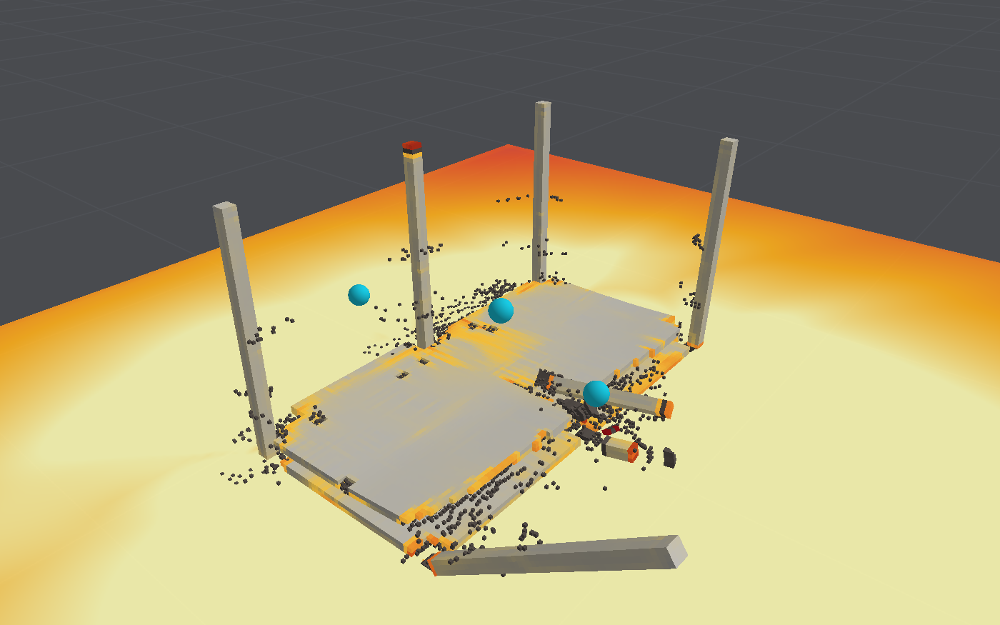

# BombCAD

An interactive blast simulator for simple building layouts, written to answer one question:
how close to real time can a physically based simulation of blast on structures run on a
current Mac?

It has two solvers, both on the GPU:

- an **air-blast solver** that propagates the blast wave around obstacles and records peak
  overpressure and impulse on every surface;
- a **structural solver** for reinforced concrete and masonry that cracks, crushes, yields its
  reinforcement and breaks under those pressures. Broken pieces collide, fall and come to rest,
  and the air flows through the gaps they leave.

It is a study of the numerics and the performance, not a design tool.




## Running it

Requires macOS 15 or later, Swift 6.4 and a Metal GPU.

```bash
swift run -c release BombCAD
```

```bash
./Scripts/make-app.sh
```

The second command builds `build/BombCAD.app`, which can be launched from Finder.

In the view: drag or two-finger scroll to orbit, shift-drag or right-drag to pan, pinch or mouse
wheel to zoom. Space runs and pauses, ⌘R resets.

The sidebar has two tabs. **Run** picks a built-in layout, the grid, the charge and the display.
**Edit layout** adds, moves, resizes and removes rigid blocks, deformable walls, openings and
pressure gauges, with undo (⌘Z). The toolbar opens and saves layouts as JSON and lets you move
the charge, or the selected gauge, by clicking the ground. Gauge and deflection histories export
as CSV from beside the chart.

```bash
swift test
```

```bash
swift run -c release blastbench throughput
```

```bash
swift run -c release blastbench slab --sensitivity
```

`blastbench` also has `structure`, `validate` and `snapshot` commands; see
[Performance](docs/performance.md) and [Validation](docs/validation.md).

## Headline results

Measured on an Apple M4 Max (32-core GPU, 36 GB).

| Case                                                        | Speed                        |
|-------------------------------------------------------------|------------------------------|
| Air blast, street scene, 8.4 million cells of 0.25 m        | 27× slower than real time    |
| Concrete building, 225,000 elements, coupled to the air     | about 100× slower            |
| Two-storey frame collapsing over 3 s                        | 10× slower                   |

Two comparisons with the outside world, both in the [validation notes](docs/validation.md):

- **Blast loads.** On air cells of 0.25 m or finer, the impulse on a rigid wall is within 10% of
  the Kingery–Bulmash reference at the three stand-offs checked. Peak pressures are
  under-resolved, more so close to the charge.
- **Structural response.** Against a published blast test of a reinforced-concrete slab, the
  model predicts a peak deflection of 108 mm where 108 mm was measured, with no material
  constant fitted to the test. That agreement is partly luck: the result is sensitive to the
  load and the supports, and it is not mesh-converged. With twice as many elements through
  the thickness the slab collapses, because crushing concentrates in the outermost layer.

Collapse and debris have not been compared with anything.

## Documentation

| Document                                    | Contents                                                        |
|---------------------------------------------|-----------------------------------------------------------------|
| [Air-blast model](docs/air-blast-model.md)  | Equations, numerical scheme, charge model, boundaries           |
| [Structural model](docs/structural-model.md) | Elements, time stepping, contact, coupling to the air           |
| [Concrete model](docs/concrete-model.md)    | Cracking, crushing, shear, reinforcement, strain-rate effects   |
| [Validation](docs/validation.md)            | The slab test, empirical blast curves, verification tests       |
| [Performance](docs/performance.md)          | Benchmarks and where the time goes                              |
| [Roadmap](docs/roadmap.md)                  | Known limitations in order of importance, and planned work      |
| [Data wanted](docs/data-wanted.md)          | Sources that need fetching by hand, and what each would add     |

Each model document lists its sources, its limitations and the work that would address them.

## Code layout

| Target        | Contents                                                             |
|---------------|----------------------------------------------------------------------|
| `BlastCore`   | Air and structural solvers, materials, scenarios, benchmark data     |
| `BlastRender` | Scene renderer, orbit camera, offscreen snapshots                    |
| `BombCAD`     | SwiftUI app with the layout editor                                   |
| `blastbench`  | Command-line throughput, validation and snapshot tool                |
