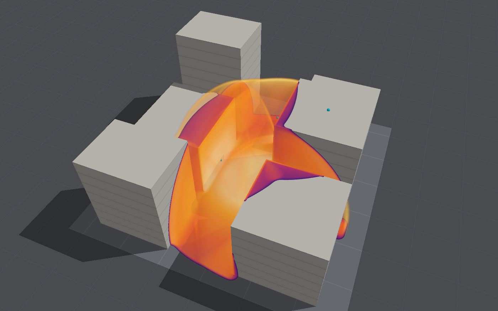
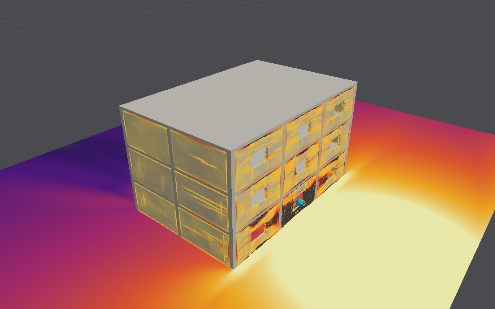
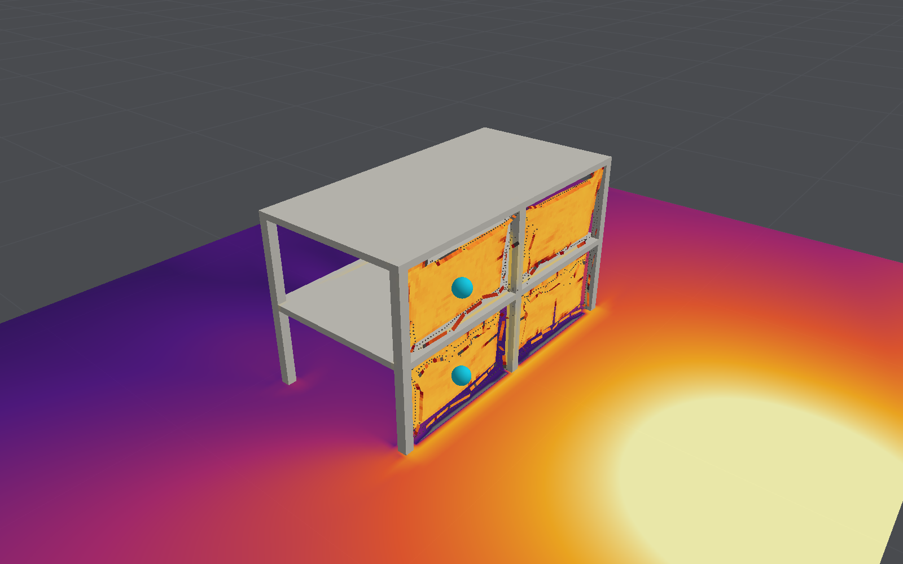
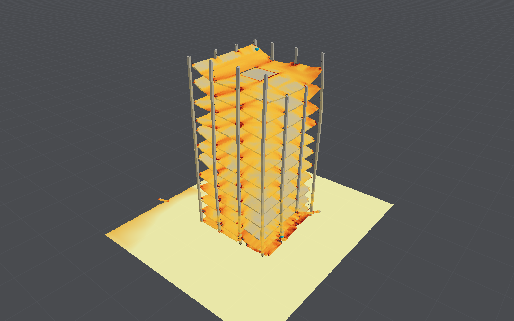

# BombCAD

An interactive blast simulator for simple building layouts, written to answer one question:
how close to real time can a physically based simulation of blast on structures run on a
current Mac?

It has two solvers, both on the GPU:

- an **air-blast solver** that propagates the blast wave around obstacles and records peak
  overpressure and impulse on every surface;
- a **structural solver** for reinforced concrete, brick, concrete block, steel and glass that cracks,
  crushes, yields its reinforcement and breaks under those pressures. Broken pieces collide,
  fall and come to rest, and the air flows through the gaps they leave. Structures are meshed with solid elements, or
  with much faster shell elements for walls and slabs and beam elements for columns, or with
  both in one body, tied where they meet.

It is a study of the numerics and the performance, not a design tool.









## Download

A signed, notarized build for Apple silicon Macs running macOS 15 or later is on the
[Releases](https://github.com/emmettl/bombcad/releases) page. Expand the ZIP and move
`BombCAD.app` to Applications; the `.sha256` file beside it checks the download.

## Running it

To build from source instead: macOS 15 or later, Swift 6.4 and a Metal GPU.

```bash
swift run -c release BombCAD
```

```bash
make app
```

The second command builds `dist/BombCAD.app`, which can be launched from Finder.
[Releasing](docs/releasing.md) describes signed, notarized builds for other Macs.

In the view: drag or two-finger scroll to orbit, shift-drag or right-drag to pan, pinch or mouse
wheel to zoom. Space runs and pauses, ⌘R resets.

The sidebar has two tabs. **Run** picks a built-in layout, the grid, the charge and the display.
The layouts are open ground, a single building, a street canyon and a courtyard (rigid blocks);
a cantilever wall, a single-storey building, the same building behind a blast wall, a two-storey
frame (bare, infilled with masonry, or glazed with glass panes), a three-storey clad building,
an eight-storey frame and a twelve-storey tower with a concrete core (both shells and beams,
for collapse over several seconds), an
open-sided car park with a charge inside, an underpass, a column close to a charge, a
two-storey house of concrete blockwork meshed with shells, a blockwork boundary wall meshed
block by block with its mortar joints, and the internal-explosion test
(deformable). The close-in column wants the fine grid: on coarser air it
is less than a cell or two across. The sidebar shows a structure's deflection now and the
largest it has reached.
**Edit layout** adds, moves, resizes and removes rigid blocks, deformable walls, openings and
pressure gauges, sets each wall's material and reinforcement, and has undo (⌘Z). You can move
the charge, or the selected gauge, by clicking the ground. Save Project writes a `.bombcad`
document containing the scene, simulation settings, camera and embedded import sources. Projects
reopen without the original OBJ/STL files. Named projects autosave; each
project has its own window, and closing an edited untitled project asks whether to save.
BombCAD → Settings (⌘,) sets defaults for new projects and playback windows.
The More menu offers Save As and Import Layout JSON. Export Layout JSON saves just the scene. See [Save files](docs/save-files.md).

**Import Model…** reads watertight OBJ or STL geometry. Confirm source units, up axis and
placement, then prepare a preview of the actual occupied simulation volumes. Imports can be
rigid obstacles, or a new deformable solid body with a material preset and editable density,
stiffness and strength. Deformable imports require a layout without an existing structure,
use solid elements at the air cell size, and start without reinforcement. Fixing the base
holds nodes at the imported body's lowest plane; review that assumption before running.

Repository-only [importer sample files](Samples/Importer/README.md) cover named parts,
STL components, units, cavities, thin features, narrow gaps, and the repair workflow.
They are not bundled with the app.

The importer retains each source mesh, its units/orientation and placement in the saved layout.
**Inspect / edit source…** in Edit layout reopens an import without its original file. Changing
the air grid regenerates retained geometry in the background; the simulation pauses until the
new geometry is ready. Source edits replace that model rather than adding another copy.

Click an imported model in the main viewport to select it and open its source, placement and
material inspector. Selection follows occupied volumes, respects openings and nearer geometry,
and outlines the selected model. Turn off Place Charge to select models; charge/gauge placement
continues to take priority. Viewport selection uses the initial layout, so reset after running
the simulation before selecting a model. Detached geometry remains independently editable and
its retained source is accessible from the sidebar.

The import inspector keeps its 3D preview visible beside independently scrolling, collapsible
controls. Detailed material properties live under Advanced. Dimensions in metres remain visible
while units and placement change; unusually small or large models offer explicit unit corrections.
A labelled reference grid helps judge scale. Corrections are never applied automatically.

Drop one local OBJ/STL file into the viewport or use Import Model. Reading and geometry checking
run in the background with a Cancel checking action; cancelled or superseded work cannot open a
stale result. Rejected geometry opens a separate inspection view with red defect surfaces, source
triangle numbers, repair guidance, and a text repair report. Collapsed/non-finite triangles remain
blocked even when they cannot be drawn. Choose repaired file retries validation after the inspection
closes; invalid inspection data cannot enter the simulation. Syntax errors report OBJ line numbers.

The source inspector includes a searchable Parts browser. OBJ object and group names label
complete connected shells; STL components and unnamed sources receive stable component names.
Face groups within one shell do not define separate material volumes. Select a part to highlight
its source surface in green and focus the preview; the browser reports its sampled solid cells.
A shell with no cells may represent a cavity or a feature lost at the selected resolution.

Part checkboxes support multi-selection, Select matching, and bulk material assignment/reset.
Copy and paste a material between selections. Isolate selected parts and material colours affect
only the preview; every source part still imports. The model default remains linked to parts
without an override. Geometry warnings can be filtered by source part IDs, including cavity
boundaries; placement filtering uses overlapping sampled regions.

Compare grids samples coarse, medium and fine without changing the chosen grid or live layout.
The table shows cells, sampled volume changes, parts absent at one grid but present at a finer
one, and estimated air-memory cost. Measured thin features/gaps suggest a grid when two cells
fit across the smallest sampled dimension; unresolved finest-grid features are called out.
Stable volume or a suggested grid is not a completeness or convergence guarantee. Checks can
be cancelled, and changes to source placement/units invalidate comparisons. Apply is blocked
when estimated air memory or active material counts exceed their limits. Export import report
records all warnings and assignments, regardless of the current warning filter.

Reusable import profiles save units, up axis, behavior, base support choice, default material and
part overrides matched by name. Loading a profile is explicit, reports matched overrides, and
stages settings until Apply. Placement, domain and grid stay specific to the current import.
Existing imports retain their rigid/deformable behavior. Profiles can be updated or removed;
up to 20 are stored locally.

For deformable imports, each part can use the model's default material or a custom preset with
editable properties. Assignments are saved against source part IDs and survive grid, unit,
orientation and placement changes, including a thin part disappearing and later returning at a
finer grid. Sampling keeps different parts in separate generated regions even when a coarse grid
closes their gap. Cavity walls use the enclosing solid's material; a solid island within a cavity
uses its own. The solver supports eight distinct active materials, including the model default;
imports or refinements exceeding that limit fail before changing the layout. Rigid parts remain
obstacles and ignore structural materials. Material textures and external OBJ material files are
not imported.

Placement checks in the preview highlight overlaps with existing geometry (orange), charge
locations inside the candidate model (red), and floating or disconnected sampled components
(purple). Selecting a placement issue focuses the camera on its region, with surrounding volume
for a blocked charge and a ground reference for an elevated component. The Context layer shows
existing geometry and ground and can be toggled off. Checks exclude the
model being edited and subtract structural openings. Separate buildings and intentional joints
can produce advisory warnings; geometric contact does not establish a structural connection
or validate supports. Fixed-base explanations distinguish the lowest plane from elevated,
disconnected components. Checks use the sampled geometry of the rebuilt layout and do not
track moving debris. Work/highlight limits are explicitly reported when checks are incomplete.

The preview refreshes automatically after a short pause when units, orientation, position or
grid change. Pending updates keep the previous geometry dimmed and clearly marked; Apply is
disabled until the current preview is ready and its warnings have been reviewed. Previewing
does not change the simulation.

Placement shortcuts centre the footprint without changing its height, put the base on the
ground without moving X/Y, or expand the domain with clearance. Expansion preserves existing
domain extents and checks the estimated air-memory budget; it takes effect only on Apply and
can be undone in the sheet before applying.

The interactive 3D preview overlays the source wireframe (cyan) and sampled simulation volumes
(blue). Orange regions identify thin features or narrow gaps sampled along X, Y and Z; red
regions identify potentially missing surfaces. Toggle layers, orbit and zoom, or select a
region to focus the camera, or reset the view. Warnings group potentially missing surfaces
separately from resolution risks. **Preview finer grid** advances to the next available grid;
the finest grid is explicitly identified, since refinement does not guarantee resolution.
Region descriptions include approximate position, extent and the
minimum sampled feature dimension. Empty previews show geometry lost on a coarse grid, but
cannot be imported until a finer grid or larger scale produces occupied cells.

Warnings persist with retained models. Review them before applying an import, and compare
resolutions to assess accuracy: highlights are approximate sampling diagnostics, not a
convergence or completeness guarantee. Up to 128 affected regions are highlighted; the UI
reports when this limit is reached. Features not crossed by scanlines and missing surfaces
near other occupied geometry can escape detection.

Deformable regeneration preserves the body's main material and source part assignments. Changes to individual generated regions,
openings, reinforcement or supports block regeneration to avoid overwriting local edits.
**Detach geometry** keeps the current geometry and edits while stopping source regeneration.
The mesh remains saved and available for inspection; detached geometry is independent. Grid
changes cannot then restore lost features. Layouts saved by the earlier importer remain
readable, but their discarded sources cannot be recovered automatically.

Textures and OBJ visual materials are ignored; export triangulated faces or convex polygons.
Open/non-manifold meshes, self-intersections, overlapping solids and ambiguous contacts are
rejected before sampling, including defects smaller than a grid cell. Intersection errors
identify triangle numbers and an approximate region in source units. Boolean-union overlapping
solids or repair the indicated surfaces in your CAD tool before exporting again. Separate nested
shells are interpreted as cavities, with further nested shells becoming solid islands; a completely
contained part therefore needs a Boolean union if it is intended to fill material. Face winding
is normalized internally for sampling without rewriting the source. Rays on triangulation edges
use one face owner and tangent contacts cancel.

Limits are 20 MB, 100,000 triangles, 2 million sampled cells, and 2,048 coalesced regions.
A spatial hierarchy limits intersection checking to overlapping triangle bounds, with a
2 million candidate-pair limit, a traversal budget and cancellation. Models that exceed
validation limits must be simplified; they are not imported with incomplete checks. A scanline-work budget also limits
expensive previews.

Gauge and deflection histories export
as CSV from beside the chart.

```bash
swift test
```

```bash
swift run -c release blastbench throughput
```

```bash
swift run -c release blastbench slab --sensitivity
```

`blastbench` also has `structure`, `validate`, `gas`, `chamber` and `snapshot` commands; see
[Performance](docs/performance.md) and [Validation](docs/validation.md). `blastbench anchorage`
compares a freestanding wall on a clamped base with one on starter bars, a construction joint
or friction alone (see [base connections](docs/structural-model.md#base-connections)).

`BombCAD run Example.bombcad --out Example-run.bombcad` runs a saved project without a window and
keeps the result as a saved run, for scripts and other Macs; see
[headless runs](docs/run-comparison.md#headless-runs). Add `--usd Example.usda` to write the scene and the
structure over time for rendering elsewhere ([USD export](docs/usd-export.md)).

For the isolated rigid-object mechanics demo, run `swift run rigidboxdemo`, then open
`.build/rigid-box-demo.html` in a browser. The self-contained replay shows resting, friction
holding, sliding, lift-off, rocking and tipping, with playback and a time slider. It records
the Swift reference mechanics; independent rigid objects are not yet simulated or displayed
in the app.

`swift run -c release rigidboxdemo --blast` generates `.build/rigid-box-blast-demo.html`, a
slow-motion comparison of a held and free box under the same blast. This experimental path
uses one box on uniform ideal-gas air and reports reference timings. Chemistry and deformable
structures are unsupported; whole-cell boundary updates can introduce pressure
artefacts. It does not enable rigid-object simulation in the app.

`swift run -c release rigidboxdemo --convergence` writes `.build/rigid-box-convergence.json`
and prints resolution, timestep, impulse, motion, mass-conservation and timing comparisons.
It includes held/free uniform-grid references and factor-two adaptive held/free runs.
`swift run -c release rigidboxdemo --refined` generates `.build/rigid-box-refined-demo.html`,
showing held and moving boxes with fine masks and wall velocities. Translation, rotation and
ground-gap opening/closure use conservative fine-cell remapping. Free-motion results are
still sensitive to spatial resolution. The synchronous remapper operates within the swept
box bounds plus a donor margin; the convergence report includes remapping phase timings.
Add `--extended` to the convergence command for 0.025 m uniform grids at both timesteps
and adaptive comparisons with 0.05 m fine cells. This writes
`.build/rigid-box-convergence-extended.json`, including initial gas mass/energy and final
orientation/angular momentum; each completed case prints its timing.

`swift run -c release rigidboxdemo --diagnostics` writes `.build/rigid-box-diagnostics.json`:
prescribed remapping in ambient air without gas evolution, suspended-box loading in uniform
flow without gravity/contact, and contact-only mechanics under a known force pulse. These
separate boundary sensitivity from contact sensitivity; the remap-only pressure changes
are a numerical stress diagnostic, not a prediction of blast error.
Add `--transport` to compare an opt-in connected-path remapper, writing
`.build/rigid-box-diagnostics-transport.json`. It preserves uniform states for balanced
occupancy changes; unequal voxel volumes still use redistribution. The usual driver and
app keep their existing behaviour while this alternative is evaluated.

## Headline results

Measured on an Apple M4 Max (32-core GPU, 36 GB).

| Case                                                        | Speed                        |
|-------------------------------------------------------------|------------------------------|
| Air blast, street scene, 8.4 million cells of 0.25 m        | 17× slower than real time    |
| Concrete building, 225,000 elements, coupled to the air     | 70× slower                   |
| The same building as 3,700 shell elements                   | 7× slower (2× on 0.5 m air)  |
| Three-storey building as shells and beams                   | 31× slower (17× on 0.5 m air) |
| The building with its front wall solid, the rest shells     | 24× slower                   |
| Three-storey frame with masonry cladding, 160,000 elements  | 60× slower                   |
| Two-storey frame collapsing over 3 s                        | 11× slower                   |
| Eight-storey frame collapsing over 4 s, 31,000 shells and beams, 0.5 m air | 21× slower    |
| Twelve-storey tower collapsing over 4 s, 95,000 shells and beams, 0.5 m air | 56× slower   |

Seven comparisons with the outside world, all in the [validation notes](docs/validation.md):

- **Blast loads.** On air cells of 0.25 m or finer, the impulse on a rigid wall is within 6% of
  the Kingery–Bulmash curves beyond 1.5 m/kg^(1/3), and within 5% everywhere checked on
  0.125 m cells. Peak pressures are under-resolved, more so close to the charge; refining the
  air near the shock gives the peaks of a grid twice as fine at a sixth to a third of its cost.
  The incident impulse is 13–22% low by default, or within 6% with afterburning and hot air
  switched on, which also bring the gas pressure in a closed room within 8% of the US design
  manual's.
- **Structural response.** Against a published blast test of a reinforced-concrete slab, the
  model predicts peak deflections of 100, 101 and 107 mm with 4, 8 and 16 elements through the
  thickness, where 108 mm was measured, with no material constant fitted to the test; with 32
  elements (4.4 million) it is 105 mm, so the peak has converged. The rebound
  after it is twice the measured one, and the result is sensitive to the load and to how the
  supports are modelled. Shell elements converge to 124 mm in about a second, with a rebound
  close to the measured one.
- **Beam bent to failure.** A reinforced beam with no stirrups, loaded slowly in four-point
  bending, carries 97–99% of its measured peak moment on two meshes and fails at 38–52 mm
  against 42 mm measured, with nothing fitted.
- **Beam failing in shear.** A beam without stirrups fails suddenly in diagonal tension, as
  the test beam did, at 11–12% above the measured load on fine meshes; on coarse ones (twelve
  elements through the depth) it is a third too strong.
- **Beams struck by a falling weight.** Seven drop-weight impacts on beams that differ only in
  their stirrups: with stirrups, the peaks are within 15% under the light drops and −5% to +15%
  under the heavy ones, and the beam without stirrups is broken by the heavy drop, as in the
  test, but also by the light one, which it survived. Ando et al.'s beams without stirrups,
  struck at rising speeds, peak within 15% up to 3 m/s and go too far at higher speeds.
- **Slabs under close-in charges.** Full-scale slabs under 2–15 kg hung 0.5 and 1 m above
  them: the impulse under the charge is 86–95% of the empirical curves' on fine cells (and
  within 8% from 0.3 m/kg^(1/3) on a rigid surface), and light charges
  leave the slab undamaged as in the tests, but the heavy ones leave it a third as far down,
  barely spalled and not punched through, where the tests' slabs spalled and were holed.
- **Internal explosion.** In a full-scale reinforced concrete chamber loaded by 200 kg of TNT,
  the peak pressures on the walls are 0.9 to 1.6 times those measured. With the structure as
  built, so far as the paper says, the roof is about twice as stiff as the paper's own model
  and springs back to 7 mm where 95 mm was measured; its joints stay whole where the test's
  were cut through. The test exposed missing mechanisms in the concrete model, errors in it,
  in contact and in the time step, and an error in the test's own set-up, all now dealt with.

Collapse and debris have not been compared with anything.

## Documentation

| Document                                    | Contents                                                        |
|---------------------------------------------|-----------------------------------------------------------------|
| [Air-blast model](docs/air-blast-model.md)  | Equations, numerical scheme, charge model, boundaries           |
| [Structural model](docs/structural-model.md) | Elements, time stepping, contact, coupling to the air           |
| [Concrete model](docs/concrete-model.md)    | Cracking, crushing, shear, reinforcement, strain-rate effects   |
| [Shell model](docs/shell-model.md)          | Shells for walls and slabs, beams for columns                   |
| [Validation](docs/validation.md)            | The slab test, empirical blast curves, verification tests       |
| [Performance](docs/performance.md)          | Benchmarks and where the time goes                              |
| [Distributed computing](docs/distributed-computing.md) | Whether one run could use several Macs' GPUs, and when it would pay |
| [USD export](docs/usd-export.md) | Writing a run's geometry over time as USD, for rendering in Blender and elsewhere |
| [Ray tracing](docs/ray-tracing.md) | Notes for other projects: adopting Metal ray tracing for precomputed simulations |
| [Roadmap](docs/roadmap.md)                  | Known limitations in order of importance, and planned work      |
| [RoomCAD roadmap](docs/roomcad-roadmap.md)   | Shared modules, room impulse responses and convolution reverb   |
| [Save files](docs/save-files.md)            | Versioned project packages, assets and persisted settings       |
| [Data wanted](docs/data-wanted.md)          | Sources that need fetching by hand, and what each would add     |
| [Releasing](docs/releasing.md)              | Signed, notarized builds                                        |
| [Continuous integration](docs/continuous-integration.md) | The Mac mini runner, nightly validation and benchmarks |

Each model document lists its sources, its limitations and the work that would address them.

## Code layout

| Target        | Contents                                                             |
|---------------|----------------------------------------------------------------------|
| `SceneModel` / `SceneView` | Shared geometry and camera in [SimulationKit](Packages/SimulationKit/README.md) |
| `BlastCore`   | Air and structural solvers, materials, scenarios, benchmark data     |
| `BlastRender` | Scene renderer, orbit camera, offscreen snapshots                    |
| `BombCAD`     | SwiftUI app with the layout editor                                   |
| `blastbench`  | Command-line throughput, validation and snapshot tool                |

## Licence

MIT; see [LICENSE](LICENSE).
