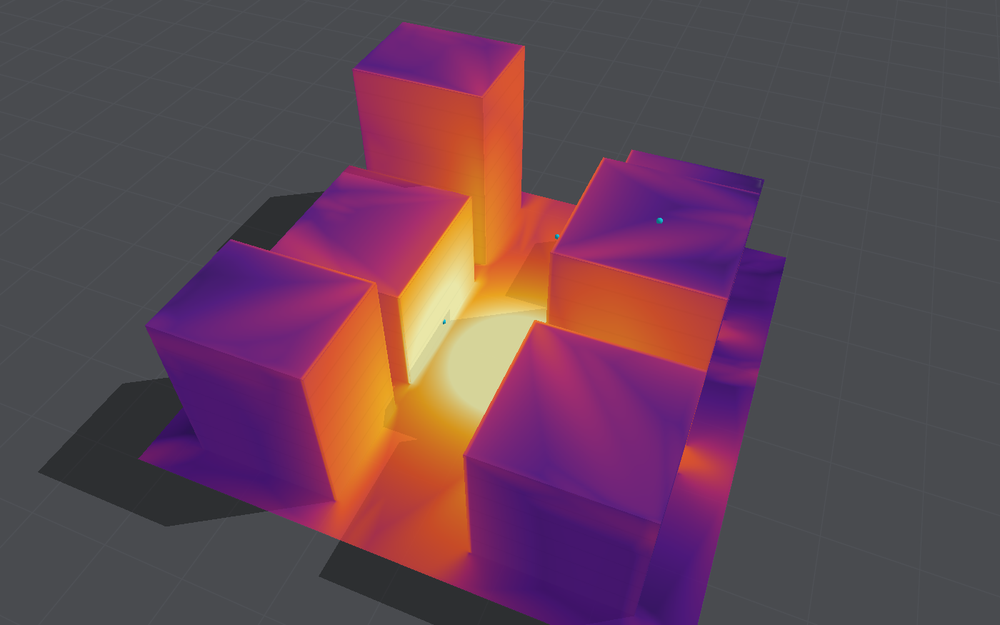

# Air-blast model

The air solver propagates the blast wave through the air around rigid obstacles and the
deformable structure. It lives in `Sources/BlastCore/BlastSolver.swift` and
`Sources/BlastCore/Shaders/Solver.metal`.

## What it solves

The three-dimensional compressible Euler equations for an ideal gas with a constant ratio of
specific heats γ = 1.4, on a uniform Cartesian grid of cubic cells. There is no viscosity, heat
conduction, gravity or chemistry. The conserved variables per cell are density, three momentum
components and total energy, stored as five single-precision numbers.

## Numerical scheme

| Aspect             | Choice                                                                         |
|--------------------|--------------------------------------------------------------------------------|
| Discretisation     | Finite volume, cell-centred                                                    |
| Order              | Second order in smooth flow, first order at shocks                             |
| Reconstruction     | MUSCL–Hancock: limited slopes of the primitive variables, half-step predictor  |
| Limiter            | Generalised minmod with θ = 1.5 (θ = 1 is minmod, θ = 2 is monotonised central) |
| Riemann solver     | HLLC, with Einfeldt's wave-speed estimates from Roe averages; HLL is selectable |
| Multi-dimensions   | Dimensional splitting; the sweep order alternates x-y-z and z-y-x each step    |
| Time step          | Courant number 0.45 per sweep, ramped up over the first six steps              |
| Positivity         | Reconstruction falls back to first order where it would give negative density or pressure; density and pressure floors |

Each directional sweep is one Metal compute kernel that reads a five-cell stencil and writes
the cell's new state, so a time step is three kernel dispatches. Neighbouring cells compute the
flux through their shared face from identical inputs, which makes the scheme conservative
without storing fluxes.

**Time-step control on the GPU.** The final sweep of each step records the fastest wave speed
with an atomic maximum. A one-thread kernel at the start of the next step turns that into the
time step, advances the clock and samples the gauges. Because nothing is read back to the CPU
between steps, up to 256 steps are queued in one command buffer.

**Recorded fields.** The final sweep also accumulates, per cell, the peak overpressure and the
positive-phase impulse (the time integral of overpressure while it is positive). These are what
the app paints on the ground and on rigid blocks.

## Obstacles and boundaries

- Rigid blocks and the structure are voxelised into a solid mask. A block cell is solid when
  its centre is inside the block; a structure cell is solid when at least a third of it is
  filled by intact elements (see [Structural model](structural-model.md#coupling-to-the-air)).
- At a solid cell or a reflecting domain face, the stencil is filled with mirrored ghost states
  (normal velocity reversed). The Riemann problem at the wall then has zero mass flux, so walls
  are exactly conservative and can be one cell thick.
- The ground (z = 0) is a reflecting face. The other five faces of the domain are open: the
  stencil copies the last interior cell (zero-gradient extrapolation).

## The charge

The charge is a "bursting balloon": a sphere of hot, dense gas at rest.

- Its energy is the TNT-equivalent mass times 4.184 MJ/kg (the conventional energy of TNT), and
  its mass is added to the air's density in the sphere.
- The sphere's radius is the physical charge radius (for a density of 1600 kg/m³) or two cells,
  whichever is larger.
- Cells are weighted by the fraction of their volume inside the sphere, and the totals are
  normalised over fluid cells only. A charge on the ground or against a wall therefore releases
  all of its energy into the air; a charge on rigid ground behaves like a free-air charge of
  twice the mass.
- A scenario can fire several charges at once (`additionalCharges`); each is laid down the
  same way.

## Skipping still air

Air the blast has not yet reached is in exactly the uniform state it was filled with, and a
sweep leaves such a cell unchanged when every cell its update reads is in that state too. So
the grid is cut into tiles of 8 × 8 × 8 cells, and only the awake tiles are swept:

- A cell's update reads two cells either side along the sweep, so in one step (three sweeps)
  a change spreads at most two cells along each axis.
- After each step, a cell that differs from the uniform state by any amount wakes every tile
  within two cells of it. A tile is therefore awake before any change can reach its cells.
- At a restart, the tiles near every cell not in the uniform state are woken, and so are the
  tiles around a structure, where the moving mask and the debris trade with the air.
- Tiles never go back to sleep, and both state buffers start alike, so a skipped tile holds
  exactly the uniform state.
- Skipped air still counts towards the time step, with exactly the wave speed a sweep would
  have recorded for it.

The answer is therefore identical to the last bit; tests compare a street scene and a wall
broken by the blast with and without skipping, cell by cell. The list of awake tiles is built
on the GPU before each step and the sweeps are dispatched indirectly, so stepping still needs
no round trip to the CPU. Only the peak overpressure and impulse of air the blast never
reached can differ, by the rounding error that still air reads as overpressure (under 0.1 Pa).
`SolverConfiguration.skipStillAir` switches it off.

## Freezing the air

When a deformable structure is present, the air is frozen (its sweeps are skipped) once either
no cell is more than 2 kPa from ambient pressure, or five acoustic crossing times of the domain
have passed. The structure then advances alone at its own time step. The second condition
exists because a collapsing structure keeps disturbing the air near it through the moving solid
mask, so the pressure test alone may never be met. The threshold is not lower because the
winds left behind by a blast die away slowly: a second after a 50 kg charge, some cells were
still 0.8 kPa from ambient.

## Verification and validation

See [Validation](validation.md). In brief: the scheme reproduces Sod's shock tube, a reflected
normal shock and the Sedov–Taylor blast, and conserves mass and energy exactly in a closed box.
Against the Kingery–Bulmash curves for a surface burst, from 0.75 to 6 m/kg^(1/3), the impulse
on a rigid wall is within 6% on 0.25 m cells beyond 1.5 m/kg^(1/3) and within 5% everywhere on
0.125 m cells; the incident impulse is 13% to 22% low on every grid; and peak pressures are
under-resolved (76% to 82% of the incident peak on 0.25 m cells, improving with resolution).
In a closed room the gas pressure left after the shocks is 48% to 114% of the design curve of
UFC 3-340-02, lowest for light charges.

## Limitations

1. **The source model is crude.** An ideal-gas balloon with γ = 1.4 ignores the detonation
   wave, the real equation of state of the detonation products, and afterburning. It is poor
   within a few charge diameters, or a few cells, of the charge, and it under-predicts incident
   impulse by 13% to 22% at all ranges tested. Impulse on a wall facing the charge is much
   better, within 6%. **Afterburning** matters most in confined spaces: a closed room's gas
   pressure is only half the design value for light charges (0.25 to 0.5 kg/m³), since the
   products would burn in the room's oxygen and release more energy than the detonation.
2. **Shocks are smeared over two or three cells**, so peak overpressure is under-predicted near
   the charge, where the wave is thin compared with a cell. Impulse is much less affected.
3. **Open boundaries reflect a little.** They copy the state inside outward (zero-gradient,
   or "transmissive"), which is not exactly non-reflecting. Measured: for 50 kg at the surface,
   a gauge 13 m away and 5 m inside a truncated boundary differs from the same gauge in a long
   domain by at most 1.2 kPa against a 61.5 kPa peak (2%), all of it in the negative phase,
   and its positive impulse by 1.3%. Keep gauges and structures a few metres inside open faces.

   A characteristic far-field condition (the incoming Riemann invariant taken from still air)
   was tried and was much worse: in a split scheme it treats each face as if waves met it head
   on, and a blast running along a side or top boundary, with full overpressure and almost no
   flow through it, was turned into a strong spurious outflow that doubled the impulse at the
   gauge.
4. **One gas.** Hot products and air share one γ, so the fireball's temperature and its late
   pressure history are not realistic.
5. **Moving solids are a staircase of whole cells.** A moving wall pushes the gas through its
   ghost states, and its surface jumps a cell at a time. The gas is conserved within 0.3% as it
   does; see the structural model's coupling notes.
6. **Single precision.** Pressure differences well below a pascal are lost in rounding against
   ambient pressure, which is harmless for blast but rules out acoustics.

## Future work

- **Afterburning**: energy released into the gas behind the shock as it mixes with air,
  limited by the oxygen available, with the gas pressure of UFC 3-340-02 (Figure 2-152) and the
  incident impulse of Kingery–Bulmash as its two checks. This is the charge model's first
  priority.
- **Better source.** Two options, in order of effort: start from a one-dimensional, finely
  resolved spherical solution and map it onto the grid once the shock has grown to several
  cells; or carry the detonation products as a second gas with a Jones–Wilkins–Lee equation of
  state and optional afterburn energy.
- **Better open boundaries**, if they are ever needed: a perfectly matched or sponge layer
  works at any angle, unlike the one-dimensional characteristic condition that was tried.
- **Adaptive resolution** near the charge and the shock, the standard answer to the
  thin-shock problem, at a large cost in complexity on the GPU.
- **Cut cells**, so that moving solid surfaces need not follow cell faces (see the structural
  model's future work).

## Sources

- E. F. Toro, *Riemann Solvers and Numerical Methods for Fluid Dynamics*, 3rd ed., Springer,
  2009. The MUSCL–Hancock scheme, slope limiting and the HLL and HLLC solvers.
- E. F. Toro, M. Spruce and W. Speares, "Restoration of the contact surface in the HLL-Riemann
  solver", *Shock Waves* 4, 1994. HLLC.
- B. Einfeldt, "On Godunov-type methods for gas dynamics", *SIAM Journal on Numerical
  Analysis* 25(2), 1988. Wave-speed estimates.
- G. A. Sod, "A survey of several finite difference methods for systems of nonlinear hyperbolic
  conservation laws", *Journal of Computational Physics* 27, 1978. The shock-tube test.
- L. I. Sedov, *Similarity and Dimensional Methods in Mechanics*, Academic Press, 1959. The
  point-blast solution.
- H. L. Brode, "Numerical solutions of spherical blast waves", *Journal of Applied Physics*
  26(6), 1955. Blast from a sphere of hot gas, the idea behind the balloon source.
- G. F. Kinney and K. J. Graham, *Explosive Shocks in Air*, 2nd ed., Springer, 1985. The
  free-air overpressure and impulse formulae (equations 6-2 and 6-12) used for validation,
  both checked against the book.
- C. N. Kingery and G. Bulmash, *Airblast Parameters from TNT Spherical Air Burst and
  Hemispherical Surface Burst*, ARBRL-TR-02555, US Army Ballistic Research Laboratory, 1984;
  and M. M. Swisdak, *Simplified Kingery Airblast Calculations*, Naval Surface Warfare Center,
  1994. The reference for design practice; Swisdak's polynomials for a hemispherical surface
  burst are in `KingeryBulmash.swift`.
- United Nations Office for Disarmament Affairs, *International Ammunition Technical
  Guidelines*, IATG 01.80, "Formulae for ammunition management", 3rd ed., 2021, Table 5.
  Three worked Kingery–Bulmash examples, an independent check on the polynomials.
- US Department of Defense, UFC 3-340-02, *Structures to Resist the Effects of Accidental
  Explosions*, 2008. Peak gas pressure in a closed room (Figure 2-152), digitised in
  `UFC340.swift`.
