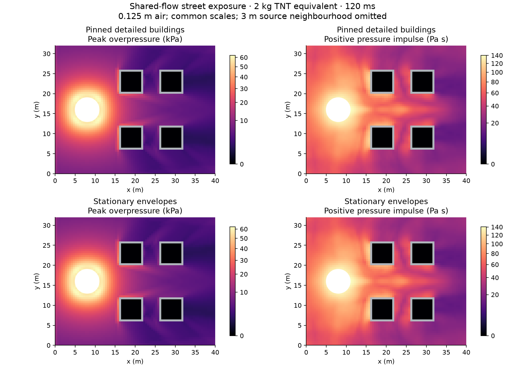
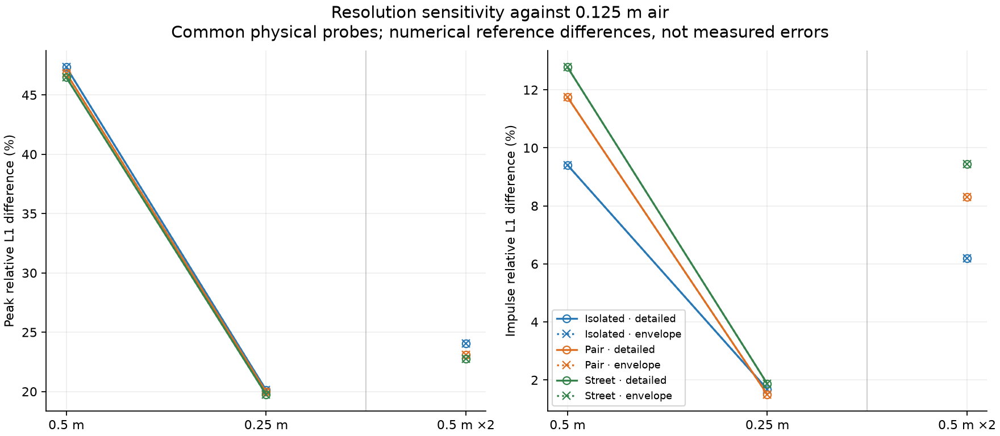
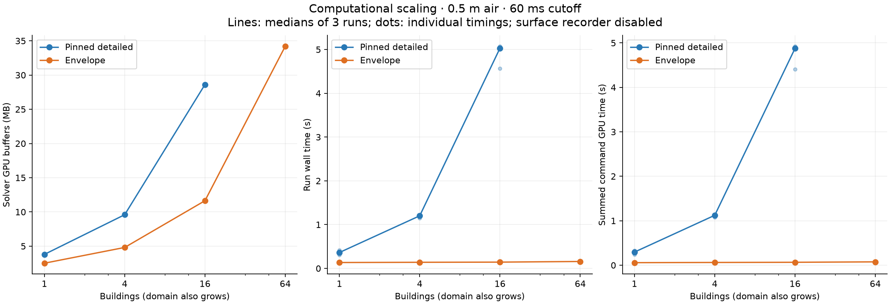

# Stationary building envelopes

Building envelopes keep walls, roofs and openings in the shared air simulation without a
structural mesh. They offer a cheaper representation for neighbourhood exposure studies:
each building still shields and reflects the flow, including waves returning from its
neighbours. They remain stationary throughout a run and predict no deformation or failure.

In the structure editor, **Use Exposure-only Envelope** converts the selected local authored
structure. Its object ID, name, solids and openings survive; materials, reinforcement,
supports and mechanical state are discarded. **Undo** restores the detailed structure.
The resulting buildings appear under **Exposure-only buildings**, where they can be removed.
Geometry editing is done before conversion or in a layout JSON; there is no separate envelope
geometry editor yet. Source-owned imports keep their existing import workflow.

`BuildingEnvelope` and its approximation rules belong to BlastCore in BombCAD. It uses the
existing ContinuumKit `Box` geometry; this milestone introduces no shared-core contract or
package release. Openings are subtracted into bounded box fragments using the same half-open
boundary convention as the air rasteriser. Limits are 2,048 solids/fragments per building,
256 openings per building and 2,048 rigid fragments across a scene containing envelopes.
Unlike deformable bodies, envelopes have no sixteen-building mechanics limit. Air memory and
resolution still constrain useful scene size.

## Saving and exporting

Layouts encode `buildingEnvelopes` beside the existing geometry, with durable object ownership.
Projects containing envelopes use scene encoding version 5 so older package readers reject
them instead of silently dropping buildings. Projects without envelopes retain their existing
version 3 or 4 encoding. Existing numerical fingerprints are unchanged; envelope geometry
enters new fingerprints while object names and IDs remain excluded.

The viewport draws the subtracted rigid fragments, and ordinary runs retain gauge histories
and the existing pressure/impulse fields. USD exports put each envelope in a separate mesh
with its object ID, name and stationary-envelope representation attached. Opening geometry
also participates in import placement and picking occlusion.

## Surface exposure and loads

An optional `BlastSolver.configureEnvelopeExposure(objects:)` recorder reports the boundary
that the air grid actually resolves. It accepts envelopes and fully pinned detailed reference
bodies at time zero. Moving-body references are rejected. Loading another scene or replacing
the body set clears the recorder; restarting resets its values.

Every owned solid cell face next to a fluid cell becomes a receiver with area `dx²`, a
position at the voxel face and a normal pointing into air. Interior and exterior surfaces
both contribute. Shared solid faces and domain boundaries contribute nothing, including the
ground attachment. Buildings with overlapping owned solid cells are rejected by the recorder;
every requested building must have at least one resolved face.

After each complete fluid step, a receiver reads the pressure at its adjacent coarse fluid
cell centre, including restricted fine state. This is a cell-pressure approximation to
surface loading, not the solver's wall Riemann flux or a calculated structural reaction.
The initial pressure participates in the peak; temporal integrals use right endpoints for
every accepted fluid interval, including a clipped final interval. Time-limit no-op steps add
nothing. A changed solid/fluid pair marks the receiver invalid.

Snapshots retain current overpressure (Pa), peak positive overpressure (Pa), positive pressure
impulse (Pa s) and signed pressure impulse (Pa s). Summing `-normal × area × overpressure`
gives an estimated force in N; using signed impulse gives an estimated vector impulse in N s.
Signed accumulation preserves suction and cancellation between opposite faces. The core
recorder is opt-in. The app automatically enables it for scenes containing envelopes without
deformable structures; other ordinary scenes allocate no surface recorder. Mixed scenes
continue to run, with the inspection restriction shown in the sidebar.

The Run tab's **Building surface exposure** section selects an owner and shows its recorded
window, resolved area, maximum surface overpressure, area-weighted mean positive impulse,
summed positive loading, current force vector and signed impulse vector. The positive scalar
sum integrates pressure impulse over every resolved interior/exterior face; it is not the
resultant vector impulse. Readouts refresh alongside the chart, up to ten times a second.
The GPU still records every fluid endpoint, so display cadence does not skip integrals.

Pause a run to **Export surface records…** as JSON, with individual face locations, normals,
areas and pressure exposure. Exports are snapshots of the current finite observation window.
Reset clears the live results. The viewport continues to show the existing pressure and
impulse fields; the numerical surface inspector does not add a separate surface colour map.

**Keep Run** stores compact per-building summaries with stable owner IDs. They appear in
saved-run inspection and CSV exports, where their values are labelled at the end of the
recorded window. Individual face arrays are exported separately rather than embedded in
every kept result. Results containing these summaries use saved-run encoding version 3;
earlier records remain readable and retain their encoding when they lack surface results.
These diagnostics do not enter the numerical input fingerprint.

Headless runs collect the same summaries. To write full surface records alongside a kept run:

```sh
.build/release/BombCAD run envelope-layout.json --duration 0.12 --out envelope-run.bombcad --envelope-results surfaces.json --csv exposure.csv
```

`--envelope-results` requires a scene containing only stationary envelopes and at least one
resolved exposed face per owner. It refuses a pre-existing destination. Unavailable surface
recording does not prevent ordinary blast runs, but an explicitly requested surface export
fails with its reason instead of writing absent results as zeros.

## Matched building study

```sh
swift build -c release --product scenebench
.build/release/scenebench envelopes /tmp/envelope-study --source-revision=$(git rev-parse HEAD)
python3 Scripts/check-building-envelopes.py /tmp/envelope-study --summary /tmp/envelope-study/summary.json
python3 Scripts/plot-building-envelopes.py /tmp/envelope-study --out /tmp/envelope-study/figures
```

`--quick` runs six 12 ms smoke cases. It establishes operation and initial boundary matching;
the full study is needed to follow the wave through the buildings.

The full matrix uses the [street study's](street-interaction.md) isolated, paired and
four-building layouts, with a conventional 2 kg TNT-equivalent source, fixed 1 m deposition
radius and a 120 ms observation window. The detailed references use 0.5 m solid elements,
with every node restrained. Comparing
against freely responding buildings would confound the cost of the representation with the
physics deliberately removed by an envelope.

Each layout runs at 0.5, 0.25 and 0.125 m uniform air spacing and at 0.5 m refined by two.
Additional cases exercise a doorway and roof opening, source-normalised conservation with
closed boundaries, half CFL at 0.25 m, separate stage profiling and unrecorded replays.
The fixed spatial probes remain 0.5 m apart at 1.5 m height. Comparisons exclude the union
of solid-touching probes across both representations and all resolutions, a 3 m source
radius and a 1 m domain-edge margin. Surface comparisons match physical voxel-face positions
and normals, retaining any unmatched-face count.

Representation gates require matching boundary classifications and surface faces, peak
relative L1 differences below 10% and positive-impulse differences below 5%, both on maps and
surfaces, total surface positive loading differences below 5% and vector impulse differences
below 10%. Total-load comparisons include every resolved face, including any unmatched faces.
These gates assess the approximation against the pinned numerical reference;
they do not establish physical accuracy. Spatial sensitivity uses the finest grid as a
reference. The finest grid itself has no finer or half-CFL companion here.

Load histories sample force at eight-step batch endpoints. Their cumulative signed impulse
includes every accepted fluid step, while force extrema between batch endpoints can be missed.
Gauge histories retain every fluid endpoint. The metadata report stays readable; raw maps,
surface records, gauge/body histories and load histories are separate lossless gzip files.

The retained M4 Max [report](../Benchmarks/BuildingEnvelopes/m4-max/report.json) contains 57
runs produced by revision `6710af3952c14bb263fe2c3de0279d09613ee09f`; its
[checked summary](../Benchmarks/BuildingEnvelopes/m4-max/summary.json) contains 14 representation
comparisons, 20 sensitivity comparisons and four scaling sizes. Every representation pair
has identical spatial maps and surface records, including the opening fixture. The matched
faces, total surface positive loading and vector impulse therefore have zero differences.
The unrecorded and profiled replays also retain identical maps.



The plot uses common square-root colour scales, omits the 3 m source neighbourhood and shows
stencils touching solids in grey. Enclosed air remains visible inside the buildings.

Envelope equality does not remove air-grid sensitivity. For the street's 4,272 common probes:

| Air setting | Peak relative L1 | Impulse relative L1 | Mean arrival difference |
| --- | ---: | ---: | ---: |
| Uniform 0.5 m versus 0.125 m | 46.48% | 12.78% | 1.006 ms |
| Uniform 0.25 m versus 0.125 m | 19.76% | 1.87% | 0.391 ms |
| 0.5 m refined by two versus 0.125 m | 22.75% | 9.43% | 0.553 ms |
| Uniform 0.25 m, half CFL versus nominal CFL | 2.62% | 1.34% | 0.097 ms |

The detailed and envelope curves coincide because their resolved boundaries and air fields
match. Adaptive maps read restricted coarse state, rather than the sharpest fine-cell peak.
The finest result is a numerical reference, not a converged or measured answer.



Closed companions have identical conservation residuals: mass drift is 0.02755% of injected
source mass and energy drift is 0.00107% of source energy, both below the 0.3% gate.

## Scaling study

The scaling runs compare 1, 4 and 16 pinned detailed buildings with matching envelopes, then
run 64 envelopes. Air spacing is 0.5 m and the cutoff is 60 ms. Domain extent grows with the
building count, so total air-cell count grows too. The largest scene need not have exposed
every building by that cutoff; this is a computational scaling study, not complete loading
of a neighbourhood.

Each paired size has three repeats with alternating execution order. Surface recording is
disabled for scaling, and spatial recording remains enabled on both representations.
The report retains each wall/GPU timing, setup time and solver GPU-buffer footprint.
Stage-profile replays separate air, mechanics, coupling and observation; their stage sum
omits encoder gaps and profiling adds overhead. Repeated local timings still vary with
background work and hardware.

Measured medians of three runs on M4 Max, with memory in decimal MB:

| Buildings | Detailed buffers | Envelope buffers | Detailed wall time | Envelope wall time | Detailed GPU time | Envelope GPU time |
| --- | ---: | ---: | ---: | ---: | ---: | ---: |
| 1 | 3.80 MB | 2.51 MB | 0.363 s | 0.134 s | 0.295 s | 0.057 s |
| 4 | 9.59 MB | 4.81 MB | 1.201 s | 0.140 s | 1.122 s | 0.062 s |
| 16 | 28.62 MB | 11.64 MB | 5.031 s | 0.143 s | 4.877 s | 0.066 s |
| 64 | — | 34.21 MB | — | 0.158 s | — | 0.075 s |



The 16-building short-window wall-time ratio is 35.1, but it includes the different amount
of still-air work as well as removed mechanics and coupling. Detailed boundaries keep nearby
air awake for moving-mask/debris processing; envelopes can skip untouched tiles. Extending
the window until distant buildings are exposed would change this balance.

The finer four-building street offers a longer-window comparison. At 0.125 m, a single
120 ms run took 51.79 s wall and 50.55 s GPU with detailed buildings, versus 18.92 s wall and
17.95 s GPU with envelopes. Reported solver buffers fell from 514.84 to 301.22 MB. These are
single local observations; the full-resolution air remains a substantial cost.

The separate 0.25 m profiled replays recorded 2.01 s of mechanics and 0.91 s of coupling for
the detailed scene, both zero for envelopes. Recorded air time was 0.77 s and 0.51 s,
respectively, and observation was 0.12–0.13 s. Stage sums omit encoder gaps, and their
profiled command times (8.34 s and 3.83 s) include extra encoder overhead; use the ordinary
runs for throughput comparisons.

## Shell geometry diagnostics

The earlier shell-reference matrix is retained separately in
[`Benchmarks/BuildingEnvelopes/shell-reference`](../Benchmarks/BuildingEnvelopes/shell-reference).
It does not satisfy the matching-boundary acceptance gates. Diagnose it with:

```sh
python3 Scripts/check-building-envelopes.py Benchmarks/BuildingEnvelopes/shell-reference --diagnostic --summary /tmp/envelope-shell-summary.json
```

The shell mesh joins panels on midsurfaces and its sampled boundaries differ from the authored
box union at some junctions and opening rims. Closed-building probe masks match, but resolved
surface faces differ on the finer grids. In the doorway/roof-opening fixture, one horizontal
probe changes solid classification and the surface sets have 16 unmatched faces at 0.5 m
air spacing and 131 at 0.25 m. Treating those runs as a strict check of envelope geometry
would hide the shell approximation.

The opening fixture's far-field map impulse differs by 1.23% at 0.5 m and 0.83% at 0.25 m,
while the total surface positive loading differs by 11.73% and 6.68%, respectively. The
corresponding vector impulse differences are 24.13% and 34.94%. Far-field agreement therefore
does not establish agreement in surface loading. The matched-solid study isolates the cost
of removing mechanics; this diagnostic matrix records the consequences of changing the
resolved boundary as well.

## Scope and verification

Tests compare surface integration with independent per-step CPU pressure accumulation,
including suction, check uniform-pressure cancellation, final-interval clipping and restart,
and verify bit-identical air fields with recording enabled on coarse and refined grids.
Project tests cover mixed scenes, version rejection and Undo/Redo restoring the original
structure. Existing ownership, project and multi-body checks cover compatibility.

The envelopes inherit the existing idealised blast model and grid-dependent geometry.
Unresolved openings and thin walls can disappear. Fixed geometry cannot represent broken
windows, collapse, debris or evolving shielding. This establishes stationary exposure
behaviour and its computational cost; it does not validate invented buildings against
measurements or establish kilogram-to-kiloton physical coverage.
