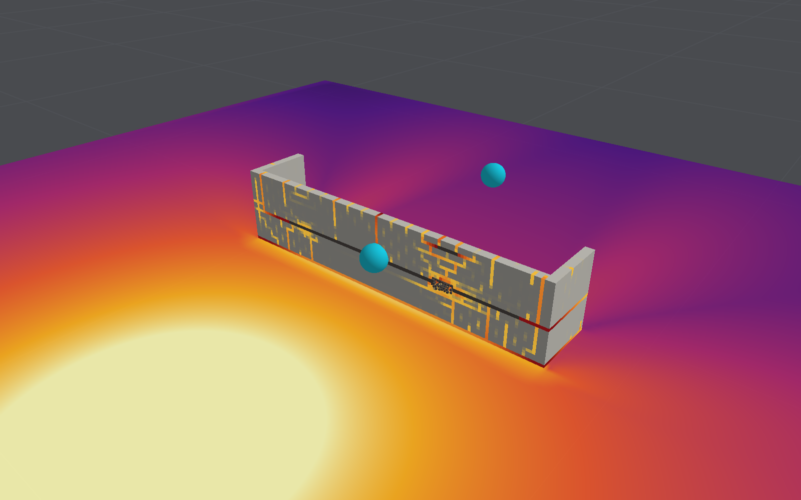

# Concrete and reinforcement model

This is the material law used for reinforced concrete, plain concrete and masonry. It is
evaluated once per element per time step in `structureElements` in
`Sources/BlastCore/Shaders/Structure.metal`; its parameters are in `StructureMaterial` in
`Sources/BlastCore/StructureTypes.swift`.

A second, much simpler material (von Mises plasticity with a failure strain) is kept for
verification problems with exact answers. It is not described here.

## Overview

The model works on **total strain**: at each step it takes the element's Green–Lagrange strain,
computed from nodal displacements, and returns a stress. The only memory is a handful of history
values per element. There is no incremental plasticity for the concrete, which makes the model
robust and exactly reversible in the elastic range.

| Ingredient                  | Treatment                                                                 |
|-----------------------------|---------------------------------------------------------------------------|
| Cracking                    | Smeared over three planes across crack axes that turn with the stress until the crack opens |
| Tension after cracking      | Exponential softening, scaled by fracture energy                          |
| Compression                 | Parabola to peak, linear softening to a 20% residual; permanent strain on unloading |
| Confinement                 | Strength and ductility rise with lateral compression                      |
| Compaction                  | Under high confined pressure the pores collapse; pressure follows the Holmquist–Johnson–Cook curve |
| Shear across cracks         | Aggregate interlock, weakening with crack width; dowel action and kinking of the bars crossing |
| Reinforcement               | Smeared bars along the lattice axes, multi-linear hardening, rupture; Bauschinger softening on reversal |
| Strain rate                 | Published dynamic increase laws for concrete and steel                    |
| Removal                     | By crack width, when no intact bar crosses the crack; or by crushing      |

## Strain measure

The displacement gradient H at the element centre gives the Green–Lagrange strain
E = ½(H + Hᵀ + HᵀH), expressed in the lattice axes. Stress is computed in those axes as a second
Piola–Kirchhoff stress S and pushed forward to the Cauchy stress σ = F S Fᵀ / J. Large rigid
rotations therefore produce no spurious stress, which matters once walls topple.

Poisson coupling is handled through **equivalent uniaxial strains**: for each axis,

ε̃ᵢ = [(1 − 2ν′) Eᵢᵢ + ν′ tr E] / [(1 + ν′)(1 − 2ν′)]

so that σᵢ = E_c ε̃ᵢ reproduces isotropic elasticity while everything is linear. The effective
Poisson's ratio ν′ fades from ν to zero as the worst crack opens, because the strain of an open
crack is not elastic strain and must not put the directions alongside it into tension.

## Cracking

An element cracks when a principal value of its strain with the Poisson effect taken out,
which is the elastic stress divided by E_c (a Rankine criterion), exceeds the cracking strain.
It then works in its **crack axes**, stored as a rotation (a half-precision quaternion): each
of the three planes across them keeps the largest tensile equivalent strain it has seen, κ,
and its own compression and confinement histories, and the shear across a plane is that on
the crack itself. Cracking across one direction therefore leaves the tensile strength of the
others intact. The bars stay on the lattice axes, strained along them, and their stress is
added after the concrete's has been turned back; a crack's crossing bars, for dowel action,
kinking and removal, are counted by the projection of its normal on each lattice axis.

**The axes turn until the crack opens.** While a crack is still forming, its axes follow the
principal axes of the strain every step, each axis taking the principal direction nearest to
it so that each plane's history stays with its own direction. Once a crack has opened, its
tension softened through a tenth of its softening strain (to about 90% of the tensile
strength), the axes are fixed for good; so are they once the concrete has crushed past its
peak. Later cracking at another angle is shared between the three planes in proportion to the
squared direction cosines, and, if it is more than 30° from all three, opens a second crack.

**A second crack.** With the axes fixed, tension that turns away from them is carried across
the cracked planes by their shear, which aggregate interlock holds at up to about 3 MPa, more
than the tensile strength: the stress locks. One element cracked across x and then pulled far
along the diagonal of x and y still carried 0.6 times the tensile strength across the
diagonal, where a crack there would have softened to nothing. So where the concrete's principal
tension passes its tensile strength more than 30° from every crack axis, a second crack forms
across it, its normal fixed from then on (a multi-directional fixed crack, after de Borst and
Nauta). Its opening is a strain of its own, taken out of the strain the rest of the concrete
sees, and set each step so that the stress across it is what the crack carries at that
opening: softening exponentially from the tensile strength over the same crack band and
fracture energy as the first, unloading along a straight line to its residual opening, shut
below that. The split keeps the work done on an element equal to the rest of the concrete's
plus the crack's own opening work, so it dissipates; a first version that only capped the
stress across the new crack returned energy on closed cycles of strain, since the cap
followed one component of strain and the stress all of them. The second crack counts for
removal as the others do, bridged by the bars that cross it. On the element above the
diagonal tension falls to 0.35 of the tensile strength: tension within 30° of the first
crack's axes still locks, and a third crack is not opened. `StructureModel.secondCracks`
(on by default; `--no-second-crack` in `blastbench`) turns it off. Shells and beams have none,
and need none: their cracks lie on the element's axes, and the interlock across them fades as
the shared cracking opens (see the [shell model](shell-model.md#materials)).

The tenth was chosen on the slab test supported on 1 in bearings that hold it down, one of its
sensitivity cases. Left turning through the whole softening, the cracks at mid-span followed
the stress round as the slab rebounded, until no axis carried the tension, and the slab came
apart (245 mm, 999 elements removed). Fixed after a quarter of the softening it peaked at
116 mm with 672 elements removed; after a tenth, at 80 mm with none, beside 81 mm for fixed
cracks and 84 mm for the lattice planes. The other cases changed little between one and a
tenth. A crack that turns only while it is barely open is, in practice, close to a fixed
crack whose direction is chosen a little later; what it removes is the error of the very
first, hairline cracking.

`StructureModel.crackAxes` chooses between this (`.turningUntilOpen`, the default) and the two
models it replaced:

- **Lattice planes** (`.lattice`): the axes are always the lattice's, and an inclined crack is
  shared between the planes it cuts. It is wrong both ways at once. A crack at 45° gives each
  of the two planes its full strain, where geometry gives each half, so their normal stress
  softens too soon; but the shear across those planes is then carried by aggregate interlock,
  up to about 3 MPa at small openings, more than the tensile strength, and that shear carries
  tension across the real crack. One element pulled along a diagonal of the lattice peaks at
  1.18 times the tensile strength and releases 6.6 times the fracture energy (2.0 and 12 times
  along the body diagonal); turning and fixed cracks give both within 0.1%, as along the
  lattice. In the structures run, the softer side won: the lattice planes deflected more
  wherever cracks were inclined.
- **Fixed at first crack** (`.fixedAtFirstCrack`): the axes are those of the first crack, kept
  from then on. An early hairline crack from the shock then fixes axes that the later bending
  does not follow, and stress locks across it.

| Case | Lattice planes | Fixed at first crack | Turning until open |
|---|---|---|---|
| Slab test, 4 / 8 / 16 / 32 elements through | 101 / 105 / 112 / 112 mm; history within 7–10 mm | 101 / 101 / 106 mm | 101 / 100 / 107 / 105 mm; history within 10–15 mm |
| Slab test, 1 in bearings held down | 84 mm | 81 mm | 80 mm |
| Chamber test, test's charge, with the gas the design manual supports | Roof's edge left 0.9 m up | 69 mm peak, 10 mm left | 71 mm peak, 10 mm left (paper's model 87 and 62; measured 95 left) |
| Cantilever wall, 50 kg, on 0.5 / 0.25 / 0.125 m air cells: largest deflection | 41 / 60 / 64 mm | 40 / 50 / 53 mm | 40 / 51 / 54 mm |
| Two-storey frame | First floor falls at 1,000 kg | Stands at 1,000 kg, 92 mm | Stands at 1,000 kg, 90 mm; falls at 2,000 kg |
| Three-storey building's masonry, 100 kg | 1,505 elements removed | 296 | 320 |

(This table predates the second crack.) With and without it, by default otherwise:

| Case | Without a second crack | With one (the default) |
|---|---|---|
| Slab test, 4 / 8 / 16 elements through | 101 / 100 / 107 mm; history within 10.6 / 15.3 / 10.5 mm | 101 / 101 / 108 mm; within 10.5 / 14.4 / 9.8 mm |
| Slab test, 1 in bearings held down | 81 mm | 81 mm |
| Chamber test, default gas / with afterburning and hot air | 66 / 10 mm and 71 / 10 mm | 73 / 12 mm and 82 / 14 mm (paper's model 87 / 62) |
| Cantilever wall, 50 kg, on 0.5 / 0.25 / 0.125 m air cells: largest deflection | 40 / 51 / 54 mm | 40 / 51 / 54 mm |
| Cantilever wall, 200 kg, at 0.1 s | 303 / 382 / 405 mm; 0, 278 and 375 elements removed | 270 / 325 / 352 mm; none removed |
| The same, 0.25 m air, at 1 s | Leaning back on its bars, 608 mm | Back to 202 mm |
| Concrete building, 500 kg, 0.25 / 0.125 m air, 0.1 s | 164 / 138 mm; 22 and 44 removed | 173 / 148 mm; 13 and 44 removed |
| Two-storey frame, 1,000 kg | Stands, 90 mm | Stands, 100 mm (2 s, 0.5 m air); falls at 2,000 kg |
| Three-storey building, 0.1 s | 311 elements removed | 703 |
| Infilled frame, 0.1 s | 112 mm; 879 removed | 549 mm; 1,299 removed |

The chamber, three-storey and infilled cases without it are from `--no-second-crack`; the others
from the code before it. (Metal compiles with fast arithmetic, so a change elsewhere in a shader
can shift rounding and with it a few failing elements: the chamber lost 8 elements with
`--no-second-crack` and 5 before.) The slab barely moves and the chamber moves towards the
paper's model. The masonry of the three-storey and infilled buildings comes apart much more,
and the cantilever wall no longer stays hinged over at 200 kg; there is nothing measured to
say which is right.

Turning cracks keep what fixed cracks gained on the chamber, whose joints crack at 45°. At
50 kg the wall swings 40 to 64 mm with every crack model, converging as the air is refined (its
rows were once given as the few millimetres it happened to be at at 0.1 s, which had read as
noise). Against the lattice planes the other models are stiffer wherever cracks are inclined;
no test yet says where the truth lies.
A 25 mm strip of the slab, which bends one way and cracks square to the lattice, gives the
same 105, 113 and 112 mm on 8, 16 and 32 elements through as the lattice planes did, so the
difference on the full slab comes from its inclined cracking. Two costs remain: the slab
rebounds further after its peak (61 mm at the end of the record on 8 elements through,
against 67 mm with the lattice planes and 91 mm measured), and both tests' permanent
deflection comes out low (see Limitations).

The principal values of the strain itself were used at first. They count the sideways swelling
of squeezed concrete as cracking: under uniaxial compression at two-thirds of its strength the
lateral strain already reaches the cracking strain. Compression zones then cracked parallel to
the surface, which cut the shear that ties them to the concrete beneath.

Tension follows

- σ = E_c ε̃ up to the cracking strain ε₀ = f_t / E_c;
- σ = f_t exp(−(κ − ε₀) / ε_s) beyond it;
- unloading and reloading along a straight line to a residual strain, a tenth of the crack's
  inelastic opening (κ − σ_κ / E_c), because fragments and misfit stop the faces closing
  completely. Below that strain the faces bear on each other and full compressive stiffness
  returns, measured from where they met. The fraction (`crackResidual`, 0.1) is the ratio of
  plastic to cracking strain, b_t, that Birtel and Mark recommend for the concrete damaged
  plasticity model from tests; it changes the slab result by less than 1 mm between 0 and 0.5.
  Each plane keeps its residual opening, and it rises only as far as the plane's own strain
  has opened: a diagonal crack is shared between the planes it cuts across, and raises their
  histories even where one of them is held closed, and a residual rising with the history
  there would push faces already bearing on each other apart from nothing (step 22).

The softening strain ε_s is set so that the energy dissipated per unit area of crack equals the
fracture energy G_f whatever the element size (crack band theory):

ε_s = G_f / (ℓ f_t) − ε₀ / 2

For plain concrete, which forms a single crack, the band width ℓ is the element size. In
reinforced concrete the bars force a crack every so often, so ℓ is the larger of the element
size and a typical crack spacing (100 mm by default). Without this, a fine mesh in reinforced
concrete dissipates one crack's energy in every row of elements, which is far too much.

That holds only for cracks that bars cross. A crack that no bar crosses, such as one splitting
a beam along its bars, gathers in one row of elements as in plain concrete, and spread over
the crack spacing it would soften as if several elements wide: on fine meshes it gave up its
strength many times too readily. So each crack plane takes ℓ by how its normal lies to the
lattice axes the body has bars along: the crack spacing once its normal is within 45° of such
an axis, the element size when it lies square to all of them, and a blend between. Bending and
shear cracks, whose normals lie along or close to the bars, are as they were.

## Compression and confinement

Compression follows, for a compressive strain ε with peak strain ε_c and strength f_c,

- σ = f_c [1 − (1 − ε/ε_c)ⁿ] up to the peak, with n = E_c ε_c / f_c so the initial stiffness is
  E_c. Unconfined, ε_c = 2 f_c / E_c and n = 2, which is the familiar parabola;
- linear softening from f_c to 0.2 f_c over a strain range set by a crushing energy G_c
  (250 G_f by default) in the same mesh-independent way as tension;
- on unloading from a strain ε_un, the stress falls in a straight line to zero at a permanent
  strain ε_p given by Karsan and Jirsa's rule, ε_p / ε_c = 0.145 (ε_un / ε_c)² + 0.13 (ε_un / ε_c),
  never more steeply than elastic unloading. Below ε_p the concrete carries nothing, and
  reloading retraces the line. Each crack axis keeps its own compressive history.

  Past the peak, the softening can optionally be made **nonlocal** (`crushLength`, off by
  default): it then follows the crushing averaged over the intact elements of the same
  material within that radius, as in the nonlocal damage models of Pijaudier-Cabot and Bažant;
  three aggregate sizes, 48 mm, is the usual radius. Only elements already past the unconfined
  peak strain gather the average, from the previous substep's values, sampling at most nine
  points along each axis. It was added to stop a fine mesh of the validation slab peeling its
  compression zone away layer by layer, but that turned out to be caused by two errors fixed
  since (step 14 below); with them fixed it changes the slab's result by less than 1%.

  Between ε_p and zero strain, crushed concrete carries no tension either: it has lost its
  tensile strength. Measuring tension from ε_p instead was tried. It made slabs near their
  limit far more fragile, because concrete that sprang back then counted as cracked open by
  ε_p, which cut its shear transfer.

**Confinement.** Concrete squeezed from the sides is stronger. Each axis's strength is
multiplied by K = 1 + 4.1 σ_lat / f_c, where σ_lat is the smaller of the compressive stresses
the other two axes can supply, estimated elastically and capped at the unconfined strength
(so K ≤ 5.1). The strain at peak and the softening range grow by 1 + 5(K − 1), so confined
concrete is far more ductile. K follows its target through a running average over 50 time
steps: applied instantly, the coupling between axes is several times stiffer than the elastic
solid and breaks the explicit time-step limit.

## Compaction

Concrete is about a tenth pores. Squeezed hard from all sides, as by the shock close to a
charge, the pores collapse and the pressure keeps rising, where the strength laws above would
level off at about five times f_c. So while an element is confined (every axis in compression,
the least by at least a fifth of the most, as in the uniaxial strain of a shock) and has been
squeezed past the point where the curve's pressure reaches f_c, its mean stress is never less
compressive than the pressure of the Holmquist–Johnson–Cook curve for its volumetric
compression μ = V₀/V − 1:

- elastic, p = K μ, up to the crushing pressure f_c / 3;
- then the pores collapse, and p rises linearly to 0.8 GPa at μ = 0.1, keeping the largest
  compaction reached: unloading is at the bulk modulus K from there, so crushed concrete keeps
  a permanent compaction;
- beyond μ = 0.1 it is fully dense: p = 0.8 GPa + K₁ m + K₂ m² + K₃ m³, m = (μ − 0.1)/1.1, with
  K₁ = 85, K₂ = −171 and K₃ = 208 GPa.

The pressure is added as a shift of the three normal stresses, so the shear strength still
comes from the laws above. Under uniaxial strain to 12% a cube now carries 3 GPa, where
before it levelled off at 150 MPa and was then removed as crushed; the slab test, a 500 kg
charge 6 m from a wall and 8 m from a building are unchanged. No test with a charge close
enough for it to matter has been run.

Two looser rules were tried and dropped. Starting at the curve's own crushing pressure,
f_c / 3, rather than f_c, let the shock of 500 kg at 8 m start compaction in the building's
front wall, and the wall's deflection more than doubled; and letting an element follow the
curve after it was no longer confined pressed its later bending cracks shut. Below f_c the
strength laws above already describe concrete squeezed by an ordinary blast.

Confinement is judged by stress, not strain: concrete squeezed from one side dilates as it
crushes, which this model does not represent, so its volume change says nothing about its pores
there, and counting it put spurious pressure into the slab's crushed compression zone.

## Shear across cracks

Before cracking, shear is elastic. Across a cracked plane the shear stiffness drops to a quarter
and the shear stress is capped by aggregate interlock, the capacity of rough crack faces to
transmit shear, from the modified compression field theory:

v = 0.18 √f_c / (0.31 + 24 w / (a + 16))    (MPa, mm)

where a is the largest aggregate size (16 mm by default) and w is the crack width, taken as the
crack strain times the band width ℓ. A hairline crack carries about 0.58 √f_c, close to the
tensile strength; a 1 mm crack carries about 30% of that.

This term was added after a model without it failed. With no shear transfer across cracks, a
flexurally cracked slab with no steel through its thickness cannot pass shear between its
tension and compression zones; the zones slide apart and the member splits along its length.
The validation slab collapsed that way until interlock was included.

**Bars across a sliding crack.** The bars that cross the crack (those along the normal of the
wider-open of the two planes) add two terms to the cap:

- **Dowel action.** A bar resists sliding across a crack by bending and bearing on the concrete;
  its strength is 1.3 d² √(f_c f_y) (Rasmussen, 1963), which over the bars crossing a unit area
  is 1.65 ρ √(f_c f_y). For the 2% of steel in the frame's columns that is about 4 MPa, 0.13 f_c,
  of the same order as the direct shear capacity UFC 3-340-02 allows a section (0.16 f_c,
  equation 4-30); a slab's few tenths of a per cent add a fraction of a megapascal.
- **Kinking.** Slid by s, a bar debonded over a length L (the crack band, 100 mm by default) is
  stretched by √(1 + (s/L)²) − 1, and the component of its tension along the slide,
  ρ σ s / √(L² + s²), resists it, with σ from the bar's own curve. When the stretch passes
  rupture, the bars across that plane break for good.

Without them a section cracked through its depth could pass shear only by interlock, which
fades as the crack opens, so supports slid apart however much steel crossed them. A full-scale
internal explosion (see [Validation](validation.md#an-internal-explosion-in-a-reinforced-concrete-chamber))
showed it: the walls and roof of a chamber that held in the test slid off their supports in the
model.

## Reinforcement

Bars are smeared: each element carries a steel ratio (bar area per unit area of concrete) along
each lattice axis. A reinforcement layer given to the model is shared between the elements it
overlaps in proportion to the overlap, so a mat of bars lying on an element boundary is split
between the two layers either side.

**Inclined bars** (`StructureModel.inclinedBars`), such as the diagonal bars across a
chamfered corner, run at 45° between two lattice axes. A layer of them is spread across a band
√2 elements wide, over the diagonal rows of elements there in proportion to how near each lies
to the bars, which keeps its steel exactly; an element holds one set. They follow the same law
as the other bars, strained along their own direction, rupture by the same rule with the
debonded length measured along them, bridge cracks across them for removal, and count in dowel
action. Pulled along the diagonal, an element's inclined bars carry within 5% of what the same
ratio of bars along an axis carries when pulled along it.

A bar's strain is the stretch of the lattice direction it lies along, so bars rotate with the
element. Loaded one way, its stress follows an elastic–plastic law with a multi-linear hardening
curve of up to eight points: either a straight line from yield to ultimate followed by a
plateau, or a measured curve. The bar ruptures, permanently, when its plastic strain passes the
last point, judged over a debonded length (below).

**Rupture over a debonded length.** A bar slips in its concrete either side of a crack, so the
crack's opening is shared by a length of bar several diameters long, not by the one element the
crack happens to run through. The bar's stress follows its own element's strain, but it
ruptures when its plastic strain averaged along its axis over the crack spacing (100 mm by
default, `bondSpreading`) passes the rupture strain, using the neighbours' values from the
previous substep and counting the window's end elements in part so its length is exact. A
single crack therefore breaks its bars at an opening of about the rupture strain times the
crack spacing, 12 mm for the default steel, on any mesh: a reinforced tie with one weak slice
fails at 13 and 11 mm on 20 and 10 mm elements, where judged element by element it failed at
3.4 and 2.2 mm. Averaging the strain itself, not just the rupture check, was tried first; it
leaves bars no resistance to a sawtooth pattern of strain along their length, and the slab
collapsed.

**Cyclic loading.** Once a bar that has yielded is loaded back by more than a tenth of its yield
strain, it follows the Menegotto–Pinto curve with the constants of Filippou, Popov and Bertero:

σ* = b ε* + (1 − b) ε* / (1 + |ε*|^R)^(1/R),    R = 20 − 18.5 ξ / (0.15 + ξ)

where ε* and σ* run from 0 at the reversal point to 1 where the elastic line from it meets the
yield asymptote in the new direction, b is the hardening ratio (the secant slope of the
monotonic curve from yield to ultimate, over E_s), and ξ is the plastic excursion since the
earlier reversal in that direction, in yield strains. The asymptotes move with kinematic
hardening. A bar stretched well past yield therefore softens early when shortened again (the
Bauschinger effect) instead of unloading as an elastic spring all the way to compressive yield.
Each axis keeps its reversal point, target point, extreme point and earlier extremes, 96 bytes
per element, read only once its bars have yielded.

In the slab test the bars at mid-span reach 850 MPa at peak deflection. Without the cyclic law
they then unloaded elastically to between −230 and −380 MPa while the crack around them was
still open; with it they reach about −100 MPa.

The default steel has a 500 MPa yield, 575 MPa ultimate at 7.5% strain and rupture at 12%.

## Strain-rate effects

Blast loads strain materials at 0.1 to 100 per second, and both concrete and steel are stronger
at those rates. With `rateDependent` set, strengths are multiplied by a dynamic increase factor
that depends on a running average (50 steps) of the element's effective strain rate ε̇:

| Material and mode    | Factor                                                      | Source                    |
|----------------------|-------------------------------------------------------------|---------------------------|
| Concrete compression | (ε̇ / 30×10⁻⁶)^(1.026 α), α = 1 / (5 + 9 f_c / 10 MPa), below 30 /s; cube-root law above | CEB-FIP Model Code 1990 |
| Concrete tension     | (ε̇ / 10⁻⁶)^δ, δ = 1 / (1 + 8 f_c / 10 MPa), below 1 /s; cube-root law above | Malvar and Ross, 1998 |
| Steel yield          | (ε̇ / 10⁻⁴)^α, α = 0.074 − 0.040 f_y / 414 MPa             | Malvar and Crawford, 1998 |
| Steel ultimate       | (ε̇ / 10⁻⁴)^α, α = 0.019 − 0.009 f_y / 414 MPa             | Malvar and Crawford, 1998 |

The factor raises strength without changing stiffness. Two details matter:

- The **tensile factor is frozen when an element first cracks**. Once a crack forms, strain
  gathers in it at a rate that depends on the element size and says nothing about the material.
- The rate is the equivalent (von Mises) strain rate, √(2/3 ε̇:ε̇).

Until the fix described in step 14 below, the compressive law above 30 per second omitted the
normalisation by 30×10⁻⁶ per second, so the factor fell from 1.45 to about 0.05 as the rate
passed 30 per second: concrete compressed that fast kept 3% of its strength. Rates above 30 per
second occur in the compression zone of the validation slab on fine meshes and in walls near
a charge, so every result before the fix that involved fast crushing was affected.
- The **steel factor moves from its yield value to its ultimate value** as the bar hardens.

Alternatively, fixed factors can be set (`concreteRateFactor`, `steelRateFactor`), such as the
design values of UFC 3-340-02 (1.19 and 1.17 for bending in the far range).

## Removal

An element is removed when

- a crack across one of its planes has opened by 5 mm (3 mm for masonry) and no intact bar
  crosses that plane anywhere in the member's section (below); or
- a crack has opened by three times that, or the element has stretched by 100% if that is
  more, whatever crosses it; or
- a compressive strain passes the end of softening by a further softening range; or
- its volume has fallen to a quarter.

A crack's opening is its strain times the element size. Tension-softened concrete carries no
tension long before a 5 mm opening. The late removal is deliberate: a cracked element still
resists compression and interlock shear, and removing it early destroys load paths that exist
in reality.

**Bridged across the section.** A crack runs across a member, so the bars that cross it in one
place hold it closed throughout the section: concrete between the two mats of a thick wall,
or between a mat and the far face, is not a gap however wide its crack, as long as the mats'
bars are intact. So before an element without bars of its own across a wide crack is
removed, the section is searched along the crack's plane, from the element to the member's
surface or to another material, for an element with intact bars across it. This is the
rule the [shell elements](shell-model.md) already followed, judging a crack over all their
layers at once. Before it, the core of an 0.8 m wall cracked at a hinge was removed at a 5 mm
opening, and the hinge fell apart.

The crack strain used to be capped at 0.5, and any element stretched past 100% removed. On
elements smaller than 10 mm both removed concrete at narrower cracks than intended, 1.6 mm on
3 mm elements, which made the finest meshes of the validation slab shed their cover and
collapse.

## Default parameters

`StructureMaterial.concrete(compressiveStrength:)` derives the other properties from the
compressive strength f_c (in MPa):

| Property           | Formula                    | Source                |
|--------------------|----------------------------|-----------------------|
| Young's modulus    | 4700 √f_c MPa              | ACI 318               |
| Tensile strength   | 0.3 f_c^(2/3) MPa          | Eurocode 2 (mean)     |
| Fracture energy    | 73 f_c^0.18 N/m            | fib Model Code 2010   |
| Crushing energy    | 250 × fracture energy      | Common practice       |
| Crushing length    | 0 (local); 48 mm when nonlocal crushing is wanted | Bažant and Pijaudier-Cabot (about 2.7 aggregate sizes) |
| Poisson's ratio    | 0.2                        |                       |
| Density            | 2400 kg/m³                 |                       |

Built-in materials:

| Material            | f_c    | Reinforcement used | Strain-rate laws | Notes                                 |
|---------------------|--------|--------------------|------------------|---------------------------------------|
| Reinforced concrete | 30 MPa | Yes                | Yes              |                                       |
| Plain concrete      | 30 MPa | No                 | Yes              | Same concrete, bars ignored           |
| Masonry             | 8 MPa  | No                 | No               | Solid (brick): E = 6 GPa, f_t = 0.3 MPa, G_f = 20 N/m, 1,900 kg/m³ |
| Concrete block      | 3 MPa  | No                 | No               | Hollow ("breeze block"), per gross area: E = 3 GPa, f_t = 0.2 MPa, G_f = 10 N/m, 1,400 kg/m³ |

Concrete block stands for hollow dense aggregate-concrete blocks, about 55% solid, of 7.3 MPa,
in general-purpose mortar. Its compressive strength is Eurocode 6's for the wall,
f_k = 0.45 f_b^0.7 f_m^0.3 (about 3 MPa with f_b 7.3 and f_m 4 MPa), its modulus 1000 f_k, and
its tensile strength and fracture energy those of the bond to the mortar. Its cores are not
modelled, only their effect on the wall's density, stiffness and strength.
In the infilled frame at 20 kg its panels are breached (about 1,200 elements removed) where
brick panels only crack (14).

### Masonry as units and mortar joints

The strengths above are a wall's as a whole. Both materials also carry the units they are laid
in (`StructureMaterial.units`), and where the solid elements are fine enough, no more than
half a course high and a quarter of a unit long, the wall is meshed as units and joints
instead:

| | Unit, with one joint | Unit: f_t, G_f | Joint in tension: f_t, G_f | Joint in shear: cohesion, friction, G_II |
|---|---|---|---|---|
| Masonry (brick) | 225 × 75 mm | 2 MPa, 80 N/m | 0.25 MPa, 18 N/m | 0.35 MPa, 0.75, 125 N/m |
| Concrete block | 450 × 225 mm | 0.9 MPa, 60 N/m | 0.2 MPa, 10 N/m | 0.28 MPa, 0.75, 100 N/m |

So blockwork shows its joints on the layouts' 62.5 mm elements, and brickwork only on elements
of 37.5 mm or less; coarser meshes, and shells, keep the wall's one strength.

**Where the joints are.** Each masonry piece is laid from its own base in running bond: a bed
joint at the foot of every course, and head joints every unit along the longer of the piece's
horizontal sides, offset by half a unit in alternate courses. The units run through the
wall's thickness. An element that a joint's plane passes through holds that joint; one byte
per element says which of its three lattice planes are joints.

**What a joint does.** An element that holds a joint cracks across the lattice axes from the
start, like the lattice-plane crack model above but with a law of its own on the joint's
plane:

- *Across the joint*, the tension law is the bond's: its strength, and its fracture energy
  spread over the element, so the energy to open a joint does not depend on the mesh. The
  element's other planes, and every element without a joint, have the unit's.
- *Along the joint*, the shear is held to c e^(−w) + μ σ: the cohesion c, lost as the joint is
  worn, plus friction on the compression σ across it (Coulomb). An open joint with nothing
  pressing on it carries no shear. What the joint cannot hold it slides by, permanently: the
  slip is stored (three shear strains per element) and the shear is that of the strain less
  the slip, so sliding dissipates.
- *Wear.* Sliding wears the joint as opening does. Sliding by s counts as opening by
  s (c / G_II) (G_I / f_t), so that the cohesion is spent over G_II of sliding as the bond is
  over G_I of opening (the coupling of Lourenço and Rots's interface model, without its
  compression cap or dilatancy). Sliding alone can take away all the cohesion but never
  removes the element.
- *Removal.* An opened joint is the gap itself: its element stays, to bear on the joint when
  it shuts again as a wall rocking on it does, and goes only when the joint has opened or
  slid by half an element. Away from the joint's plane the usual rule applies.
- The strain-based sharing of an inclined crack between the planes is skipped in these
  elements, since their strain is mostly the joint's opening and sliding and says nothing of
  the stress in the unit beside it; inclined cracking there is left to the second crack,
  which goes by the stress. Hourglass (bending) forces are capped by the joint's strength.

Two versions failed first. Capping the shear worked out from the total strain, with no stored
slip, is not dissipative when the pressure on the joint changes: shear put in while the joint
is lightly pressed comes back at a higher cap once it is squeezed. A wall cracked by a push
of 0.5 m/s and left alone went from 20 J of kinetic energy to millions and threw itself
apart; with stored slip the same wall swings 44 mm, settles 12 mm out and comes to rest. And
before the sharing was skipped, sliding along an open joint counted as cracking of the unit
across the wall, and every opened joint lost its row of elements.

**What it gives.** Pulled across its bed joints, blockwork parts at the bond, 0.2 MPa, within
5%. Pulled along them it carries 0.26 MPa, between the bond and the units' strength: the head
joints go first, then the crack either runs on through the units or steps along the bed
joints, shearing them over the half unit of overlap. A bed joint slides at its cohesion, and
at cohesion plus 0.75 of the pressure on it, within 10%. In the "Blockwork wall" layout (a
2 m boundary wall between return walls, 5 kg at 6 m) the wall cracks along a bed joint at
mid-height and at its foot, and in steps and up the head joints towards the returns, swings
31 mm and is left standing 41 mm out with 85 elements gone; without joints
(`StructureModel.unitJoints` off; `--no-units` in `blastbench`) the same wall swings 14 mm
and loses nothing. With twice the charge the jointed wall falls where the unjointed one loses
a few hundred elements and stands. Nothing here has been compared with a test of a wall.

In the built-in layouts, walls and slabs have 12 mm bars at 200 mm centres both ways in each
face (565 mm²/m, centred 40 mm below the surface); the frame's slabs have 754 mm²/m and its
columns 2% longitudinal steel with 0.4% ties. In the editor, reinforcement is assigned
automatically from each piece's proportions unless set by hand for that piece: none, a mat of
given bar area and depth in one or both faces, or a column's longitudinal and tie ratios
(`Reinforcement` in `StructureTypes.swift`).

## How the model got here

The model was built in steps, each tested against the slab benchmark in
[Validation](validation.md). The dead ends are recorded because they show which ingredients
matter.

1. **Von Mises plasticity with one yield stress.** No distinction between tension and
   compression, no reinforcement. Useful only for showing that the solver worked.
2. **Rotating-crack model, straight-line steel hardening, fixed rate factors.** Predicted
   134 mm against 108 mm measured (24% over).
3. **Measured steel curve and strain-rate laws added.** Predicted 88 mm, but the result
   depended on the mesh, because every row of elements was dissipating a full crack's energy.
4. **Tension softening regularised by crack spacing.** The slab collapsed: with tension
   stiffening no longer exaggerated, the lack of any shear transfer across cracks was exposed
   and the slab split along its length.
5. **Cracks fixed to lattice planes, with aggregate-interlock shear.** Predicted 108 mm on a
   fine mesh and 113 mm on a coarse one, with no element failures.
6. **Confinement added.** No change to the slab result, as expected for a member in bending.
7. **Permanent compressive strain added.** The peak is unchanged. The rebound after it improved
   slightly (root-mean-square difference from the measured history down from 7.9 mm to 6.8 mm
   on the fine mesh), but the model still rings more than the specimen did.
8. **Cyclic steel and residual crack opening added**, to damp that ringing. The peak is
   unchanged. The coarse mesh's history improved (5.1 mm to 3.9 mm), the fine mesh's got worse
   (6.8 mm to 8.7 mm), and the two meshes now differ in their rebound. Tracing the fine mesh
   showed why: the rebound is not limited by hysteresis at all. At peak the compression zone at
   mid-span is a single 12.7 mm element crushed to about 15‰. When it unloads, the section
   cracks through its full depth, and the two halves of the slab swing back about the bars,
   which form a hinge with almost no lever arm. How far they swing depends on how the thin
   compression zone crushes, which depends on the mesh. The cyclic laws were kept because they
   are right on their own terms: elastic unloading of a yielded bar to −380 MPa is not what
   steel does.
9. **Crushing spread over a band wider than an element** (`crushBand`), tried as the fix for
   that hinge. It made things worse: the fine mesh collapsed with any band from 50 mm to
   200 mm, and the coarse mesh did not change at all. (After step 12 a 50 mm band makes no
   difference.) The option is kept, at zero (one element), for the sensitivity study.
10. **A mesh-convergence check**, with 16 elements through the thickness. The slab collapses.
   Before anything fails it is already softer than the 8-layer mesh, because its compression
   zone crushes to several per cent while its bars barely yield: compressive softening
   collapses into the outermost layer of elements, whatever their size. The 4- and 8-layer
   meshes agree on the peak; the model is not converged.
11. **Nonlocal crushing**, averaged over three aggregate sizes, to stop that. On its own it
   made no difference.
12. **A compressive term in the hourglass cap**, on the theory that the compression zone was
   folding in a zigzag its one-point elements could not feel. With step 11 it gave 96, 102 and
   110 mm on 4, 8 and 16 elements; but the 16-layer result then proved to be a knife edge,
   flipped between 110 mm and collapse by a 0.1% change in the load or by round-off.
13. **Three further fixes tried** (a stronger cap for uncracked concrete, shear stress in the
   cap, freezing the compressive rate factor at first crushing): none removed the knife edge.
14. **Two errors found and fixed** by tracing the top element of the 16-layer slab through the
   collapse. First, the crack check used the principal values of the total strain, so the
   compression zone's sideways swelling counted as cracking (see Cracking); checking the
   stress-like strain instead removed the early collapse. Second, at 21 ms the top element's
   strain rate rose past 30 per second and its stress fell from 50 MPa to nearly nothing: the
   compressive rate law above 30 per second was missing its normalisation (see Strain-rate
   effects). A test now crushes a 1 mm cube at 100 per second and checks the strength.
15. **Steps 11 and 12 revisited.** With the errors fixed, nonlocal crushing changes the slab's
   peak by less than 1%, so it is now off by default. Removing the compressive hourglass term
   altogether gave 114, 108 and 116 mm, but two sensitivity cases then collapsed through
   cracked elements near the top surface distorting freely; a term of s (1 − s / f) instead of
   s keeps them standing at less cost in bending strength. With it the slab peaks at 101, 105
   and 112 mm on 4, 8 and 16 elements through the thickness, nothing fails on any mesh or in
   any sensitivity case, and the 16-layer mesh gives 109, 112 and 115 mm at 0.99, 1.00 and
   1.01 times the load.

16. **The rebound, again.** A cracked-section estimate puts the slab's elastic springback as its
   load falls away at about 15 mm, close to the 13 mm measured; the model springs back 22 to
   26 mm. Two causes were ruled out. Tension stiffening in the elements carrying bars (the
   modified compression field theory's f_t / (1 + √(500 ε))) stiffened the slab so much that
   the peak fell to 91 and 75 mm on 8 and 4 elements, and it still sprang back about 25 mm.
   Elastic-plastic bars in place of the cyclic law cut the springback only from 26 to 22 mm.
   What remains is the hinge: crushed concrete at its top carries nothing while it recovers
   its permanent shortening, so the hinge can turn back with little to resist it. Whether the
   specimen's hinge behaved differently, or the rig restrained its rebound, cannot be told
   from the published record.

17. **Removal made independent of element size**, and a 32-layer check. Removal by crack
   width had been capped at a strain of 0.5, which on elements under 10 mm removed concrete at
   narrower cracks than intended; with the cap gone, a 25 mm strip of the slab peaks at 105,
   111 and 112 mm with 8, 16 and 32 elements through the thickness. The full-width slab at 32
   still collapsed after 30 ms, through bar rupture at a crack one element wide.
18. **Bar rupture judged over a debonded length** (see Reinforcement). The 32-layer slab then
   peaks at 112 mm, the same as 16 layers, losing 83 elements: converged. With the fixed UFC
   design factors in place of the rate laws, the slab no longer collapses either; it reaches
   130 mm.

19. **Bars across sliding cracks, and cracks bridged across the section**, after a full-scale
   internal explosion threw a chamber's roof that had held in the test (see Shear across
   cracks and Removal). The slab is unchanged on 8 elements through the thickness (105 mm) and
   peaks at 102 mm on 4 (101 mm before); with the UFC factors it still reaches 130 mm, now with
   no elements removed. With static strengths it still fails (until step 24).

20. **Oriented cracks, as an option.** With the gas made as strong as the design manual says,
   the chamber's roof was still thrown, and its joints crack at 45°, which the lattice planes
   could only share between them. Fixing each element's crack axes at first cracking made the
   chamber follow the paper's own model across its charge sweep and kept the slab within 7%
   of the measured peak, but stiffened other cases in the way fixed cracks are known to (see
   Cracking), so it is not the default.

21. **Cracks that turn until they open, by default.** The lattice planes turned out to give an
   inclined crack's strain to each plane it cuts in full, and to carry tension across it by
   interlock on those planes; fixed cracks locked stress. Letting the axes follow the stress until
   the crack opens kept the chamber's agreement with the paper's model. Turning through the
   whole softening let the held-down slab come apart in its rebound, so the axes are fixed
   after a tenth of it. The slab: 101, 101, 106 and 105 mm on 4, 8, 16 and 32 elements
   through the thickness, against 108 mm measured.

22. **The residual opening kept where the crack opened.** Looking for why the chamber's roof
   springs back (to 10 mm against 95 mm measured), the residual fraction was raised. At 0.3
   the roof was left 47 mm up, with 1,400 elements removed from the down-stand and chamfers;
   at 0.4 the chamber and the finest slab ran away, and at 0.5 every structure tried (the
   wall and the single-storey building too), walls thrown at hundreds of metres a second. The residual had followed each
   plane's history, which a diagonal crack raises even on a plane held closed, so a sheared
   element squeezed across a plane gained compression across it with no change of strain:
   energy from nothing, at a rate in proportion to the fraction. A single element pulled and
   pushed along one axis, the only check there had been, never shows it. Each plane now keeps
   its residual, which rises only as far as its own strain has opened. Every structure is
   stable up to 0.5; at the default 0.1 the slab and the chamber are unchanged, and over
   100 ms on 0.25 m air the single-storey building loses 22 elements where it lost none
   (164 mm against 165) and the infilled frame's peak falls from 131 to 108 mm. The roof's springback is not the residual's
   doing: at 0.5 it is still left only 35 mm up (see
   [Validation](validation.md#an-internal-explosion-in-a-reinforced-concrete-chamber)).

23. **A second crack**, to relieve the stress locking of fixed axes (see Cracking). The slab is
   unchanged within a millimetre (101, 101 and 108 mm on 4, 8 and 16 elements); the chamber's
   roof rises 73 mm and is left 12 mm up (82 and 14 mm with afterburning and hot air, against
   the paper's model's 87 and 62 mm). Masonry comes apart more; see the table in Cracking.

24. **A second test: a beam bent slowly to failure** (Janney, Hognestad and McHenry, 1956; see
   [Validation](validation.md#a-reinforced-beam-bent-to-failure)). With twelve elements
   through its depth the model followed the measured moment and failed at 39 mm against
   42 mm; with 24 the beam split along its bars at 13 mm and lost a thousand elements.
   Splitting cracks, which no bar crosses, had been softened over the 100 mm crack spacing
   like cracks across the bars, which on 12.7 mm elements is eight elements' energy in one;
   with a crack spacing of 50 mm the fine beam held to 46 mm. They now soften over one
   element (see Tension). The beam then holds to 38 and 52 mm on the two meshes, peaking at
   99% and 97% of the measured moment. The slab is unchanged within 2 mm on every mesh, the
   layouts and the chamber within a millimetre, but with static strengths the slab no longer
   fails: it peaks at 143 mm (133%), where it had broken apart at 197 mm.

Step 3's agreement was therefore an artefact, and step 5's rests on the shear mechanism that
step 4 showed to be missing. The rate-law error of step 14 was present from step 3 onwards, so
every result before step 14 that involved concrete crushed faster than 30 per second, in the
slab on fine meshes or in walls near a charge, was too weak in compression.

## Limitations

1. **Validated against three tests**: a one-way slab under a uniform blast load, a beam bent
   slowly to failure, and a beam without stirrups failing in shear (see limitation 4). On the slab the peak is 100, 101, 107 and 105 mm
   as the elements through the thickness go from 4 to 8 to 16 to 32: converged at about
   105 mm, 3% below the measurement. On the beam the peak moment is 99% and 97% of the
   measured on 12 and 24 elements through the depth; six elements run 20% strong. Results for
   members in bending should still be checked at more than one mesh. Nothing in shear,
   punching or direct shear has been compared with a test.
2. **Bending is 10–15% too strong** where a compression zone is thinner than an element,
   because the hourglass forces of squeezed elements add to the section's moment (see the
   structural model). A reinforced beam six or twelve elements deep carries 11–14% more than
   section analysis.
3. **Crack axes turn until the crack opens, then are fixed.** A crack that opens and then has
   the stress turn across it opens a second crack past 30°, but tension within 30° of its axes
   still locks, a third crack is never opened, and a crack crossing another at an angle under
   30° is shared between planes. When the axes are fixed (a tenth of the softening) was
   chosen on one sensitivity case of the slab, not measured. Shear failures remain the least
   trustworthy predictions the model makes.
4. **Shear across cracks** is interlock plus the dowel action and kinking of the bars that
   cross them, each from a published formula, not fitted. Against one beam without stirrups
   that failed in diagonal tension (see [Validation](validation.md#a-beam-failing-in-shear)),
   the model fails the same way, 11–12% strong on fine meshes but 37% strong with twelve
   elements through the depth: shear strength needs a finer mesh than bending does, about 24
   elements through a member's depth. On coarser meshes the diagonal crack cannot cut through
   the compression zone, and the load arches to the supports over the bars until they yield;
   neither interlock nor dowel action accounts for it. Beams check each section's shear
   instead (see the [shell model](shell-model.md#materials)). Dowel
   action is Rasmussen's for a bar
   well embedded in concrete; bars near a face, as a column's or a slab's mats are, split their
   cover first, so it is probably overestimated there. The kinking term may also count again
   tension that the element's own shear already turns: in shells it did, and was dropped (see
   the [shell model](shell-model.md#materials)); in the solid elements this has not been
   checked. Earlier versions of the slab sat
   near a shear failure; since the errors of step 14 were fixed it does not. The chamber test
   depends on these terms, but no test of a member that failed in shear has been run.
5. **The rebound after the peak is too large.** On every mesh the slab recovers about 30 mm
   after its peak, where the specimen recovered about 13 mm and settled. The cause is the
   hinge that forms at mid-span once its crushed compression zone unloads (see step 8 above),
   not a lack of damping. Cracked concrete still unloads and reloads along one line, so small
   cycles dissipate nothing in the concrete; only the bars have hysteresis. A larger residual
   crack opening does not cure it, in the slab or in the chamber (step 22). In the chamber the
   roof is pulled back by arching thrust in its restrained edge, which closes every hinge (see
   [Validation](validation.md#an-internal-explosion-in-a-reinforced-concrete-chamber)).
6. **Confined strength is capped** at about five times the unconfined strength; above it only
   the compaction curve raises the pressure, so the strength does not grow with pressure as
   in real concrete under triaxial load. The compaction curve's constants are for a 48 MPa
   concrete and are used unscaled. Nothing close-in has been checked against a test.
7. **Reinforcement is perfectly bonded and smeared.** There is no bond slip, bar buckling or
   lap failure, and bars are placed by the element, not individually. Dowel action is a cap on
   the shear stress, mobilised as soon as a crack forms rather than over the first millimetre
   or so of slip, and inclined bars (such as the diagonal bars across a chamfer) can only be
   represented by their components along the lattice axes. Rupture is
   judged over a debonded length, but a bar's stress still follows the strain of the element
   it sits in, so where a crack gathers into one element the bar there carries its full
   strength while that element stretches. Under cyclic
   loading a bar returning past its earlier extreme follows the yield asymptote, not the
   measured monotonic curve, which can understate its stress by up to about 10% there; and
   the cyclic law ignores strain rate except in the yield stress used to place each branch.
8. **No spalling model as such.** Tensile failure under a reflected stress wave is captured
   only as far as the tension law and removal rule happen to capture it.
9. **Crack spacing and aggregate size are inputs**, not predictions; so is the crushing length.
10. **Masonry's joints are meshed only where solid elements are fine enough**, in running
    bond with units running through the wall; elsewhere, and in shells, it is a weak
    concrete of one strength. A joint is as thick as an element and as stiff as the wall.
    Friction on a joint acts separately along its two directions (a square, not a circle, of
    limiting shear), sliding does not open the joint (no dilatancy), and the joint does not
    crush before the wall does. The blocks' cores are not modelled. The joint properties are
    typical values from the literature, written from memory, and no wall test checks them.

## Future work

- **More validation**: a slab with steel in both faces, a wall loaded by the air solver rather
  than a prescribed pressure, a member that failed in shear, and a close-in test with spall.
  Candidates include the high-strength slabs of the same contest (Thiagarajan et al., 2015) and
  the University of Ottawa shock-tube programmes, most of which load each specimen several
  times and so need care.
- **More cracks**: a third crack, to relieve the stress locking that remains; and dilatancy
  (the opening that sliding forces) on the crack plane.
- **The rebound**: the slab's hinge springs back about twice as far as the specimen did.
  Elements that represent a strain gradient through their depth (shells, or fully integrated
  solids) would resolve its thin compression zone; friction on closing cracks and bond slip
  would add damping, though the slab suggests they are not the first-order problem.
- **Bond slip**, so that bond governs crack spacing instead of its being assumed, and a bar's
  stress as well as its rupture is spread over its debonded length.
- **Strength that grows with pressure** (a pressure-dependent failure surface, as in the
  Holmquist–Johnson–Cook and Karagozian & Case models) for concrete close to a charge, and a
  close-in test to check it.
- **Discrete bars** as truss elements for heavily reinforced joints and inclined bars.
- **Masonry on coarse elements and shells**: strengths that differ across and along the bed
  joints, standing for joints the mesh cannot show; and a test of a masonry wall under blast
  to check either.

## Sources

- CEN, *EN 1996-1-1: Eurocode 6, Design of masonry structures*. The characteristic compressive
  strength of masonry, f_k = K f_b^0.7 f_m^0.3 with K = 0.45 for hollow (group 2) aggregate-
  concrete units, and the short-term modulus 1000 f_k, used for the concrete block. Written
  from memory.

- P. B. Lourenço and J. G. Rots, "Multisurface interface model for analysis of masonry
  structures", *Journal of Engineering Mechanics* 123(7), 1997. The properties of brickwork's
  joints and units, and the coupling of a joint's wear in tension and in shear. Written from
  memory; see [Data wanted](data-wanted.md).

- Z. P. Bažant and B. H. Oh, "Crack band theory for fracture of concrete", *Materials and
  Structures* 16, 1983. Scaling tension softening by fracture energy and band width.
- F. J. Vecchio and M. P. Collins, "The modified compression-field theory for reinforced
  concrete elements subjected to shear", *ACI Journal* 83(2), 1986. The aggregate-interlock
  limit on crack shear, after J. C. Walraven, "Fundamental analysis of aggregate interlock",
  *Journal of the Structural Division, ASCE* 107, 1981.
- F. E. Richart, A. Brandtzaeg and R. L. Brown, *A Study of the Failure of Concrete under
  Combined Compressive Stresses*, University of Illinois Engineering Experiment Station
  Bulletin 185, 1928. The confinement coefficient 4.1.
- I. D. Karsan and J. O. Jirsa, "Behavior of concrete under compressive loadings", *Journal of
  the Structural Division, ASCE* 95(ST12), 1969. Permanent strain on unloading. The formula was
  written from memory and has not been checked against a copy.
- J. B. Mander, M. J. N. Priestley and R. Park, "Theoretical stress-strain model for confined
  concrete", *Journal of Structural Engineering* 114(8), 1988. Strain at peak under confinement.
- L. J. Malvar and C. A. Ross, "Review of strain rate effects for concrete in tension",
  *ACI Materials Journal* 95(6), 1998.
- L. J. Malvar and J. E. Crawford, "Dynamic increase factors for steel reinforcing bars",
  28th DoD Explosives Safety Seminar, 1998.
- Comité Euro-International du Béton, *CEB-FIP Model Code 1990*, Thomas Telford, 1993.
  Compressive rate law.
- fib, *fib Model Code for Concrete Structures 2010*, Ernst & Sohn, 2013. Fracture energy.
- EN 1992-1-1, *Eurocode 2: Design of concrete structures*. Mean tensile strength.
- ACI Committee 318, *Building Code Requirements for Structural Concrete*. Elastic modulus.
- US Department of Defense, *Structures to Resist the Effects of Accidental Explosions*,
  UFC 3-340-02, 2008. Design dynamic increase factors (Table 4-1) and the direct shear
  capacity of a section, 0.16 f_c (equation 4-30), used as a check on the dowel term.
- B. H. Rasmussen, "The carrying capacity of transversely loaded bolts and dowels embedded in
  concrete", *Bygningsstatiske Meddelelser* 34, 1963. The dowel strength 1.3 d² √(f_c f_y),
  widely quoted (for example in fib Model Code 2010, section 6.1); the formula and citation
  were written from memory.
- R. de Borst and P. Nauta, "Non-orthogonal cracks in a smeared finite element model",
  *Engineering Computations* 2(1), 1985. The multi-directional fixed crack, whose crack strains
  are split from the concrete's and which opens a new crack past a threshold angle. The
  citation was written from memory.
- J. G. Rots, *Computational Modeling of Concrete Fracture*, PhD thesis, Delft University of
  Technology, 1988. Smeared fixed and rotating crack models, shear retention.
- M. Menegotto and P. E. Pinto, "Method of analysis for cyclically loaded R.C. plane frames
  including changes in geometry and non-elastic behaviour of elements under combined normal
  force and bending", IABSE Symposium, Lisbon, 1973; and F. C. Filippou, E. P. Popov and
  V. V. Bertero, *Effects of Bond Deterioration on Hysteretic Behavior of Reinforced Concrete
  Joints*, Report UCB/EERC-83/19, University of California, Berkeley, 1983. The cyclic steel
  law and its constants R0 = 20, a1 = 18.5, a2 = 0.15, as also used by OpenSees's Steel02.
- G. Pijaudier-Cabot and Z. P. Bažant, "Nonlocal damage theory", *Journal of Engineering
  Mechanics* 113(10), 1987; and Z. P. Bažant and G. Pijaudier-Cabot, "Measurement of
  characteristic length of nonlocal continuum", *Journal of Engineering Mechanics* 115(4),
  1989, which puts the characteristic length near 2.7 aggregate sizes. Nonlocal crushing.
  The 2.7 was recalled from memory; three aggregate sizes are used.
- J. Lee and G. L. Fenves, "Plastic-damage model for cyclic loading of concrete structures",
  *Journal of Engineering Mechanics* 124(8), 1998. The concrete damaged plasticity model.
- V. Birtel and P. Mark, "Parameterised finite element modelling of RC beam shear failure",
  ABAQUS Users' Conference, 2006. The ratio of plastic to cracking strain in tension,
  b_t = 0.1, used for the residual crack opening (the value as quoted in later work on the
  model; not checked against the paper itself).
- T. J. Holmquist, G. R. Johnson and W. H. Cook, "A computational constitutive model for
  concrete subjected to large strains, high strain rates, and high pressures", 14th
  International Symposium on Ballistics, Quebec, 1993. The compaction curve and its constants
  (0.8 GPa and 0.1 at locking; K₁ = 85, K₂ = −171, K₃ = 208 GPa), which were written from
  memory.
