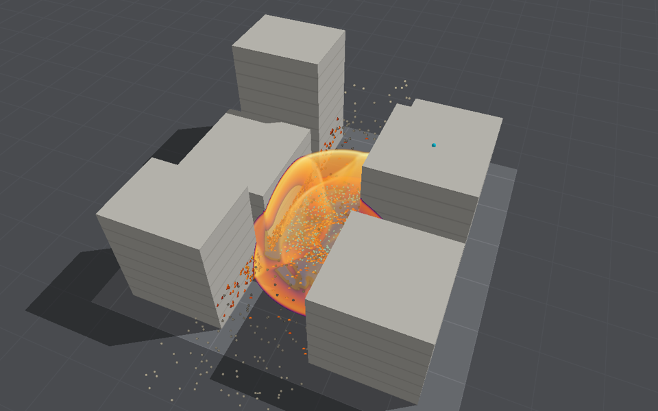
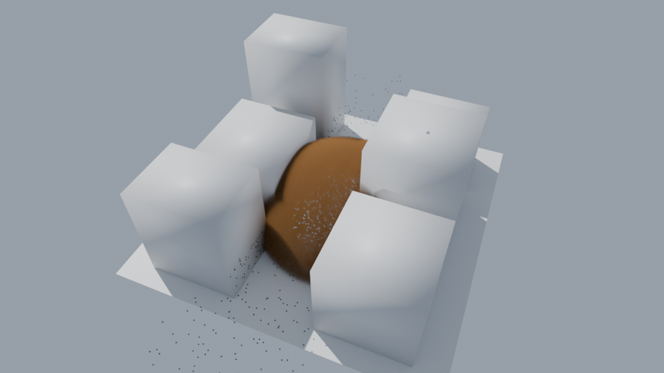

# Fragments flown alongside a run

A cased charge's fragments, and passive tracers, flown through the blast one way: the air pushes
them, they do not push back. The app draws them over a run as it goes; headless runs export them.
The model can run on this Mac's CPU or on another Mac, fed the air a frame at a time over SSH, which is what it was built to try: a live one-way consumer, the first
of the separable models in [Distributed computing](distributed-computing.md#separate-models-on-separate-machines).

**Standing: illustrative.** Each ingredient is a textbook approximation, and nothing here has
been compared with a fragmentation test. Use it to see how fragments and a blast relate in a
scene, not for ranges or hazards.

```bash
swift run -c release BombCAD run street.bombcad --fragments casing.json --consumer my-mac.local --usd street.usda --vdb street.volumes --fragment-results impacts.json
```

`--consumer local` (the default) runs the fragments on this Mac's CPU. The description is JSON;
any field left out takes its default:

```json
{
  "casingMass": 50,
  "count": 2000,
  "casing": "cylinder",
  "axis": [0, 0, 1],
  "spread": 0.25,
  "gurneyVelocity": 2440,
  "fragmentDensity": 7850,
  "tracers": 500,
  "tracerRegion": {"min": [22, 21, 0.5], "max": [38, 37, 6]},
  "seed": 1
}
```

## The model

- **Masses** follow Mott's distribution, P(mass > m) = exp(−√(m/μ)), scaled so that the
  fragments add up to the casing's mass. Many fragments are tiny; the largest of 2,000 from a 50 kg
  casing is about 0.7 kg.
- **Launch speed** is the Gurney equation's, √(2E) / √(M/C + ½) for a cylinder and
  √(2E) / √(M/C + ³⁄₅) for a sphere, M the casing's mass and C the charge's; √(2E) is 2,440 m/s
  for TNT. A cylinder sprays its fragments out round its axis within `spread` of square to it, a
  sphere evenly. They start at the charge's radius.
- **Flight** is gravity and drag from the local air, ½ ρ C_d A |u − v| (u − v): the blast's
  density and wind act on each fragment. A fragment is taken as a tumbling cube, whose mean
  presented area is a quarter of its surface, with C_d 0.9 below Mach 0.8, rising to 1.3 at
  Mach 1.2, and easing to 1.1 above. Drag is integrated exactly for a rate held over each step,
  so the stiff drag on the smallest fragments does not limit the step.
- **Tracers** are massless and go with the air.
- **Impacts** are recorded where a fragment first meets the ground, a rigid block or the
  structure's starting outline: the point, time, speed and energy. A fragment does not load what
  it hits, and the structure's outline does not move. Every independent structure contributes
  its starting regions; impacts in multiple-structure scenes include the stable `objectID`.
  The optional owner table and impact ID preserve decoding of older single-structure streams
  and results. Beyond the air's domain the air is still.

## In the app

Turn on **Cased charge** in the Run tab's Fragments section. It starts with a casing a tenth of
the charge's mass, 2,000 fragments and 300 tracers across 16 m round the charge, and sets the
casing's mass, the number of fragments and tracers, and the casing's shape; the launch speed it
gives is shown. The description is saved with the project (as `fragments.json`), takes effect
from the next run, and is undone and redone with the layout's edits (⌘Z). With a Mac set for sweeps in Settings, **Fly on** that Mac sends the fragments
there, over a connection kept open between runs.

During a run the view draws them over the blast as dots of a fixed size on screen, whatever their
true size: fragments in flight dark when slow and white-hot at their launch speed, tracers in cyan,
and where fragments landed, from yellow at a joule to dark red at ten megajoules. Under Display,
each kind can be hidden and the dots' size set. A line under the section counts the fragments in
flight and landed, and the hardest impact.

**Keep Run** keeps the fragments with the run: what was flown, its launch speed and every impact.
Compare gives a line for each run that flew them, the run's CSV lists the impacts (time and
energy in joules, by fragment and surface), and **Use this run's inputs** brings its casing back.
They do not act on the air, so they are no part of the run's input fingerprint.



**The air is untouched.** The app takes a frame at the end of each batch rather than stopping the
run at fixed times, and with fragments on holds a batch to about a millisecond of simulated time by
taking fewer steps, never shorter ones; the tests check that the air's gauges and the structure's
response are the same to the last bit with fragments on or off. The cost is that the frames fall
where batches end, which follows the playback's timing, so the fragments in the app differ a
little from one run to the next. For a fragment study that repeats exactly, use `BombCAD run
--fragments`, which stops at fixed frames.

`blastbench snapshot --fragments casing.json` flies them alongside an offscreen snapshot, as the
view draws them (the figure above).

## Running alongside the blast

At each frame, the run cuts out a block of the air (`AirSlice`) around the particles, density,
velocity and pressure as 16-bit floats, and sends it to the consumer (`FragmentConsumer`), which
flies the particles from the last frame's air to this one's, interpolating in space and between
the two in time, and reports where they have got. The block for frame *k* is the report after
frame *k* − 5 grown by as far as the fastest particle (or, for tracers, the blast's wind, taken as
up to 2.5 km/s) can go in the frames between, and thinned to every second or third cell above a
million samples.

The run may get up to four frames ahead; then it waits, through a gate in `SimulationModel`'s run
loop that holds the next batch without blocking the main thread. Because each block comes from a
report always in by then, the air sent, and so the result, do not depend on how the two sides keep
time: the consumer on another Mac gives the same result as on this one, to the last bit.

On another Mac, the consumer is a session of `BombCAD worker` (see
[Sharing a sweep](run-comparison.md#sharing-a-sweep-with-another-mac)), over the same SSH
connection: the worker protocol's version 2 carries each block as a raw binary payload, and the
trajectories come back the same way.

Frames are the export's (`--frame-interval`, 1 ms by default). Without a structure the run stops
at each frame, ending a time step there: every millisecond, in the street on the medium grid,
1,608 steps instead of 1,527 and a near-façade peak 1% lower; every 2 ms, 1,562 steps.

## Measured

The street canyon on the medium grid (8.4 million cells, 0.17 s, 100 kg), a 50 kg casing, frames
every millisecond, the Mac Studio (M4 Max) running the blast and either itself or the CI Mac mini
(M4) the fragments, over Thunderbolt:

| Particles | Consumer | Air sent | Rate | Run waited | Run | Same result |
|---|---|---|---|---|---|---|
| 2,000 fragments, 500 tracers | This Mac | 1.63 GB, 171 frames | about 200 MB/s | 0 s | 6.6 s | |
| 2,000 fragments, 500 tracers | The mini | 1.63 GB | about 200 MB/s | 0 s | 8.4 s | Yes |
| 50,000 fragments, 10,000 tracers | This Mac | 1.59 GB | 203 MB/s | 1.66 s of 7.84 | 8.1 s | |
| 50,000 fragments, 10,000 tracers | The mini | 1.59 GB | 205 MB/s | 1.43 s of 7.79 | 9.7 s | Yes |

Against 3.9 s for the run without fragments. The Studio was heavily loaded by other work at the
time, so the run times are rough; the mini's extra second or two is connecting and sending it this
build. The fragments are cheap: one CPU core keeps up with a few thousand, and only around 60,000
does the run wait for the consumer, on the mini or here. So this consumer gains nothing by moving,
as [expected](distributed-computing.md#separate-models-on-separate-machines); it exercises the
streaming a costlier consumer would need. The Thunderbolt link carried the air at about 200 MB/s
without the run waiting for it.



At 24 ms the blast still fills the street while the fragments (dark, drawn enlarged) have outrun
it past the blocks; the tracers (light) are carried in it. Rendered in Blender 5.2 with Cycles from
the export, the fragments enlarged by a geometry-nodes modifier: at true size they are millimetres
to centimetres across.

## Output

- **The USD scene** (`--usd`) gains `/Scene/Fragments` and `/Scene/Tracers`, Points prims whose
  positions follow the frames; a fragment's width is its edge. Blender imports them as point clouds.
- **`--fragment-results`** writes the impacts, masses and counts as JSON, without the
  trajectories, which are in the scene.
- The summary printed gives the fragments landed on each surface and the highest impact energy,
  and how much air was sent and how long the run waited.

## Limitations

- Illustrative, as above: no test data, and the drag law, presented area and spray are rough.
- One way: fragments do not load the structure or the air, and the structure they can hit is its
  starting outline.
- The casing's own energy is not taken from the air's: the blast is the bare charge's.
- No break-up, no ricochet, no penetration; a fragment stops where it first hits.
- Only the coarse grid's air, also where refinement sharpens the shock.
- In the app, frames fall at batch ends, so its fragments vary a little from run to run (above).
- A kept run keeps the fragments' impacts, not their paths.

## Sources

- R. W. Gurney, *The initial velocities of fragments from bombs, shells and grenades*, BRL Report
  405, 1943.
- N. F. Mott, Fragmentation of shell cases, *Proceedings of the Royal Society A* 189 (1947) 300–308.
- P. W. Cooper, *Explosives Engineering*, Wiley-VCH, 1996: Gurney's equations and constants.
