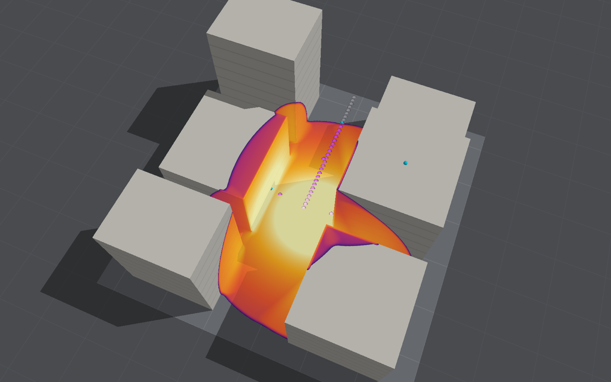

# Ground shock away from the charge

The ground's shaking under chosen points, estimated from the overpressure the run records on the
ground. It works one way: the air presses on the soil, and the soil does not press back. The air
model's ground stays a rigid reflecting boundary. A run in the app or a headless one streams
the bottom layer of cells to the estimate a frame at a time, a one-way consumer like the
[fragments](fragments.md) and the [thermal radiation](thermal-radiation.md). It belongs among the separable models in
[Distributed computing](distributed-computing.md#separate-models-on-separate-machines).

**Standing: illustrative.** The model is the textbook one-dimensional estimate of air-induced
ground shock from the protective design manuals, and nothing here has been compared with a
ground shock measurement. Use it to see roughly how hard and how far the ground shakes under a
blast, and where the simple estimate stops applying. Do not use it for design, for damage to
buried services or for vibration limits.

```bash
swift run -c release BombCAD run street.bombcad --ground-shock ground.json --ground-results ground-results.json
```

With `--consumer ground=<ssh host>` the estimate is made on another Mac, fed the ground's air
frame by frame (see [Several consumers on several machines](distributed-computing.md#several-consumers-on-several-machines)).

The description is JSON, and any field left out takes its default:

```json
{
  "soil": {"density": 1600, "waveSpeed": 300},
  "points": [[24, 15], [32, 39.5]],
  "line": {"from": [30, 32], "to": [62, 32], "count": 17},
  "depths": [0, 1, 3],
  "arrivalThreshold": 1000
}
```

The points are (x, y) on the ground in metres. `points` comes first, then `line`, which puts
`count` points evenly from `from` to `to`, ends included. `depths` are in metres below each
point. `waveSpeed` is the soil's loading wave speed, the speed of a compression wave in it.
`arrivalThreshold` is the overpressure, in pascals, that marks the blast's arrival at a point.

## The model

Each point is treated as a vertical column of uniform soil, pressed at its top by the air.
Where the air's front sweeps over the ground faster than the soil's own wave, as it always does
in soft dry soil and does near the charge in stiffer soil, the motion below the surface is mainly
a compression wave running straight down. That is the protective design manuals'
one-dimensional picture of air-induced ground shock.

- **On the ground**, the soil moves down at **v = P / (ρc)**, P the peak overpressure, ρ the
  soil's density and c its loading wave speed. ρc is its acoustic impedance. This is the plane
  wave relation σ = ρcv for a compression wave. Its top sinks by **d = I / (ρc)**, I the
  overpressure's positive impulse.
- **With depth** the wave arrives z/c later. Real soil gives way more on unloading than on
  loading, which wears the peak down as the wave travels. The manuals' factor
  **α = 1 / (1 + z / (c t_d))** stands in for that. The peak stress at depth z is αP and the
  velocity αP/(ρc). Here t_d = 2I/P, the length of the triangular pulse with the same peak and
  impulse, so c t_d is the pulse's length in the soil. The displacement is left at I/(ρc), the
  elastic column's value at every depth. That is an upper estimate, since it ignores the loss
  the factor stands for.
- **Sideways**, the soil's wave trails the air's front at an angle θ to the ground, with
  sin θ = c/U, U the front's speed. The particles move square to that wavefront, so the
  horizontal velocity is v tan θ. U comes from the peak overpressure by the Rankine–Hugoniot
  relations, U = c₀ √(1 + (γ+1)/(2γ) · P/p₀), c₀ being the ambient sound speed.
- **Regimes.** The horizontal estimate grows without bound as U falls towards c, where the
  wavefront stands upright. It is given only where **U ≥ √2 c** (superseismic), where it is no
  larger than the vertical. Between c and √2 c (transseismic) only the vertical estimate is given.
  Below c (outrunning) the soil's wave runs ahead of the blast. It shakes the ground before the
  air arrives, through motion that came in from nearer the charge, which this model does not
  have. There the vertical estimate is only the air's share. The √2 cut-off is this project's
  choice, not the manuals'.

**From the run.** P and I are the solver's own peak overpressure and positive impulse in the
bottom cell, kept every time step. Frames a millisecond apart would miss a ground-level peak
between them, but these fields do not. The consumer also counts each frame's overpressure
towards the peak. That covers a point already inside the blast as laid down at time zero, before
the solver's first step. Between cell centres it interpolates from the open cells only. A point
with only solid cells round it, under a block or the structure at every frame, is reported as
covered and has no response. The arrival is the first frame at which the peak has passed the
threshold, so it can be up to a frame late.

## Output

`--ground-results` writes, for each point:

- the peak overpressure on the ground, its positive impulse and the triangular pulse's duration;
- the arrival, the front's speed and its regime (`superseismic`, `transseismic` or `outrunning`);
- at each depth, the peak vertical stress, vertical and horizontal particle velocity, vertical
  displacement and the stress wave's arrival;
- the overpressure on the ground at every frame, for anyone wanting the shape of the load;
- whether the point was covered.

The file also gives the frames, the bytes of air streamed and the time the run spent on them.
The summary printed gives the fastest surface motion and where it was, the points without a
horizontal estimate, and the covered points.

With `--usd` as well, the scene gains `/Scene/GroundShock`, Points just above the ground at the
points with open ground, as wide as half their spacing along a line (half a metre otherwise).
Each carries what the ground did there as primvars, for colouring in Blender: `peakOverpressure`
(kPa), `impulse` (Pa·s), the surface's `verticalVelocity` (mm/s) and `verticalDisplacement` (mm),
and `arrival` (ms, −1 where the blast never came). File ▸ Export for Rendering… puts the
project's ground points in the scene unless told not to.

## In the app

Turn on **Ground points** in the Run tab's Ground shock section. It starts with 16 points along
the ground from a metre beside the charge to a metre short of the domain's edge, the way the
ground runs furthest, in dry soil of 1,600 kg/m³ at 300 m/s. Sliders set the soil's density and
wave speed, the number of points (8 to 64) and the line's two ends, to the half metre. The
points are saved with the project (as `groundShock.json`), take effect from the next run, and
are undone and redone with the layout's edits (⌘Z). Other points, and other depths than 0, 1
and 3 m, need the JSON description and `BombCAD run`.

The view draws the points as dots just above the ground: grey until the blast reaches them, then
from blue at 1 mm/s of downward surface velocity, through violet, to near white at 10 m/s, on a
log scale. Points under a block or the structure are not drawn. Under Display they can be
hidden, and they share the fragments' dot size. A line under the section counts the points the
blast has reached and names the one where the ground moves fastest.

**Keep Run** keeps the points and their estimates, without the overpressure histories. Compare
gives a line for each run that had them, the run's CSV gives each reached point's peak
overpressure and its vertical velocity at each depth (at the arrival there), and **Use this
run's inputs** brings its points back. Like the fragments, they do not act on the air, so they
are no part of the run's input fingerprint, and the tests check that a run's gauges are the
same to the last bit with them on or off.

The app takes a frame at the start, at the first batch's end past each millisecond, and at the
end, as it does for the fragments, but the points do not shorten the batches as the fragments
do. The peak and impulse come from the solver's own fields, so they are unaffected. The arrival,
though, is the end of that batch, which at unlimited speed can be several milliseconds late. For arrivals, use
`BombCAD run`, which frames every millisecond. `blastbench snapshot --ground-shock
ground.json` draws the points offscreen as the view does (the figure below).



## Running alongside the blast

At each frame (`--frame-interval`, 1 ms by default) the run cuts out the bottom layer of cells
over the points' bounds plus one cell (`GroundSlice`). For each cell this holds the overpressure
now, the peak so far and the impulse so far, as 32-bit floats, with NaN over solid cells. The
consumer (`GroundShockConsumer`) samples it at each point. It is cheap enough to run in the
run's own loop, so it never holds the run up.

The slice has a header and a binary payload like the fragments' `AirSlice`, so it could travel
over a worker connection. It does not yet. A worker session would gain nothing: the work is a
sample per point per frame.

As with fragments, a run without a structure stops at each frame and ends a time step there.
In the street on the medium grid that means 1,608 steps instead of 1,527. Estimating ground
shock does not change the air: the tests check that a run with it gives the same gauges, to the
last bit, as a run with the same frames and none.

## Measured

The open-ground preset (100 kg on the ground at the centre of a 64 m domain), the medium grid
(0.25 m cells), 0.17 s, points every metre along the ground, dry soil of 1,600 kg/m³ at
300 m/s. Ranges are from the charge.

| Range | Peak on the ground | Impulse | t_d | Front speed | v at surface | v at 3 m | d | Horizontal at surface |
|---|---|---|---|---|---|---|---|---|
| 4 m  | 1,389 kPa | 976 Pa·s | 1.4 ms  | 1,215 m/s | 2.89 m/s | 0.36 m/s | 2.0 mm | 0.74 m/s |
| 7 m  | 433 kPa   | 641 Pa·s | 3.0 ms  | 735 m/s   | 0.90 m/s | 0.21 m/s | 1.3 mm | 0.40 m/s |
| 10 m | 188 kPa   | 481 Pa·s | 5.1 ms  | 547 m/s   | 0.39 m/s | 0.13 m/s | 1.0 mm | 0.26 m/s |
| 14 m | 91 kPa    | 369 Pa·s | 8.2 ms  | 452 m/s   | 0.19 m/s | 0.08 m/s | 0.8 mm | 0.17 m/s |
| 20 m | 45 kPa    | 276 Pa·s | 12.3 ms | 400 m/s   | 0.09 m/s | 0.05 m/s | 0.6 mm | none: transseismic |
| 28 m | 25 kPa    | 204 Pa·s | 16.1 ms | 375 m/s   | 0.05 m/s | 0.03 m/s | 0.4 mm | none: transseismic |

The inputs inherit the air model's accuracy. On these cells the ground's peaks are about 77–82%
of Kingery–Bulmash's and the impulses 80–86%
([Validation](validation.md#kingerybulmash-the-design-practice-standard)): at 14 m, 91 kPa
against 116, and 369 Pa·s against 430. The velocities, proportional to the peak, are low by the
same proportion. Within 3 m of the charge the estimate gives 5 to 20 m/s. That is inside the
region of the charge's own crater, where the model does not apply (below).

The same run with a stiff soil, 1,900 kg/m³ at 1,500 m/s: the ground's wave outruns the air's
front from 4 m out, where U falls below 1,500 m/s. At 14 m the vertical estimate is 32 mm/s,
about a sixth of the dry soil's, because ρc is six times larger.

**Cost.** In the street canyon on the medium grid, 21 points spread over 49 m × 25 m took a
slice of 199 × 101 cells a frame: 41 MB over 171 frames. Cutting the slices out and consuming
them took 0.02 s of a run of 8 to 9 s. On open ground, 31 points along a line took 0.8 MB and
0.001 s. The Mac Studio (M4 Max) was heavily loaded by other work at the time, and successive
runs of the same case varied by several seconds. The model's own cost is lost in that noise:
the run's cost is the frames' extra steps, not the estimate.

## Limitations

- Illustrative, as above: no comparison with measured ground shock.
- One-dimensional and uniform soil. No layers, water table or rock beneath, any of which can
  reflect and amplify the wave. No surface waves, and nothing from the shape of the ground.
- The soil loads at one wave speed. The loss with depth is the manuals' empirical factor, not a
  model of the soil's crushing, so stresses beyond what the soil can take are not limited. There
  is no permanent set and no compaction. The displacement is an upper value.
- Horizontal motion only where the front is clearly superseismic, by a crude geometric argument.
  Where the ground's wave outruns the blast, the motion that arrives first is not modelled at all.
- **Not near the charge.** The crater, the ground shock the charge drives directly into the
  ground, and ejecta are not modelled. Within a few crater radii (a few metres for 100 kg on the
  ground) the estimate is meaningless. That region is two-way and needs its own model
  ([Distributed computing](distributed-computing.md#separate-models-on-separate-machines)).
- One way: the soil does not absorb, soften or vent the blast. The air model's ground stays
  rigid.
- The peak and impulse are the coarse grid's, in the bottom cell, whose centre is half a cell
  above the ground. They inherit its under-resolved peaks (above), and refined patches are not
  used. Between cells, the points take interpolated peaks, not the peak of an interpolated history.
- t_d = 2I/P is the triangular pulse's. In a street, multiple reflections make a longer, ragged
  load, and a single triangle describes it poorly.
- Points under a block or the structure get nothing. The building's own load on its foundations
  is not passed to the soil.
- Not on a worker over SSH. The USD scene holds each point's final values, not how they grew.
  In the app, arrivals are only as fine as the batches (above), and the points lie on one
  straight line.

## Future work

- A layered soil column solved numerically, with different loading and unloading moduli. The
  elastic column the tests already integrate is the start of one. It would replace the
  attenuation factor and handle layers and the water table.
- The ground points in the app as a grid over an area as well as a line.
- A worker session for the slices, if a costlier ground model needs one.
- A comparison with measured air-induced ground motion
  ([Data wanted](data-wanted.md#3a-air-induced-ground-shock)).

## Sources

- *Structures to Resist the Effects of Accidental Explosions*, UFC 3-340-02, US Department of
  Defense, 2008: ground shock, air-induced ground motion, and the superseismic and outrunning
  cases.
- *Fundamentals of Protective Design for Conventional Weapons*, TM 5-855-1, US Army, 1986:
  air-blast-induced ground shock, its attenuation with depth and the outrunning case.
- N. M. Newmark and J. D. Haltiwanger, *Air Force Design Manual: Principles and Practices for
  Design of Hardened Structures*, AFSWC-TDR-62-138, 1962 (DTIC AD0295408): the one-dimensional
  soil column under a moving air-blast load, and the attenuation with depth by 1/(1 + z/L).
- Crawford and others, *The Air Force Manual for Design and Analysis of Hardened Structures*,
  AFWL-TR-74-102, Air Force Weapons Laboratory, 1974.
- Pathak and others, "A designer's approach for estimation of nuclear-air-blast-induced ground
  motion", *Advances in Civil Engineering* (2018) 3029837: air-induced motion in the
  superseismic zone is mainly one-dimensional and vertical.
- G. F. Kinney and K. J. Graham, *Explosive Shocks in Air*, 2nd edition, Springer, 1985: the
  shock's speed from its overpressure.
- K. F. Graff, *Wave Motion in Elastic Solids*, Dover, 1991: plane compression waves, σ = ρcv.

The manuals' own text could not be consulted while this was written (see
[Data wanted](data-wanted.md#3a-air-induced-ground-shock)). The relations above are the standard
ones they are known for, re-derived here and checked analytically by the tests. Equation numbers
are therefore not quoted, and the √2 cut-off for the horizontal estimate is this project's
choice.
