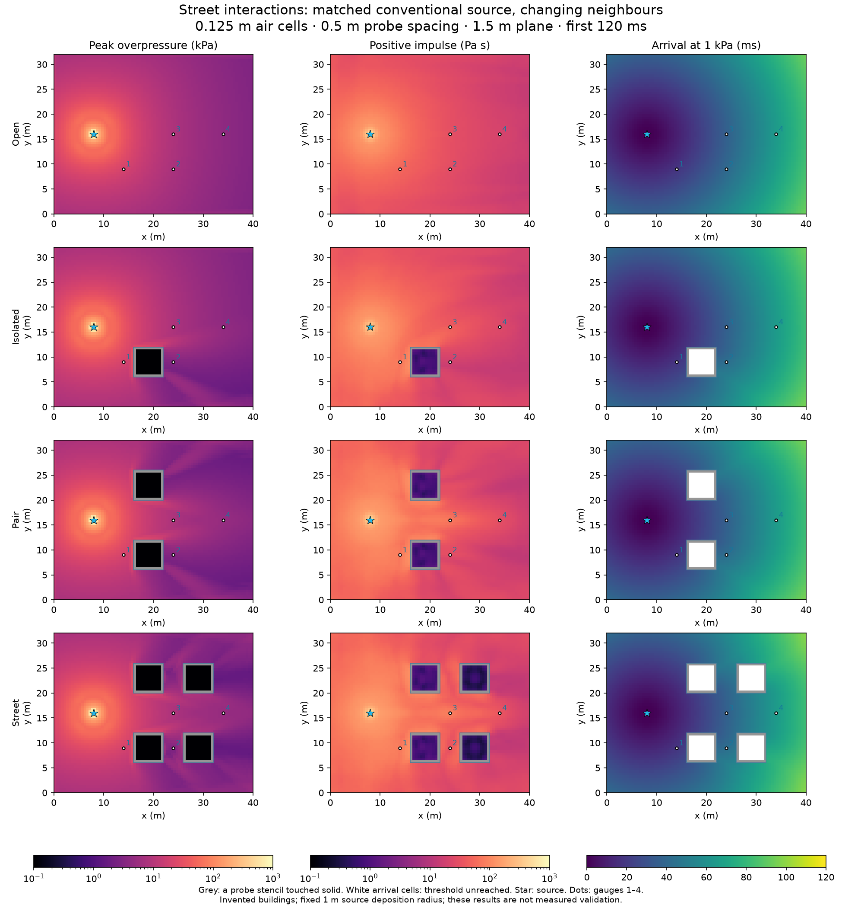
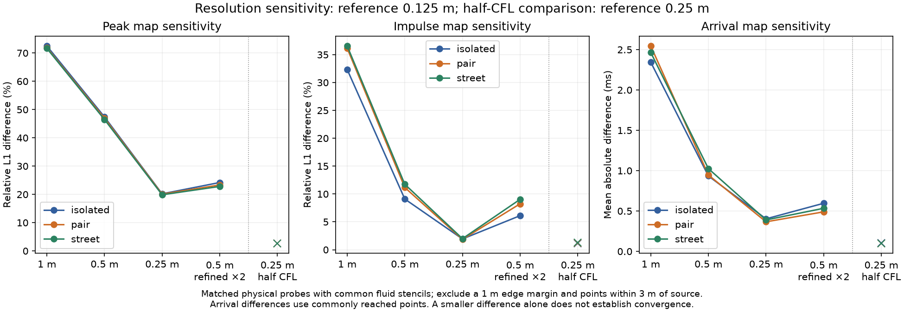
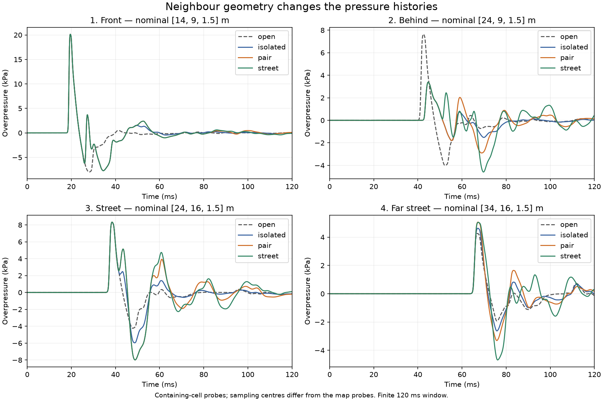

# Street interaction study

This study compares an isolated building, two buildings and a four-building street against
the same conventional source and observation locations. It follows the
[multiple-object scaling work](multi-object-scaling.md) with spatial results, numerical
sensitivity checks and measurements over a useful physical window.

The buildings are invented reinforced-concrete shells. These are numerical comparisons,
not reproductions of a measured neighbourhood experiment. They do not extend the physical
scope of the air or structural models.

## Reproduce the study

```sh
swift build -c release --product scenebench
.build/release/scenebench street /tmp/street-study --source-revision=$(git rev-parse HEAD)
python3 Scripts/check-street-interaction.py /tmp/street-study --summary /tmp/street-study/sensitivity.json
python3 Scripts/plot-street-interaction.py /tmp/street-study --out /tmp/street-study/figures
```

Plotting requires matplotlib and NumPy. Running and checking the study require no Python
packages. The macOS driver uses `/usr/bin/gzip` for lossless map compression.
`scenebench street <directory> --quick` runs three short, coarse smoke cases; it does not
produce the complete sensitivity report or figures.

The [retained M4 Max data](../Benchmarks/StreetInteraction/m4-max/report.json) identifies
producer revision `f01e2523ee822a9e609c0901c791aa4acfd4a675`. Each case retains device/OS,
solver allocation, coupling allocation, steps, timings, gas inventories, gauge samples,
per-owner structural histories and a compressed spatial map. The
[derived sensitivity report](../Benchmarks/StreetInteraction/m4-max/sensitivity.json)
can be regenerated with the checker. The driver rejects incomplete or unstable runs.

The four `*-layout.json` files preserve editable geometry and structural settings. Replay
through this driver to retain its controlled solver configuration; opening the geometry in
the app uses the app's selected source and solver settings.

## Controlled inputs

All scenes occupy 40 × 32 × 8 m. A 2 kg TNT-equivalent conventional source sits at
(8, 16, 1) m. Its energy is deposited into a fixed 1 m radius sphere on every grid,
including the adaptive case. This is a controlled initial condition, not a resolved
detonation. Afterburning and mapped-charge initialisation are disabled; the gas is ideal
with gamma 1.4. The ground reflects and the other faces allow outflow.

Buildings are 6 × 6 m in plan, with 4 m walls and a roof; walls and roof are 0.5 m thick.
Their lower-left corners are (16, 6), (16, 20), (26, 6) and (26, 20) m. The isolated case
uses the first building, the pair the first two, and the street all four. They have no door
openings. Structural elements stay at 0.5 m; base restraint, material and owner identities
stay fixed across comparisons. Independent buildings share one air solution.

There are 24 completed runs:

- Three layouts × six settings: uniform 1, 0.5, 0.25 and 0.125 m air cells, 0.5 m air
  refined by two, and 0.25 m air at half the nominal Courant number.
- Three closed, fully restrained street companions at 1, 0.5 and 0.25 m for gas conservation.
- An open-ground reference, a gravity-only street control and a separately profiled street
  replay, all at 0.125 m.

Interaction runs last 120 ms; closed companions last 60 ms. Nominal CFL is 0.45, or 0.225
in the temporal check. Bodies can impose a tighter timestep bound. Adaptive runs use a
128 MiB patch budget and a pressure-jump refinement threshold of 0.05. Air freezing is
disabled. Inter-body contact remains unsupported; it and coupling-pool exhaustion stop a run.

## What the maps measure

`BlastSolver.configureExposurePlane` enables an optional plane of Eulerian probes. This
study uses the same 80 × 64 lattice in every case: 0.5 m spacing at 1.5 m height, with
points at `(i + 0.5, j + 0.5) × 0.5 m`. Pressure is trilinearly interpolated from coarse
cell centres after each complete fluid interval. Where air is refined, this reads the
restricted coarse state; it does not report fine-cell maxima. Outer stencils clamp to
the outermost cell centres.

Each probe records the largest positive overpressure, the right-endpoint sum of positive
overpressure times timestep, and the first endpoint at or above 1 kPa. Initial pressure
is sampled before the first step. Arrival has no sub-step interpolation. A stencil that
ever touches solid is excluded from all three maps; its values are JSON `null`.
An otherwise valid probe that never reaches the threshold has a null arrival. Restart
clears the records. Arrays are x-fast, and metadata includes air resolution, probe spacing,
height, threshold, units and the finite time cutoff.

Gauge histories retain the existing containing-cell sampling convention, using the fine
child when available. Their actual coarse/fine sampling centres are recorded. Gauge
impulse sums `max((p0 + p1) / 2 - ambient, 0) × interval`; this clips each trapezoidal
interval mean. Consequently gauges and interpolated map probes use different observation
and quadrature rules and need not agree exactly.

All impulses include every positive interval within the stated cutoff, including later
reflections. They are not claims about a complete positive phase or eventual loading.



## Observed interactions

At 0.125 m air resolution, the same rear gauge is shielded by the isolated building:
its peak falls from 7.64 to 3.38 kPa, and its 1 kPa arrival moves from 41.10 to 43.30 ms.
Adding neighbours leaves that peak nearly unchanged but increases later positive loading.
The street gauge likewise keeps an initial peak near 8.3 kPa while its accumulated impulse
changes substantially.

| Geometry | Behind peak (kPa) | Behind impulse (Pa s) | Street peak (kPa) | Street impulse (Pa s) |
| --- | ---: | ---: | ---: | ---: |
| Open ground | 7.643 | 28.920 | 8.318 | 31.246 |
| Isolated building | 3.382 | 18.268 | 8.323 | 43.197 |
| Pair | 3.381 | 29.566 | 8.327 | 73.939 |
| Four-building street | 3.385 | 36.707 | 8.330 | 82.306 |

All values use the same 120 ms window and gauge convention. Shielding the initial pulse
does not ensure a lower accumulated load after reflections. These outputs demonstrate
interactions within the model; they do not establish measured agreement or justify adding
independent building-response profiles to predict a street.

## Resolution and timestep sensitivity

The checker compares the same physical probe locations. For each layout it excludes the
union of stencils touching solid in any setting, points within 3 m of the source and a
1 m domain-edge margin. Thus each layout's comparisons retain the same spatial mask.
Relative L1 is `sum(abs(candidate - reference)) / sum(abs(reference))`. Arrival differences
use commonly reached probes; threshold-reach classification differences are retained too.

Spatial comparisons use the uniform 0.125 m run as reference. The half-CFL comparison
instead uses the uniform 0.25 m run, isolating timestep sensitivity on that grid. These
are reference differences, not errors against an exact or measured solution. Pressure
reconstruction, source quadrature and wall rasterisation still change with air resolution.
Structural mesh refinement is outside this study.



The street comparisons retain 3,808 common fluid probes:

| Air setting | Peak relative L1 | Impulse relative L1 | Mean arrival difference |
| --- | ---: | ---: | ---: |
| Uniform 1 m | 71.66% | 36.56% | 2.465 ms |
| Uniform 0.5 m | 46.48% | 11.74% | 1.025 ms |
| Uniform 0.25 m | 19.86% | 1.98% | 0.389 ms |
| 0.5 m refined ×2 | 22.82% | 9.04% | 0.534 ms |
| Uniform 0.25 m, half CFL, versus nominal CFL | 2.62% | 1.30% | 0.097 ms |

Impulse is much less spatially sensitive than peak pressure in the finer uniform comparison.
The 0.25 m peak map still differs substantially from the 0.125 m reference. Coarse air also
changes threshold-reach classification at 500 probes; that difference is zero in the fine,
adaptive and temporal comparisons. The adaptive map reads restricted coarse pressure, so
this table does not assess the sharpest fine-cell peak or replace the structural loading checks.

The finest grid has no finer spatial reference or half-CFL companion here. A formal order
of convergence, a grid-independent peak or measured building-response accuracy is not
established. The data provide a reproducible reference for later model changes and
simplified representations.

## Gas conservation and structural response

Open scenes lose gas and energy through their boundaries and exchange work with structures.
Their initial and final inventories are retained as diagnostics, not conservation errors.
Closed companions fix every structural node and reflect every outer face. The checker tests
gas mass and energy changes both against the initial inventory and against the injected
source mass/energy, so the ambient inventory cannot hide a source-scale discrepancy.
Both normalisations must remain below 0.3%.

The worst closed residual is 0.0281% of injected source mass and 0.000928% of source energy.
Relative to the initial gas inventory, both remain below `5e-8`.

Structural histories are sampled at batch endpoints and retain owner IDs, displacement,
damage and element counts. Their maximum sampled displacement is not an exact stepwise
peak. Gravity acts in the blast runs; the separate no-source control shows its contribution.
Differences between scalar displacement magnitudes are not a direct extraction of a
blast-only displacement vector. No element removal is permitted by this fixture's checker.

Bodies start undeformed and at rest, with gravity applied from the start; they have not been
equilibrated under gravity before the source is deposited. The largest sampled displacement
in the finest street run is 0.267 mm, compared with 0.236 mm in its gravity-only control.
No elements are removed. This example's structural motion is small and includes a gravity
startup transient; it is not a collapse study.

## Whole-run costs

Ordinary study runs enable recording and disable stage profiling. Setup time is reported
separately. Run wall time includes encoding, GPU waits and endpoint summaries; map export
and final inventory reduction are outside that timer. Command GPU time is summed across
batches. Each retained run supplies one timing observation, not a throughput distribution
or a portable speed guarantee.

`enableGPUProfiling` uses additional compute encoders and Metal stage-boundary counters in a
separate replay. GPU ticks are calibrated through paired CPU/GPU timestamps as described in
[Apple's timestamp conversion documentation](https://developer.apple.com/documentation/metal/converting-gpu-timestamps-into-cpu-time).
The categories cover air stepping/regridding, mechanics (including within-substep envelope
checks), coupling (allocation, boundary composition, exchange and interaction checks), and
observation. Their sums exclude gaps between encoders. Profiling can change overhead;
its timings are kept separate from throughput measurements. The checker requires the
profiled and ordinary finest street maps to match exactly, including arrival records.

For the retained M4 Max street runs, using decimal MB:

| Setting | Solver allocation | Run wall time | Command GPU time |
| --- | ---: | ---: | ---: |
| Uniform 0.25 m | 68.43 MB | 6.37 s | 5.94 s |
| 0.5 m refined ×2 | 103.17 MB | 4.41 s | 4.26 s |
| Uniform 0.125 m | 514.65 MB | 48.01 s | 47.16 s |

The adaptive run reaches 369 active patches out of 1,280 reserved slots. The separately
profiled finest replay records 23.74 s in air work, 14.02 s in coupling, 4.61 s in mechanics
and 0.124 s in observation, within 53.72 s of command GPU time. Encoder gaps and scheduling
account for the remainder. Air and coupling both warrant attention when scaling this scene;
the earlier coupling-buffer savings alone do not establish whole-run scalability.

## Verification and ownership

Tests compare the recorder with independent CPU endpoint accumulation, reproduce an
analytical linear pressure field on different air grids at the same physical points, and
check masking, nulls, restart, time-limit no-ops and batching. Recording and profiling
preserve full coarse/refined multi-body states, gauge histories, inventories and mechanics.
Fixture ownership and unsupported-overlap checks also pass.

Selected application/core integration suites, the final recorder/multi-body/coupling checks,
strict formatting, eleven release/nightly script checks, the optimized driver/application
builds and the complete retained-report checker pass. Generated plots have been inspected.

Fixtures, physical quantities, recording and result interpretation remain in BombCAD's
BlastCore and SceneBench. No ContinuumKit release or application project-schema change is
needed. Ordinary runs do not enable the new recorder or profiler.


