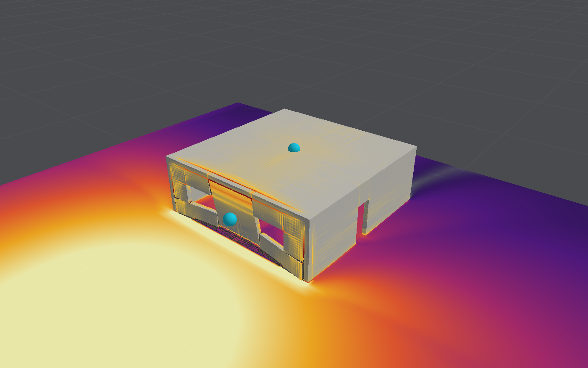

# Structural model

The structural solver deforms and breaks one body, the "structure", under the pressures of the
air solver or under a prescribed pressure history. It lives in
`Sources/BlastCore/StructureSolver.swift` and `Sources/BlastCore/Shaders/Structure.metal`.
The material laws have their own document: [Concrete model](concrete-model.md). Walls and slabs
can instead be meshed with shell elements and columns with beams, many times faster: see
[Shell and beam model](shell-model.md). This document describes the solid elements.

## Independent bodies

The shared air solver can advance up to sixteen independent structural objects. Each has
its own solid, shell or mixed solver, material table, supports and mesh sizes. Objects share
the air field without sharing structural nodes or automatically bonding. The editor's
**Editing structure** selector scopes local edits; deformable imports retain separate owners.
Overall deflection is the maximum across intact bodies, with individual histories also kept.
See [shared air mechanics](multiple-object-scene.md#implemented-shared-air-mechanics).

Inter-object contact and moving connections are excluded. Touching initial envelopes are
rejected, and conservative GPU envelope/cell checks stop a run when independent bodies may
interact. This includes loose nodes and can stop before actual detailed surfaces touch.
Existing contact within one body, including between its solid and shell parts, is unchanged.

## Mesh

The structure is the union of axis-aligned boxes (walls, slabs, columns) minus other boxes
(openings), filled with cubic elements on a regular lattice. An element exists wherever a
lattice cell's centre lies inside the body. The built-in layouts use elements of 62.5 mm, or
125 mm for the two-storey frame.

Because the mesh is a lattice, there is no connectivity table: an element finds its eight nodes
from its lattice position. Nodes on the ground plane are clamped when the structure has a fixed
base, or tied to the ground by a connection that can fail (see
[base connections](#base-connections)).

**Materials.** Each box can have its own material, up to eight in one structure; where boxes
overlap, the later one's wins. Pieces that touch share nodes, so they are bonded: masonry
infill is built into its concrete frame. The materials' properties sit in a small table in the
GPU's constant memory, and each element carries a one-byte index into it. Node masses come from
each element's own density, and the time step from the stiffest material. Reinforcement is
ignored in elements whose material has no steel, so a wall's mats do not run on through a
masonry panel that overlaps it, and crushing is averaged only over elements of the same
material. The "Frame with masonry infill" layout uses this: 250 mm brick panels in the front
of a concrete frame.

**Joints between materials.** With `StructureModel.interfaceBond` set (in the editor, "Joints
between materials can open"), the elements along a boundary between two materials, on the
weaker one's side, carry across it only the bond: by default 0.2 MPa in tension and 10 J/m² of
fracture energy, as of mortar on concrete. They are given a material of their own, a copy of
theirs with that strength and energy, so the crack-band scaling keeps the joint's energy right
whatever the element size, and shear across it is the concrete model's interlock. Infill then
comes away from its frame at the bond; pulled apart, a concrete element and a masonry one
separate at 0.2 MPa instead of masonry's 0.3. Joints within masonry, between its units, are
meshed where the elements are fine enough: see the
[concrete model](concrete-model.md#masonry-as-units-and-mortar-joints). The presets keep their pieces bonded; on the
infilled frame and the three-storey building the bond changes little, since their panels near
the charge break through anyway (1,969 against 1,936 elements removed; 350 against 387 mm).

**Steel and glass.** Besides reinforced concrete, plain concrete, masonry (solid, as brick) and
concrete block (hollow, as breeze block; see the
[concrete model](concrete-model.md#default-parameters)), the presets include structural steel (S355: von Mises, 355 MPa, failing at 20% strain) and annealed glass
(brittle: cracking at 45 MPa, with the fracture energy, 8 J/m², of its toughness, and gone
after half a millimetre), meant for panes meshed as shells (and drawn as see-through glass, turning milky as it cracks), alone or in a
[mixed body](shell-model.md#shells-and-solids-together). A 1 m square pane of 6 mm glass held
at its edges breaks under 1 kg at 3 m and survives 0.5 g.

## Elements

| Aspect            | Choice                                                                        |
|-------------------|-------------------------------------------------------------------------------|
| Element           | Eight-node hexahedron, one-point quadrature (uniform strain)                  |
| Mass              | Lumped: an eighth of each element's mass at each of its nodes                 |
| Kinematics        | Total strain from nodal displacements (concrete); updated Lagrangian with the Jaumann stress rate (von Mises) |
| Hourglass control | Flanagan–Belytschko stiffness form, scaled to the element's bending stiffness |
| Bulk viscosity    | Linear (0.06) and quadratic (1.5), in compression only                        |

**Precision.** Nodes store their displacement from the lattice position, not their absolute
position, and concrete strain is computed from displacements alone. Small deflections therefore
keep full single-precision resolution however far the structure is from the origin.

**Hourglass control.** A one-point element cannot sense the four bending-like "hourglass"
modes, so a stabilising force is added for each. Here its stiffness is E h / 48 per unit modal
amplitude, the value at which a cube resists pure bending exactly as the continuum would. With
that choice a wall n elements thick has the correct bending stiffness for any n, instead of
needing many layers. The hourglass forces are capped at the element's bending capacity times
h² / 8, so they yield along with the material. For concrete that capacity is the larger of
the remaining tensile strength plus the steel, and s (1 − s / f) for an element squeezed at
mean stress s with strength f: how far a block under axial load can shift its force towards
one face, so nothing when it is unloaded or fully crushed and most at half strength.

The compressive term keeps cracked, squeezed concrete from distorting freely. Without it, two
of the validation slab's sensitivity cases (wider crack spacing, and bearings that hold the
slab down) collapsed through elements near the top surface distorting until removed. Its
cost is some extra bending strength where a compression zone is thinner than an element: a
reinforced beam carries 11–14% more than section analysis, against 8% without it. Counting
the full compressive stress instead was tried first; it made bending a few per cent stronger
still and was replaced.

## Time stepping

Central differences (explicit). The stable step is half the time a compression wave takes to
cross an element: 9 µs for 62.5 mm concrete elements. The wave's speed counts the bars where
they are densest (the largest ratio along one lattice axis plus any inclined bars), which
shortens the step by a few per cent in reinforced concrete; counting the concrete alone, a
25 mm mesh whose inclined bars overlapped a mat's blew up. Each step is two kernels: one over the
elements (strain, stress, nodal forces) and one over the nodes (acceleration, velocity,
displacement). Both run over lists of the elements and nodes that exist, not the whole lattice.

Supports and loading:

- a node can be held still along any of x, y, z, or given a prescribed velocity;
- every node inside a support region (`StructureModel.supports`, a list of boxes) is held
  still, for structures cut off at a part treated as rigid, such as a massive end wall;
- a node can rest on a support that pushes it up but does not hold it down, so a member can
  rotate onto the edge of a bearing and lift off it;
- the nodes on the ground plane can be tied to it by a connection of finite stiffness and
  strength instead of clamped ([base connections](#base-connections));
- gravity acts on every node;
- nodes cannot pass below the ground plane, and lose horizontal speed while on it;
- for running without the air, a pressure history can be applied to one outer face.

## Base connections

A clamped base is an assumption: the joint between a wall and its footing, and the footing in
the ground, never give. `StructureModel.baseAnchorage` replaces the clamp with a connection
(`Anchorage`) that can deform, open, slide and fail. Each node on the ground plane is tied to
the ground over its share of the base (a quarter of each element face it touches) by:

- **across the joint**, a stiff bearing in compression, damped as contacts are (30% of
  critical), and in tension a spring up to the joint's tensile strength, then a plateau held to
  a given opening (yielding starter bars) and a linear fall to nothing, unloading towards the
  origin;
- **along the joint**, a spring that sticks up to the Mohr–Coulomb limit, cohesion plus friction
  times compression, then slides. Opening takes the cohesion away as it takes the tension, and
  sliding wears both away over a given slip.

Support regions can also carry independent `Anchorage` laws (`supportAnchorages`, aligned
with `supports`; null entries retain ideal clamping). Finite connections act on exposed solid faces, or points of shell and beam faces, that face
the region's joint. The law
uses each point’s reference position as a stationary bearing plane, horizontal unless the
region's joint faces another way (below). Regions select initial attachment points; they do
not bound the bearing plane after sliding or separation. A footing ([below](#footings)) is a
connection to a moving component with a finite plan, and a joint between parts (below) ties two
parts of the body that both move.

**Joints facing other ways** (`Anchorage.side`, `JointSide`). A support region's joint can be
over the body (a soffit it hangs from) or against one of its faces across x or y (a vertical
joint, as of a panel cast between columns), as well as under it. It then ties the exposed
lattice faces of solid elements that face that way, and the law acts in the joint's own frame:
opening and tension across it, Mohr–Coulomb shear in its plane. The ground's connection and a
footing are under the body only. Checks
(`SupportConnectionTests`): a 1 m block hung on a vertical joint facing −x or +y (1 m² tied,
the face on that side only) holds its weight with a cohesion of 1/0.7 of it and slides down
with 1/1.3 of it, without friction; with friction 0.6 the lower third, pressed by the block's
moment with about 0.75 W, holds it at 1/1.3 too; and a block under a soffit joint holds with a
tensile strength of 1/0.7 of its weight and falls away with 1/1.3.

**Joints at an angle** (`Anchorage.jointNormal`, set from the support's angle from straight
below and its bearing in plan by `Anchorage.normal(tilt:azimuth:)`). A joint need not lie along
the lattice: its normal can point any way, and the law then acts in its frame as above. The
body's surface there is a staircase of lattice faces, and each exposed face that faces the
support carries its quarter shares weighted by the cosine between the two, its area projected
on the joint, so that a staircase's treads and risers add up to the joint's own area. Each node
bears on, slides along and lifts off a plane through its own place at rest, parallel to the
joint. Checks (`InclinedJointTests`): a block on a joint at 30° or 45° with no cohesion holds
with friction a quarter above tan α, the joint bearing W cos α across and W sin α along within
3%, and with a quarter below slides down it at g (sin α − μ cos α) within 1%, its friction μ
times its bearing; a staircase of eight steps standing for a 45° joint is tied over 2.74 m² per
metre against the joint's 2.83, and holds and slides by its cohesion at 0.7 and 1.3 of W sin 45°;
an axis-aligned normal gives the named side's answer to the bit; and a wall 0.5 m thick and
1.5 m high resting on its base, pushed by gravity turned towards its face, holds at 0.8 and tips
at 1.2 of the push that tips it, upright and turned 30° and 45° against the lattice with its
joint and gravity (`StructureSolver.gravityDirection`). Turned 45° it sways within 3% of the
upright wall; turned 30° on 125 mm elements the staircase's corners stand out at its toe and it
takes 30% more push to tip than b / H.

**Joints between parts** (`Anchorage.betweenParts`, `PartPairs`; solid elements only). A
support region's joint can tie the body to another of its own parts across a gap, both moving,
instead of to fixed ground: a precast beam seated on a corbel through a bearing pad, a panel
against its frame. The parts are meshed apart, a gap of at least one element between them (the
pad), and the region spans the gap. Each node on faces that face the joint is paired with the
node of the other part straight across it, and the law acts on their relative motion: a pass
before the node pass works out each pair's force, which the node pass gives the first node and,
negated, the second, so the pairs keep the body's momentum exactly. The seat runs out half an
element past the other part's last node in the region along each axis of the joint; a node that
slides further is off its seat for good and carries nothing, and the part falls unless something
else holds it (contact, if switched on, catches it on what is below). The joint's frame does not
turn with the parts. Checks (`PartConnectionTests`): a block seated across a gap on another
bears its weight within 3%; floating blocks tied by a joint keep their momentum within 10⁻⁵,
moving on together when the tie holds and the lower one left behind when it shears through;
struck together they rebound with their momentum and never more kinetic energy than they began
with; a block thrown along its seat with friction 0.5 slides v² / (2 μ g), 0.25 m, within 10%,
its kinetic energy all spent on friction, the pairs within a quarter metre less half an element
of the edge off their seat; thrown to slide 1.5 m it goes off the end and falls.

`blastbench seat` (`DroppedSpanStudy`) seats a precast beam 0.5 m deep on corbels at the tops of
two reinforced concrete columns 6 m apart, resting with friction 0.5 on a 100 mm pad, and gives
the right column a velocity away from the span rising from nothing at its base to a speed at its
top, as a blast's impulse on its far face might (0.1 m elements, 1.5 s, about 12 s a run):

| Seat | Column struck at | Column sways | Beam slides on the seat | Bearing off the seat | Beam end falls |
|---|---|---|---|---|---|
| 100 mm | 4 m/s | 54 mm | 51 mm | 67% | 0 |
| | 8 m/s | 156 mm | 148 mm | 67% | 0 |
| | 12 m/s | 316 mm | off | 100% | 3.6 m: the span drops |
| 200 mm | 8 m/s | 154 mm | 146 mm | 40% | 0 |
| | 12 m/s | 292 mm | 277 mm | 100% | 0.1 m, onto the corbel as the column swings back |
| | 16 m/s | 497 mm | off | 100% | 3.6 m: the span drops |

The beam rides on the column by friction until its column outruns it, and slides; a seat that
the column's sway passes drops the span. Off its seat for good, a beam whose column swings back
under it falls by the pad's thickness onto the corbel and rests there by contact. The share off
the seat moves in steps: the row of the beam's nodes over the corbel's edge carries half a span's
element of tributary area and goes first. With starter bars through the pad (`--dowels`, 0.4%),
the beam at 12 m/s on a 100 mm seat drops too: the bars pull it after the column until they
break. This shows the mechanism; it is not a validation.

`blastbench anchorage --panel` stands the study's wall as a panel 3 m long resting on the
ground between two columns that do not move, its vertical edges tied to them by each connection
in turn, under the same pulse (sway at the top's middle):

| Edges | 6 m | 10 m | 15 m | 25 m |
|---|---|---|---|---|
| clamped | 11.2 mm | 4.8 mm | 1.9 mm | 0.6 mm |
| starter bars | 12.3 mm | 5.2 mm | 2.3 mm | 0.8 mm |
| construction joint | 13.1 mm | 6.0 mm | 3.1 mm | 1.1 mm |
| resting against them | 22.0 mm | 11.7 mm | 6.8 mm | 3.2 mm |

A panel tied at its edges sways a tenth or less of what the freestanding strip does. A plain
construction joint along its edges loses all its strength at 68% of the panel's tied points
at 6 to 15 m (28% at 25 m; the points of its resting base, which have none to lose, count
among them), and the panel then hangs on what is left. Even resting against the columns, without any tie,
it stands at every distance where the freestanding wall goes over: as it bends between rigid
columns it arches, pressing its edges into them (62 kN of friction along the edges of a 3 m
panel at 10 m, with no ties at all), the arching action that holds infill walls wedged between
stiff frames. Columns that give, or gaps at the edges, would take that away; the panel's
columns here are rigid. About 3 s a run. Meshed with shells of 125 mm (`--panel --shells`), the
tied panel sways within 10% of the solid one (clamped 12.1, 5.1, 2.2 and 0.7 mm; starter bars
13.2, 5.7, 2.6 and 0.8; construction joint 14.2, 6.4, 3.3 and 1.2, its ties lost at the same 68%
and 32%), but resting against the columns it sways 1.4 to 1.6 times as far (41, 19, 10 and 4.6
mm) and slips twice as much: the shell's edge arches more weakly. On 62.5 mm shells it sways
16 mm at 10 m against the solid's 11.7. Ideal support clamps take precedence over finite laws; among finite
regions the last region wins. See [editing supports](structural-editing.md#restraints) for the
app controls, active bearing-area diagnostics and save/undo behavior.

Shells and beams have one node through a wall's thickness or a column's section, so there the
connection acts at points of the faces that face its joint instead (`ShellMesh.jointPoints`),
each over its area weighted by the cosine to the joint as solid faces are: through the thickness
at free edges of walls and slabs, at the corners of either face of a wall or slab (a slab's
soffit seated on a bearing), over the section at a beam's free end and across its sides (a
beam's soffit on a corbel). Under the base, as before: nine through the thickness at each node on
a wall's base, over half of each element edge it ends, and nine by nine over a column's
section, from face to face with the trapezoid rule's weights. Each point moves with its node's
rotation, so a wall can open at its heel while it bears at its toe, and the node takes the
points' moment as well as their force. (Points at the middles of nine strips put the toe 7/16
of the thickness out instead of at the face, and a shell wall resting on the ground rocked
42% further than the rigid estimate; from face to face it is within 9%, as solid elements are.)

Once nothing is left the node only rests on the ground: it bears on it, slides on it with
Coulomb friction, and lifts off and lands again anywhere on it. By default the springs are as
stiff as one more element of the body's material, E / h and G / h per unit area, which leaves
the time step unchanged; a stiffer connection shortens it to keep the base nodes stable.

Three connections are provided:

| Connection | Tension | Cohesion | Friction | Lost over |
|---|---|---|---|---|
| Resting on the ground | none | none | 0.6 | nothing to lose |
| Construction joint | 1 MPa | 1.3 MPa | 0.7 | 40 J/m² opening (80 µm); 1 mm of slip |
| Dowelled (starter bars, ratio ρ) | ρ f_y (at least 1 MPa) | 1.3 MPa + 0.7 ρ f_y | 0.7 | held to 20 mm, gone at 40 mm; 20 mm of slip |
| On soil (a Winkler bed) | none | none | 0.5 | bears 600 kPa, then settles for good |

The joint's cohesion and friction are those of a rough joint in Eurocode 2, EN 1992-1-1
§6.2.5 (c = 0.45 of a C30 concrete's mean tensile strength, μ = 0.7), its tensile strength and
fracture energy about half the concrete's own; the bars' clamping is §6.2.5's ρ f_y μ for bars
at right angles to the joint. The bars' plateau stands for yield over a debonded length, about
their uniform elongation over twenty diameters each side; it is a placeholder, not a fitted
value.

**Checks** (`AnchorageTests`, an elastic block so the body itself stays out of it): a resting
block bears its weight within 3%; a bonded block pulled up by a slowly rising body force holds
at 80% of the joint's strength and comes away at 130%; starter bars hold their yield force as
the joint opens and let go past twice the plateau; a resting block holds a push of 80% of the
friction and accelerates at (F − μW)/m within 10% at 130%, with the friction force averaging
μW within 10%; a construction joint holds 70% of its cohesion and friction and slides through
at 130%; and a tall block resting on the ground holds 70% of the push that tips it, while at
130% its heel rises as a rigid block rocking about its toe would, within 15%. The same wall
meshed with shells bears its weight within 3%, holds at 70%, rocks within 20% of the rigid
block at 130% (9% in fact), and stands on a construction joint; a column of beam elements
bears its weight and, set turning, rocks on one edge of its foot.

**A freestanding wall** (`AnchorageStudy`, `blastbench anchorage`). The deformable-wall
preset's wall, 3 m high and 250 mm thick with a 565 mm²/m mat near each face, as a 1 m strip
on 62.5 mm elements, loaded by a triangular pulse of the Kingery–Bulmash reflected pressure and
impulse for 50 kg of TNT, uniform over its face, with no air and no clearing, for 0.5 s:

| Distance (pulse) | Base | Peak sway | At 0.5 s | Base uplift | Slip | Ties lost |
|---|---|---|---|---|---|---|
| 6 m (1,950 kPa, 1.8 ms) | clamped | 183 mm | 114 mm | | | |
| | starter bars | 254 mm | 113 mm | 17 mm | 0.4 mm | 0% |
| | construction joint | over | over | | 169 mm | 100% |
| | resting | over | over | | 203 mm | |
| 10 m (434 kPa, 4.3 ms) | clamped | 64 mm | 28 mm | | | |
| | starter bars | 77 mm | 14 mm | 3.5 mm | 0.1 mm | 0% |
| | construction joint | over | over | | 34 mm | 100% |
| | resting | over | over | | 51 mm | |
| 15 m (156 kPa, 7.5 ms) | clamped | 28 mm | −9 mm | | | |
| | starter bars | 31 mm | 0 mm | 1.2 mm | 0.04 mm | 0% |
| | construction joint | over | over | | 8 mm | 100% |
| | resting | over | over | | 27 mm | |
| 25 m (58 kPa, 11.5 ms) | clamped | 11 mm | 5 mm | | | |
| | starter bars | 11 mm | −1 mm | 0.3 mm | 0 | 0% |
| | construction joint | 310 mm | rising | 26 mm | 1.3 mm | 80% |
| | resting | 327 mm | rising | 27 mm | 5 mm | |

"Over" is a wall rotating away from its base past 0.7 m of sway at 0.5 s; "rising" one still
rotating away. No element failed in any run; each takes about 2.5 s.

Meshed with shells of 125 mm (`blastbench anchorage --shells`, about 1.4 s a run) the wall
does the same on every base: peak sway 210, 69, 29 and 10 mm clamped, 248, 78, 33 and 12 mm
on starter bars, and over, or still going over, on a plain joint or resting, at 6, 10, 15 and
25 m.

Where the wall is cast on starter bars the clamped base is a fair stand-in at a distance: the
peak sway is within 10% of the clamped wall's at 15 and 25 m, 21% more at 10 m and 39% more at
6 m, where the bars yield and the heel lifts 17 mm, and the wall ends no further over. Without
bars it is not. A plain construction joint cracks through under every pulse here, even the
58 kPa one at 25 m that sways the clamped wall 11 mm, and the wall then rocks on its toe as if
it stood loose. Resting on the ground it rocks up at every distance; at 25 m it is given about
200 J per metre against the 92 J it takes to tip it, so it goes over. Under this pulse a wall
that stands clamped can be thrown over if its base is not tied into its footing. But the pulse
overstates the load, as the air shows (below). This is a comparison of support assumptions,
not a validation: no measured wall is reproduced, and the footing itself is rigid.

**Loaded by the air** (`AnchorageStudy.runCoupled`, `blastbench anchorage --air`). The same
section as a wall 12 m long, the charge on the ground in front of the middle of its length,
loaded by the air solver on 0.25 m cells for 1 s. The air reaches 12 m beyond the wall, its
ends and the charge, and 18 m up: with 2 m and 7 m its open boundaries sent back enough of the
wave to load the wall's back face, and at 25 m the clamped wall swayed 12.0 mm against 4.9 to
5.5 mm with 12 or 20 m, and walls on weak bases were thrown back towards the charge. On 0.125 m
cells the clamped wall sways within 1 to 2 mm of the 0.25 m answer.

| Base | 10 m, pulse | 10 m, air | 25 m, pulse | 25 m, air |
|---|---|---|---|---|
| clamped | 64 mm | 22 mm | 11 mm | 5 mm |
| starter bars | 77 mm | 22 mm | 11 mm | 7 mm |
| construction joint | over | 287 mm, still going | 310 mm, still going | 7 mm, stands |
| resting | over | 237 mm, still going | 327 mm, still going | 7 mm, stands |
| on soil (600 kPa, 50 MN/m³) | over | 593 mm, still going | 399 mm, still going | 9 mm, then 50 mm back |

The face's positive impulse is the Kingery–Bulmash reflected impulse (946 Pa s against 929 at
10 m, 312 against 331 at 25 m), but its peak is low on these cells (281 kPa against 434). The
pulse leaves out what reaches the back: the wave runs over the 3 m wall and round its ends and
loads the back face, and the negative phase follows. Over the 50 ms from arrival the net
impulse through the wall at mid-height, front less back, is 290 Pa s at 10 m, a third of the
face's, and about nothing at 25 m. So the clamped wall sways a third as far, and at 25 m every
wall stands that the pulse throws over; at 10 m, walls without bars are still rotating away
after 1 s, more slowly than under the pulse.
A freestanding wall's base still decides close in, but a reflected pulse on its face alone, as
for a wall that is part of a closed building, overstates its load.

**On soil.** With a bearing capacity the ground under the base yields once pressed harder
than that, and the base settles into it for good; unloaded, it springs back from where it
settled. `Anchorage.soil()` makes the connection a Winkler bed: a subgrade modulus for its
stiffness (50 MN/m³ by default, along the base as well as across it), an ultimate bearing
pressure (600 kPa), friction (0.5) and no tension, values within the ranges foundation texts
give for a medium dense sand under a footing about a metre wide, written from memory and not
measured for any site. Checks (`AnchorageTests`): a block pressed by 200 kPa settles (w + p) / k
within 3%; pressed past its bearing it sinks for as long as the load stays, and keeps more than
10 mm of it once unloaded; a block pushed with half the moment that would lift its heel turns
by M / (k I) within 10%, I the second moment of its base as its nodes carry it (b³ L / 12 times
1 + 2 / n² for n elements across); a wall on soft ground (100 kPa) tips once the push's moment
passes W (b − W / (q L)) / 2, its toe crushing the soil, at a little over half what tips it on
rigid ground (at 1.3 times that moment it is over by 1 s; at 0.8 times it leans 20 mm and
stays); and a shell wall on soil settles W / (k t L) within 5%. Without a footing the
freestanding wall on soil goes over in every case of the study above, as it does resting on
rigid ground: its 250 mm base is the same lever either way.

**Not modelled.** The ground is flat, and rigid unless it is given a bearing capacity. There is
no embedment. The Winkler bed of `Anchorage.soil()` is the simplest of soils: it has no mass,
no radiation damping, no rate dependence and no layers, its springs do not interact, and it
neither softens nor hardens as it settles; a footing ([below](#footings)) has a finite plan,
mass, and soil with mass, radiation damping and a layer. The connection has no rate dependence and no
dilatancy, the bars' yield is a plateau of the joint as a whole rather than bars at the faces,
and opening and sliding interact only through the shared loss of strength. Support regions
(`supports`) hold their nodes still unless given a connection of their own, which acts as a
horizontal bearing (see [structural editing](structural-editing.md)).

## Footings

A connection can stand the base on a rigid footing instead of the ground (`Anchorage.footing`,
`Footing`; `BaseConnection.footing` is a wall cast on starter bars onto a footing 0.4 m thick
reaching 0.5 m beyond it on each side). The footing is a rigid body of its own, with its mass
and moments of inertia, moved on the GPU by one threadgroup after each node pass
(`FootingSystem`, `footingStep` in Footing.metal). The connection's law acts between the body
and the footing's top as it does between the body and the ground, but in the footing's frame,
which moves and turns with it: a wall can open at its heel on a footing that is itself
lifting. The ground's connection makes one footing under all the base points it ties, and each
support region with a footing its own; its plan is the box round those points, widened by
`overhang` on each side. Solid elements' nodes and the footprint points of shell walls and beam
columns are tied to it alike.

The footing bears on the soil over its plan alone, through a bed of 17 × 17 points from edge
to edge (`FootingBed`). Each bears in compression only, lifts off and lands again unstrained,
slides with Coulomb friction, and yields past its share of the bearing capacity, settling for
good. So the heel lifts once the moment passes the bed's kern, the contact shifts towards the
toe as the footing turns, the toe crushes the soil, and the footing tips about its own toe,
not the wall's. A bed of equal springs turns 2.5 times too easily for its vertical stiffness,
as a rigid footing on an elastic half-space bears hardest at its edges, so each point's
stiffness is its share of (1 − s²)^−a (1 − t²)^−b over the base (s and t from −1 to 1 across
it; a = b = 1/2 is the rigid punch's pressure), each exponent set so that the bed turns about
its axis as stiffly, against its vertical stiffness, as the half-space does. Along the base the
springs take the same shares, so that the footing slides all at once. A footing more than
about twice as long as it is wide turns about its long axis more stiffly than any bed of its
width can; there the exponent stops at 0.95 and the bed is scaled to rock as stiffly as the
half-space, which leaves it stiffer vertically (by 1.1 at twice as long, 1.6 at ten times).

**The soil** (`Soil`, `SoilMaterial`) is an elastic half-space, medium dense sand by default
(G = 40 MPa, ν = 0.3, 1,900 kg/m³, about 145 m/s in shear; 600 kPa bearing, friction 0.5),
values within the ranges foundation texts give, not measured for any site. Its static
stiffnesses are G. Gazetas's for a rigid rectangle (1991), which agree with the rigid disk's
within 1% in translation and 9% in rocking for a square.

**The soil's mass and radiation damping** (`Soil.radiationDamping`, on by default) follow
J. P. Wolf's cones (*Foundation Vibration Analysis Using Simple Physical Models*, 1994), each
fitted to the bed's static stiffness K: a cone of apex height z₀ = ρ c² A / K carries the waves
away at c, the shear speed along the base and, across it and in rocking, the dilatational speed
up to ν = 1/3 and twice the shear speed beyond. In translation that is a dashpot ρ c A beside
the spring; spread over the bed in proportion to its springs and driven by the base centre's
velocity, so that a point's dashpot never pulls it below nothing before the footing's does.
Rocking radiates little at low frequency, so the rocking cone is a dashpot ρ c I to an internal
rotary mass ρ I z₀, moved exactly over each step, which reproduces Wolf's dynamic stiffness
K [1 − b²/(3 (1 + b²))] + i ω ρ c I b²/(1 + b²), b = ω z₀ / c; it is scaled by the share of the
bed's rocking stiffness still bearing. Past ν = 1/3 the footing carries Wolf's trapped masses,
2.4 (ν − 1/3) ρ A r₀ vertically and 1.2 (ν − 1/3) ρ I r₀ in rocking. Without them the soil is
massless springs damped as contacts are (30% of critical on the footing and what it carries).

**Layers** (`Soil.layerDepth`, `Soil.beneath`). The soil can be a layer d deep over rock, or
over another half-space. A wave the footing sends down reflects at the layer's base, by
R = (Z₁ − Z₂)/(Z₁ + Z₂) with Z = ρ c (−1 at rock), and returns after each round trip 2 d / c,
weakened by the cone's spreading: in Wolf's cones with reflections the footing moves as
u₀(t) = ũ(t) + 2 Σⱼ Rʲ z₀/(z₀ + 2 j d) ũ(t − 2 j d / c), ũ the half-space's motion under the
same force. The footing kernel keeps ũ and its rate for each translation, sampled 32 times a
round trip, and adds the half-space's force on ũ − u₀, a sum over ũ's past, to the bed's. It
takes 64 echoes, the last third tapered away, each losing 1% more per round trip as to the
soil's own damping: the echoes of a layer on rock alternate in sign, and the soil takes energy
from the footing at low frequency only by a margin that the whole sum, smoothly ended, keeps.
Cut off sharply, after the few echoes that reach 1% of the first (as at first), or with no
loss, the soil fed the footing energy, and a footing driven for two seconds blew up. The
echoes follow the soil's own deformation under the footing, the bed's spring force over its
stiffness, not the footing's motion, which lifts and slides past what the soil carries: fed
the footing's whole displacement, a wall at 10 m over 3 m of sand on rock slid 7 m and broke
from its footing. They cannot make the soil pull, nor hold the footing past its friction, and
the share of the weight they carry counts towards the friction of the bed's points. Rocking
cones echo in the same way only with far too much energy and stiffness (they double the 1.5 m
footing's rocking stiffness over 1.5 m of soil on rock, where Kausel's stratum adds 9.5%, and
they feed it energy at every attenuation tried down to 30% a trip), so in
rocking the layer only stiffens the bed, by E. Kausel's 1 + r / (6 d) for a stratum on rock,
scaled by −R, and the half-space's rocking cone carries on. Without the soil's mass, the bed is
given the layer's static stiffness from the start.

**Checks** (`FootingTests`, a stiff elastic block or wall cast on starter bars):

- the bed gives the half-space's vertical and both rocking stiffnesses within 1% under a
  square footing, and both rocking stiffnesses under footings two and ten times as long as
  wide, with the vertical within the factor above;
- a block on a 1.5 m square footing settles W / K under its own and the footing's weight
  within 3%, the soil bearing the weight within 2%;
- pushed with moments of 0.1, 0.25 and 0.4 of W B, the footing turns within 5% of the bed's own
  statics, a rigid plate on tensionless springs solved separately, with its bearing range the
  same within one point of the bed; past the kern (0.4) its heel lifts and the contact moves
  towards the toe;
- a 3 m wall 250 mm thick on a footing 1.25 m wide, of solid elements or shells, holds 0.8 of
  the push whose moment about the footing's toe is W B / 2, and goes over at 1.3 of it; that
  push is more than five times what tips the wall about its own toe;
- driven up and down at half, once and twice its natural frequency on the sand, a block on a
  footing answers with the vertical cone's dynamic stiffness within 5% (its imaginary part, the
  radiation damping, is 0.58 of critical);
- pushed to and fro on its face at 0.6 and 1.6 times its rocking frequency, it sways and turns
  as the two coupled equations of a rigid body on the horizontal and rocking cones say, within
  7% in amplitude and phase together; with the dashpots spread by area instead of by
  stiffness, the lightly loaded middle of the bed slid near the coupled resonance and the
  footing lagged twice as far;
- over a layer 1.5 m deep on rock, the 1.5 m square footing's vertical stiffness is 1.81 times
  the half-space's, 5% above E. Kausel's 1 + 1.28 r / d for a stratum on rock (1.72), and the
  block settles under its weight within 3% of that, with the soil's mass (the echoes building it
  up) and without (the bed);
- pushed with 1.3 times its friction, a block on a footing slides at (F − μ W) / M within 15%,
  on the half-space and over a layer 2 m deep on rock, where the bed's points alone bear only
  about 56% of the weight and slid at twice that rate until they were given the echoes' share;
  and the wall on its footing tips about the toe as above over a layer 2 m deep;
- over layers 0.3 to 10 m deep, on rock, soft rock or a soft clay, the impedance's imaginary
  part is nowhere negative in any mode, up to ten times the layer's lowest frequency: the soil
  never gives the footing energy;
- driven up and down at 0.4 and 1.5 times the layer's cut-off, c / 4 d, the block answers with
  the layered cone's dynamic stiffness within 7%; below the cut-off the layer radiates under a
  third of what the half-space does. Here the body is given a little mass-proportional damping
  (20/s, i ω M c in the expected impedance), as the layer otherwise keeps the footing's own
  free vibration going for longer than the test runs.

**On the freestanding wall** (`blastbench anchorage --bases footing`), the study's 1 m strip of
wall on starter bars onto a footing 1.25 m wide and 0.4 m thick, on the sand with its mass:

| Distance | Peak sway | At 0.5 s | Footing turned | Heel lifted | Slid | Rose |
|---|---|---|---|---|---|---|
| 6 m | over (1.38 m) | over | 398 mrad | 440 mm | 54 mm | 197 mm |
| 10 m | 360 mm | 318 mm | 103 mrad | 115 mm | 8 mm | 44 mm |
| 15 m | 130 mm | −69 mm | 37 mrad | 40 mm | 1.8 mm | 7 mm |
| 25 m | 43 mm | 28 mm | 12 mrad | 12 mm | 0.8 mm | 1.8 mm |

Without the soil's mass (`--massless`) the peak sway is within 1.5% at every distance and the
footing turns within 0.5%: rocking on its toe radiates little, and the toe's crushing and the
heel's lift do the rest. Over a layer 3 m deep (`--layer 3`) on rock the wall and footing rock
further, 426 mm and 122 mrad at 10 m, 149 mm and 43 mrad at 15 m, as the stiffer ground under
the toe gives back more of what it takes; over a soft clay (`--beneath clay`) a little less,
338 mm and 96 mrad at 10 m. The wall stays tied to its footing (the joint opens 0.4 mm at 6 m) and the two rock together
on the footing's toe, which crushes the sand. Clamped, the wall sways 200, 65, 29 and 11 mm;
on the Winkler bed of `Anchorage.soil()` under its own 250 mm base it goes over at every
distance. The footing is what keeps it up at 10 m and beyond, but it rocks. At 10 m the pulse's
angular impulse about the toe, 5.3 kN m s, gives the wall and footing (9,250 kg m² about the
toe) 1.5 kJ; rocking as a rigid block on its toe, they would rise until that has lifted their
weight, at 0.09 rad, against 0.103 found on the yielding sand. Each run takes about 22 s, as
on the other bases. Meshed with shells (`--shells`, 10 s a run) the wall and footing do the
same within 1% at 10, 15 and 25 m and 2% at 6 m.

**A measured footing** (`FootingRockingTest`, `blastbench rocking`, data in
[Samples/FoRCy](../Samples/FoRCy/README.md)). S. Gajan and B. L. Kutter's centrifuge test
SSG02_03 (2008), from the FoRCy database: an essentially rigid shear wall of 29 Mg, its centre
of mass 4.5 m up, on a surface footing 2.8 m long and 0.65 m wide on dry Nevada sand at a
relative density of 80% (ultimate bearing pressure 814 kPa against the 157 kPa it carried),
pushed slowly to and fro by an actuator 4.9 m up in five packets of three cycles, prototype
units. The model is the wall as a stiff block on a footing 0.65 m thick, their masses set to
the test's, driven at the actuator's height by the measured amplitudes through a spring and
dashpot to the displacement asked for (it lags by at most 2.3 mm), with bearings against its
faces near the top for the test's Teflon guides (without them the 8.6 m wall on its 0.65 m
footing fell over sideways). The sand's shear modulus is the one input not taken from the
test; 80 MPa is roughly its small-strain value under the footing by the usual correlations for a dense sand, an estimate, and 40 MPa is the default sand's.

| Packet | Rotation | Moment 2 M / (L P), measured | 80 MPa | 40 MPa | Settlement / L, measured | 80 MPa | 40 MPa |
|---|---|---|---|---|---|---|---|
| a | 3 mrad | 0.53 / 0.37 | 0.52 | 0.34 | 0.0027 | 0.0005 | 0.0008 |
| b | 7 mrad | 0.69 / 0.62 | 0.67 | 0.55 | 0.0065 | 0.0007 | 0.0010 |
| c | 14 mrad | 0.78 / 0.78 | 0.74 | 0.68 | 0.0108 | 0.0009 | 0.0014 |
| d | 30 mrad | 0.84 / 0.91 | 0.78 | 0.74 | 0.0173 | 0.0012 | 0.0019 |
| e | 62 mrad | 0.87 / 0.96 | 0.80 | 0.78 | 0.0295 | 0.0016 | 0.0024 |

(The measured moment is the largest each way; the model's is the same both ways.) On 80 MPa
sand the moment the footing mobilizes follows the test within 6% to 14 mrad of rotation. It then
levels off at 0.80, the capacity of a rigid footing whose toe bears 814 kPa,
(1 − A_c / A) with A / A_c = 5.2, where the test went on rising to 0.87–0.96: the sand under the
toe bore more than its bearing capacity as it was rounded and confined, which points that yield
at a fixed pressure cannot. The settlement is the model's failing: a tenth or less of the
sand's, 4.5 mm against 83 mm by the end. The bed's points settle only while each is pressed
past its share of the bearing capacity, and as the footing rocks its toe soon bears on few
points; the sand settled at every cycle as it was pushed aside and rounded under the footing.
Settlement under cyclic rocking needs a soil that yields gradually below its capacity and
flows from under the toe. `FootingTests` checks the moment of the first two packets within 10%
and that the model still settles less than a third as much. A run of all five packets takes
about 90 s.

**Not modelled.** The footing is rigid, rectangular, flat-bottomed and sits on the surface:
there is no embedment and no soil against its sides. It is drawn nowhere in the app. The bed's
springs do not interact, and its points yield one by one with no rounding of the soil under
the toe. One footing spans every point its connection ties, however far apart. Settlement under cyclic
rocking is a tenth of a measured footing's (above).

## Failure and removal

An element stops carrying stress and is removed ("eroded") when its material says it has
failed, or when it is crushed to a quarter of its volume. Its mass stays with its nodes, which
carry on as loose debris, pushed by the air (below). The app draws removed elements as small dark lumps at the middle of
their nodes. Removal matters for two things only: letting pieces separate, and opening the air's
solid mask. It is deliberately late (see the concrete model), because a cracked element still
resists compression and removing it too early destroys load paths.

## Contact

Once anything has failed, every node on a surface acts as a sphere one element across. A node
with all eight elements around it intact is buried and left out: nothing can reach it without
first meeting the surface nodes in front of it.

1. Each substep, nodes are binned into element-sized cells of all space, which map into a
   table that wraps periodically (its period is the structure's extent rounded up to a power of
   two, shortened if need be to keep it near four entries per node). An entry holds up to eight
   nodes, the lowest-numbered that arrive, whatever the thread timing; entries are tagged with
   the substep's number, and only those touched are cleared.
2. Each node looks in the 27 cells around it, ignoring nodes from other cells that share an
   entry, and repels any node closer than one element with a
   penalty spring, a damper (30% of critical) and Coulomb friction (coefficient 0.5).
3. The spring stiffness is a tenth of the stiffest spring the time step allows, based on the
   lighter of the two nodes, so contact never limits the time step.

Three safeguards keep contact from creating energy. A node that its own crowded entry dropped
takes no part that step, so two nodes either see each other or neither does and their forces are
equal and opposite; once two nodes separate faster than 1 m/s the spring between them pushes no
further; and contact changes a node's velocity by at most 2 m/s in one step. Without them, nodes
hidden from each other in crowded entries can meet already deeply overlapped, and the penalty
spring then flings them apart: the shell elements' debris was thrown at up to 1,000 m/s before
they were added (see the [shell model](shell-model.md#coupling-to-the-air)). The two-storey frame
behaves as before with them.

Nodes that began as lattice neighbours never repel each other. While they share an intact
element it holds them apart; once it has failed they may already be closer than a sphere's
width, and a spring switched on in that state would create energy. The price is that two pieces
that were joined can overlap by up to one element before they touch.

## Coupling to the air

**Air to structure.** After each air step the structure takes as many substeps as its stability
limit needs to cover the same interval (typically 5 to 15). Every element face that borders the
air, or a failed element, is loaded by the overpressure of the air cell just outside it, or,
where the air is [refined](air-blast-model.md#refining-near-the-shock), of the fine cell just
outside it. The face's current position, normal and area are used, so loads follow the deformed
shape.

**Structure to air.** After those substeps, intact elements are counted into the air cells
they currently occupy. A cell within a few metres of the structure is solid when it is rigid
scenery or at least a third full of elements. An element larger than an air cell is counted at
points no further apart than an air cell; counted at its centre alone, a wall of 0.1 m elements
on 0.05 m air cells was left porous, every other cell open, and the blast went through it. The
solid mask therefore travels with a wall that
is pushed along, and opens where a wall breaks, letting the blast through. A cell that opens is
filled with the average of its fluid neighbours.

**Debris.** A node with no intact element left around it is loose debris, and the air loads it
directly, since it no longer belongs to any face. It stands for a lump of volume *V*, an eighth
of each element the body started with around it, whatever those were made of, and feels

- the air's pressure gradient across that volume, −∇*p* *V*, from central differences of the
  air cells around it (one-sided beside a solid cell), and
- drag on a cube of the same volume in the wind relative to it, ½ ρ *C*d *V*2/3
  |*u* − *v*| (*u* − *v*), with *C*d = 1.

The first throws debris along with the blast front; the second carries it in the flow that
follows. A masonry panel shattered by a charge is thrown into the building rather than left
hanging in place. `StructureSolver.debrisDrag` switches the loading off.

The air feels the reaction. Each node adds what it takes, the momentum −**F** Δt and the work
−**F**·**v** Δt, into its air cell, and after the substeps the air is given the sums (the work
that drag dissipates stays in the air as heat). The sums are kept as 64-bit fixed-point
integers (two 32-bit atomic words, with the carry passed by hand), so that they are exact, give
the same answer whatever order the nodes arrive in, and cannot overflow beside a charge.
Momentum is then conserved between air and debris: in a steady wind, the air loses what the
debris gains to within 1%. (32-bit sums either overflowed beside a charge, with the sign of the
change wrapping round, or, made coarser to prevent that, rounded away the small pushes on
single nodes and lost 5% of the momentum.)

Three guards keep the exchange from wrecking the air where it is extreme. A cell of gas
thinner than a hundredth of ambient density (a crack just opened beside a chamber at
megapascals) loads no debris. A cell is given at most 1,000 m/s of velocity change in one air
step, the exchange being scaled down past that, so momentum is not conserved there. And debris
may not take a cell below 1% of ambient pressure: the drag and the pressure gradient, held for
a whole air step, could otherwise leave negative internal energy, which the air solver's own
floors never see because the exchange comes after its sweeps. Without them, the internal
explosion test (see [Validation](validation.md#an-internal-explosion-in-a-reinforced-concrete-chamber))
blew up: a cell inside a cracking wall reached 10¹¹ m/s. Rubble still packed where its wall stood therefore slows the gas through it, and
the pressure that builds up in front of it pushes it on, much as it would push the wall.

Drag is computed from the air as it stands at the start of an air step, and held for the
whole step. Where debris is packed densely into a cell, that could take more than the air's
relative momentum and reverse the flow (a test with fine debris filling a cell in a 300 m/s
wind reversed the air to −170 m/s). So before the substeps a short pass adds up the frontal
area of the loose debris in each air cell, and each node's drag is scaled by 1 / (1 + ½ |*u* −
*v*| *A*cell Δ*t* / *V*cell): the implicit (backward Euler) form of the
cell's air relaxing towards its debris. With it the same test slows the air to 116 m/s in its
first step and never reverses it. Sparse debris is barely affected.

Debris is loaded only within the region around the structure where the air's mask is
followed, since only there can the reaction be given back, and not at all while the air is
frozen.

**Moving walls.** The same pass sums the velocities of the elements in each solid cell (as
fixed-point integers, so that the GPU's atomic additions are exact and order-independent). The
air's sweep then mirrors the gas about the wall's velocity rather than about zero: the ghost
state behind a face moving at *w* along the sweep has velocity 2*w* − *u*. A wall advancing into
still air therefore drives the correct piston shock ahead of it and a rarefaction behind, and a
flexing wall radiates sound to the far side. Rigid scenery always has zero velocity. The option
`SolverConfiguration.movingWalls` switches this off, which restores the earlier behaviour of a
surface that is stationary wherever it currently is.

For the deformable-wall preset the difference is small: with 50, 200 and 500 kg charges the
peak deflection is 1% to 3% lower with moving walls, because the air ahead of the wall now
resists its motion. Air throughput is unchanged.

**Substep bookkeeping.** The air's time step is decided on the GPU, so the CPU cannot know how
many substeps each air step will need. It encodes the largest number that could be needed
(bounded by the time step of still air), and surplus substeps return immediately.

## Verification

See [Validation](validation.md). In brief: stress-wave speed, cantilever deflection and natural
period, rigid rotation, collisions and stacking are all checked against theory, and the coupling
is checked for impulse transfer, hydrostatic equilibrium, venting, a moving mask, a piston
shock, and the drag and pressure-gradient push on loose debris.

## Limitations

1. **Each body is bonded throughout unless joints are asked for.** A layout can have up to
   sixteen independent bodies, each of up to eight materials (joints take some of those). Joints
   between materials are an element thick and open at the bond's strength, and masonry's own
   mortar joints are meshed on fine enough elements; pieces of one body meshed apart can be
   tied by a support region's joint between parts, which can separate, slide and fail, but
   pieces that touch are bonded. Rigid blocks never
   respond. Independent bodies have no mutual contact or moving connections; conservative
   interaction checks stop the run when their envelopes or resolved cells overlap.
2. **Debris is pushed crudely.** Loose nodes feel the air's pressure gradient and a drag with a
   fixed coefficient, as cubes of their share of the elements around them. The air feels
   the reaction, so packed rubble slows the gas through it, but only through drag spread over
   a whole air cell: rubble is never solid to the air, and a cell's air sees all its debris as
   moving together. A node still attached to one intact element is not loose and is loaded
   only through that element's faces. Debris more than a few metres from the structure, or
   moving after the air has been frozen, is not loaded at all.
3. **Walls are a staircase of whole cells.** A wall's surface in the air is placed to the
   nearest cell, and its thickness there can flicker by a cell as it moves (a 0.5 m wall on
   0.25 m cells covers two cells or three). The gas itself is conserved: the face flux of a
   moving wall adds the gas that its not-yet-covered cell would have squeezed out, and that gas
   is removed when the cell is covered. A wall driven 1.1 m through the grid conserves the
   gas's mass within 0.3% once the grid's volume is scaled to the true volume; the apparent
   change, about 1.7%, is one cell of staircase. The work the air does on the wall and the
   work the wall does on the air are computed separately and do not exactly balance. A solid
   cell's velocity is the mean of its elements, so a spinning fragment smaller than a cell looks
   to the air like one moving in a straight line.
4. **Contact is approximate.** Surfaces are bumpy at the element scale, formerly joined pieces
   overlap by up to an element, and a crowded entry of the contact table drops nodes beyond its
   eight lowest-numbered. The table wraps space periodically, so debris anywhere still collides,
   but cells a period apart share an entry and its eight slots. Entries used to hold four: on
   25 mm elements debris packed more nodes than that into a cell, and the nodes left out sank
   into the others and were pushed back out when they reappeared, feeding energy to the debris
   until it tore half a million elements off the chamber test's walls and roof in 8 ms. With
   eight (or sixteen) nothing of the kind happens. Debris more than a few metres
   from the structure leaves the air's mask.
5. **Collapse is chaotic, though repeatable.** A run is repeated exactly, to the last bit, on
   the same machine, however its steps are batched (everything that changes what a step
   encodes is decided at checkpoints 64 steps apart), but a collapse amplifies small
   differences, so a slightly different input (a charge a centimetre away, a time limit at a
   different moment, a change to the model) gives a different pattern of debris. The two-storey frame shows it: across this project's versions
   its upper floor has sometimes stayed up at 3 s and sometimes fallen, as changes to the
   concrete model that barely alter its first second tipped the collapse one way or the
   other; since bars resist sliding across cracks it stands at its old 250 kg charge, and
   since cracks turn with the stress until they open it stands at 1,000 kg too (90 mm; 98 mm
   with a second crack), so the preset now uses 2,000 kg, at which it falls. The twelve-storey
   layout, meshed with shells and beams, falls at 4,000 kg, its floors punching off their
   columns; the eight-storey frame has come down at that charge in one version of the model
   and lost only its two lowest floors in the next (see the
   [shell model](shell-model.md#validation)). No outcome has been compared with anything.

   Repeatability took four fixes for races between GPU threads. An element failing in a pass
   was seen by some of its neighbours in that pass and not others; a failing element is now
   marked first and committed in the node pass that follows. An element left as bars alone
   whose bars then failed took the same mark, which its neighbours read as whole concrete when
   they ran after it and as bare bars when they ran before (on a heavily loaded GPU, a breach
   run twice sometimes eroded a different number of elements); it now has a mark of its
   own, read as bare bars for the rest of the pass. The nodes in a contact grid cell
   were stored, and their forces summed, in the order threads arrived; each cell is now
   emptied in one pass and filled in the next with an atomic-minimum chain that keeps its four
   lowest-numbered nodes in ascending order, whatever the timing. That also decides which
   nodes a crowded cell drops.
6. **Uniform element size.** A large building at fine resolution needs many elements, and the
   time step is set by the smallest (here, every) element. Walls, slabs and columns can be
   meshed with [shells and beams](shell-model.md) instead.
7. **Lattice-aligned geometry only.** No inclined walls, curved shells or circular columns.
8. **No structural damping** beyond the material's own dissipation, so elastic ringing persists
   longer than in a real structure.

## Future work

- **Cut cells**, in which the solid's surface cuts through air cells, so that walls are placed
  more precisely than a cell and their thickness does not flicker. This was planned as a
  conservation fix, but measurement showed the gas is already conserved within 0.3% (see
  limitation 3), so it is now a matter of geometric accuracy, and a large change to the air
  solver for it.
- **Joints within a material**: pieces of the same material that touch without being bonded.
  (Masonry's mortar joints are done, on solid elements fine enough to show them; pieces meshed
  apart can be tied by a joint between parts, on solid elements; on shells, and with a joint
  frame that turns with the parts, they are not.)
- **Glass that fragments realistically**: its strength depends on the duration of the load and
  on surface flaws, and its pieces are sharp and small.
- **Proper contact surfaces**: node-to-face contact with a consistent gap, which removes the
  one-element overlap and the bumpiness.
- **Coarser solid elements away from the damage**, or solids near a charge with
  [shells and beams](shell-model.md) elsewhere.

## Sources

- CEN, EN 1992-1-1:2004, *Eurocode 2: Design of concrete structures — Part 1-1*, §6.2.5, shear
  at the interface between concretes cast at different times. The construction joint's
  cohesion and friction, and the clamping of bars across it.
- D. P. Flanagan and T. Belytschko, "A uniform strain hexahedron and quadrilateral with
  orthogonal hourglass control", *International Journal for Numerical Methods in Engineering*
  17, 1981. The element and its hourglass control.
- T. Belytschko, W. K. Liu, B. Moran and K. Elkhodary, *Nonlinear Finite Elements for Continua
  and Structures*, 2nd ed., Wiley, 2014. Explicit time integration, objective stress rates,
  bulk viscosity, penalty contact and element erosion.
- J. O. Hallquist, *LS-DYNA Theory Manual*, Livermore Software Technology Corporation. The
  conventional choices for explicit structural codes, which this solver follows in outline.
