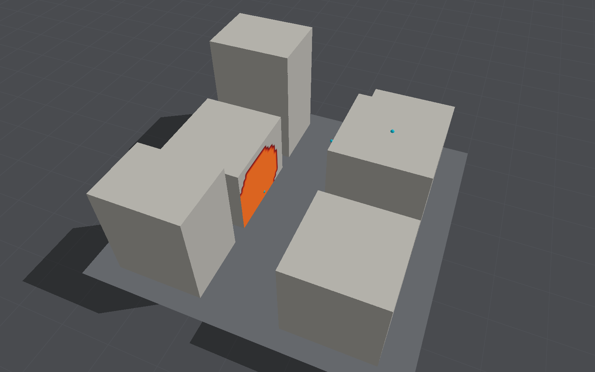

# Surfaces heated by the fireball

What the fireball's [thermal radiation](thermal-radiation.md) does to the surfaces it falls on: each
receiver's irradiance, frame by frame, conducted into its material as heat, for the highest
temperature its surface reaches; and, for surfaces that burn, whether that temperature or the
fluence passed a threshold at which tests have seen the material ignite.

**Standing: illustrative.** As the [long-term vision](long-term-vision.md#new-physical-scope) puts
it, exposure, material heating and fire are distinct subjects, and exposure alone does not
establish ignition. This is the second of them, as an inert solid: nothing melts, chars, spalls
or burns, the properties are constant, and the irradiance it is fed is itself illustrative (three
to five times what a TNT fireball was measured to radiate, until the gas loses the heat it
radiates). The **ignition flags are thresholds from tests, not a fire model**: they say a surface
passed what ignited the material in a test, not that it ignites, and nothing spreads or burns.

It is on by default wherever the thermal radiation is reckoned (`BombCAD run --thermal`, the app,
a worker Mac), and is described in the thermal description's `heating`, any field of which may be
left out:

```json
{
  "heating": {
    "enabled": true,
    "ground": "asphalt",
    "blocks": "concrete",
    "overrides": [
      { "surface": "block 2", "material": "timber", "finish": "white paint" },
      { "surface": "structure 0", "material": "glass pane" }
    ],
    "ambient": 293.15,
    "convection": 20,
    "cells": 32,
    "resolvedTime": 2.5e-5,
    "horizon": 2,
    "maximumStep": 0.001
  }
}
```

`{"heating": {"enabled": false}}` turns it off. A thermal description saved before it was added
reads with it on and the defaults.

## Materials

Each receiver's surface takes a material by what it is on: the ground `ground` (asphalt by
default), the rigid blocks `blocks` (concrete), and the structure each solid's own, by its
material's name (concrete, including blockwork and reinforced; masonry; steel; glass), unless
`structure` names one for all of it. `overrides` change a surface, matched by its receivers'
label (`ground`, `block <n>`, `structure`, or `structure <n>` for the nth solid), to another
`material`, a `finish` over its outer layer, or an outer layer's `thickness` in metres. A
material is layers, outermost first; a layer without a thickness runs through the solid behind,
as thick as the block or structure is along the surface's normal, and without end under the
ground. Materials of the description's own go in `materials` (each a `name` and `layers`, each
layer a `material` with every property below and an optional `thickness`), and replace the
library's of the same name.

| Name | Layers | k, W/(m K) | ρ, kg/m³ | c, J/(kg K) | Absorbs | Emits | Source |
|---|---|---|---|---|---|---|---|
| `concrete` | the solid | 1.4 | 2300 | 880 | 0.75 | 0.88 | Incropera A.3 (stone mix); A.12 (α 0.60) |
| `masonry` | the solid | 0.72 | 1920 | 835 | 0.79 | 0.93 | A.3 (common brick); A.12 (red brick, α 0.63) |
| `steel` | the solid | 63.9 | 7832 | 434 | 0.75 | 0.8 | A.1 (AISI 1010); weathered surface estimated, α 0.7 |
| `steel sheet` | 0.7 mm | as steel | | | | | cladding |
| `glass` | the solid | 1.4 | 2500 | 750 | 0.3 | 0.92 | A.3 (plate); absorbs beyond 2.7 µm only (below) |
| `glass pane` | 6 mm | as glass | | | | | |
| `timber` | the solid | 0.12 | 510 | 1380 | 0.76 | 0.9 | A.3 (softwood: fir, pine); surface estimated, α 0.6 |
| `timber board` | 20 mm | as timber | | | | | |
| `asphalt` | the solid | 1.0 | 2115 | 920 | 0.92 | 0.93 | ρ, c from A.3; k a round figure for dense asphalt concrete (below); α 0.9 |
| `soil` | the solid | 0.52 | 2050 | 1840 | 0.84 | 0.92 | A.3; dry surface estimated, α 0.75 |
| `dry grass` | the solid | as soil | | | | | heated as the soil beneath; ignites (below) |
| `canvas` | 0.5 mm | 0.06 | 800 | 1300 | 0.61 | 0.9 | A.3 (cotton) for k, c; 12 oz/yd² over 0.5 mm; white, α 0.3 |

Finishes: `white paint` absorbs 0.59 and emits 0.90; `black paint` 0.98 and 0.98 (Incropera
A.12: white acrylic α 0.26, black 0.98). A coat of paint is thin enough to change only how the
surface absorbs and emits.

**How much a surface absorbs** of a fireball's radiation is the least certain of these. Tables
give a solar absorptivity α, for sunlight's spectrum, about 5,800 K, and a long-wave emissivity;
a fireball near 2,000 K sends 48% of its energy below 2 µm and the rest beyond. Building materials
absorb near-infrared much as they do sunlight, and the far infrared as they emit it, so each is
taken as 0.48 α + 0.52 ε: an assumption. Clear glass passes most of the light below 2.7 µm and
absorbs beyond, 32% of a 2,000 K black body's spectrum, so 0.3, taken as absorbed at its surface;
what passes into a room (about 80% of a nuclear flash, by Glasstone and Dolan §7.50, less of the
redder fireball here) is not followed. Asphalt's conductivity in Incropera's Table A.3, 0.062
W/(m K), is far below the 0.7 to 1.5 measured for pavement; 1.0 is taken.

## The model

- **Conduction** into each receiver's surface is one-dimensional, along its normal, through a
  column of `cells` finite volumes: a node at the surface, at each cell's far face and at every
  interface between layers, each holding the heat capacity of the half cells either side, joined
  to the next by its cell's conductance. The first cell is the outer layer's diffusion length over
  `resolvedTime`, √(α t), 4 µm in concrete and 2 µm in timber by default, and the cells grow
  geometrically to the column's depth: the material's thickness, or, in a deeper solid, four
  diffusion lengths over `horizon` seconds (5 mm in concrete, 2 mm in timber, 25 mm in steel),
  cut there with no heat through it, as a semi-infinite solid.
- **The surface** absorbs `absorbs` of the irradiance and loses heat by convection to the air at
  `ambient`, h(T − T₀) with h `convection` (20 W/(m² K)), and by its own radiation, εσ(T⁴ − T₀⁴).
  A layer thinner than its column loses heat from its back the same way, to air at ambient: a
  pane, cladding, an awning.
- **The steps** are TR-BDF2's: the trapezium rule to 2 − √2 of the way, then the second-order
  backward difference to the end, each implicit, with the radiation linearised about the
  temperatures it starts from. It is second order and L-stable, so cells a few micrometres thick
  neither limit the step nor ring. Each frame's interval (a millisecond) is cut into steps no
  longer than `maximumStep`, one by default, with the irradiance going linearly between the
  frames as the fluence's trapezium rule takes it.
- **The peak** is the surface's highest temperature at the end of any step. The model is fed only
  while the run lasts, so a surface still heating at its end has its temperature then.

It runs inside the thermal consumer, after each frame's irradiance, here or on the worker Mac
that reckons the radiation, so its answer does not depend on where; columns never lit are skipped.

## Ignition, illustrative

For the materials that burn, two thresholds from tests, each flagged where it is passed:

- **Short-pulse fluence**, the radiant exposure (incident, as the receivers' fluence is) that
  ignited the material in the thermal pulses of nuclear tests and their laboratory simulations,
  from Glasstone and Dolan's Tables 7.35 and 7.40, the 35-kiloton column: plywood of Douglas fir
  flaming during exposure at 9 cal/cm² (377 kJ/m²), fine grass igniting at 5 cal/cm² (209 kJ/m²),
  white cotton canvas at 13 cal/cm² (544 kJ/m²). That column's pulse, its second maximum at
  0.2 s, delivers 80% of its energy by 2 s (§7.86), ten times longer than the fireballs here.
  The exposure needed rises with the pulse's length for pulses of seconds (§7.30) but falls again
  for those of a fraction of a second (§7.31), where surfaces were seen to vaporise without
  burning, so the shortest column is taken unscaled. For massive wood Glasstone and Dolan add that
  "persistent ignition is improbable" (§7.37): the plywood's flaming is transient.
- **Ignition temperature**, for timber only: about 350 °C (623 K), the surface temperature at
  flaming piloted ignition of softwoods under steady radiant heating (Babrauskas). It is reached
  in seconds to minutes at tens of kW/m²; under a pulse of MW/m² for a fraction of a second, an
  inert surface passes it long before the wood beneath has given off enough to burn, so this flag
  says only that the surface got that hot.

The two disagree in the street below, which is the point of keeping them apart: what a surface is
exposed to and how hot it gets do not establish that it ignites, let alone that a fire follows.

## Checks

`swift test --filter SurfaceHeatingTests`:

- **A constant flux on a semi-infinite solid**, no losses: the surface rises 2q√(t/πkρc). With the
  defaults it is within 0.5% from 1 ms to 1 s, in concrete, steel, timber and glass.
- **A slab heated on one face and insulated behind** against its analytical series (Carslaw and
  Jaeger, chapter III), its front and back, from 2% to twice its diffusion time: within 0.5%, for 5 mm of
  steel, 2 mm of glass and half a millimetre of canvas.
- **Re-radiation**: a millimetre of steel under 200 kW/m², radiating from both faces with no
  convection, settles within 0.2% of where it radiates what it absorbs, αq = 2εσ(T⁴ − T₀⁴); timber
  under 3 MW/m² stays below αq = εσ(T⁴ − T₀⁴) while approaching it (over 85% of it by 2 s), and by
  170 ms has risen under 70% of what it would without losing heat.
- **Grid and step**: in concrete under a constant flux, twice the cells with the first a quarter
  as thick (16, 32, 64, 128) give 2.6%, 0.71%, 0.18% and 0.047% from the closed form at 2 ms and
  170 ms, second order; on the default grid, steps of 1, 0.5, 0.25 and 0.125 ms after a sudden
  onset give 0.091%, 0.089%, 0.024% and 0.006% from steps of a microsecond, second order below
  half a millisecond.

`blastbench heating` repeats the convergence on a pulse like the afterburning street's, rising to
3 MW/m² at 50 ms and gone at 170 ms, for each material's peak surface temperature:

| Material | Peak rise | Grid 16 / 32 / 64 / 128 cells, from 256 | Steps of 1 ms, from 10 µs |
|---|---|---|---|
| Concrete | 314 K | −0.79% / −0.19% / −0.045% / −0.009% | under 0.001% |
| Masonry | 514 K | −0.78% / −0.19% / −0.044% / −0.009% | under 0.001% |
| Steel | 36 K | −0.80% / −0.19% / −0.046% / −0.009% | under 0.001% |
| Glass pane | 131 K | −0.80% / −0.19% / −0.045% / −0.009% | under 0.001% |
| Timber | 1,453 K | −0.42% / −0.10% / −0.024% / −0.005% | under 0.001% |
| Asphalt | 463 K | −0.79% / −0.19% / −0.045% / −0.009% | under 0.001% |
| Steel sheet, 0.7 mm | 81 K | under 0.001% | under 0.001% |
| Canvas, 0.5 mm | 1,363 K | −0.25% / −0.06% / −0.014% / −0.003% | under 0.001% |

The default, 32 cells, is within 0.2% of the finest grid.

**Its cost**, on the street's 10,456 receivers fed that pulse, on the Mac Studio (M4 Max) with
load averages of 37 to 47 from other sessions: 1.3 to 1.7 ms a frame, 7 to 10 ms of the CPU's
cores' time (10 with every receiver lit, 7 with a third in shadow throughout), against the volume
march's 29 ms a frame. It is spread over the cores, chunks of 256 receivers at a time, not on the
GPU, and grows with the receivers lit and the steps a frame. The worker's live results grow from
8 to 12 bytes a receiver a frame.

## Measured: the street

The afterburning street with hot air, 0.17 s, the volume's defaults, as in [Thermal
radiation](thermal-radiation.md#the-volume-against-the-shape)
(`blastbench snapshot --preset street --air thermal --afterburn --time 0.17 --thermal thermal.json --mode temperature`):

| Surface | Highest fluence | Peak surface temperature, default materials | With timber blocks and dry grass |
|---|---|---|---|
| Ground | 248 kJ/m² | 774 K, asphalt | 732 K, dry grass |
| Block 1 | 269 kJ/m² | 692 K, concrete | 2,029 K, timber |
| Block 4 | 117 kJ/m² | 499 K | 1,377 K |
| Block 0 | 130 kJ/m² | 516 K | 1,451 K |
| Blocks 2, 3 and 5 | 15 to 26 kJ/m² | 318 to 337 K | 437 to 545 K |

With timber blocks and dry grass, 433 of the 9,864 timber receivers pass the ignition temperature
and none the plywood's short-pulse fluence, the highest being 269 against 377 kJ/m²; one of the
592 grass receivers passes its 209 kJ/m². A timber surface at 2,000 K is far beyond where an inert
model holds: real wood chars, gives off its volatiles and has its surface blown off (Glasstone and
Dolan §7.31) long before. Concrete faces of 600 to 700 K would spall where the concrete is wet
enough, which is not modelled either.




The figures are `--mode temperature` and, with `{"heating": {"blocks": "timber", "ground": "dry grass"}}`,
`--mode ignition`.

These temperatures follow the radiation, which is too strong while the gas keeps its heat: with
the air's radiative cooling on, which takes that heat out of the gas, the fluences in this street
roughly halve, and the temperature rises with them.

## In the app

Turn on **Heat the surfaces** in the Run tab's Thermal radiation section and choose what the
**ground** and the **blocks** are; the structure follows its own materials, and overrides and
the rest of the description keep what the project's `thermal.json` gives them. **Surfaces** under
Display offers **Peak surface temperature**, its rise above ambient on a log scale from 1 to
1,000 K, painted as the fluence is, and **Ignition (illustrative)**, orange where a surface got
hot enough to ignite under steady heating and pale yellow where it passed a short pulse's
ignition fluence, with a legend that says these are test thresholds, not a fire model. The line
under the section adds the hottest surface so far and the receivers past either threshold. Kept
runs keep it all, and Compare adds the hottest surface and the receivers flagged.

## Output

- **The summary** adds each surface's material and highest peak temperature, and for each
  material that burns, the receivers past each threshold, marked illustrative.
- **`--thermal-results`** adds `heating`: `ambient`, the `materials` as resolved (name with any
  finish, and layers with their properties and thresholds), and for each receiver its `material`
  (an index), `peakTemperature` (K) and `ignition` (1 the temperature, 2 the fluence, 3 both).
  Results written before it was added read without it.
- **The USD scene** adds float primvars `peakSurfaceTemperature` (K) and `ignition` (the same
  flags) to `/Scene/Thermal`.

## Limitations

- Illustrative throughout, as above, and only as good as the irradiance it is fed.
- Inert: no melting, softening, charring, pyrolysis, ablation, spalling or burning, and the
  properties do not change with temperature, so temperatures past a material's decomposition or
  melting (timber's few hundred degrees, glass's softening near 1,000 K) are not physical.
- No moisture: wet timber, soil and concrete absorb heat in evaporating water that this leaves out.
- Absorptivities are two-band estimates for a 2,000 K source, several surfaces' estimated outright;
  glass absorbs only at its surface and what passes through is not followed.
- Heat flows only along each receiver's normal: edges and corners, heated from two sides, come out
  cooler than they are; the receivers' spacing (a metre on faces, two on the ground) smooths what
  varies faster.
- Only radiation heats the surfaces: a surface inside the fireball, or swept by its hot gas, gets
  no convective heat from it, and the blast's flow does not change the convective coefficient.
- The ignition thresholds are from nuclear thermal pulses of seconds, applied unscaled to pulses
  ten times shorter; there are only three combustible materials, and none for the scene's own
  structural materials.
- Receivers on the structure's starting outline do not follow it as it moves or fails, and their
  materials are by each solid's material's name.

## Sources

- F. P. Incropera, D. P. DeWitt, T. L. Bergman and A. S. Lavine, *Fundamentals of Heat and Mass
  Transfer*, 6th ed., Wiley, 2007: Tables A.1 and A.3 (thermal properties at 300 K) and A.12
  (solar absorptivity and emissivity of surfaces).
- H. S. Carslaw and J. C. Jaeger, *Conduction of Heat in Solids*, 2nd ed., Oxford, 1959: the
  semi-infinite solid under a constant flux (chapter II) and the slab heated on one face (chapter III).
- R. E. Bank, W. M. Coughran and others, "Transient simulation of silicon devices and circuits",
  *IEEE Transactions on Computer-Aided Design* 4 (1985) 436–451; M. E. Hosea and L. F. Shampine,
  "Analysis and implementation of TR-BDF2", *Applied Numerical Mathematics* 20 (1996) 21–37: the
  time steps.
- S. Glasstone and P. J. Dolan, *The Effects of Nuclear Weapons*, 3rd ed., US Department of
  Defense and Energy Research and Development Administration, 1977, chapter VII: Tables 7.35 and
  7.40 (radiant exposures for ignition of fabrics and other materials, low air bursts), §§7.29–7.38
  (thickness, moisture, pulse length, wood), §7.50 (glass), §7.86 (the pulse's duration).
- V. Babrauskas, "Ignition of wood: a review of the state of the art", *Journal of Fire Protection
  Engineering* 12 (2002) 163–189, and his *Ignition Handbook*, Fire Science Publishers, 2003:
  wood's surface temperature at ignition (about 250 °C glowing near the least flux, 300 to 365 °C
  flaming), and the least fluxes for ignition.
- Asphalt pavement's conductivity, 0.7 to 1.5 W/(m K): measurements of dense asphalt concretes,
  e.g. J. Luca and D. Mrawira, "New measurement of thermal properties of Superpave asphalt
  concrete", *Journal of Materials in Civil Engineering* 17 (2005) 72–79.
- Long-term scope: [Long-term vision](long-term-vision.md#new-physical-scope); the radiation
  itself: [Thermal radiation](thermal-radiation.md).
