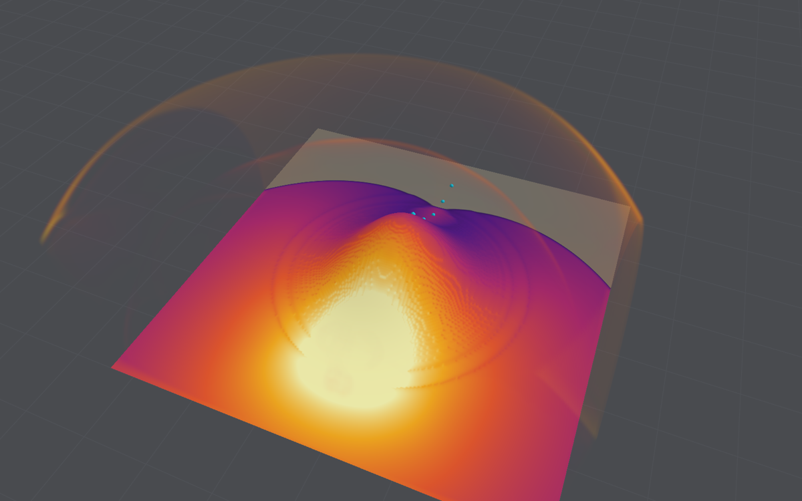

# Terrain

The ground under a scene can have a shape: hills, ridges, slopes, or a crop of a digital
elevation model (DEM). The air sees it as rigid solid, cell by cell, as it sees a block. It is
what the [long-term vision](long-term-vision.md) means by terrain interaction, at the scale of a
neighbourhood or a small landscape: shielding behind a rise, reflection up a slope, a blast that
arrives late and weakened over a crest. Flat ground stays the default and is unchanged to the
last bit.

The code is `Sources/BlastCore/Terrain.swift` (the heightfield), `ElevationGrid.swift` (DEM
import), `Shaders/Refine.metal` (`refineFill`, the fine cells' outline) and, for the checks,
`ShockReflectionTheory.swift`, `WedgeReflectionStudy.swift` and `Sources/blastbench/TerrainBench.swift`.

## The model

- **A heightfield.** `Scenario.terrain` is a regular grid of elevations (nodes `spacing` apart
  from an `origin`), joined bilinearly between nodes and carried flat beyond its edge. Heights
  are metres above the domain's floor, z = 0, which stays the reflecting face beneath it. It is
  a property of the scene beside its objects, not one of them; the multiple-object scene schema
  is unchanged.
- **In the air's mask.** A cell is solid where its centre lies below the surface, on the coarse
  grid (set on the CPU when the scene loads, beside the blocks) and on every level of
  refinement (`refineFill` evaluates the same bilinear surface at each fine cell's centre). So
  the terrain is a staircase of whole cells at each level's own resolution, as a block is; the
  fine outline is checked cell for cell against the CPU's surface on both levels.
- **Charges on or above it.** A charge is laid down in the fluid cells within its sphere and
  normalised over them, so a charge on a slope releases all its energy into the air, as on flat
  ground. "Place the charge on the ground" in the app sets it on the surface. The mapped
  one-dimensional start treats the terrain as an obstacle it must not reach.
- **Persistence.** Heights are saved as little-endian 32-bit floats in base64. A scene without
  terrain encodes exactly as before (saved-run fingerprints are unchanged). A project with
  terrain is scene encoding 8, which older readers refuse rather than open as flat ground.
- **Bit-identical when flat.** A flat heightfield gives the same `blastbench digest` hashes as
  no terrain: uniform, refined once and refined twice (`blastbench digest --terrain flat`).

### Refinement over a terrain

Where the coarse and fine outlines differ, a new patch must decide what the fine cells hold. A
fine cell of air under a solid coarse cell takes still air, as beside a block. The gas a coarse
cell of air held over fine cells that are terrain is *given up*, not shared among its fluid fine
cells as it is for a block: shared, it raised their pressure by the solid share (an eighth of a
cell solid, 14%), which flagged the blocks beside them for refinement, and patches spread along
a sloping surface two cells a step, far ahead of the blast. Given up, it balances on average the
still air gained on the other side of the surface: a closed box over a hill gains 0.08% of its
mass and energy in 120 steps (0.2% when it was shared, besides the false pressures). Such
patches are pinned, as all patches whose outlines differ are, so the refined shell along the
ground is kept once the blast has passed.

## Importing a DEM

`ElevationGrid` reads, with no library:

- **ESRI ASCII grids** (`.asc`): `ncols`, `nrows`, `xllcorner` or `xllcenter`, `yllcorner` or
  `yllcenter`, `cellsize` (or `dx` and `dy`) and `NODATA_value`, rows north to south. The format
  does not say its units; degrees are assumed when the cell is under a thousandth and the corner
  lies within longitude and latitude, metres otherwise, unless the caller says.
- **GeoTIFFs** (`.tif`): one band, classic TIFF in either byte order, strips or tiles,
  uncompressed, LZW or Deflate, horizontal or floating-point predictor, 8 to 32-bit integers or
  32 or 64-bit floats; placed by ModelPixelScale and ModelTiepoint (or a ModelTransformation
  without rotation), PixelIsArea or PixelIsPoint, geographic or projected by GTModelTypeGeoKey,
  and GDAL's nodata tag.

A crop becomes the scene's terrain: nodes `spacing` apart over the scene's extent from a chosen
origin in the DEM's coordinates, each the bilinear elevation there, less the crop's lowest
elevation (or a given datum), times an optional vertical scale. Nodes without data take the
crop's lowest elevation, and the report says how many. A grid in degrees is mapped by local
metres (an equirectangular projection on a sphere of the Earth's mean radius, good to a part in
a thousand over a few kilometres); a projected grid's coordinates are taken as metres and not
reprojected.

In the app, Run ▸ Terrain ▸ Import elevation grid… crops from the grid's south-west corner, with
sliders to move the crop, and scales the relief down to 60% of the domain's height if it is
more. `blastbench terrain --dem file --origin x,y --size 200,200 --spacing 1` reports a crop;
`--terrain file.asc` lays one under any `blastbench` scene.

No DEM was downloaded for this work. The fixtures in `Samples/Terrain` are synthetic (a 20 m hill
on a slope, 24 × 18 cells of 5 m), written by numpy and tifffile, with LZW, Deflate,
floating-point-predictor, tiled and big-endian copies recompressed by libtiff's `tiffcp`, an
independent encoder.

## Checks

All on the Mac Studio, single precision, the default scheme. The runs and their CSV files are in
`/Volumes/StudioData/bombcad/terrain/`.

### A slope: regular and Mach reflection

A plane shock of Mach 2 running up a planar slope, the shock-tube wedge problem. Whether it
reflects regularly (the reflected shock meets the surface) or as a Mach reflection (a Mach stem
grows along the surface, its triple point leaving it at an angle χ) depends on the slope's angle;
two-shock theory puts the transition at 50.6° (detachment) or 50.8° (sonic) for Mach 2 in air,
and Hornung and Taylor found that the inviscid transition, taken from experiments by
extrapolating to infinite Reynolds number, is the sonic criterion; at finite Reynolds number the
boundary layer keeps regular reflection a little below it. Three-shock theory, closed with a
straight stem normal to the surface, gives χ.

`blastbench terrain --study wedge` runs it two ways: as terrain, a slope rising from flat ground
(a staircase of whole cells), and, as a control without the staircase, on the flat ground with
the shock tilted to meet it at the slope's angle. Cells 10, 5 and 2.5 mm, the foot of the shock
measured after 1 m along the surface (100, 200 and 400 cells), 8 cells across. χ follows from
how far the foot leads where the incident shock would meet the surface; regular reflection reads
a lead of 0.4–1.4 cells, the shock's own thickness.

| Slope | Theory χ | Smooth, 100 / 200 / 400 cells | Terrain, 100 / 200 / 400 cells |
|------:|---------:|------------------------------:|-------------------------------:|
| 30°   | 8.50°    | 9.14 / 8.99 / 8.89°           | 5.29 / 6.48 / 7.22°            |
| 40°   | 4.40°    | 4.80 / 4.72 / 4.65°           | 1.21 / 2.36 / 3.26°            |
| 45°   | 2.70°    | 2.71 / 2.71 / 2.74°           | regular / regular / 1.03°      |
| 48°   | 1.78°    | 1.65 / 1.70 / 1.74°           | regular                        |
| 50°   | 1.21°    | 0.59 / 0.35 / 0.73°           | regular                        |
| 51°–60° | regular | regular                     | regular                        |

- **On smooth ground** the triple point's angle converges to three-shock theory (within 0.4° at
  30° and 40°, 0.04° at 45° and 48°; at 50°, within a degree of the transition, the stem is a few
  cells and reads low), and the transition falls between 50° and 51°, at the
  detachment and sonic criteria. The solver reflects shocks correctly; it has no boundary layer,
  so it agrees with the inviscid criterion rather than with experiments at finite Reynolds
  number.
- **On the terrain's staircase** Mach reflection is delayed: regular reflection persists down to
  between 40° and 45° on 100 and 200 cells along the run and between 45° and 48° on 400, and χ is
  under-read (5.3, 6.5 and 7.2° at 30° against 8.9° on smooth ground), converging slowly, at first
  order, as the steps shrink against the run. The steps behave as roughness. The peak pressure on
  the surface also overshoots near the transition (19 times ambient at 48° on the staircase, where
  smooth ground's Mach stem gives 12.5) where the steps' faces take the shock almost square on;
  regular reflection's pressure is 2–10% above two-shock theory on both.
- Three-shock theory with a straight stem has no solution at 20° (the flow behind the incident
  shock is subsonic to the triple point); χ there is 13.7–14.1° on smooth ground and 9.4–11.1° on
  the staircase.

Each run costs 0.1 to 9 s (0.1 to 1.9 million cells).

### Shielding behind a ridge

`blastbench terrain --study shield`: 100 kg TNT on the ground (half of it, against a mirror at
y = 0), 0.25 m cells, a ridge across the domain whose crest is 20 m from the charge, triangular in
section with flanks 2 heights long (27°) or 1 (45°, "steep"), and a wall of the same height 0.5 m
thick. The ground's peak overpressure and positive impulse along the centreline, over those of
flat ground at the same horizontal distance, and the first arrival against flat ground's at the
length of a string pulled taut over the profile from the charge (the shortest path through the
air):

| Behind the crest | 3 m | 6 m | 9 m | 13 m | 17 m | 23 m | 35 m |
|---|---|---|---|---|---|---|---|
| Ridge 2 m: peak, impulse | 0.78, 0.83 | 0.97, 0.93 | 1.00, 0.95 | 1.02, 0.95 | 1.02, 0.96 | 1.02, 0.95 | 1.01, 0.97 |
| Ridge 4 m | 0.74, 0.75 | 0.68, 0.71 | 0.84, 0.83 | 0.94, 0.88 | 0.97, 0.89 | 1.00, 0.89 | 1.01, 0.92 |
| Ridge 8 m | 0.59, 0.65 | 0.54, 0.61 | 0.53, 0.58 | 0.52, 0.55 | 0.65, 0.67 | 0.78, 0.72 | 0.87, 0.75 |
| Steep ridge 4 m | 0.53, 0.71 | 0.85, 0.85 | 0.91, 0.87 | 0.96, 0.88 | 0.99, 0.89 | 1.01, 0.90 | 1.01, 0.91 |
| Wall 4 m | 0.48, 0.79 | 0.59, 0.84 | 0.67, 0.86 | 0.74, 0.86 | 0.80, 0.86 | 0.85, 0.84 | 0.89, 0.86 |

What simple geometry expects, and found:

- **Arrival follows the path over the crest.** On the windward face and at the crest the blast
  arrives within 1% of flat ground's arrival at the taut-string distance; behind the obstacle it
  comes 1.5–5% later, as a diffracted shock weakened below the incident one should.
- **The whole lee is in shadow** (from a charge on the ground every point behind the crest is),
  and shielding grows with height: a 2 m ridge (0.1 of the crest's distance) barely shields; an
  8 m one nearly halves peak and impulse on its lee slope. Beyond the lee foot the peak recovers
  towards flat ground's (to 0.97 within 9 m of a 4 m ridge's foot, to 0.87 19 m past an 8 m
  ridge's); the impulse stays 5–25% low much further, the shadow's deficit carried on.
- **Steeper shields more close in, and a wall most.** The wall, the steepest obstacle of the same
  height, cuts the peak to 0.48 just behind it and recovers to 0.9 only at 10 heights; the gentle
  ridge's surface carries the flow over its crest and down its lee.
- **The windward face is loaded by reflection**: 1.6–2.1 times flat ground's peak and 1.3–1.9
  times its impulse on the slopes facing the charge.

No measured terrain-shielding data has been compared (none open was found); these are checks of
consistency and of geometry, not validation.

### A hill's resolution sensitivity

`blastbench terrain --study hill`: the same burst and a round Gaussian hill 6 m high, falling to
1/e at 8 m, its top 20 m from the charge, on 0.5, 0.25 and 0.125 m cells and on 0.25 m cells
refined by 2 (fine cells of 0.125 m at the shock). Gauge peak and impulse (from the gauge's
history) over flat ground's on the same cells:

| | 0.5 m | 0.25 m | 0.125 m | 0.25 m refined |
|---|---|---|---|---|
| Windward foot, 10 m out: peak | 0.88 | 2.02 | 2.31 | 1.62 |
| impulse | 1.12 | 1.68 | 1.62 | 1.41 |
| Top: peak, impulse | 0.90, 0.87 | 0.92, 0.85 | 0.89, 0.85 | 0.90, 0.86 |
| Lee, 6 m past the top: peak, impulse | 0.72, 0.71 | 0.63, 0.67 | 0.54, 0.67 | 0.56, 0.69 |
| 13 m past: peak, impulse | 0.95, 0.78 | 0.93, 0.80 | 0.88, 0.80 | 0.80, 0.80 |
| 23 m past: peak, impulse | 1.08, 0.93 | 1.17, 0.90 | 1.27, 0.91 | 1.13, 0.91 |
| 35 m past: peak, impulse | 1.10, 0.95 | 1.17, 0.92 | 1.27, 0.89 | 1.17, 0.89 |

- **The shadow converges**: the impulse behind the hill agrees within 6% on all four grids, as a
  ratio and in absolute terms (148–155 Pa·s 6 m past the top; 0.78–0.80 of flat ground's 13 m
  past). Impulse is what the shadow takes.
- **The windward foot does not** at 0.5 m (the reflection off the hill's lower slope is
  unresolved), and its peak keeps rising with resolution, as peaks near a charge do on flat
  ground (see [Validation](validation.md#with-refinement)).
- **Behind a round hill the centreline peak exceeds flat ground's**, by 8–27% 23 and 35 m past
  the top, growing with resolution: the waves diffracted round both flanks meet there and merge. It
  is a real effect of a round obstacle (a ridge, uniform across, has none), and it is not
  converged.
- Refined by 2, the 0.25 m grid gives the 0.125 m grid's top and close shadow (6 m past it) and
  its impulse throughout, but a lower peak further behind and less of the focusing and of the
  windward reflection.

### Cost

- **Building the mask** takes 0.05–0.2 s on the CPU for 2.2 million cells; the fine outline is part
  of placing each patch.
- **Uniform air**: a terrain costs no more a step than flat ground (its solid cells are fewer cells
  to sweep): the hill's runs took 0.75 to 1.1 times flat ground's on a shared machine. The number of
  steps can differ where the terrain changes the flow (the 8 m ridge, whose windward foot is 4 m
  from the charge, took 23% fewer: the reflection pushes the hottest gas out of the domain).
- **Refined air**: 1.1 to 1.25 times flat ground's refined run, from the patches kept along the
  surface behind the blast.
- **Memory**: four bytes a node, once on the CPU and once a refinement level on the GPU.

## Downstream

- **Ground points** (ground shock) read the first cell of air above the surface in each column
  (`GroundSlice`), not the floor's cells; their soil column is still level.
- **Thermal receivers** on the ground lie on the surface, a millimetre off it along its normal,
  and take its normal for their horizon, so a slope facing the fireball receives more.
- **Fragments** land where their path meets the surface, found by bisection along each step.
- **The app's 3D view** draws the terrain as a mesh of its nodes, lit by its normal, with 10 m
  contours, tinted by the blast's field in the air half a cell above it. **The USD export** writes it
  as `/Scene/Terrain`, a mesh of its nodes with its source, and lifts the ground points onto it.

## Limitations

1. **A staircase of whole cells.** Slopes are steps one cell high, at each refinement level's own
   cells. They delay Mach reflection by 3–11° and under-read the triple point's angle by 20–75%
   on 100–400 cells along a run (above), converging at first order. Cut cells would remove
   this; refinement shrinks it only where the shock is refined.
2. **Rigid, smooth and reflecting.** No cratering, no soil that gives or absorbs, no vegetation or
   roughness besides the staircase's, no snow or water. The floor under the terrain still reflects.
3. **Refinement near the surface.** Placing a patch gains still air on one side of the surface and
   gives up gas on the other (0.08% of a closed box's gas in 120 steps over a hill). Patches along
   the surface are kept once placed. A refined coarse cell records the largest impulse of its fine
   cells, and next to a terrain some of those sit in the staircase's corners: the painted impulse
   on refined terrain near the windward face read up to 50% above the gauge's own (1382 against
   915 Pa·s); gauges are right.
4. **DEM import is basic.** No reprojection (a projected grid's coordinates are taken as metres;
   degrees by a local equirectangular mapping), no vertical datum, no BigTIFF, JPEG, PackBits or
   multi-band files, no rotated rasters. Resampling is bilinear without averaging, so a DEM much
   finer than the nodes is aliased rather than smoothed. Missing data takes the crop's lowest
   elevation.
5. **Not seen downstream**:
   - the fireball's radiation is not hidden by the terrain (neither the CPU's nor the GPU's
     visibility test knows it), and the equivalent sphere's part "above the ground" is above z = 0;
   - the app paints the thermal radiation on the floor's plane, under any raised terrain, and does
     not paint the blast's field on the terrain while it shows the radiation;
   - freestanding rigid objects rest and slide on the floor at z = 0, not on the terrain, and
     anchorage footings assume level ground;
   - a fragment step that crosses a ridge and comes down beyond it within one step passes through
     it (steps are far shorter than any hill);
   - blocks and structures cast no shadows on the terrain in the view, nor it on them.
6. **The domain must hold it**: heights from the floor up, the domain taller than the highest
   point; its open faces cut through the terrain as through the air.

## Future work

- **Cut cells for terrain**, so that a slope is a slope: the staircase is the largest error found.
- **Terrain in the thermal visibility** (a heightfield march on the CPU, triangles in the GPU's
  acceleration structure), and in rigid contact and footings.
- **DEM reprojection** (UTM from geographic) and area-averaged downsampling.
- **Measured terrain shielding** or blast over hills, to validate rather than check.
- **Landscape scale**: the shielding study holds at 500 t, scaled (see [Large
  scenes](large-scenes.md#over-terrain-at-scale)); the app cannot yet make such a scene.

## Sources

- J. von Neumann, "Oblique reflection of shocks", Navy Department, Bureau of Ordnance, Explosives
  Research Report 12, 1943 (*Collected Works* vol. 6, Pergamon, 1963). Two- and three-shock theory
  and the detachment criterion; known here through the literature below.
- H. G. Hornung and J. R. Taylor, "Transition from regular to Mach reflection of shock waves. Part 1.
  The effect of viscosity in the pseudosteady case", *Journal of Fluid Mechanics* 123, 143–153,
  1982. The inviscid transition, extrapolated from experiments to infinite Reynolds number, at the
  sonic criterion; regular reflection persists beyond it at finite Reynolds number. Abstract read.
- G. Ben-Dor, *Shock Wave Reflection Phenomena*, 2nd ed., Springer, 2007. The wedge problem, the
  transition criteria and three-shock theory; not consulted for numbers here.
- The oblique-shock relations (θ–β–M, the pressure ratio and the Mach number behind) as in any
  text on gas dynamics, for example J. D. Anderson, *Modern Compressible Flow*, 3rd ed.,
  McGraw-Hill, 2003, chapter 4; checked here by the largest deflection at Mach 2 (22.97°) and the
  normal-reflection limit (15 times ambient at Mach 2).
- ESRI, *ASCII raster format* (the `.asc` header keywords), and OGC, *GeoTIFF Standard* 1.1, 2019
  (ModelPixelScale, ModelTiepoint, ModelTransformation, the GeoKey directory); Adobe, *TIFF Revision
  6.0*, 1992, and Adobe Technical Note 3 (1995) for the floating-point predictor, as libtiff
  implements it. Written from memory and checked against libtiff's output.
