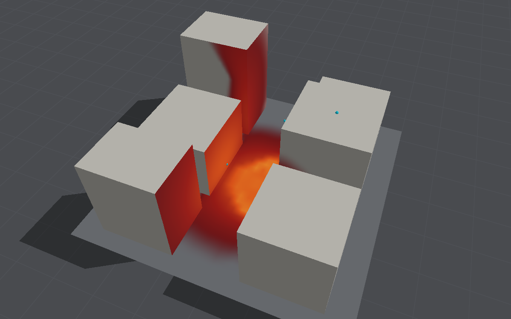

# Thermal radiation from the fireball

The fireball's radiant heat on the ground and the scene's faces, reckoned frame by frame
alongside a run: the irradiance at each point, its peak, and its time integral, the fluence. The
fireball is the air model's own hot gas, so it grows, moves, takes the shape of the streets and
cools as the blast does; the radiation is worked out from that shape in blocks, a few to a
hundred kilobytes a frame, which is what makes it the best candidate in
[Distributed computing](distributed-computing.md#the-long-term-visions-effects) for running apart
from the blast.

**Standing: illustrative.** Each ingredient is a textbook approximation, the fireball is only as
good as the gas model makes it (below), its absorption coefficients are assumptions, and its
total has been set against only one measurement of a TNT fireball's radiation, which it exceeds
three to five times (see [Measured](#the-volume-against-the-shape)). Use it to see where a scene's
surfaces see the fireball and how that compares between layouts, not for burn, ignition or damage
thresholds.

```bash
swift run -c release BombCAD run street.bombcad --thermal thermal.json --thermal-results thermal-results.json --usd street.usda
```

With `--consumer thermal=<ssh host>` the radiation is reckoned on another Mac, fed the fireball
frame by frame (see [Several consumers on several machines](distributed-computing.md#several-consumers-on-several-machines)).

The description is JSON; any field left out takes its default, so `{}` will do:

```json
{
  "luminousTemperature": 1500,
  "fireball": "volume",
  "absorption": 0.1,
  "sootYield": 0.185,
  "marchStep": 0.5,
  "emissivity": 1,
  "surfaceSpacing": 1,
  "groundSpacing": 2,
  "samples": 128
}
```

`fireball` is `volume`, the luminous cells as a partly transparent gas, or `shape` or `sphere`, an
opaque flame of the gas's shape or its equivalent sphere radiating at `emissivity`, which applies
to those two only. A description saved before the volume names its model and keeps it.

## In the app

Turn on **Fireball's radiant heat** in the Run tab's Thermal radiation section, and set how
much the hot **gas absorbs** a metre and the temperature it is **luminous above**; the receivers'
spacing, the directions sampled, the fireball model (its cells, as a volume) and its soot keep
their defaults. A project whose description names the shape or the sphere shows their
**emissivity** instead. The description is saved with the project (as
`thermal.json`), takes effect from the next run, and is undone and redone with the layout's edits
(⌘Z). With Macs set for sweeps in Settings, **Run on** reckons the radiation on the one chosen, over
a connection kept open between runs and shared with any other model run there, such as the
[fragments](fragments.md#in-the-app); should that Mac drop, it carries on here.

During a run, **Surfaces** under Display offers **Thermal fluence** and **Peak irradiance** beside
the blast's fields, and paints the one chosen onto the ground and every face that has receivers,
interpolated between them: each surface's receivers are a grid, and the colour at a point is
bilinear between the four nearest, on a log scale (a receiver under another solid takes the mean
of its neighbours, so a surface has no holes at its edges). The scale runs over four decades,
0.1 to 1,000 kJ/m² or kW/m², from dark red through orange to pale yellow, as metal glows hotter;
below its bottom the surface keeps its own grey, as for the blast's fields, and the legend gives
the units. It is painted as it stands after each frame reckoned, also when those come in after
the run has ended. A line under the section gives the largest fireball so far, its temperature
now, the highest fluence and the number of receivers, and any frames still to reckon; Reset
clears it all.



`blastbench snapshot --thermal thermal.json --mode fluence` (or `--mode irradiance`) reckons it
alongside an offscreen snapshot, a frame a millisecond, and paints it as the view does (the figure
above, with `--preset street --air thermal --afterburn --time 0.06 --no-wave`).

**Keep Run** keeps the result with the run: the description, every receiver with its peak
irradiance and fluence, and the fireball at each frame, as `--thermal-results` writes them.
Compare gives a line for each run that reckoned it (the largest fireball, how long it was
luminous, the highest fluence), the run's CSV adds the fireball's diameter and temperature
through the run, and **Use this run's inputs** brings the description back. Like the fragments,
it does not act on the air, so it is no part of the run's input fingerprint.

**The air is untouched.** The app finds the fireball at the end of the first batch in each
millisecond of simulated time, and at the run's end, rather than stopping the run there: batches
take fewer steps, never shorter ones, to end just past each millisecond. The tests check that the
gauges and the structure's response are the same to the last bit with it on or off. The frames
therefore fall a little after each millisecond, where a step ends, and differ slightly from those
of `BombCAD run --thermal`, which stops at each; for a study that repeats exactly, use that.

The receivers are reckoned on a queue of their own, here or on the other Mac; the run may get up
to four frames ahead of them, and then waits, as for the fragments. On the street's 10,500
receivers that is about 29 ms a frame on the Mac Studio over the afterburning street's run, 12 ms of it the
GPU's march (see [Measured](#the-volume-against-the-shape)), against about
80 ms a frame on the CPU's cores for the shape, so well within the run's own pace. A sweep's cases on this Mac reckon it
too, as they fly any fragments, and wait for the last frames before they are kept; cases sent to
other Macs run the blast alone.

On another Mac it is a session of `BombCAD worker`, of the kind any model fed by the blast uses
(see [Several consumers on several machines](distributed-computing.md#several-consumers-on-several-machines)):
the fireball goes out, its shape a few to a hundred kilobytes a frame and its cells up to
1.6 MB after it as raw bytes, and in the app each receiver's fluence and peak irradiance so far
come back after each frame, as raw floats, to draw. The receivers are laid out on both sides from
the same scene and description. The worker marches the volume on its GPU where it has one; for
the shape and the sphere its result is the same as this Mac's to the last bit, whether either Mac
tests the receivers' view on its GPU or its CPU, and for the volume the GPU's and the CPU's
marches agree to a thousandth of the highest irradiance.

## The model

- **The fireball** at each frame is every cell of air at least `luminousTemperature` kelvin hot
  (1,500 K by default), from the gas model's own temperature, p / (ρR) for ideal and thermally
  perfect air and the equilibrium temperature for dissociating air. The GPU sums it in blocks of
  two cells a side at the end of the batch that lands on the frame, and the blocks are doubled
  until their box holds no more than 32,768 (a metre a side when the fireball fills the street
  on 0.25 m cells, half a metre while it is smaller). Each keeps the share of its air that is
  luminous and the fourth root of that gas's mean T⁴, the temperature of a black body that
  radiates as it does on average. For the volume, every cell in the blocks' box is cut out too,
  in the same pass: its temperature to the kelvin, zero if it is not luminous, and with
  afterburning the density of its unburnt detonation products. The cells are merged in twos,
  fours and so on only if the box would hold more than a million; the street's fireball at
  170 ms is 86 by 82 by 44 cells, 1.6 MB.
- **The volume** (the default) is the luminous gas as a partly transparent medium. Each cell
  absorbs κ a metre, `absorption` for the hot gas itself plus its soot (below), and emits κB, B =
  σT⁴/π the radiance of a black body at its own temperature, so the emissivity is not set but
  follows from the optical depth along each ray: an optically thin fireball gives each receiver
  its cells' emission, 4κσT⁴ a cubic metre spread evenly in all directions, and a thick one σT⁴
  of its outer cells, hiding its hotter core. Along each of a receiver's directions (below) the radiance
  is gathered from the far side in: L = Σ B (1 − e^(−κs)) e^(−τ), τ the optical depth between
  the receiver and each step s, until something is in the way or less than 10⁻⁴ of what lies
  beyond could get through. The cells' luminous share, κ and κB are interpolated between their
  centres, and the gas is where the share is at least one half, as the shape's surface is, so
  that the opaque limit is the shape and not a staircase of cubes: seen at an angle, cubes show
  their sides, and an opaque sphere of whole cubes 40 across came out 4% too bright from five
  radii away. The ray steps through the cells it crosses, and within those where gas may be
  found by steps of at most `marchStep` cells, each taking the gas at its two ends and, where the
  share passes one half between them, only the part beyond that, which makes the step's error
  second order.
- **Its absorption** is the volume's assumption. The hot gas's own, water vapour and carbon
  dioxide, is taken as grey, 0.1 a metre by default: the Planck means of the TNF workshop's
  RADCAL fits at 2,000 K, 1.2 for water and 5.5 for carbon dioxide a metre and atmosphere, give
  about 1.4 a metre for TNT's products burnt in air (23% carbon dioxide and 8% water), but that
  is the limit for thin gas; over metres the bands saturate and a grey gas absorbs far less. The
  soot follows the unburnt products, which only afterburning keeps track of: `sootYield` of
  their mass, 0.185 for TNT, whose products by the H₂O–CO rule keep half its carbon as soot
  (C₇H₅N₃O₆ → 2.5 H₂O + 3.5 CO + 3.5 C + 1.5 N₂), as particles small against the wavelength, as
  explosives' soot is seen to be, absorbing 1817 f T a metre (f its volume fraction at
  1,800 kg/m³; Williams, Shaddix and others). Neither has been checked against a TNT fireball's optical depth.
- **The shape** (`"fireball": "shape"`) is a solid flame: its surface is where the blocks'
  share, interpolated between their centres, is one half, and it radiates from there at the
  temperature of the block it is in. This "solid flame" treatment is the usual one for fireballs in hazard assessment, there
  with an empirical sphere's diameter, duration and surface emissive power; here the air model
  supplies the shape and temperatures. Interpolating the share, rather than taking each block
  as a cube, keeps a ragged outline of cubes from catching grazing rays: as cubes, a ball 40
  blocks across came out 4% too bright from 10 m. With `"fireball": "sphere"` it is instead one
  equivalent sphere (the luminous volume, its centroid and the mean T⁴), as before, for
  comparison.
  The shape and the sphere radiate from their surface as a grey body, εσT⁴, ε the `emissivity`;
  1, a black body, is the most they could.
- **Each receiver** sees the gas or the flame's surface at some radiance, εσT⁴ / π for the
  shape and the sphere, so its irradiance is that radiance times cos θ, integrated over the
  directions in which it sees the fireball. Those are sampled tile by tile: the luminous blocks
  (for the volume, the cells with any luminous gas) are gathered into up to 16 compact tiles
  (the least compact cut in two across its longest side, until each fills at least a fifth of
  the sphere round it), and each tile's directions are spread evenly over the cone its sphere subtends,
  `samples` in all, shared by each cone's solid angle and how much of it the tile fills, at least
  four a tile. Each direction is followed through the gas, or to where it first meets the
  surface, so the flame in front hides what is behind it; where the cones overlap, each ray
  counts over the density of samples there from every cone it lies in (the balance heuristic),
  so every ray that meets the flame counts and none twice. A ray counts where it is above the
  receiver's horizon and nothing is in the way, above the ground, of a block or the structure's
  starting outline (tested together, see [Ray tracing](ray-tracing.md)). One compact fireball is
  one tile, sampled as the sphere is, and gives the sphere's answer; a receiver inside the flame
  gets all of εσT⁴.
  The volume is marched on the GPU, one threadgroup a receiver, the first block or structure in
  each ray's way found on the ray-tracing hardware; for the shape and the sphere, whether each
  ray is clear is tested there, and the rest is on the CPU's cores. Where the Mac has no GPU with
  ray tracing, all of it is on the CPU, with the same answer to a thousandth for the volume and
  to the bit for the others ([Ray tracing](ray-tracing.md#in-bombcad-the-fireballs-radiation));
  `BOMBCAD_THERMAL_VISIBILITY=cpu` in the environment keeps it on the CPU.
- **The fluence** at each receiver is the irradiance integrated over the frames by the trapezium
  rule; the peak irradiance is the highest at any frame.
- **The receivers** lie over the ground, `groundSpacing` apart, and over every face of the blocks
  and the structure's starting regions that the air touches, `surfaceSpacing` apart, a millimetre
  off their surface. Points inside another solid are left out, as are undersides.
- **The air between is transparent**: no absorption by water vapour or carbon dioxide, which
  over tens of metres takes a few per cent to a few tens of per cent, nor by smoke or dust.

The run's summary also gives what the fireball **radiated in all**, as a share of the charge's
energy. For the volume it is measured: each frame, 256 points on a dome over the fireball facing
in and 256 on the ground within it facing up, with nothing in the way but the ground, sum what
crosses them, all the gas sends into the air but what goes straight into the ground beneath it
(for an opaque sphere, σT⁴ over its surface above the ground, to 3% in the tests). For the shape
and the sphere it is εσT⁴ over the part of the equivalent sphere above the ground, which for the
street's shape agrees with the same measurement to under 1%. Nothing takes that energy out of
the gas, so a share beyond what fireballs of that explosive are seen to radiate shows the gas
stays hot and luminous too long, or the absorption or emissivity is too high.

## Measured

The street canyon on the medium grid (0.25 m cells, 100 kg, 0.17 s), frames every millisecond,
on the Mac Studio (M4 Max), heavily loaded by other work at the time, so the times are rough.
These first tables are the shape and the sphere, as they were before the volume
([below](#the-volume-against-the-shape)):

| Gas | Largest fireball | Luminous until | Radiated (ε = 1) | Highest fluence | Run, without and with |
|---|---|---|---|---|---|
| Default (cold air, no afterburning) | 4.2 m across, at 1 ms | 44 ms | 0.4 MJ, under 1% | 9 kJ/m², ground | 4 to 7 s and 6.5 s |
| Afterburning and hot air | 14.6 m across, still growing at 170 ms | the run's end | 78 MJ, 19% | 265 kJ/m², ground; 264 kJ/m², a block's face | 8.3 s and 28.3 s; later, less loaded, 10.5 s and 11.5 s |

The largest fireball is given as the sphere of its volume; the fluences are from its shape. The
runs' times were measured with the sphere (below for the shape's cost).

**The gas model decides the answer.** With the default gas the charge's products cool by
expanding as cold air would, so the luminous region is a few metres across and gone within
50 ms. With afterburning and hot air the products burn with the air they mix with and the gas
keeps its heat, and the fireball fills the street. Fireballs of high explosives are known to
scale with the cube root of the charge, last for tens to hundreds of milliseconds, and to be near
1,800 K and above early on; the second is the more plausible, and the one to use for a thermal
study. Since the radiated energy is not taken from the gas, its 19% at emissivity 1 is an upper
bound that a lower emissivity scales down in proportion.

Without a structure, each frame stops the run, ending a time step there (1,856 steps instead of
1,780 with afterburning), as for [fragments](fragments.md#running-alongside-the-blast). The
receivers, about 10,500 of them in the street, each sampling 128 directions against six blocks,
are reckoned on a queue of their own, so the run does not wait for them until the end.

**The receivers on the GPU.** Measured with the fireball as its sphere, on the afterburning
street later the same day, the M4 Max
loaded by other work (load averages of 13 to 51), each build run four times, interleaved, with
the CPU time from `time` and the GPU time from the process's `accumulatedGPUTime` in the
I/O Registry:

| `BombCAD run`, 0.17 s | Wall | CPU time | Of it the radiation's |
|---|---|---|---|
| Without `--thermal` | 9.8 to 12.0 s | 0.5 to 0.7 s | |
| With, before the GPU test | 11.0 to 12.6 s | 3.6 to 4.3 s | about 3.4 s |
| With, the visibility tested on the CPU | 11.6 to 12.1 s | 3.6 to 4.2 s | about 3.4 s |
| With, the visibility tested on the GPU | 11.6 to 12.5 s | 2.7 to 3.2 s | about 2.4 s |

The run takes as long either way: the receivers were never what it waited for. What the GPU
saves is the CPU's cores, a third of the radiation's CPU time, for a few hundredths of a second of
GPU time over the run, too little to see against the blast's 4 to 7 s (and other sessions' work
inflating it). `blastbench thermal --frames 171` times the receivers alone, on a sphere growing to
15 m across: 12 ms of the cores' time a frame on the CPU (1.6 ms of wall time), 5 ms with the
visibility on the GPU (1.3 ms), which takes it in 0.16 to 0.22 ms. The rest is laying out the
rays and summing them, still on the CPU, to which the fireball's shape adds the search for where
each ray meets it (below). The two tests agreed to the bit on every receiver.

**The shape against the sphere.** `blastbench snapshot --thermal thermal.json --thermal-compare`
reckons the same frames with both. In the street with afterburning and hot air, by 170 ms the
flame fills the street in blocks a metre a side, 23 by 20 by 11 of them, in 16 tiles:

| Surface | Highest fluence, shape | Highest fluence, sphere | Mean fluence, shape against sphere |
|---|---|---|---|
| Ground | 265 kJ/m² | 182 kJ/m² | +15% |
| Block 1 | 264 kJ/m² | 171 kJ/m² | +17% |
| Block 4 | 139 kJ/m² | 93 kJ/m² | +1% |
| Block 0 | 98 kJ/m² | 51 kJ/m² | −8% |
| Blocks 2, 3 and 5 | 10 to 21 kJ/m² | 16 to 25 kJ/m² | −20 to −35% |

The flame pressed against the faces and the ground of the street gives the receivers nearest it
half as much again as a ball of the same volume at its centroid, and nearly twice as much on
block 0; the faces that see little of the flame (blocks 2, 3 and 5) get a fifth to a third less.
On the ground most receivers get less from the shape (the median ratio is 0.65) and the nearest
much more; on blocks 1 and 4 most get more (median ratios 2.1 and 1.6). With the default gas the fireball is a
compact ball a few metres across, one tile, and the two agree to within 8% at the highest
fluence (9 against 8 kJ/m²). With 512 samples instead of 128, each surface's highest fluence
moves by under 5% and its mean by under 2%.

Its cost, measured alternately with the sphere on the same frames while the Mac Studio was
loaded by other work: about 80 ms a frame on the CPU's cores for the street's 10,500 receivers
once the flame fills the street, against 4 ms for the sphere, almost all of it following the
rays through the blocks (the sight lines take under a millisecond). Finding the fireball,
on the thread that drives the GPU, went from 0.05 ms to 0.1 to 1.7 ms a frame as the flame grows,
sorting its blocks and doubling them, under half a per cent of the 0.4 s each frame's blast
took. A frame of the shape is 3 bytes a block, 15 to 90 KB, and as JSON a third more.

### The volume against the shape

The afterburning street with hot air again, 0.17 s, the same frames reckoned with the volume's
defaults and with the shape (`blastbench snapshot --preset street --air thermal --afterburn
--time 0.17 --thermal thermal.json --thermal-compare`), on the Mac Studio with load averages of
150 to 240 from other sessions:

| Surface | Highest fluence, volume | Highest fluence, shape | Peak irradiance, volume | Peak, shape | Mean fluence, volume against shape |
|---|---|---|---|---|---|
| Ground | 248 kJ/m² | 265 kJ/m² | 3.2 MW/m² | 2.7 MW/m² | −4% |
| Block 1 | 269 kJ/m² | 264 kJ/m² | 3.0 MW/m² | 2.9 MW/m² | +18% |
| Block 4 | 117 kJ/m² | 139 kJ/m² | 2.1 MW/m² | 2.7 MW/m² | +10% |
| Block 0 | 130 kJ/m² | 98 kJ/m² | 1.8 MW/m² | 1.6 MW/m² | +40% |
| Blocks 2, 3 and 5 | 15 to 26 kJ/m² | 10 to 21 kJ/m² | 0.2 to 0.4 MW/m² | 0.1 to 0.3 MW/m² | +43 to +56% |

Most receivers get more from the volume (median ratios 1.1 to 1.6 by surface; 1.3 on the
ground), the faces that see little of the flame most of all, while the nearest get about as much
or less. Which of its differences does this is not settled: the volume follows the flame to its
cells, a quarter of the shape's blocks, so flame thinner than a block radiates, and takes each
cell's own temperature rather than its block's mean. With 512 directions instead of 128, each
surface's highest fluence moves by under 1% and its peak irradiance by under 3%; with steps of a
quarter of a cell instead of a half, by under 0.1%.

**The soot decides it.** At 170 ms 30 kg of the 100 kg's products are still unburnt, and their
soot makes the fireball opaque: with it, the gas's own absorption hardly matters. Without it, the
grey coefficient for the hot gas, the assumption, sets the answer almost in proportion while the
gas is thin:

| Absorption | Radiated | Share of the charge's 418 MJ | Highest fluence, ground | Peak irradiance, ground |
|---|---|---|---|---|
| Default: 0.1/m and soot | 87.9 MJ | 21.0% | 248 kJ/m² | 3.2 MW/m² |
| Soot alone | 89.8 MJ | 21.5% | 248 kJ/m² | 3.2 MW/m² |
| 1/m, no soot | 86.0 MJ | 20.6% | 229 kJ/m² | 2.6 MW/m² |
| 0.1/m, no soot | 47.9 MJ | 11.4% | 91 kJ/m² | 1.1 MW/m² |
| 0.01/m, no soot | 6.9 MJ | 1.6% | 13 kJ/m² | 0.16 MW/m² |
| The shape, ε = 1 | 77.8 MJ | 18.6% | 265 kJ/m² | 2.7 MW/m² |

**Against a TNT fireball.** The thermal measurements of the 100-tonne TNT hemisphere fired at
Suffield in 1961 (Tate and Pattmann) put what it radiated at 3.8% and 6.6% of its energy, by two
kinds of instrument, its radiance peaking about 20 ms after the detonation; scaled by the cube
root of the charge, 100 kg would peak at about 2 ms. The volume's 21% is three to five times as
much, and its course is the wrong way round: 0.2% by 20 ms, 1.4% by 50 ms, 6.5% by 100 ms and
21% by 170 ms, when its fireball is still at 2,400 K and growing. The volume is opaque here, so the
excess is not the emissivity: the gas never loses the heat it radiates (21% of the charge's energy
would cool it markedly), and stays hot and luminous far longer than a real fireball, while its
first milliseconds, a fireball a few cells across, are faint. Taking the radiated heat out of the
gas is the next step; until then, treat the volume's fluences, like the shape's, as an upper
bound, and its timing as wrong.

**Its cost.** Each binary run three times, interleaved, the branch before the volume (the shape,
compared with the sphere) and after (the volume, compared with the shape), each model's time on
the same 171 frames from the same blast:

| Per frame, medians of three | Before | After |
|---|---|---|
| The shape, on the CPU's cores | 136 ms (133 to 147) | 163 ms (144 to 173) |
| The volume, all of it | | 29 ms (28 to 30) |
| Of which the GPU's march | | 12 ms (11.7 to 12.0) |
| Finding the fireball, on the thread that drives the GPU | 2.3 ms | 6.7 ms |

The volume costs a fifth of the shape: the GPU follows its 1.3 million rays a frame through the
cells in 12 ms, and the rest is making the medium and its tiles from the cells and measuring what
it radiates. Cutting the cells out adds about 4 ms a frame to finding the fireball, about 1% of
the half second each frame's blast took here. On the CPU alone the same march is about thirty times slower:
`blastbench thermal` on a sphere of cells growing to 15 m across over 30 frames takes 18 ms a
frame with the GPU (8 ms of it the GPU's) and 540 ms on the cores, the two agreeing to 0.001%.

## Output

- **The summary** printed gives the largest fireball, its temperature and how long it was
  luminous, what it radiated, and each surface's highest peak irradiance and fluence.
- **`--thermal-results`** writes the description, every receiver (position, normal, surface),
  its peak irradiance (W/m²) and fluence (J/m²), and the fireball at every frame, as JSON.
- **The USD scene** (`--usd`) gains `/Scene/Thermal`, a Points prim of the receivers with float
  primvars `fluence` (kJ/m²) and `peakIrradiance` (kW/m²), for colouring in Blender.

## Limitations

- Illustrative, as above: one comparison with a measurement of a TNT fireball's radiation, which
  the model exceeds three to five times.
- The radiated energy is not taken from the gas, which therefore stays hot and luminous too
  long; this, more than the absorption, is why the total is too high.
- The volume's absorption is assumed: a grey coefficient for the hot gas, between the thin-gas
  Planck mean and what saturated bands allow over metres, and Rayleigh soot as a fixed share of
  the unburnt products. Real soot forms, burns and cools on its own course, not the products'.
  Without afterburning there is no soot, and the fireball is as thin as the gas's coefficient
  makes it. No optical depth of a TNT fireball has been compared.
- Scattering is left out: the soot's particles are small enough to absorb far more than they
  scatter, but dust the blast lifts is not taken into account.
- The volume interpolates its cells, which are luminous or not: an opaque sphere of whole cells
  comes out 3.7% too bright at 4 cells in radius and 1.7% at 32 (to 0.3% when the cells are
  filled as much as they are inside it). Merged cells, in fireballs of over a million, count as
  wholly luminous within the surface where their share is a half.
- The volume's march waits for a busy GPU rather than racing the CPU, which would be over ten
  times slower; the GPU's and the CPU's marches agree to a thousandth, not to the bit.
- The app's kept runs keep their frames without the volume's measured radiation, so their
  summary gives the equivalent sphere's instead; `BombCAD run` and `blastbench` give the measured.
- In the app, which does not have the GPU cut the cells out at each frame, they are read from
  the state on the CPU, on the thread that drives the GPU, over the fireball's box; that cost has
  not been measured (cut out on the GPU, the cells add about 4 ms a frame).
- The shape is resolved only to its blocks, a metre a side when it fills the street on the
  medium grid: its edges and corners are rounded within half a block (a long box's view factor
  came out 3% low on blocks an eighth of its width), and a flame thinner than a block is lost.
  A fireball so small that no block of two cells is half luminous is taken as its sphere.
- The shape's flame is opaque, at each block's mean temperature from its surface inwards.
- A run keeps its frames without their shapes or cells, so a kept run's radiation can be
  reckoned again only from the sphere.
- The air between is transparent.
- On coarse grids the charge's gas is spread over large cells and comes out cooler: on 0.5 m
  cells, 0.5 kg of TNT starts at under 800 K, below the default luminous temperature.
- Only the coarse grid's cells, also where refinement sharpens the blast.
- `BombCAD run --thermal` reckons it on this Mac only; the app can send it to another Mac.
  Sent there, the volume's cells are a few megabytes a frame on the network, and kept in a
  temporary file against that Mac dropping, a few hundred megabytes over a run.
- The GPU's and the CPU's visibility tests have agreed to the bit on every scene tried, but only
  the M4 Max's GPU has been tried, for both the test and the march; on an M1 or M2, ray tracing
  runs in software and may be slower.
- For the shape and the sphere only the visibility test is on the GPU; laying out the rays and
  summing them, and following each ray to where it meets the shape, stay on the CPU.
- The paint is interpolated between receivers, a metre apart on the faces and two on the ground
  by default, so what varies over less than that is smoothed; it shows no shadows of the sun.
- Receivers on the structure's starting outline, and their paint, do not follow it as it moves
  or fails.

## Sources

- F. P. Incropera et al., *Fundamentals of Heat and Mass Transfer*, Wiley: radiation between
  surfaces, view factors.
- J. R. Howell, *A Catalog of Radiation Heat Transfer Configuration Factors*, case B-3: a small
  surface to a parallel rectangle, used by the tests for the box, the L and the corner.
- J. Amanatides and A. Woo, "A fast voxel traversal algorithm for ray tracing", Eurographics
  1987: following a ray through the blocks.
- E. Veach and L. J. Guibas, "Optimally combining sampling techniques for Monte Carlo rendering",
  SIGGRAPH 1995: the balance heuristic, for the tiles' overlapping cones.
- Committee for the Prevention of Disasters, *Methods for the calculation of physical effects*
  ("Yellow Book", CPR 14E), 3rd ed., 1997, chapter 6: the solid-flame model of fireballs.
- M. F. Modest, *Radiative Heat Transfer*, Academic Press: the radiative transfer equation along
  a ray in an absorbing, emitting medium, and mean absorption coefficients.
- TNF Workshop, [Radiation models](https://tnfworkshop.org/radiation/) (RADCAL, after
  Grosshandler, NIST): curve fits of the Planck-mean absorption coefficients of water and carbon
  dioxide, 300 to 2,500 K, behind the gas's coefficient (an assumption, as above).
- B. F. Williams, C. R. Shaddix and others, *International Journal of Heat and Mass Transfer* 50
  (2007) 1616–1630, via [RadLib's Planck-mean
  documentation](https://ignite.byu.edu/radlib_documentation/classrad__planck__mean.html): soot's
  Planck-mean absorption, 3.72 C f T / C₂ = 1817 f T a metre (an assumption for explosives' soot).
- A. J. Saltzman, A. D. Brown, K. Wan and others, "Extinction imaging diagnostics for in situ
  quantification of soot within explosively generated fireballs", *Propellants, Explosives,
  Pyrotechnics* 48 (2023), [Sandia](https://www.sandia.gov/research/publications/details/extinction-imaging-diagnostics-for-in-situ-quantification-of-soot-within-ex-2023-03-01/):
  explosives' soot absorbs as particles in the Rayleigh limit.
- P. W. Cooper, *Explosives Engineering*, Wiley-VCH, 1996: the H₂O–CO arbitrary rule for
  detonation products, from which TNT's soot (an assumption: measured yields vary with
  confinement).
- P. A. Tate and J. D. R. Pattmann, *Surface burst of 100 ton TNT hemispherical charge (1961),
  Project No. 4: Thermal measurements*, Defence Research Chemical Laboratories, Ottawa, 1962,
  [OSTI 4786722](https://www.osti.gov/biblio/4786722): thermal yields of 3.8% and 6.6%, the
  radiance peaking at about 20 ms.
- Long-term scope: [Long-term vision](long-term-vision.md); where it can run:
  [Distributed computing](distributed-computing.md#the-long-term-visions-effects).
