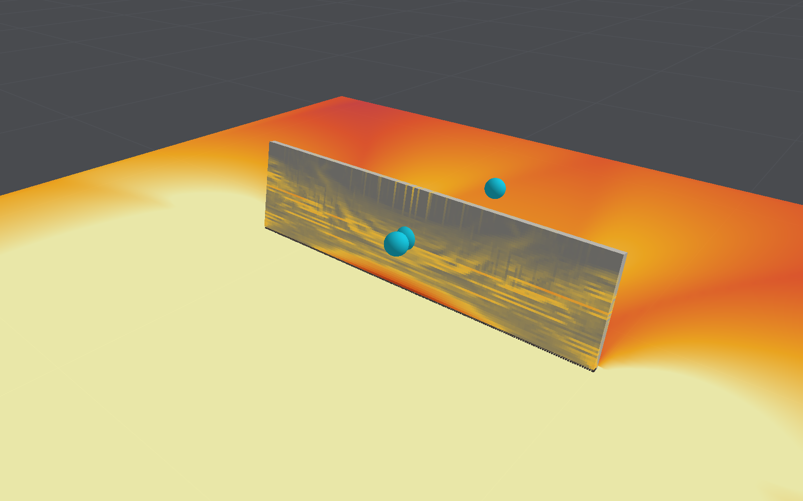

# Validation

What has been checked, against what, and how far the results can be trusted. "Verification"
here means agreement with theory (is the model solved correctly?); "validation" means agreement
with measurements (is it the right model?).

All of it can be reproduced:

```bash
swift test
```

```bash
swift run -c release blastbench slab --sensitivity
```

```bash
swift run -c release blastbench beam
```

```bash
swift run -c release blastbench shear --layers 24,36
```

```bash
swift run -c release blastbench pushoff
```

```bash
swift run -c release blastbench impact --layers 16
```

```bash
swift run -c release blastbench closein
```

```bash
swift run -c release blastbench contact
```

```bash
swift run -c release blastbench closeair --dx 0.01
```

```bash
swift run -c release blastbench validate
```

```bash
swift run -c release blastbench chamber
```

## Summary

| Area                 | Evidence                                             | Confidence                         |
|----------------------|------------------------------------------------------|------------------------------------|
| Air solver numerics  | Exact solutions                                      | High                               |
| Blast loads          | Kingery–Bulmash curves from 0.75 to 6 m/kg^(1/3): impulse on a wall within 6% on 0.25 m cells beyond 1.5 m/kg^(1/3); refinement gives the next finer grid's peaks | Good for impulse on walls; peaks under-resolved; incident impulse 13–22% low without afterburning, within 4% with it (fitted) |
| Gas in a closed room | UFC 3-340-02: 48% to 114% of the design curve by default; 98% to 108% with afterburning and hot air; 90% of Cooper's closed vessel, burnt out | Good with afterburning and hot air, nothing fitted |
| Structural numerics  | Beam and wave theory                                 | High                               |
| Concrete material    | Its own curves; section analysis of a beam           | High that it does what is intended |
| Structural response  | One slab test: solid elements 113–124 mm (105–115%) on 4 to 32 elements through, shells 135 mm (125%); one beam bent to failure: peak moment 97–99%, failure at 38–52 mm against 42 mm; one beam without stirrups failing in shear: 11–15% strong on fine meshes, failing suddenly as the test did; seven drop-weight impacts on beams: with stirrups within 12–24% under light drops and −5% to +3% under heavy ones on 16 elements (+2% to +18% on 24), the beam without stirrups broken by the heavy drop as in the test, and damaged by the light one it survived; nineteen on beams without stirrups at rising speeds: within 15% up to 3 m/s and 15% on average beyond on 16 elements, but further on 24, springing back too far, and decided by how the ends were held | Moderate for bending; low for shear: one test, and coarse meshes far too strong; moderate for impact, where the strain-rate laws decide it |
| Close-in charges     | Reflected impulse within 8% of Kingery–Bulmash from 0.3 m/kg^(1/3) on fine enough cells; full-scale slabs under 2–15 kg at 0.5 and 1 m: gauges beside the slab 75–80% of those measured, the impulse under the charge 86–95% of Kingery–Bulmash's; the slab left a third to a half as far down as measured, spalled only under the charge (on fine air and 12 elements through), and not holed | Good for the load; low for close-in damage: the slab bends too little, spalls too little and is never holed |
| Steel in both faces | Wu et al. (2023): 2 m slabs, one layer or two, within −20% to +7% at the peak under 1.6 kg at 0.43 m/kg^(1/3), 40–70% under 0.2–0.8 kg where the tests spalled; contact charges hole them, not to size. Wang et al. (2022): an aluminised charge's impulse 75% as its stated 10 kg of TNT, 94% with afterburning; the slabs several times too stiff as supported | Moderate for bending under the larger charges; low for one layer against two, spall and holes |
| Internal explosion   | One full-scale chamber test: peak wall pressures 0.9 to 1.6 times those measured; the roof is about twice as stiff as the paper's model and its edge is left 15 mm up against 95 mm | Low: the joints' inclined cracking decides it, and the crack models disagree |
| Fireball radiation   | Two TNT shots by one group (DREO): 100 t, whose total the volume exceeds three to five times; Dial Pack, 500 t, against which the pulse is a sixth as bright at its first maximum, dark from 40 to 350 ms and two to five times too bright after 1 s, 3.9% radiated by 2 s against 2.4%; with gravity it rises but stays as hot | Low: illustrative; the fireball barely mixes with cold air |
| Gas deflagrations    | A closed sphere against the thin-flame model: burns out at the fitted AICC pressure, conserving energy; rise times within 1–3% at 48 cells across the radius; K_G 51 against 76, converging from below. Vented rooms: a thirtieth to a fiftieth of Molkov's correlation with the default flame, a fifth to an eighth with the burning velocity tripled; FM Global's six tests (plotted only): the model at a tenth to a half of the plots' axes | Verified for a laminar flame in a closed vessel; illustrative for vented rooms |
| Foundations          | One footing rocked slowly on dry sand (centrifuge, FoRCy SSG02_03): moment within 6% to 14 mrad of rotation, 7–17% low beyond; settlement a tenth of that measured | Moderate for rocking moment; low for settlement |
| Collapse and debris  | Debris off six slabs under contact charges (Hupfauf, 2024): the far face thrown 1.2–1.9 times as fast as the debris at first, its cover cracked loose over about the spall crater on the thinner slabs, but the loose layer held back rather than thrown, and no slab holed where four of these were; the charge's impulse about twice the products' own; collapse nothing | Low for debris; none for collapse |

## Structural response against a real test

### The test

The normal-strength slab of the 2013 Blast Blind Simulation Contest, organised by the University
of Missouri–Kansas City with ACI Committees 447 and 370 and tested in the Blast Loading
Simulator of the US Army Engineer Research and Development Center, Vicksburg. The simulator is
a large shock tube that applies a uniform, measured pressure history to one face of a specimen.

| Property        | Value                                                                          |
|-----------------|--------------------------------------------------------------------------------|
| Slab            | 64 × 33.75 × 4 in (1626 × 857 × 102 mm)                                        |
| Supports        | Simple, 52 in (1321 mm) apart                                                  |
| Concrete        | 5,400 psi (37 MPa)                                                             |
| Main bars       | Nine No. 3 (9.5 mm) at 4 in, 1 in from the unloaded face                       |
| Cross bars      | No. 3 at 12 in                                                                 |
| Steel           | Yield 72 ksi (496 MPa), 118 ksi (814 MPa) at 8% strain, rupture near 15%       |
| Load            | Peak 50 psi (345 kPa), impulse 1,020 psi·ms (7.0 kPa·s), over 80 ms            |
| Measured        | Peak mid-span deflection about 4.25 in (108 mm) at 30 ms; about 3.55 in (90 mm) at 70 ms |

**Source of the data.** T. H. Kewaisy, A. A. Khalil and A. ElFouly, *Advanced Modeling of Blast
Response of Reinforced Concrete Walls with and without FRP Retrofit*, ACI Spring Convention,
2018, which reproduces the contest's specimen drawing, material curves, pressure record and
measured displacement history. The test programme itself is reported in G. Thiagarajan,
A. V. Kadambi, S. Robert and C. F. Johnson, "Experimental and finite element analysis of doubly
reinforced concrete slabs subjected to blast loads", *International Journal of Impact
Engineering* 75, 2015.

**How the data were taken.** The pressure record, the steel curve and the displacement history
were read off the published plots by hand. The pressure record was then scaled so that its
impulse equals the stated 1,020 psi·ms; the scaling was under 1%, and the scaled peak is
49.9 psi against the stated 50.

### The model

The slab is meshed with cubic elements, eight (12.7 mm) or four (25.4 mm) through its
thickness. It is supported on two lines of nodes on the unloaded face (a pin and a roller), and
the recorded pressure is applied to the other face. Gravity is ignored, since the slab stood
vertically.

Nothing was fitted to the test. The concrete's stiffness, tensile strength and fracture energy
come from standard correlations with its compressive strength; the bars follow their published
curve; strengths rise with strain rate by published laws. Two inputs are assumptions: the crack
spacing (100 mm) and the aggregate size (16 mm).

### Results

| Case                             | Peak deflection | At    | At 70 ms | Elements failed |
|----------------------------------|-----------------|-------|----------|-----------------|
| **Measured**                     | **108 mm**      | 30 ms | 90 mm    |                 |
| Model, 32 elements through       | 124 mm (115%)   | 29 ms | 106 mm   | 60,152 of 4,423,680 |
| Model, 16 elements through       | 121 mm (112%)   | 28 ms | 98 mm    | 0 of 552,960    |
| Model, 8 elements through        | 113 mm (105%)   | 27 ms | 83 mm    | 0 of 68,608     |
| Model, 4 elements through        | 114 mm (105%)   | 27 ms | 88 mm    | 0 of 8,704      |
| With Malvar and Crawford's law for the bars: 16 through | 112 mm (103%) | 27 ms | 77 mm | 0 of 552,960 |
| 8 through                        | 104 mm (97%)    | 26 ms | 64 mm    | 0 of 68,608     |
| 4 through                        | 104 mm (96%)    | 26 ms | 84 mm    | 0 of 8,704      |
| With Malvar and Ross's tensile law: 32 through | 105 mm (98%) | 26 ms | 74 mm | 32 of 4,423,680 |
| 16 through                       | 107 mm (99%)    | 26 ms | 67 mm    | 0 of 552,960    |
| 8 through                        | 101 mm (93%)    | 26 ms | 66 mm    | 0 of 68,608     |
| 4 through                        | 100 mm (93%)    | 26 ms | 79 mm    | 0 of 8,704      |

The concrete's tensile strain-rate law is the fib Model Code 2010's by default, and the bars'
the CEB's (see the [concrete model](concrete-model.md#strain-rate-effects)); with them the peak
is 105–115% on 4 to 32 elements, converging at about 124 mm, and the record is followed more
closely on the coarser meshes, within 4.4, 7.6 and 8.3 mm root-mean-square on 4, 8 and 16
elements (14.7 mm on 32): the slab rebounds less (from 113 mm to 82 on 8 elements, against 108
to 95 measured). On 32 elements it loses 60,152 elements, 1.4% of them, where under the
earlier laws it lost 32: the row of elements just above the bottom bars, split along them for
about 0.45 m either side of mid-span (`blastbench slab --layers 32 --map`), and a band about
20 mm below the loaded face near mid-span, where the compression zone cracks along its length.
The split is the one that parts Saatci's beam without stirrups on fine meshes (below): the
bars, perfectly bonded and smeared through one row of elements, hand their changes of force
to the row of plain concrete above, which no bar crosses. Under Malvar and Crawford's steeper law for the bars
the peak was 96–103%. The tables below were made with Malvar and Ross's tensile law and Malvar
and Crawford's for the bars, the defaults until the drop-weight impacts and close-in slabs
below showed them too stiff.

Mid-span deflection through the record, with Malvar and Ross's tensile law, in millimetres:

| Time  | Measured | 32 through | 16 through | 8 through | 4 through |
|-------|----------|------------|------------|-----------|-----------|
| 5 ms  | 9        | 10         | 10         | 9         | 9         |
| 10 ms | 35       | 37         | 37         | 36        | 35        |
| 15 ms | 66       | 68         | 69         | 68        | 66        |
| 20 ms | 88       | 93         | 95         | 91        | 90        |
| 25 ms | 103      | 105        | 107        | 101       | 100       |
| 30 ms | 108      | 102        | 105        | 97        | 97        |
| 35 ms | 107      | 91         | 93         | 84        | 86        |
| 40 ms | 98       | 81         | 81         | 75        | 81        |
| 45 ms | 95       | 78         | 77         | 74        | 86        |
| 50 ms | 98       | 83         | 80         | 80        | 90        |
| 55 ms | 98       | 91         | 88         | 86        | 88        |
| 60 ms | 96       | 92         | 93         | 84        | 80        |
| 65 ms | 92       | 84         | 90         | 76        | 77        |
| 70 ms | 90       | 74         | 80         | 67        | 80        |

The root-mean-square difference over the record is 10.1 mm for 32 elements through the
thickness, 9.8 mm for 16, 14.4 mm for 8 and 10.5 mm for 4. **The peak has converged at 105 to
107 mm**, at most 3% below the measurement: 100, 101, 107 and 105 mm from 4 to 32 elements
through. (The 32-element run predates steps 22 to 24 of the
[concrete model](concrete-model.md#how-the-model-got-here), the residual opening kept where a
crack opened, a second crack, and splitting cracks softened over one element, which moved the
others by a millimetre or two at most. The 16-element history in the table predates step 24,
which left its peak at 107 mm and its end at 67 mm.)
The rise to the peak is reproduced within a few millimetres on every mesh. After the peak every
mesh rebounds further than the specimen did (about 30 mm against 13 mm) and settles lower, about
75 mm on the finer meshes against 90 mm. The rebound is set by a hinge at mid-span: once its
crushed compression zone unloads, the section cracks through its depth and the two halves
swing back about the bars. The [concrete model](concrete-model.md#how-the-model-got-here)
gives the evidence.

**Finer still, and the crack model.** A strip of the slab 25 mm wide bends as the slab does at
a thirtieth of the cost (`blastbench slab --strip 25 --layers 8,16,32`): 121, 127 and 131 mm
with the present laws. Before the bars took their strain rate over their debonded length (see
the [concrete model](concrete-model.md#strain-rate-effects)), the CEB's law for the bars let
the strip's mid-span hinge run away on 16 and 32 elements (180 mm and 153 mm, still going at
80 ms) and the full slab fall apart on 32: the rate of the one element a crack ran through,
growing as the mesh was refined, had kept the hinge whole under Malvar and Crawford's steeper
law (109, 118 and 120 mm). Under the earlier laws the 32-layer run (4.4 million elements of
3.2 mm, 36 minutes) lost 32 elements, cover below a wide flexural crack, and the strip gave
105, 113 and 112 mm. The strip cracks square to the lattice, and gives the same
whichever [crack model](concrete-model.md#cracking) is used; the full slab, whose cracks
incline towards its corners and supports, does not. With cracks on the lattice planes, which
mishandle inclined cracks, the full slab gave 101, 105, 112 and 112 mm from 4 to 32 elements
through, with histories within 7 to 10 mm and less rebound. The measurement lies between the
two models' converged peaks.

Getting there took one more change: bars now rupture when their plastic strain averaged over
a debonded length (the crack spacing) passes the rupture strain, not their strain in the one
element a crack runs through. Before that, the 32-layer slab's mid-span crack gathered into a
single column of 3.2 mm elements, whose bars ruptured at a 0.5 mm opening, and it collapsed.

Two errors had to be found before the fine mesh behaved: compressed concrete's sideways
swelling was counted as cracking, and the compressive strain-rate law lost 97% of the
strength above 30 per second. Before they were fixed the 16-layer slab sat on a knife edge
between 110 mm and collapse, decided by a 0.1% change in the load or by round-off. Earlier
figures reported here (108 mm on 8 elements, then 102 mm) came from versions with one or
both errors.

**With shells.** The same slab meshed with [shell elements](shell-model.md) peaks at 135 mm
(125%) on 2 and 1 in elements with the CEB's law for the bars. Under Malvar and Crawford's it
peaked at 124 mm (115%) on 2, 1 and 0.5 in elements and with 8 to 32 layers through the
thickness, so the shells have converged too, 18% above the solid elements. They rebound about as little as the specimen
did: 94–97 mm at the end of the record against 91 mm measured, with a root-mean-square
difference over the record of 10 mm. A run takes a second or two. The
[shell model](shell-model.md#validation) has the details.

For comparison, the source reports these peaks from other tools on the same slab and load:

| Tool                                                       | Peak            |
|------------------------------------------------------------|-----------------|
| Extreme Loading for Structures (applied element method)    | 107 mm (99%)    |
| RCBlast (single degree of freedom)                         | 117 mm (108%)   |
| SBEDS (single degree of freedom, flexure)                  | 239 mm (221%)   |

### Sensitivity

Eight elements through the thickness, strain-rate laws, one thing changed at a time:

| Change                                       | Peak            | Elements failed |
|----------------------------------------------|-----------------|-----------------|
| None                                         | 101 mm (94%)    | 0               |
| Load 5% lower                                | 88 mm (81%)     | 0               |
| Load 5% higher                               | 115 mm (107%)   | 0               |
| Aggregate 10 mm instead of 16 mm             | 101 mm (93%)    | 0               |
| Crack spacing 50 mm instead of 100 mm        | 98 mm (91%)     | 0               |
| Crack spacing 200 mm                         | 101 mm (94%)    | 0               |
| Fracture energy halved                       | 101 mm (94%)    | 0               |
| Tensile strength 20% lower                   | 103 mm (96%)    | 0               |
| Cracks close fully (no residual opening)     | 101 mm (94%)    | 0               |
| Residual crack opening 30% instead of 10%    | 101 mm (94%)    | 0               |
| Residual crack opening 50%                   | 101 mm (94%)    | 0               |
| Crushing spread over at least 50 mm          | 102 mm (94%)    | 0               |
| Crushing averaged over 48 mm (nonlocal)      | 101 mm (94%)    | 0               |
| Supports as 1 in bearings, held down         | 79 mm (73%)     | 0               |
| Supports as 1 in bearings, free to lift      | 87 mm (81%)     | 0               |
| 16 elements through the thickness            | 107 mm (99%)    | 0               |
| Fixed UFC 3-340-02 factors, no rate laws     | 121 mm (112%)   | 0               |
| Static strengths                             | 143 mm (133%)   | 0               |

Reading this table:

- **The rate treatment matters most.** The load is well above the slab's static capacity, so
  how much stronger steel and concrete are when loaded quickly sets the peak. With static
  strengths the model predicts 143 mm, a third more than was measured (it broke apart until
  splitting cracks were softened over one element; see step 24 of the
  [concrete model](concrete-model.md#how-the-model-got-here)). With the fixed design factors of
  UFC 3-340-02, which are deliberately conservative, it predicts 121 mm, 12% more than was
  measured: conservative, as intended. (Before bar
  rupture was judged over a debonded length, these factors gave a collapse.) The test is
  therefore a sharp check on the rate treatment, and a poor check on anything else.
- **A 5% change in load moves the peak by 13–14%.** The hand-read pressure record could
  easily be 5% out in its shape, though its impulse is pinned.
- **No material assumption tips the slab into failure any more.** Earlier versions sat near a
  shear failure, which one assumption or another (a lower load, smaller aggregate, a wider
  crack spacing, 5% more load) would trigger, never the same one twice. Those failures went
  when the hourglass control was fixed, which suggests they were the zigzag modes, not shear.
- **The concrete's tensile properties barely matter** here, as expected for a slab whose
  resistance comes from its bars.
- **The supports matter by 15–25%.** The default is a pin and a roller on single lines of
  nodes. Bearings one inch wide lower the peak to 79–87 mm. The source does not
  describe the rig; [Data wanted](data-wanted.md) lists it.

### Its cracks

A photograph of the test slab's unloaded face after the shot is in G. A. Shetye's thesis
(*FE analysis and experimental validation of RC single-mat slabs subjected to blast loads*,
MS, University of Missouri–Kansas City, 2013, open access on MOspace; Fig. 6-60b, p. 121): its
slab 2, RSC-R1-4in, 53.1 psi and 976 psi·ms, 4.29 in at 29.94 ms, the contest's record. The
cracks were marked up after the test. About ten main cracks run straight across the width,
wavy and branching but not fanning towards the corners, about 2–4 in (50–100 mm) apart,
65–75 mm on average, in a band about 22–24 in (560–600 mm) long about mid-span, with nothing
near the supports. One crack near mid-span is wider than the rest, spalled at the edge. That is
a reading of a small photograph; no widths are given. (The thesis gives the panels' clear
span as 58 in, where the contest's drawing, as Kewaisy et al. reproduce it, puts the supports
52 in apart.)

`blastbench slab --plan` draws the model's unloaded face at 80 ms in plan, marking cracks wider
than 0.1 mm, read over each crack's band (the crack spacing with perfect bond, the element with
bars that slip), and finds the lines of cracking across the width. On 8 elements through:

| Model | Peak | Main cracks | Nine tenths of the face's opening within | Widest |
|---|---|---|---|---|
| **Test** | **108 mm** | **about 10, 65–75 mm apart** | **about 600 mm** | **one, near mid-span** |
| Perfect bond (the default) | 113 mm | one smeared field from support to support | 650 mm | — |
| Bars that slip (`--bond pullout`) | 95 mm | 11 over 1 mm wide, 19 over 0.1 mm, 50–55 mm apart | 570 mm | 2.7 mm, 30 mm from mid-span |
| The same, 16 elements through | 96 mm | 9 over 1 mm wide, 60 mm apart; 19 over 0.1 mm | 530 mm | 6.0 and 5.1 mm, either side of mid-span |

Perfectly bonded, every element between the supports cracks past 0.1 mm over the 100 mm
spacing, so the cracks cannot be compared one by one, but the opening gathers in about the
same length as the test's cracks. With slip the face cracks much as the photograph shows:
separate cracks across the width, about as far apart as the test's, over about the same length,
the widest at mid-span, and the same on 8 and 16 elements through. So the slab's stiffness with slip (88%) does not come from cracks too
few or over too short a zone, as was suspected from the slice through its thickness: there are
as many as the test had, where they were. It must come from what lies between and under them:
the concrete between cracks still carrying tension, the bars' bond, or the compression zone.
Keeping a crack's slide out of its opening (`--slide-apart`; see
[one crack sheared along its measured path](#one-crack-sheared-along-its-measured-path))
changes neither.

**Traced by mechanism.** `blastbench slab --work` adds up, element by element, the work each
mechanism does as the slab goes down (`StructureSolver.tracesWork`; the stresses split in each
element's crack axes, so a plane's tension, compression and shear are told apart; on the
shear beam below the parts add up to the load's work within 0.2%). By 80 mm, on 8 elements
through, in joules:

| Mechanism | Perfect bond | Bars that slip |
|---|---|---|
| Bars, and the bond on their slip | 7,716 | 7,355 + 305 = 7,660 |
| Concrete in compression; of it, crushed past its peak | 516; 1 | 937; 289 |
| Concrete in tension: uncracked / cracked under 0.1 mm / wider | 37 / 116 / 4 | 33 / 421 / 14 |
| Shear across cracks; of it, on cracks pressed shut | 174; 0.1 | 154; 1 |
| Shear on uncracked planes | 20 | 22 |
| Hourglass control | 683 | 718 |
| Total | 9,264 | 9,958 |

The bars and their bond do the same work either way. What slip adds is the concrete between
its cracks, cracked by under 0.1 mm but still carrying tension, which does three and a half
times the work it does perfectly bonded, and the compression zone that balances it, which
crushes from 40–60 mm on instead of from 90. Shear across cracks is 1–2% of the work, and
almost none of it on cracks pressed shut, so interlock under pressure (below) has nothing to
act on here. Turned down one at a time with slip (`--interlock`, `--dowel`, `--confinement`,
`--fracture-energy`, `--tensile-strength`, `--hourglass`), only the concrete's tension moves the
peak much:

| Change, 8 elements through | Perfect bond | Bars that slip |
|---|---|---|
| None | 113 mm | 95 mm |
| Tensile strength 20% lower | 115 mm | 100 mm |
| Tensile strength halved | | 105 mm |
| Fracture energy halved | 114 mm | 100 mm |
| Both of the first and third | | 103 mm |
| No interlock; a fifth of it | falls apart (615, 630 mm) | 99, 97 mm |
| No dowel action | 113 mm | 95 mm |
| No confinement | 114 mm | 97 mm |
| Hourglass control halved | 116 mm | 97 mm |

So the slab's stiffness with slip is tension stiffening: the concrete between its cracks
carrying tension at blast rates, which the bonded slab, its cracks smeared, lacks.

**Where that tension comes from** (`blastbench slab --stiffening`). By 80 mm, over the 600 mm
about mid-span, in kN:

| Carried by | Perfect bond | Bars that slip |
|---|---|---|
| Bars | 484 | 477 |
| Concrete never cracked | 1 | 2 |
| Concrete cracked under 0.02 mm | 9 | 54 |
| Concrete cracked 0.02–0.1 mm | 2 | 23 |
| Concrete cracked wider | 20 | 17 |

With slip, the concrete across a crack's own plane carries next to nothing. Between cracks it
has been loaded through the bond to its tensile strength, raised by its strain rate, and holds
it at the start of its softening. Nothing is counted twice: with slip there is no
tension-stiffening branch, only plain concrete's softening over each element. A tie with the
same law carries what the Model Code's tension stiffening gives at the raised strength, on two
meshes (see [the concrete model](concrete-model.md#bars-that-slip-an-option)). The bond law
hardly matters (95–96 mm with pull-out, splitting or confined splitting bond); a tenth of the
fracture energy takes the slab with slip to 107 mm. Softening that would bring the slab to the
test spoils the tie's crack spacing and tension stiffening, and leaves OA1 40% strong.

### What this does and does not show

It shows that the model reproduces the flexural response of a lightly reinforced one-way slab
under a uniform dynamic load, including the influence of strain rate, to within about 7% at
the peak on meshes of 4 to 32 elements through the thickness, converging at 3% below the
measurement. The rebound after the peak is too large on every mesh.

It does not show that the model predicts shear failure, breach, spalling, fragmentation or
collapse correctly; that walls loaded by the air solver respond correctly (the air solver's
loads have their own error, below); or that a second slab would agree as well. Agreement within
a few per cent on one test with this much sensitivity is partly luck.

The air solver's loads on a wall are close to the reference (next section), so a wall loaded by
the air solver starts from about the right impulse. The combination has still not been compared
with a test.

## A reinforced beam bent to failure

A second structural test, slow and in bending, chosen because it isolates what the slab
leaves mixed with strain rate: whether the concrete and its bars hold together as a beam
yields and deflects to failure.

### The test

One of the conventionally reinforced beams of J. R. Janney, E. Hognestad and D. McHenry,
"Ultimate flexural strength of prestressed and conventionally reinforced concrete beams",
*Journal of the American Concrete Institute* 52(1), 1956, as described and modelled by J. Xu
and Y. Lu, "Numerical modelling for reinforced concrete response to blast load: understanding
the demands on material models", ACI SP-306, 2016, whose figures supply the data used here.

| Property  | Value                                                                       |
|-----------|-----------------------------------------------------------------------------|
| Beam      | 6 × 12 in (152 × 305 mm), 120 in (3,048 mm) long                            |
| Supports  | Simple, 108 in (2,743 mm) apart                                             |
| Load      | Four-point bending: two loads at the third points, 36 in (914 mm) apart      |
| Concrete  | 5,250 psi (36.2 MPa)                                                        |
| Bars      | Three No. 5, 8.3 in (211 mm) below the top (1.87%); no stirrups              |
| Steel     | Yield 48.3 ksi (333 MPa), no hardening reported                             |
| Measured  | Yield near 37 kN m at 11 mm; 41.5 kN m when it failed in flexure at about 42 mm |

The beam has no stirrups, so shear and the bond of its bars are carried by the concrete
alone; Xu and Lu chose it because one widely used concrete model in LS-DYNA, run with its
default settings, has the concrete around the bars give way and the beam fail abruptly at
18 mm. The measured curve was read off their plot by hand.

### The model

`BeamBenchmark.swift`: solid elements 6, 12 or 24 through the depth (51, 25 and 12.7 mm), the
bars smeared through a band one element deep. The supports are a pin and a roller on lines
of nodes at the bottom; the loads are applied through plates 2 in wide on rollers, moved down
at 0.1 m/s, slow against the beam's 16 ms period, with light damping. The moment between the
loads is half the reactions times the shear span. Nothing is fitted: the concrete's other
properties come from the standard correlations, the steel is elastic–perfectly plastic as
reported, and strain rate is off. `blastbench beam` runs it.

### Results

| Case                        | Peak moment         | Fails at  | RMS from the measured curve | Elements removed |
|-----------------------------|---------------------|-----------|-----------------------------|------------------|
| **Measured**                | **41.5 kN m**       | **42 mm** |                             |                  |
| Section analysis, at yield  | 37.9 kN m           |           |                             |                  |
| 24 elements through         | 40.5 kN m (98%)     | holds to 60 mm | 1.3 kN m               | 32 of 69,120     |
| 12 elements through         | 41.0 kN m (99%)     | 57 mm     | 2.3 kN m                    | 30 of 8,640      |
| 12, plates at half the speed | 41.7 kN m (101%)   | holds to 60 mm | 2.3 kN m               | 0 of 8,640       |
| 6 elements through          | 48.5 kN m (117%)    | 45 mm     | 5.2 kN m                    | 18 of 1,080      |

"Fails at" is where the moment first falls below 85% of its peak; the RMS is taken every
millimetre up to 42 mm. (On 12 elements the reaction spikes to 48 kN m for an instant at 41 mm,
as elements go; `blastbench beam` reports that as the peak, and the failure there.)

Mid-span moment against central deflection, in kN m:

| Deflection | Measured | 12 through | 24 through |
|------------|----------|------------|------------|
| 2 mm       | 9.3      | 11.2       | 12.3       |
| 5 mm       | 19.0     | 22.5       | 18.6       |
| 10 mm      | 34.0     | 36.2       | 34.6       |
| 12 mm      | 37.1     | 39.1       | 38.3       |
| 20 mm      | 38.8     | 40.5       | 39.7       |
| 30 mm      | 40.3     | 40.2       | 39.8       |
| 40 mm      | 41.3     | 39.0       | 39.5       |
| 50 mm      | failed   | 40.3       | 39.0       |

The stiffness, yield and plateau are within a few per cent on 12 and 24 elements. The model
does not show the slight hardening of the test (its steel has none), and the failure
deflection, which depends on how the compression zone between the loads crushes, moves with
the mesh and the loading rate: 57 mm on 12 elements, and none by 60 mm on 24 or at half the
speed, against 42 mm measured (38 and 52 mm before crack widths were read over each crack's own
band, below). Six elements through the depth are 17% strong, as expected where the
compression zone (about 40 mm) is thinner than an element (see
[limitation 2](concrete-model.md#limitations)).

**What the test found.** On 24 elements the first version split the beam along its bars at
13 mm and lost a thousand elements: the cracks along the bars, which no bar crosses, were
softened over the 100 mm crack spacing as if bars held them, so each released several
elements' worth of fracture energy too little. They now soften over one element (step 24 of
the [concrete model](concrete-model.md#how-the-model-got-here)), and since step 26 their width,
which sets the shear they carry, is read over it too. This is the same weakness Xu
and Lu found in the LS-DYNA model, in the opposite direction: there the concrete around the
bars lost all its strength too soon; here it lost too little energy in doing so.

### What this does and does not show

It shows that a beam with no stirrups yields and carries its plastic moment through large
deflections in the model, with its concrete and bars holding together, on two meshes, with
nothing fitted. It does not test strain rate, shear failure (the beam failed in flexure), or
anything dynamic, and its failure deflection is not pinned down.

## A beam failing in shear

The third structural test, and the first in which the concrete, not the bars, gives way: a
beam without stirrups that fails suddenly in diagonal tension, the hardest common case for a
smeared-crack model.

### The test

Beam OA1 of F. J. Vecchio and W. Shim, "Experimental and analytical reexamination of classic
concrete beam tests", *Journal of Structural Engineering* 130(3), 2004, their repeat of
Bresler and Scordelis's beam of the same name (1963). The geometry, concrete strength and
measured load against deflection are taken from P. Bernardi, R. Cerioni, E. Michelini and
A. Sirico, "A non-linear procedure for the numerical analysis of crack development in beams
failing in shear", *Frattura ed Integrità Strutturale* 35, 2016, 98–107, which is open access.

| Property  | Value                                                                        |
|-----------|------------------------------------------------------------------------------|
| Beam      | 305 × 552 mm, 4,100 mm long                                                  |
| Supports  | Simple, 3,660 mm apart                                                       |
| Load      | A point load at mid-span                                                     |
| Concrete  | 22.6 MPa                                                                     |
| Bars      | Two M30 64 mm above the bottom, two M25 64 mm above them (2,400 mm²); no stirrups, no top bars |
| Measured  | Diagonal-tension failure at about 332 kN and 9.2 mm, the load falling to 250 kN within 0.2 mm |

The measured curve was read off the source's plot by hand. The bars' properties are not in it:
a 440 MPa yield (from a secondary summary) and 200 GPa are assumed, and matter little, since
the bars stay elastic to the measured failure load (about 315 MPa). The width of the bearing
and loading plates, also not given, is taken as 100 mm.

### The model

`ShearBeamBenchmark.swift`: solid elements 12, 24 or 36 through the depth, each row of bars
smeared through a band one element deep, bearings and a loading plate as lines of nodes a
plate's width along the beam, the plate pushed down at 50 mm/s with light damping. Nothing is
fitted. `blastbench shear` runs it; `--slice 92` models a 92 mm slice of the width, which bends
and cracks the same way, for fine meshes.

### Results

| Case                          | Peak            | At      | Then                                 |
|-------------------------------|-----------------|---------|--------------------------------------|
| **Measured**                  | **332 kN**      | 9.2 mm  | Falls to 250 kN within 0.2 mm         |
| 12 elements through           | 456 kN (137%)   | 10.4 mm | Falls to 120 kN by 11 mm             |
| 24 elements through           | 368 kN (111%)   | 8.8 mm  | Falls to 39 kN by 10 mm              |
| 36 elements through           | 383 kN (115%)   | 8.5 mm  | Falls                                |
| 92 mm slice, 24 / 36 through  | 383 / 354 kN    | 8.9 / 8.2 mm |                                 |

Load against mid-span deflection, in kN:

| Deflection | Measured | 12 through | 24 through |
|------------|----------|------------|------------|
| 1 mm       | 93       | 97         | 90         |
| 2 mm       | 118      | 158        | 136        |
| 4 mm       | 195      | 238        | 215        |
| 6 mm       | 259      | 315        | 287        |
| 8 mm       | 307      | 388        | 353        |
| 9 mm       | 330      | 417        | 319        |

On 24 and 36 elements the beam fails as the test did: suddenly, in shear, with the bars well
below yield (about 350 MPa at the peak), at a load 11–15% above the measurement and a little
earlier. Where on 36 elements the brittle failure comes moves with small changes to the model:
347–372 kN in recent versions, 383 kN since confinement was taken from the stresses carried. It is 10–15% stiffer than the test after cracking. On 12
elements (46 mm) the diagonal crack cannot form in a narrow enough band, and the beam carries
37% more, nearly to the bars' yield. Neither the crack model nor dowel action explains the
excess: cracks on the lattice planes give 526 kN on 12 elements and cracks fixed at first
cracking 464 kN, and with no dowel action at all the beam carries the same 457 kN, since no
bar but the bottom ones crosses the diagonal crack. The load rate does not matter either
(457 kN at half the speed).

**Traced by mechanism** (`blastbench shear --work`; see [its cracks](#its-cracks)). At the
peak, perfectly bonded, the bars take 50% and 45% of the work on 12 and 24 elements through,
the compression zone 25%, the concrete in tension 13%, the shear across cracks 6% and 10% (at
the interlock cap 2% and 7%), dowel action nothing and hourglass control 4%. The failure is a
crack sliding at its cap: the work at the cap jumps from 135 J to 465 J between 8.8 and 9 mm
on 24 elements. With bars that slip the beam reaches its bending strength, 489 kN at 13 mm on
24 elements, with 3% of the work at the cap and 2% below it; and of that a ninth is on cracks
pressed shut, so interlock that grows with pressure would not take its excess away. Turned
down one at a time, on 12 elements through:

| Change | Perfect bond | Bars that slip |
|---|---|---|
| None | 456 kN | 472 kN |
| A fifth of the interlock; none | 201; 163 kN | 400; 332 kN |
| No dowel action | 458 kN | 468 kN |
| Hourglass control halved; quartered | 431; 397 kN | 482; 465 kN |
| No confinement | 455 kN | 456 kN |
| Fracture energy halved | 372 kN | 451 kN |
| Both halved | 290 kN | 350 kN |

Without any interlock, with slip, the beam still carries the measured 332 kN: across the web,
concrete cracked by under 0.1 mm still carries tension (167 J of the 1,186 done by the peak,
against 39 J of shear on uncracked planes and 3 J of dowel action). Perfectly bonded on the
coarse mesh, the excess depends on the hourglass control and the fracture energy, both of
which set how readily a smeared diagonal band softens.

**With shells and beams.** Built from beam elements, the beam carried 470 kN, its bending
strength, and did not fail. Beams now check each section's shear against the simplified
modified compression field theory (see the [shell model](shell-model.md#materials)): the
beam then fails suddenly at 328 and 343 kN with beams of 100 and 50 mm (99% and 103%). Shells
can do the same (298 and 319 kN for a 1 m strip with the same bars per metre), but by default
do not, since under the contest slab's blast the check broke the slab where it held.

### What this does and does not show

It shows that the model can predict a brittle shear failure of a beam without stirrups, at a
load 11–15% high on fine enough meshes, without anything fitted; and that on coarse meshes
(about a twelfth of the depth) it overestimates such a member's shear strength by a third or
more. Solid elements need about 24 through a member's depth to fail it in shear where 8 are
enough for bending. Beams, checked by sections, get within 3% at both sizes tried.
It is one test, statically loaded, of one beam; the strength at blast rates, and members
with stirrups, are not tested.

## One crack sheared along its measured path

Not a member but one crack: the shear a crack carries as it slides, which decides the beam
above, checked directly.

### The test

J. C. Walraven and H. W. Reinhardt, "Theory and experiments on the mechanical behaviour of
cracks in plain and reinforced concrete subjected to shear loading", *HERON* 26(1A), 1981,
open access from the TU Delft repository. Push-off specimens with a 300 × 120 mm shear plane
were cracked through it by splitting, to an initial width, then sheared along the crack while
four bars outside the concrete, bolted to plates on its ends, held its faces together: as
the crack slid it opened, and the bars, stretched, pressed it shut. With no bar across the
crack there is no dowel action, and the stress across the crack is the bars' force over the
plane. For each specimen the paper plots the opening against the slip (its Fig. 16a), the
shear against the slip (16b) and the stress across the crack against the opening (16c).

The seven specimens of its mix 1 (gravel to 16 mm; cube strength 36.7 and 38.5 N/mm²), coded
mix / initial width (mm) / stress across the crack at 0.6 mm open (N/mm²): 1/.0/6.8 and
1/.0/3.6, cracked to 0.01–0.03 mm and held hard; 1/.2/1.6, 1/.2/1.4 and 1/.2/.4, cracked to
0.2 mm; 1/.4/1.0 and 1/.4/.3, cracked to 0.4 mm. All slid by 2.1–2.3 mm and opened to 0.8–1.2 mm.
The curves were read off the figures by hand, to about 0.02 mm and 0.2 N/mm²; where two cross
or run together they could be mixed up, and the stress across the crack could be read for only
part of most paths. The paper's own fit to all its tests (eqs. 1a and 1b) gives the shear and
the stress across from the opening and slip; at the readings it is within about a third of
them.

### The model

`PushOffTest.swift`: one cubic element of plain concrete of 0.8 times the cube strength,
50 mm on a side (25 and 100 mm give the same), its crack opened to the initial width and
then driven along the measured path, opening across it and sliding along it at once; the
shear along the crack and the stress across it are read from the element. `blastbench
pushoff` runs it.

### Results

Along every path the model carries the interlock cap of an unpressed crack and nothing more,
and nothing presses its crack shut: its stress across the crack stays at zero where the
specimens' restraint pressed theirs by 1 to 8 N/mm².

| Specimen | Slip  | Open    | Shear measured | Model | Model, slide kept apart | Across, measured | Model |
|----------|-------|---------|----------------|-------|-------------------------|------------------|-------|
| 1/.0/6.8 | 2 mm  | 0.76 mm | 9.9 MPa        | 0.58  | 1.09                    | 8.0              | 0     |
| 1/.0/3.6 | 1.2 mm | 0.63 mm | 7.1           | 0.78  | 1.22                    | 3.9              | 0     |
| 1/.2/1.6 | 2 mm  | 0.88 mm | 5.5            | 0.55  | 0.99                    | (3.4 at 0.8 mm)  | 0     |
| 1/.4/1.0 | 1.2 mm | 0.87 mm | 5.6           | 0.71  | 1.02                    | 2.9              | 0     |
| 1/.2/1.4 | 2 mm  | 1.12 mm | 4.6            | 0.50  | 0.82                    | 3.6              | 0     |
| 1/.2/.4  | 2 mm  | 1.05 mm | 4.0            | 0.51  | 0.86                    | 2.3              | 0     |
| 1/.4/.3  | 2 mm  | 1.18 mm | 2.6            | 0.50  | 0.81                    | 2.0              | 0     |

So, at these points, the model carries a twentieth to a fifth of what the specimens carried by default, and a
tenth to a third with the slide kept out of the crack's opening (below). The missing shear is
the pressure's: the modified compression field theory's own limit on the shear across a crack
(Vecchio and Collins, 1986), v = 0.18 v_max + 1.64 f − 0.82 f² / v_max with f the stress
across it, whose first term alone is the model's cap, gives the three least restrained
specimens 0.9 to 1.3 times their measured shear from their measured pressure (it caps the
pressure at v_max, and falls short of the two held hardest, 6.3 and 5.8 against 9.9 and 7.1).
Earlier, the same cap was checked against the paper's fit where the stress across the crack
vanishes, and found 3% to 24% above it (see the
[concrete model](concrete-model.md#shear-across-cracks)); here, on the paths the cracks really
took, it is the pressure that matters.

**Tracing the element** found a second, smaller error. Sliding along the crack also opened
it: the crack's opening is read from the principal strains of the element's whole strain, of
which the slide stored by `crackSlip` is part, so a crack 1.05 mm open and slid by 2 mm on
50 mm elements read as about 1.9 mm open, and carried 57% of its cap at the measured width; it
also opened the plane across the slide, a crack across the crack. Taking the stored slide out,
as a second crack's opening already is (`StructureModel.slipWidensCracks`, `--slide-apart`),
gives the cap at the measured width within 5%.

It is an option, not the default, because every test it moves it moves the wrong way. Kept
apart, cracks that slide carry more, and the members that depend on them get stronger:

| Test | Default | Slide kept apart | Measured |
|---|---|---|---|
| Vecchio and Shim's OA1, 12 / 24 through | 456 / 368 kN | 464 / 399 kN | 332 kN |
| The same, bars that slip | 471 / 490 kN | 486 / 524 kN | |
| Janney's beam, 12 / 24 through | 48.1 (an instant's spike) / 40.5 kN m | 44.1 / 42.7 kN m | 41.5 kN m |
| The contest slab, 4 / 8 through; 8 with slip | 114 / 113; 95 mm | the same | 108 mm |
| Saatci's heavy drops with stirrups, 16 through | 39.4, 37.4, 33.2 mm | 36.9, 34.9, 32.2 mm | 39.5, 37.9, 35.3 mm |
| Saatci's SS0a-1, light drop, no stirrups | 16.8 mm, 279 elements removed | 15.8 mm, 45 removed | 9.3 mm, whole |
| Saatci's SS0b-1, heavy drop, no stirrups | 72.2 mm, broken | 43.8 mm, broken | broken |
| Ando's A24 at 3 / 4 / 5 / 6 m/s | 11.8 / 22.6 / 27.8 / 67.5 mm | 7.9 / 13.0 / 19.8 / 34.1 mm | 11 / 16 / 29 / 54 mm |
| Ando's A36 at 3 / 4 / 5 m/s | 12.5 / 24.0 / 49.6 mm | 10.2 / 16.4 / 24.9 mm | 13.5 / 28 / 66 mm |
| The chamber's roof edge, peak / left | 38 / 15 mm | 38 / 15 mm | 95 mm left |

So the error has been taking some of the excess shear strength off beams without stirrups;
put right on its own, it leaves them far too stiff. The excess has to be found first.

Pushed back shut, the model's crack carries no more: closed to 0.05 mm with the slide held, and
slid 0.5 mm further under 9–12 MPa of pressure, it carries 0.03–0.3 MPa, where the theory's
limit is several MPa. Its cap is read from the widest opening the crack has had, not the
present one, and nothing in it grows with pressure.

**Pressed cracks (an option).** `StructureModel.pressedInterlock` (`--pressed-interlock`) gives
the crack both halves of what it lacks, from Walraven and Reinhardt's own relations (eqs. 1a
and 1b, which give the shear and the stress across a crack from its opening w and slip δ):
sliding, an open crack's faces press on whatever holds it, by σ = C_σ(w) δ − f_cc/20; and
pressed by σ, from that or from anything else, it carries C_τ(w)/C_σ(w) σ more shear, a ratio
of 1 to 2, up to half the concrete's compressive strength (the theory's v_max held the most
restrained specimen to 6.3 MPa where it carried 9.9). Along the same paths:

| Specimen | Shear measured | Pressed | Across, measured | Pressed |
|---|---|---|---|---|
| 1/.0/6.8 | 9.9 MPa | 7.9 | 8.0 | 6.3 |
| 1/.0/3.6 | 7.1 | 6.5 | 3.9 | 4.4 |
| 1/.2/1.6 | 5.5 | 5.6 | (3.4 at 0.8 mm) | 4.8 |
| 1/.4/1.0 | 5.6 | 3.3 | 2.9 | 2.3 |
| 1/.2/1.4 | 4.6 | 2.6 | 3.6 | 2.5 |
| 1/.2/.4 | 4.0 | 3.4 | 2.3 | 3.1 |
| 1/.4/.3 | 2.6 | 2.0 | 2.0 | 2.0 |

That is 0.57 to 1.03 of the shear the specimens carried, where without it the model carried
a twentieth to a fifth, and the stress across the crack within 0.85–0.93 of the paper's fit;
the fit itself gives 0.68 to 1.29 of the shear at the same points. Closed after sliding, the
crack now jams: pushed back to 0.05 mm and slid on it carries 14 MPa.

But every member it moves it moves the wrong way, except the chamber, so it stays an option:

| Test | Default | Pressed cracks | Measured |
|---|---|---|---|
| The contest slab, 4 / 8 through; left at 80 ms on 8 | 114 / 113 mm; 76 mm | 114 / 114 mm; 78 mm | 108 mm; 90 mm |
| The same with slip | 95 mm | 95 mm | |
| Janney's beam, 12 / 24 through | 42.0 / 41.2 kN m, failing at 53 mm / holding | 43.2 / 43.1 kN m, failing at 40 mm | 41.5 kN m, failing at 42 mm |
| Vecchio and Shim's OA1, 12 / 24 through | 456 / 368 kN | 623 / 419 kN | 332 kN |
| The same with slip | 472 / 489 kN | 524 / 504 kN | |
| Saatci's light drops, 16 through | 17.0, 13.6, 12.4 mm; SS0a-1 losing 246 elements | 81, 308, 15.3 mm; SS0a-1 and SS1a-1 broken | 9.3, 12.1, 10.0 mm, whole |
| Saatci's heavy drops with stirrups | 40.5, 37.1, 33.6 mm | 45.0, 39.5, 33.2 mm | 39.5, 37.9, 35.3 mm |
| Ando's A24 at 4 / 5 / 6 m/s, 16 through | 22.9 / 30.6 / 78.8 mm | 139 / 813 / 455 mm, some 7,000 elements removed | 16 / 29 / 54 mm |
| The chamber's roof edge, peak / left | 38 / 16 mm | 49 / 25 mm | 95 mm left (paper's model 87 / 62) |
| The close-in slabs P7 / P2, left (peak) | 113 (161) / 210 (262) mm | 110 (155) / 222 (265) mm, the loaded face spalled over 2.3% / 0.6% | 340 / 510 mm |

Under impact the beams lose thousands of elements, and OA1, whose diagonal crack presses on
the concrete round it as it slides, holds more; neither has been traced further. With the pressure on the cap
alone, from what presses a crack and not from its own sliding (tried, not kept), OA1 is
unchanged (456 / 370 kN), as the trace above says it should be, the push-off paths carry what
they did without it, since only their sliding pressed them, and Saatci's heavy drops go
9–12% short and are left 12–13 mm down against 18.

### What this does and does not show

It shows that the interlock cap is not too generous: on the paths real cracks took, the model
carries far less than they did, because a restrained crack is pressed shut by what restrains
it and the model's crack cannot be. With Walraven and Reinhardt's relations for the pressure
(an option) it carries about what they did, but the members tested then go wrong, most of
all under impact. So a fifth of the cap, which brought Vecchio and Shim's
beam to its measured strength with bars that slip, has nothing measured behind it, and the
beam's excess strength must come from elsewhere. Where cracks are crossed by bars that their
opening stretches, stirrups above all, the model will underestimate what the cracks carry;
where nothing crosses them, as in the beam's diagonal crack, the cap is about right. It does
not test the model's own crack path: the path is imposed, and the model's crack, given only a
slide, would not open by itself (its dilatancy only stops it closing).

## Beams struck by a falling weight

The fourth structural test, and the first loaded by an impact: eight beams differing only in
their stirrups, each struck at mid-span by a weight falling 3.26 m. It tests the response
over milliseconds, where the beam's own inertia carries much of the load, and whether a beam
that needs its stirrups to survive breaks without them.

### The test

S. Saatci, *Behaviour and modelling of reinforced concrete structures subjected to impact
loads*, PhD thesis, University of Toronto, 2007, open access (published with F. J. Vecchio in
the *ACI Structural Journal* 106(5), 2009). Only the first impact on each beam is used: later
ones struck a beam already damaged.

| Property  | Value                                                                        |
|-----------|------------------------------------------------------------------------------|
| Beams     | 250 × 410 mm, 4,880 mm long                                                  |
| Supports  | 3,000 mm apart: rollers below, and hinges above held down by pre-tensioned bars, so the beam can rotate and slide but not lift |
| Bars      | Two No. 30 (700 mm² each) top and bottom, 38 mm cover; 464 MPa yield, 630 MPa ultimate |
| Stirrups  | Closed D-6 wire (38.7 mm², 605 MPa): none (SS0), at 300 mm (SS1), 200 mm (SS2) or 100 mm (SS3) |
| Concrete  | 44.7–50.1 MPa at the time of the tests; 10 mm aggregate                      |
| Impact    | 211 kg (a-series) or 600 kg (b-series) at 8.0 m/s, onto a 50 mm steel plate 300 mm square |

| Test   | Weight | Measured peak / residual | Largest reaction at a support | Observed                    |
|--------|--------|--------------------------|-------------------------------|-----------------------------|
| SS0a-1 | 211 kg | 9.3 / 1.6 mm             | 305 kN                        | Diagonal cracks up to 0.5 mm |
| SS1a-1 | 211 kg | 12.1 / 0.9 mm            | 356 kN                        |                             |
| SS2a-1 | 211 kg | 10.0 / 0.5 mm            | 327 kN                        |                             |
| SS0b-1 | 600 kg | Failed                   | 399 kN                        | A shear plug punched through under the plate |
| SS1b-1 | 600 kg | 39.5 / 17.7 mm           | 625 kN                        |                             |
| SS2b-1 | 600 kg | 37.9 / 18.5 mm           | 592 kN                        |                             |
| SS3b-1 | 600 kg | 35.3 / 17.7 mm           | 682 kN                        |                             |

The thesis gives everything the model needs except the bearing plates' length, taken as
100 mm. Its own static analyses put the beams' strengths at 120 kN (SS0, shear), 159 kN (SS1,
shear) and 178–184 kN (SS2, SS3, bending), as reactions: every impact loaded the beams to two
to four times their static strength.

### The model

`ImpactBenchmark.swift`: solid elements 12, 16 or 24 through the depth, the plate as steel
elements, each pair of bars smeared through a band one element deep and the stirrups smeared
through the beam. The weight is added to the plate's top nodes, which start down at the speed
that conserves momentum with them (7.5–7.7 m/s for 211 kg, depending on how much of the
plate they carry); it leaves the plate once the plate turns back up, as the real one bounced
off (until it did, the 300 kg of Ando's tests below pulled the concrete under the plate off on
the rebound). The bearings are 100 mm of the bottom face, which may lift off, and 100 mm of
the top face, which may fall away but not rise: hung from its bottom face by a two-way
restraint, the concrete under the supports tore away on the rebound. Gravity is on and the
strain-rate laws are used; nothing is fitted. The residual is the mean of the last 30 ms of a
200 ms record, during which the beam is still swinging by a few millimetres; the reaction is averaged over 0.5 ms, about what the load cells, read 2,400 times
a second, would see.

`blastbench impact` runs it; `--beams 0.1` meshes the beam with beam elements of that size
instead, the stirrups as their ties.

### Results

Peak / residual mid-span displacement in mm, and elements failed, with the default strain-rate
laws (the fib Model Code 2010's for the concrete in tension, the CEB's for the bars) and, for
comparison, Malvar and Ross's for the concrete in tension:

| Test   | Measured     | 16 through        | 24 through          | 16, Malvar–Ross    | 24, Malvar–Ross    |
|--------|--------------|-------------------|---------------------|--------------------|--------------------|
| SS0a-1 | 9.3 / 1.6    | 17.0 / 2.4 (246)  | 19.7 / 6.4, split along its bars (1,935) | 10.2 / 0.7 | 9.3 / 0.5   |
| SS1a-1 | 12.1 / 0.9   | 13.6 / 1.7        | 14.0 / 2.2          | 9.7 / 0.4          | 9.5 / 0.4          |
| SS2a-1 | 10.0 / 0.5   | 12.4 / 1.3        | 12.7 / 1.6          | 9.5 / 0.4          | 9.4 / 0.4          |
| SS0b-1 | Failed       | Broken (2,359)    | Broken (4,676)      | Broken (1,215)     | Broken (3,231)     |
| SS1b-1 | 39.5 / 17.7  | 40.5 / 20.9       | 46.8 / 31.0         | 28.7 / 2.9         | 29.2 / 6.2         |
| SS2b-1 | 37.9 / 18.5  | 37.1 / 17.5       | 42.0 / 27.5         | 27.9 / 5.6         | 28.5 / 6.1         |
| SS3b-1 | 35.3 / 17.7  | 33.6 / 14.8       | 35.9 / 17.9         | 26.8 / 7.2         | 27.1 / 5.6         |

(Elements removed or left as bare bars in brackets. The Malvar–Ross columns predate cracks that
slide for good, the weight's bounce, crack widths read over each crack's own band and the
CEB's law for the bars, which leave the peaks within a few per cent and raise the residuals.
The 24-element columns here and below predate confinement taken from the stresses carried
(step 29 of the [concrete model](concrete-model.md#how-the-model-got-here)), which moved the
16-element ones by up to a fifth, mostly a few per cent.
Under Malvar and Crawford's law for the bars, the heavy drops on 16 elements peaked at
31.5–37.5 mm and were left 11.6–14.6 mm down.)

With the default laws the beams with stirrups come within 12–24% of the measured peaks under
the light drops, and under the heavy ones within −5% to +3% on 16 elements and +2% to +18% on
24, and survive both; the
beam without stirrups is broken by the heavy drop along diagonal cracks running from the plate
towards the supports, as the test beam was. Their residuals are 15–21 mm on 16 elements and 18–31 mm on 24 against 18 mm measured (6–7 mm before cracks slid
for good and rode up on their aggregate; see the
[concrete model](concrete-model.md#shear-across-cracks)). The largest reactions at a support are 350–650 kN under the heavy drops the
beams survive, against 592–682 kN measured, and 400–450 kN under the light ones, against
305–356 kN.

Under the light drop the beam without stirrups comes through on 16 elements, 17.0 mm down at
its peak against 9.3 mm and left 2.4 mm down against 1.6, but with 246 elements removed under
the plate and where its diagonal cracks cross the bottom bars; on 24 it splits along its length
just above the bottom bars, though it is left only 6.4 mm down. The test beam survived with
diagonal cracks up to 0.5 mm. The peak comes within 5 ms, before any element goes; they go as
the beam swings after it. Until each crack's width was read over the length its own opening
is smeared over (see the [concrete model](concrete-model.md#cracking)), it broke on every mesh,
22.4 / 8.2 mm with 793 elements removed on 16 and 31.5 / 16.4 mm with 3,005 on 24: a split
along the bars, which no bar crosses and which gathers in one row of elements, was taken to be
as wide as its opening over the 100 mm crack spacing, four to six times too wide, and held by
that much less interlock. The beams with stirrups, whose stirrups cross such a split, did not
change.

**With bars that slip** (`--bond splitting`; see the
[concrete model](concrete-model.md#bars-that-slip-an-option)) the split goes. SS0a-1 survives
the light drop on both meshes with nothing removed, 12.0 / 2.5 mm on 16 elements and 11.0 /
1.7 mm on 24, and SS0b-1 still breaks under the heavy one (886 and 1,111 elements removed).
Perfectly bonded, the bars hand their changes of force to the row of concrete just above them,
which is where the beam splits. But slip stiffens the beams with stirrups: the light drops
11.0 and 10.6 mm (SS1a-1 and SS2a-1, against 12.1 and 10.0), the heavy ones 30–32 mm against
35–40, and left 9–11 mm down against 18, on 16 elements; and the reactions rise to 560–700 kN.
With the contest slab at 82% and OA1 at 142–147% with slip, it stays an option.

**The blow itself.** The weight's momentum goes into the plate's top nodes at once, and the
plate is bonded to the beam, so the contact is infinitely stiff. Measured as the tests did, as
the weight's mass times its deceleration over the 0.42 ms between their readings
(`blastbench impact --force`), the model's light drop strikes with about 3,200 kN and the heavy
one 4,800 kN, where the paper gives 1,421 kN for SS3a-1 under the light drop. On 24 elements
that blow parts the beam without stirrups at mid-depth under the plate within 3 ms, the stress
wave reflected from the bottom face as tension (the beams with stirrups crack there too, but
their stirrups cross the crack and hold it). An elastic pad between weight and plate of
2.3 GPa per metre (`--pad 2.3`) brings the light drop's force to 1,420 kN and its peaks to
11.3–12.3 mm (measured 9.3–12.1), but leaves those beams 1–2 mm above where they started, the
heavy drops 8–12% short and left 9–12 mm down against 18, and SS0a-1 still losing 368 elements
on 16 elements and 1,369 on 24. So it is not the default; the records of the impact force (see
[Data wanted](data-wanted.md)) would say what the contact should be.

How much aggregate interlock strengthens with strain rate, which the model takes to be as much
as the tensile strength, remains open: with interlock doubled, about what Malvar and Ross's
factor gave it at these rates, SS0a-1 survived even before the crack widths were corrected.

**Beams without stirrups at increasing speeds.** T. Ando, N. Kishi, H. Mikami and K. G.
Matsuoka, "Weight falling impact tests on shear-failure type RC beams without stirrups",
*Structures under Shock and Impact VI*, WIT Press, 2000 (open access), with the fuller
Japanese paper, *Structural Engineering* 46A (2000) 1809–1818 (Muroran Institute of
Technology's repository), struck 27 beams of 150 × 250 mm without stirrups once each with
300 kg, at 1 m/s and then from 2 or 3 m/s up in steps of 1 m/s until they broke: two bottom
bars 40 mm up (2 D19 in series A, 2 D13 in B), spans of 1.0, 1.5 and 2.0 m (shear spans of
2.4, 3.6 and 4.8 depths), clamped top and bottom 200 mm in from each end in a jig the paper
describes as letting them turn and nothing else. The materials are as measured: 33 MPa concrete
of modulus 23.3 GPa, D19 bars yielding at 385 MPa and D13 at 400. `blastbench impact --ando`
runs the nineteen tests whose peak or residual displacement the papers give: the 1.5 m beams'
displacement histories, and the loops of load against displacement for the 1.0 m beams with
D19 bars and the 2.0 m beams with D13, whose ends give the peak and where they come back to no
load the residual, read to about 2 mm. Assumed: the weight's face as a 100 mm steel plate, the
clamps as 50 mm of each face held, 20 mm aggregate. The weight leaves the plate once the plate
turns back up, as a real one does; left on, it pulled the concrete under the plate off on the
rebound.

| Test | Speed | Measured (peak / residual) | 16 through | 24 through |
|------|-------|----------------------------|------------|------------|
| A24 | 1 m/s | 2 / 0 | 1.4 / −0.5 | 1.5 / −1.2 |
| A24 | 3 m/s | 11 / 8 | 11.2 / 6.5 (106) | 13.8 / 9.3 (536) |
| A24 | 4 m/s | 16 / 11 | 22.9 / 14.5 (440) | 21.9 / 18.4 (1,474) |
| A24 | 5 m/s | 29 / 25, broken | 30.6 / 19.8 (604) | 63.0 / 40.1 (3,184) |
| A24 | 6 m/s | 54 / 48, broken | 78.8 / 52.0 (1,655) | 125 / 95.7 (3,875) |
| A36 | 1 m/s | 1.5 / 0, flexural cracks only | 2.2 / −0.9 | 2.5 / −1.9 |
| A36 | 3 m/s | 13.5 / 9.5, a severe diagonal crack | 11.7 / 6.7 (11) | 13.7 / 8.1 (432) |
| A36 | 4 m/s | 28 / 24 | 25.8 / 15.2 (441) | 56.8 / 29.2 (2,454) |
| A36 | 5 m/s | 66 / 53, split into three | 55.9 / 46.1, broken (493) | 76.4 / 41.6, broken (2,605) |
| A48 | 4 m/s | – / 10.7, bent | 36.7 / 20.1 (213) | 49.9 / 26.6 (2,160) |
| B36 | 1 m/s | 2.7 / 0, flexural cracks only | 2.6 / −0.5 | 3.1 / −2.3 |
| B36 | 3 m/s | 16 / 11.4 | 15.6 / 5.7 | 17.1 / 3.0 |
| B36 | 4 m/s | 26 / 22.6, bent | 27.2 / 12.5 (12) | 30.2 / 12.5 (100) |
| B36 | 5 m/s | 105 / 88, broken by a diagonal crack | 41.8 / 27.4 (91) | 55.3 / 36.1 (404) |
| B48 | 1 m/s | 4 / 0 | 3.9 / −0.9 | 4.4 / −1.5 |
| B48 | 3 m/s | 21 / 19, bent | 20.6 / 2.9 | 22.8 / 10.8 (423) |
| B48 | 4 m/s | 36 / 30 | 36.0 / 18.2 (104) | 41.5 / 15.3 (435) |
| B48 | 5 m/s | 55 / 47 | 54.0 / 35.6 (59) | 64.8 / 41.2 (1,008) |
| B48 | 6 m/s | 73 / 70 | 72.7 / 43.4 (143) | 219 / 214 (2,177) |

(Peak / residual mid-span displacement in mm; elements removed or left as bare bars in
brackets.) Up to 3 m/s the peaks are within 15% on 16 elements, with the diagonal cracking the
tests show. Faster, on 16 elements the peaks are within 15% of the tests' on average over the
fourteen from 3 m/s up (a median of 5%), from 46% too far (A24 at 6 m/s) to two fifths as far
(B36 at 5 m/s, which broke in the test). They were 18% off with Malvar and Crawford's strain-rate
law for the bars, and 44% too far before each crack's width was read over its own band (see
the [concrete model](concrete-model.md#cracking)), the 2.0 m beams two to three times. But the
beams spring back further than the tests', keeping about three quarters of the residual
measured (B36 at 4 m/s is left 12 mm down against 22.6). On 24 elements they go further, 53%
too far on average, and some far further: A24 at 5 and 6 m/s, A36 at 4 m/s and B48 at 6 m/s
twice to three times. A36 breaks at 5 m/s as its test beam did, cut through by removed
elements beside the plate and at a support; B36, which its test beam also broke at 5 m/s,
bends but holds.

**Pushed slowly instead** (`blastbench impact --ando --push 0.026`), B36 is left 22.9 mm down
from 26 mm, as the test beam was after the blow: statically the model keeps its deflection.
Struck, under Malvar and Crawford's law, it had yielded its bars 6.4 mm where pushed it yields
them 11 mm: the bars, made 1.4 times as strong at the rate, held it elastic, and it sprang
back. That led to the CEB's law for the bars (see the
[concrete model](concrete-model.md#strain-rate-effects)). Pushed, the clamped beam carries
112 kN, almost what fully fixed ends would give, against 68 kN measured and about 53 kN for a
simply supported beam; on plates that turn freely (`--plates 0.02`), 92 kN, or 74 kN without
the strain-rate laws.

**Bars spread through the concrete about them** (`blastbench impact --spread`). Smeared, each
bar's steel sits in the one row of elements at its height, so the row that carries it, and the
row of plain concrete above that splits, thin as the mesh is refined. Spread instead from the
bar's nearest face to as far the other side (106 mm for Saatci's bars, 80 mm for Ando's, much
as Eurocode 2's effective tension area), the steel no longer depends on the mesh, and nor do
the beams: over the fourteen faster tests the peaks are 24% off on 16 elements and 25% on 24,
where they were 18% and 58% (both with Malvar and Crawford's law for the bars, as was this), and Saatci's beams with stirrups come within 3–8% on 24
elements. But the beams are too stiff: Ando's go 24% short on average (A24 at 6 m/s 28 mm
against 54), Saatci's heavy drops 13–18% short on 16 elements, and they spring back too far,
keeping a third of the deflection the tests kept (two thirds with the bars in one row, on 16
elements). SS0a-1 still loses 430–890 elements, now along the top of the spread steel. So the
one-row bars' agreement on 16 elements owes something to the split along the bars, which
softens a beam and holds its deflection; without it the beams spring back. Either way the
shear such a beam carries across its cracks, and what keeps a struck beam bent, are not yet
right, and the spread is not the default. Rerun on the present defaults (the CEB's law for the bars, over their debonded
length), the spread still trades one for the other: Ando's fourteen faster peaks are 20% off on
16 elements and 26% on 24 (15% and 53% with the bars in one row), but nearly all short, the
heavily reinforced 1.0 m beams by half (A24 at 6 m/s 31 mm against 54), keeping half the
residuals measured; Saatci's heavy drops with stirrups come within 6% on 16 elements, their
residuals within 27% (41.7 / 22.5, 38.1 / 19.8 and 34.5 / 16.7 mm), and within −5% to −12% on
24; and SS0a-1 still loses 520–640 elements.

How the jig held the beams decides much of this. Held as pins at both ends (the paper's "turning
and nothing else"), the 1.0 m beams came within 15% at every speed and B36 broke at 5 m/s, but
the 2.0 m beams went twice as far; on steel plates turning freely about their centres, every
beam went two to five times too far. The paper's static tests carried more than a simply
supported beam would (68 kN against about 53 for B36), so the jig restrained the beams'
ends; how much, it does not say. Averaged over the fourteen peaks it reports, the clamps were
50% off and the pins 59% before crack widths were read over each crack's own band; the clamps
are now 18% off, and the pins and plates have not been run again. (Before the measured
material properties were used, the usual correlations made the model somewhat stiffer.)

**The tensile strain-rate law decides it.** Turning the laws off one at a time on SS2b-1 (16
through) shows that the concrete's tensile law is the one that matters. Under Malvar and Ross's
law (1998), which raises the tensile strength 2.7 times at the 7.3 per second the bars' gauges
recorded, the beams with stirrups are a quarter too stiff on every mesh, and the beam without
stirrups survives the light drop. The fib Model Code 2010's law, the same for every strength
and much milder above 1 per second (1.3 at 5 per second), brings the beams with stirrups within
the scatter, and is the default; Malvar and Ross's remains as `tensionRateLaw = .malvarRoss`.
Without any rate laws (16 through) the heavy drops peak at 35–43 mm and SS0a-1 breaks. The
factor, frozen as each element cracks, raises aggregate interlock across the crack with the
strength, and so the shear a beam without stirrups can carry; that is what Malvar and Ross's
steeper law buys SS0a-1. Three other changes made no difference: taking the tensile rate from
the largest principal stretching rather than the effective rate, keeping the fracture energy
fixed as the strength rises, and leaving interlock without the factor (which broke SS0a-1).
These comparisons were made before crack widths were read over each crack's own band.

**With beam elements.** Without the sectional shear check, beam elements give 12.7 mm for all
the light drops and about 38 mm for the heavy ones (36.7 / 17.2 mm for SS2b-1 with 50 mm
beams, against 37.9 / 18.5 mm), close to the measurements, but cannot tell the beam without
stirrups from the others: SS0b-1 survives. With the check, every beam fails within half a
millisecond under every drop: the impact's shear passes the beams beside the plate at two to
four times their static strength, and the check, averaged over 0.66 ms (four crossings of the
depth by a shear wave), takes it for a failure of the section. Averaging over four times as
long still broke all the heavy drops, the beams with stirrups too; ten times as long broke
none, SS0b-1 included. The static strengths of SS0 and SS1 differ by 30%, while the demand
is two to four times either: a check of each section's shear strength cannot tell which beam
the stirrups save, which is a matter of whether they hold a shear plug in.

### What this does and does not show

It shows that solid elements predict the response of beams with stirrups to an impact within
the scatter of the tests, light and heavy, with nothing fitted, once the tensile strength rises
with strain rate as the fib Model Code 2010 has it. It also shows that the result depends most
on that law, which is uncertain at these rates: under Malvar and Ross's steeper law the beams
were a quarter too stiff, and under the Model Code's the beam without stirrups is too weak in
shear, broken by a drop it survived. One beam geometry, one drop height, and only first
impacts.

Beam elements with the sectional shear check are not usable under impacts: the check is
static and breaks every beam. They are usable without it, for bending, where they come within
a few per cent of the heavy drops.

## Slabs under close-in charges

The fifth structural test, and the first in the open air with the air solver loading the
structure: full-scale slabs under charges hung 0.5 m and 1 m above them, where the concrete
spalls and is punched through.

### The test

M. Chiquito, L. M. López, R. Castedo, A. P. Santos and A. Pérez-Caldentey, "Full-scale field
tests on concrete slabs subjected to close-in blast loads", *Buildings* 13, 2068 (2023), with
the second campaign's damage on each face from S. Martínez-Almajano et al., *International
Journal of Computational Methods and Experimental Measurements* 9(3), 201–212 (2021). Both are
open access. Only the slabs without added protection are used.

| Property  | Value                                                                        |
|-----------|------------------------------------------------------------------------------|
| Slabs     | 4.40 × 1.46 × 0.15 m, C25/30 (25 MPa, 20 mm aggregate), 2,300 kg/m³          |
| Bars      | B500; first campaign (S) 12 mm at 150 mm both faces both ways; second (P) 10 mm at 300 mm towards the charge, 12 mm at 150 mm away from it; about 30 mm cover |
| Supports  | Laid across concrete blocks 0.9 m high, clamped by steel bars bolted through the slab 0.2 m from each end, 4.00 m apart |
| Charges   | PG2 (S) or dynamite (P), given as TNT equivalents, hung above the slab's centre |
| Gauges    | Flush in the tops of blocks beside the slab, level with its top face, 1 m and 2 m from its centre |

| Test  | Charge   | Height | Measured                                                       |
|-------|----------|--------|----------------------------------------------------------------|
| S1–S3 | 2 kg     | 1 m    | Minor cracks; 2.5 MPa at 1 m and 0.5 MPa at 2 m (text), peaks of 3.3–3.6 and 0.47–0.58 MPa (its Figure 9) |
| P1    | 1.74 kg  | 1 m    | Minor cracks; 2.01 MPa at 1 m                                   |
| P7    | 13.05 kg | 1 m    | Bent at mid-span, left 340 mm down; spalled 3.4% of the top face, 10.3% of the bottom |
| S4    | 15 kg    | 1 m    | Bent; 3% of the face damaged                                    |
| P2    | 13.05 kg | 0.5 m  | Punched through under the charge, the bars left across the hole; 510 mm down; spalled 8.2% and 18.6% |
| S5    | 15 kg    | 0.5 m  | Punched through; 7% damaged                                     |

Assumed: the bars rupture at 15% (B500 must stretch 7.5% at its peak stress and breaks well
after it; at 10% P2's mid-span bars broke on every mesh); the height is to the charge's centre
(the charges were spheres and rounded cubes);
the clamps are hinges that hold the slab down, and lengthwise at mid-depth, on the bolt lines,
its ends resting on the blocks behind them; the gauges' blocks are 0.55 m long, read off a
figure. The concrete's strength is the class's minimum, as the papers give it.

### The model

`CloseInSlabTest.swift`: air cells of 50 mm over the whole set-up (6.8 × 6.45 × 3 m, the
ground reflecting), the blocks rigid, the charge started from the one-dimensional solution
(see the [air-blast model](air-blast-model.md)), and the slab of solid elements 6, 8 or 12
through its thickness, its two mats smeared through bands, run for 300 ms with gravity. The
spalled area is the fraction of each face whose surface element has been removed or cracked
open past the width at which an unreinforced one would be. `blastbench closein` runs it;
`--dx 0.025 --refine 2` gives the fine air, `--h 0.0125` 12 elements through the slab, and
`--trace`, `--faces`, `--energy` and `--under` the probes used below.

### Results

**The load.** Kingery and Bulmash's curves are for a surface burst; for a burst in the air
they are used with the charge's mass divided by 1.8.

| Quantity, 2 kg at 1 m              | Reference                     | 50 mm cells | 25 mm cells |
|------------------------------------|-------------------------------|-------------|-------------|
| Gauge 1 m from the centre          | 2.5 MPa (text), 3.3–3.6 (figure) | 1.48 MPa | 1.98 MPa    |
| Gauge 2 m from the centre          | 0.5 MPa, 0.47–0.58            | 0.36 MPa    | 0.41 MPa    |
| In the open, as far as the 1 m gauge | 0.68 MPa (K–B)              | 0.48 MPa    | 0.58 MPa    |
| Impulse under the charge           | 961 Pa s (K–B, reflected)     | 819 Pa s    | 886 Pa s    |

Under the 13 kg charges the impulse under the charge is 78% of Kingery and Bulmash's on 50 mm
cells and 84–95% on 25 mm cells or 50 mm refined by 2 (3.7 kPa s against 4.4 at 1 m, 12.4
against 13.1 at 0.5 m), as [close in](#close-in) above. The slab's momentum after 5 ms, about
the impulse it received, is 8.4–8.7 kN s at 1 m and 10.9–11.4 kN s at 0.5 m, changing by under
5% between those grids: the load has converged. Afterburning changes it by under 3%. The gauges
read 75–80% of the text's values, as reflected peaks do on these cells.

**The slab.** Permanent mid-span deflection (mm), peak in brackets, read as the median across
the slab's width of its mid-depth nodes at mid-span, which a spall or crater under the charge
leaves out:

| Test  | Measured   | 6 through, 50 mm air | 8 through, 50 mm air | 6 through, 25 mm air refined by 2 |
|-------|------------|----------------------|----------------------|-----------------------------------|
| P1    | 0          | 3 (12)               |                      |                                   |
| S1–S3 | cracks     | 3 (14)               |                      |                                   |
| P7    | 340        | 113 (161)            | 79 (206)             | 124 (170)                         |
| S5    | punched through | 206 (262), whole | broken at mid-span, 789 (819) | 229 (286), 109 elements removed under the charge, no hole |
| P2    | 510, punched through, hanging | 210 (262), whole | broken at mid-span, fell | 228 (283), 28 elements removed under the charge, no hole |

(The 8-element column predates cracks that slide for good, which moved the 6-element column by
7–17 mm, and the CEB's strain-rate law for the bars, which moved it by 5–14 mm.)

With Malvar and Ross's tensile law instead, P7 was left 51, 103 and 91 mm down on the three
grids, and P2 and S5 156–173 mm, spalling 1% of the far face on the fine air.

No light shot damages the slab, as in the tests. At 1 m the slab bends at mid-span, as the
test's did, but goes a third as far, and neither face spalls (the test's spalled 3.4% and
10.3%). At 0.5 m the model punches no hole under the charge on any mesh. On 8 elements through
the slab its mid-span hinge breaks, the bars ruptured, and it falls or nearly; on 6 it holds.
Only on air fine enough for the peak (110–119 MPa under the charge, against 124 MPa from the
curves) does the reflected wave crack the far face, and only on 12 elements through does the
layer come away, under the charge alone (below). Under Malvar and Ross's tensile law the spall
had to overcome 17–21 MPa (its factor of 6.5–8 at 50–100 per second, frozen as each element
cracks), against the 10–15 MPa that spalling tests of such concrete find, from memory; and
until the fracture energy was made to grow more slowly than the strength (see the
[concrete model](concrete-model.md#strain-rate-effects)), the layer, held on by eight times the
static fracture energy, never flew at all. With the bars taken to rupture at 10%, P2's mid-span
hinge tore through on every mesh; and before bare bars (see the
[concrete model](concrete-model.md#removal)), concrete removed took its smeared bars with it,
so that a slab holed through would have fallen apart in any case.

**What moves P7** (6 through; permanent, peak):

| Change                                  | mm         |
|-----------------------------------------|------------|
| As above, with Malvar and Ross's tensile law (before the deflection was read at mid-depth) | 54 (140) |
| Without the strain-rate laws            | 120 (173)  |
| The ends free to slide lengthwise       | 92 (155)   |
| Both                                    | 128 (228)  |
| The charge 1.5 times heavier            | 147 (214)  |

Not all of the impulse stays in the slab. The wave runs round the slab's long edges, reflects
from the ground 0.9 m below and pushes up on its underside: gauges 0.1 m under it (`--under`)
read 300–400 Pa s by 5 ms, about 2.3 kN s over the slab, which is what its downward momentum
loses meanwhile (P7, 50 mm air: 8.1 kN s at 1 ms, 5.8 at 5 ms, with the supports' push about
nothing on average), and its kinetic energy halves, 22.7 to 11.0 kJ (`--energy`). A
rigid-plastic estimate (two halves turning about the supports, a hinge of 54 kN m) from that
point reaches about 250 mm, near the 228 mm the model gives without rate laws or end
restraint; from the full impulse it would be about 400 mm. Closing the space under the slab
with walls along its edges (`--skirts`) traps the air there, which cushions the slab (a 126 mm
peak, springing back), so how much of the push the test slab had is not known. With the load
within about a tenth, the rest of the shortfall is the slab's: stiffened by the rate laws and
by arching against held ends, and springing back from its peak too far, here as in the other
slab and the chamber.

#### What stops the spall and the breach

Elements were followed through P2 and P7 (`--trace` writes, every step, each element through
the thickness under the charge and 0.1–1 m along the span) to find what holds the damage back.

**The air's cells.** On 50 mm cells the pressure under the charge does not arrive as a shock:
it rises over 130 µs to 49 MPa, where the wave takes 45 µs to cross the slab. The column under
the charge is pushed as a block, its vertical stress falling evenly from the loaded face to
the free one, and no tension ever reaches the far face. On 25 mm cells refined by 2 (about
0.005 of the charge's cube root) it rises in 30 µs to 110 MPa (Kingery and Bulmash give 124),
and a compressive wave of about 115 MPa runs through the slab and reflects from the far face
as tension.

**The elements.** On 6 elements through (25 mm), the reflected tension cracks the bottom
element across its depth, 0.5–2 mm open out to 0.2 m from under the charge, but the plane the
layer would part on lies inside it. The face leaves at about 28 m/s; the slab behind, still
pushed (the pressure stays near 70 MPa for another 0.1 ms), reaches 30–35 m/s and catches it,
and the layer stays on. On 12 elements through (12.5 mm) a crack forms 12–25 mm above the
face, and by 2.3 ms the layer below it moves at 25 m/s while the slab has slowed to 14: it
spalls, as it should. But only under the charge: over 0.4% of P2's bottom face at 40 ms,
against 18.6% measured. (On that mesh the slab tears after 20 ms along the single row of nodes
that holds it lengthwise at each bolt, a limit of the supports as modelled.)

**The concrete under the charge.** The shock squeezes it nearly equally every way, 117 MPa
down and 99 MPa across at the face, a mean of four times its strength, compacting it 1.3%; the
difference between its stresses stays under 40 MPa, far below its strength. So the strength's
growth with pressure (limitation 8 in the [roadmap](roadmap.md)) is not what decides it. Its
confinement, though, was wrong: estimated from strain, it counted the face's own permanent
shortening as support, and the face held 55–80 MPa across the slab for 5 ms with nothing
pressing on it. It now comes from the stresses carried (see the
[concrete model](concrete-model.md#compression-and-confinement)), which moves these slabs by
under 1%.

**The breach.** While the shock compresses the concrete, it carries shear of up to 17 MPa and
the momentum under the charge spreads outward: the column peaks at 30 m/s, 0.3 m away 20 m/s,
0.5 m away 13. Afterwards the lower half under the charge is cracked open across all three
planes, 0.5–2.5 mm (rubble), and the upper half is crushed by about 1%, neither of which any
removal rule touches, so nothing leaves and no hole opens. Cracks that press as they slide, and
carry more shear pressed (`--pressed-interlock`; see
[one crack sheared](#one-crack-sheared-along-its-measured-path)), leave P7 110 mm and P2 222 mm
down on 50 mm air, spall 2.3% and 0.6% of the loaded face, and hole neither. The test authors' own model
(LS-DYNA, its continuous surface cap model on 18 mm elements, loads from Kingery and Bulmash)
removed elements once fully damaged and stretched 5%, and holed the slab (S. Martínez-Almajano
et al., 2021). Removing concrete here once cracked open every way, until no plane carried 1%
of its strength, took the lower half of the slab over a circle 1.8 m across within 12 ms, made
no hole, and did not move the slab; it was set aside.

**The tests' damage.** The damaged areas are the eroded areas of each face, and the papers'
photographs show where: at 1 m (P7) a band right across the slab along its mid-span hinge, on
both faces; at 0.5 m (P2) the hole and the concrete broken out around it, again along the
hinge. They follow the slab's bending, which the model gets a third to a half of, more than
the stress wave. Each element's tensile rate factor is frozen when it first cracks, from a
running average over 50 steps (about 0.2 ms here): the face under the charge cracks at 1.3
times its static strength, before the average has caught the wave's rate, where spalling
tests find several times. That errs towards damage, so it does not explain the shortfall.

### What this does and does not show

It shows that the coupled model loads a slab close to a charge within about a tenth of the
empirical impulse and leaves it undamaged where the tests did. It does not reproduce close-in
damage: the slab is left a third to a half as far down as the test's, spalls a fraction as
much, is not punched through under the charge, and, broken, falls where the test's hung on its
bars. A spall needs the air fine enough to keep the shock a shock and 12 elements through the
slab, and then comes off under the charge only; the concrete beneath is broken but never
removed; and the tests' damage follows bending the model falls short of, after a quarter of
the impulse is taken back by the wave wrapping under the slab. The supports' lengthwise
restraint, the space under the slab and the charges' shapes are assumptions that matter.

## Slabs with steel in both faces

The sixth and seventh structural tests: slabs reinforced in one face or both, under TNT in
contact, close in and in the open air, the air solver loading them. Neither paper had been
used before; both are open (CC BY 4.0), and the values used are in `Fixtures/TwoFaceSlabs`,
transcribed from their tables, text and drawings with nothing digitised from plots.
`blastbench twoface --wu S5,D5` and `--wang A,B` run them (`TwoFaceSlabTests.swift`).

### The tests

**Wu et al.** (Y. Wu et al., *Materials* 16, 4068, 2023): sixteen slabs 2 × 2 m and 100 mm
thick, the same steel in each, 8 mm bars either at 100 mm both ways in one layer near the
underside (S) or at 200 mm in a layer in each face (D); concrete of 47.0 MPa (the mean of six
150 mm cubes), bars of 455 MPa yield and 587.5 MPa ultimate; spanning one way on a steel frame,
held down by two bolted clamps a side; one shot each. In contact (S1–S4, D1–D4) 0.2 to 1.6 kg of
TNT holed every slab, 14 to 27.5 cm across; hung 0.25 to 0.50 m above (S5–S8, D5–D8, all at
0.43 m/kg^(1/3)) it bent them, the undersides of S6, S7 and D6 spalling over about 0.1 m² and
4 cm deep. A gauge 300 mm from the centre of the underside recorded each non-contact shot; the
paper tabulates its peak, its rebound and the residual. Its records (Fig. 8) peak within 5–10
ms and then swing upward 2–18 mm, past where they started, over some 60 ms, much more slowly
than the slab's own period (about 20 ms by hand): something in the rig moved, and only the
peak and the residual are used here.

**Wang et al.** (W. Wang et al., *Materials* 15, 6449, 2022): two slabs 1,200 × 500 × 100 mm
with bars both ways in both faces at 100 mm, 8 mm (A) and 12 mm (B), standing upright, their
centres 0.7 m above the ground, clamped at the corners with plates welded between, "fixed on
four sides"; one shot of a 10 kg sphere of TNT, RDX and aluminium, which the paper gives as
10 kg of TNT, 1.2 m from each. Reflected pressures were recorded on a steel plate placed as
the slabs were, and displacements at five points down each slab's back: A peaked at 19.7 mm and
kept it, its back cracked and its bars exposed; B peaked at 14.1 mm and was left 5.8 mm down,
finely cracked.

### The model

Solid elements 12.5 mm (8 through the thickness), each mat smeared through a band at its
depth, the air in 25 mm cells refined by 2 near the shock, the charge started from the
one-dimensional solution, the strain-rate laws on; nothing fitted. Assumed for Wu: the cube
strength's 0.8 for the cylinder's; the layers centred 20 mm from the faces, as the drawing
dimensions them (the text prints the two layers 600 mm apart, a misprint); the slab bearing on
100 mm of each supported edge, held down along the clamps' line and lengthwise at one edge
only, the frame's beams under those edges; the blast distance to the charge's centre, and a
contact charge as a sphere of TNT touching the slab. For Wang: 30 MPa, the grade's value its
own model used; HRB400 at 400 and 540 MPa; the layers 20 mm from the faces (the drawing marks
13 mm of cover where the text prints 50 mm, and the printed steel ratios put the bars 80 mm from
the far face); every node within 50 mm of an edge fixed; a steel frame 0.1 m wide about the slab
and a shield 0.3 m behind it; the displacement gauges 0.2 and 0.4 m above and below the centre;
and the aluminised charge as 10 kg of TNT, as the paper states, with no allowance for its
aluminium beyond what afterburning gives.

### Results

**Wu's slabs, charges hung above.** Peak, rebound and residual 300 mm from the centre of the
underside, in mm, measured / model:

| Slab | Charge | Peak | Rebound past the start | Residual | Underside spalled |
|---|---|---|---|---|---|
| S5 | 0.2 kg at 0.25 m | 4.0 / 2.1 | 1.9 / none | 0.7 / 0.1 | no / no |
| D5 | | 4.1 / 2.8 | none / none | 2.0 / −0.3 | no / no |
| S6 | 0.4 kg at 0.32 m | 8.2 / 3.9 | 5.9 / none | 2.0 / 1.3 | 0.11 m² / no |
| D6 | | 10.1 / 3.9 | 4.3 / none | 4.1 / 1.5 | 0.14 m² / no |
| S7 | 0.8 kg at 0.40 m | 13.2 / 7.4 | 11.6 / none | 4.3 / 2.7 | 0.10 m² / no |
| D7 | | 12.0 / 7.5 | 9.6 / none | 4.4 / 0.6 | cracks / no |
| S8 | 1.6 kg at 0.50 m | 18.0 / 14.4 | 18.4 / none | 5.6 / 5.9 | cracks / no |
| D8 | | 13.9 / 14.9 | 13.1 / none | 6.9 / 5.3 | cracks / no |

The largest charges come within −20% and +7% at the peak, at the time the tests peaked (about
6 ms), and within a quarter at the residual (the model still swinging by ±3 mm at 50 ms). The
smaller the charge, the further the model falls short: 53–68% at 0.2 kg, 39–48% at 0.4 kg, 56–62%
at 0.8 kg. Air refined by 4 instead of 2 (6 mm cells, under 0.01 of the charge's cube root)
leaves S6 and D6 at 3.8 mm, so the load is not what is missing; the tests' undersides spalled
4 cm deep within a few hundred millimetres of the gauge, and the model's do not spall at all,
where spalling needs 12 elements through (see [what stops the spall](#what-stops-the-spall-and-the-breach)).
With 12 elements through as well, S6 reaches 4.1 mm and still does not spall, so the shortfall
under the small charges is not the mesh either, and is left open. The model never springs up past where it started: the tests' upward swing is
the rig's, or the slab lifting in its clamps, which the model holds down.

One layer or two: the tests' single layer near the underside did better under the small
charges and worse under the large (18.0 mm against 13.9 at 1.6 kg). The model hardly tells
them apart (14.4 against 14.9 mm). Traced by mechanism (`--work`), at the peak under 1.6 kg the
bars do only 22% and 28% of the work, hourglass control 18% in both, and the concrete the rest,
in tension (uncracked or cracked under 0.1 mm, 20%), in compression (13–17%) and in shear on
uncracked and cracked planes (20–22%): at 14 mm on a 1.9 m span the slab is barely cracked
through, so where its steel lies matters little to it, and an eighth of a 100 mm slab is a
coarse element for its bending. Held lengthwise at both edges instead of one, both peak at
11 mm, a quarter stiffer.

**In contact.** Charges as spheres of TNT touching the slab, 1.6 kg (20 ms):

| Slab | Hole, measured / model | Top face damaged | Underside damaged |
|---|---|---|---|
| S4, one layer | 27.5 / 18.9 cm | 0.13 / 0.15 m² | 0.29 / 0.10 m² |
| D4, two layers | 23.5 / 50.5 cm | 0.11 / 0.42 m² | 0.21 / 0.41 m² |

These holes were mostly the step running away (see [holes](#holes-under-close-in-and-contact-charges)):
concrete compacted under a contact charge is several times stiffer than the step allows, and
at a quarter of it (`--step-divisor 4`) the holes are 14.0 and 8.3 cm, both too small, with a
fifth to a half as many elements removed. The holes counted here are now the columns whose
concrete is gone through the thickness, removed or left as its bars, as the tests' holes had
bars across them. Under the contact charges of the
[next section](#slabs-under-contact-charges), on slabs two to three times as thick, the model
holes none, and there a charge in contact was found to load the slab with about twice the
impulse a proper equation of state for its products gives.

**Wang's slabs.** Reflected pressure on the slab's face where the plate's gauges were, measured
/ model:

| Gauge | Peak (MPa) | Arrival (ms) | Impulse (MPa ms) | With afterburning |
|---|---|---|---|---|
| P1, facing the charge | 32.3 / 19.2 | 0.36 / 0.42 | 3.35 / 2.51 | 3.14 |
| P2, 0.16 m across | 26.5 / 19.3 | 0.36 / 0.42 | 3.02 / 2.49 | 3.15 |
| P3, 0.3 m up | 23.6 / 18.2 | 0.38 / 0.44 | 2.93 / 2.21 | 2.88 |

As 10 kg of TNT the charge gives three quarters of the measured impulse, arriving a sixth late, and
three fifths of the peak; with its products burning on (`--afterburn`) the impulse comes within
6%, consistent with an aluminised charge worth more than its stated equivalent. The paper's
own ConWep curve peaks near 24 MPa. Deflection at the centre of the back, mm, measured / model:

| Slab | Measured, peak / left | Edges fixed | Edges free to slide in their plane | With slip |
|---|---|---|---|---|
| A, 8 mm bars | 19.7 / 19.7 | 3.1 / 0.9 | 6.3 / 1.5 | 2.7 |
| B, 12 mm bars | 14.1 / 5.8 | 2.8 / 0.5 | 5.7 / 4.1 | 2.3 |

The model's slabs barely move: fixed all round, a slab 0.4 m across between its clamps and 0.1 m
thick arches against them and peaks within a millisecond, where the tests' peaked at 5–8 ms and
kept most of it. Freed to slide in their plane they go twice as far, still a third of the
tests'. Held on hinge lines instead, they tear along them (on single lines of nodes, as the
close-in slabs did at their bolts). Afterburning, which brings the impulse in, leaves the peak
at 2.9 mm. So the tests' slabs were held far less stiffly than "fixed on four sides", or their
gauges moved with the frame; the paper does not say which, and the comparison tests the load
far better than the slab.

**With bars that slip** (`--bond pullout`) every slab is stiffer: Wu's S8 and D8 peak at 11.5
and 11.9 mm and are left 2.7 and 3.4 mm down (5.6 and 6.9 measured), Wang's A and B at 2.7 and
2.3 mm. That is the contest slab's direction too ([its cracks](#its-cracks)).

### What this does and does not show

It shows that the coupled model bends a 2 m slab under the larger of these charges about as far
as the tests did, at the right time, with nothing fitted, and holes slabs under contact
charges, though not to the measured size. It does not separate one layer of steel from two
as the tests did; it falls well short under the smaller charges, where the tests' slabs
spalled and the model's do not; and Wang's slabs, as supported in the model, are several times
too stiff, a matter of supports the paper leaves unclear. Wang's pressures check the load from
an aluminised charge, and say its TNT equivalence is low for impulse.

## Slabs under contact charges

The first comparison of debris: the speed of the concrete thrown off the far face of slabs
under charges laid on them, the spall crater it leaves, and whether the slab is holed.

### The test

M. A. Hupfauf, *Secondary debris resulting from concrete slabs subjected to contact
detonations*, PhD thesis, Universität der Bundeswehr München, 2024, with the first results in
M. Hupfauf and N. Gebbeken, *Advances in Structural Engineering* 25(7) (2022) 1373–1385. Both
CC BY 4.0; the data used are in `Fixtures/Hupfauf/slabs.json`, read off the thesis's figures
where it gives no table (see its README).

| Property  | Value                                                                        |
|-----------|------------------------------------------------------------------------------|
| Slabs     | 2.0 × 2.0 m, 20, 25 and 30 cm thick, fifteen without steel fibres; 42.7 MPa on cubes, 2,220 kg/m³, 8 mm aggregate |
| Bars      | B500B, 10 mm at 150 mm both ways in both faces, 35 mm cover                   |
| Supports  | Stood upright between steel beams 20 cm wide on both faces at two opposite edges, 1.6 m clear |
| Charges   | Cylinders of 1000, 1500 and 2000 g of SEMTEX 10, 103 mm across, one end flush with the slab's centre; 1,550, 1,841 and 2,058 g of TNT as spheres of the same energy-equivalent impulse (the thesis's own factors) |
| Measured  | High-speed video of the far face: the debris's velocities, its fastest (the tip of the cloud) within ±25%; 3D scans of the craters; the debris's mass from the scanned volume |

The thesis fits its tip velocities as 292 / T_W − 98 m/s over the scaled thickness
T_W = T / W^(1/3) (cm g^(−1/3)), within a few m/s of every slab, and the debris's velocity over
the radius as a bell of width σ = 57 + 45 T_W mm; the slabs are holed below T_W = 2.1.

### The model

`ContactSlabTest.swift`: the slab horizontal, the charge a sphere of hot gas at its TNT mass
touching the loaded face (no room to start it from the one-dimensional solution), air cells of
20 mm refined twice by 2 to 5 mm near the shock, and 12 elements through the slab (17 to 25
mm), as the [close-in trace](#what-stops-the-spall-and-the-breach) found a spall needs; the
beams hold both faces still along two edges. The structure's step is a quarter of its elastic
limit: at the limit, the column under the charge, compacted past the Holmquist–Johnson–Cook
curve's locking point where it is three to twenty times stiffer than elastic, ran away within
50 µs, to 3.7 TPa. The far face's velocity is taken as the median of its nodes in rings about
the axis. `blastbench contact` runs one slab of each of the eight kinds, about five minutes each
for 3 ms.

### Results

**The load.** The thesis simulated 1500 g of SEMTEX 10 (a cylinder 100 mm across, L/D 1.2) on a
rigid wall with the detonation products' own equation of state, on cells down to 0.6 mm: 951
N s by 0.1 ms, and nothing more after 0.05 ms. A sphere of the same total impulse by its
factors, 1.43 kg of TNT, gives the slab 1,231 N s by 0.1 ms here (1,162 on air twice as fine),
and goes on pushing to about 1,900 N s by 0.5 ms: a ball of air expanding from the charge's
density loses its pressure far more slowly than detonation products do (γ = 1.4 against about
3 for the products while dense), so in contact it delivers about twice the impulse. From 0.3
m/kg^(1/3) out ([close in](#close-in)) the products' own equation of state did not matter; in
contact it does.

**The debris.** Downward velocity of the far face (m/s) at 0.5 ms, under the charge and 14 cm
out (16 cm on the 30 cm slabs), against the thesis's fit, with the charges at their energy-equivalent mass; the spall
crater's diameter (cm), measured against the model's cover cracked loose (a crack within 45° of
the face's plane, between the face and the bars, opened past 0.5 mm); and the breach:

| Slab  | T_W  | Under the charge | Fit | 14–16 cm out | Fit | Spall crater | Cracked loose | Breach (test / model) |
|-------|------|------------------|-----|--------------|-----|--------------|---------------|-----------------------|
| SN174 | 1.63 | 94–138           | 81  | 26           | 37  | 68–70        | 78            | yes / no              |
| SN142 | 1.73 | 131              | 71  | 21           | 34  | 62.5–66      | 71            | yes / no              |
| SN144 | 1.97 | 92               | 50  | 24           | 27  | 81–88        | 69            | yes / no              |
| SN128 | 2.04 | 64               | 45  | 21           | 25  | 63–74        | 63            | yes / no              |
| SN147 | 2.36 | 33               | 26  | 16           | 13  | 82–96        | 54            | no / no               |
| SN131 | 2.59 | 22               | 15  | 12           | 8   | 83–85        | 24            | no / no               |

(The measured tip velocities are within a few m/s of the fit: 76–84, 69–72.5, 46–55.5, 41.5–46,
23.4–25 and 14.7–15 m/s.)

At first, then, the far face under the charge moves 1.2 to 1.9 times as fast as the debris did,
its profile narrower than the measured on the thinner slabs and about as wide on the thicker,
and on the 20 and 25 cm slabs its cover cracks loose over about the measured spall crater. But
the debris does not leave. Outside a central cap a few element widths across, the loose layer
is held at its rim and pulled back to the slab's own motion: by 3 ms the face 14 to 16 cm out
moves at −0.4 to 21 m/s, against the 8 to 37 m/s the thesis's fragments kept in flight. No slab
is holed, where every 20 and 25 cm slab was; the concrete removed or left as bare bars in the
slab's far half is 15 to 30 kg on those slabs and SN147 (the measured debris 37 to 70 kg), and
under 1 kg on SN131. On the loaded face, the region removed or crushed past 1% is 22 to 30 cm across and
15 to 19 cm deep, where the crushing craters measured 44 to 54 cm across and 6.5 cm deep to the
breach (8 to 10 cm without).

**With the load matched instead.** Charges cut to give the thesis's total impulse in this model
(0.68 to 0.84 kg) leave the face too slow: under the charge 59 m/s on SN174 against 81, and 17
on SN147 against 26, and almost nothing cracks loose. The measured debris lies between the two
loads, so the load's error and the slab's cannot be told apart here.

**What holds the debris back,** for the work on removal under close-in charges:

- A layer cracked loose parallel to the face is removed only once its crack is 5 mm open. Until
  then it is a plate held at its rim by the uncracked face around it, and is pulled back; the
  tests' layer broke up along radial cracks and flew. The thesis also found, with two
  established concrete models, that the energy a spall dissipates is spread over its fracture
  zone rather than one layer of elements, where this model softens a crack no bar crosses over
  one element.
- Nodes freed under the charge leave at 400 to 800 m/s and pass through the intact slab:
  contact checks no node whose eight elements are whole, and changes a node's speed by at most
  2 m/s a step, so a loose node from the crater reached the far face in 0.75 ms and knocked a
  node of it away at 180 m/s.
- Removal by strain alone would not help: in the thesis's own models, eroding elements at 0.4 to
  1.1% principal strain took 46 to 67% of the charge's energy out of the concrete within 0.02
  ms, during the detonation itself, and the author advises against erosion for contact charges.
- Compacted concrete is several times stiffer than the step allows (above); a contact charge in
  the app, at the default step, would run away.

### What this does and does not show

It shows that the model, given the charge's mass, throws the far face of a slab under a contact
charge at about the measured speed to within a factor of two, and cracks its cover loose over
about the measured spall crater on the thinner slabs. It does not reproduce the debris: the
loose layer is held back rather than thrown, so the velocities the fragments kept and their
mass are a fraction of those measured, and no slab is holed where most were. The charge's load
is the first error, about twice the impulse of a proper equation of state for the products;
removal of loose and broken concrete is the second. The thesis's own simulations did not
reproduce the debris's velocity either. Nothing here touches collapse.

## Holes under close-in and contact charges

Where the tests were holed the model was not: Chiquito's slabs at 0.5 m, Hupfauf's 20 and 25 cm
slabs and, at a stable step, Wu's to only half the measured size. Each element under the
charges was traced to see why its concrete stays (`--report` prints the column under the
charge, `--census` the hole each candidate rule would leave), and one rule was tried in full.

**Why the broken concrete stays.** On Wu's D4 (1.6 kg on 100 mm, two layers) at a stable step,
the concrete within the measured hole's radius is cracked 2 to 7 mm across vertical planes
(normal to the slab's faces), crushed by 1 to 8%, and in one element in five nearly whole.
None of it meets a removal rule:

- a crack across a vertical plane is crossed by the mats' bars somewhere in the section, so it
  is bridged and the element stays until the crack is 15 mm open (three times the removal width);
- crushing removes concrete only past the end of its softening by as much again, about 34% on
  12.5 mm elements;
- cracks parallel to the faces, which no bar crosses, are removed at 5 mm, and are;
- neither confinement nor compaction holds it: taken from the stresses carried, the confinement
  is gone once the shock has passed (the gain is zero), and compaction is under 1% at the rim
  (11 to 18% only on the axis, where the concrete is removed in any case).

**Rules tried after the fact.** The hole (cm) each rule would leave at the end, measured in
brackets; Hupfauf's run 3 ms, Wu's 20 ms at a quarter step, Chiquito's 40 ms:

| Rule | Wu S4 (27.5) | Wu D4 (23.5) | Wu S1, D1 (15, 14) | SN142, SN174 (holed) | SN147, SN131 (not) | P2 (holed), P7 (not) |
|---|---|---|---|---|---|---|
| As now | 14.0 | 8.3 | 0, 0 | 0, 0 | 0, 0 | 0, 0 |
| Two planes open 1 mm | 21.7 | 11.9 | 0, 0 | 4.6, 16.2 | 6.9, 0 | 0, 0 |
| Three planes open 0.5 mm | 17.4 | 10.8 | 0, 0 | 0, 10.5 | 0, 0 | 0, 0 |
| A plane open 5% of the element | 35.0 | 18.6 | 0, 0 | 18.4, 24.4 | 8.0, 6.3 | 17.8, 0 |
| That, with two planes open 0.5 mm | 28.3 | 13.7 | 0, 0 | 17.2, 23.4 | 8.0, 6.3 | 0, 0 |
| Compacted, two planes open 1 mm | 17.5 | 11.8 | 0, 0 | 0, 0 | 0, 0 | 0, 0 |

Every rule that holes Hupfauf's 20 cm slabs holes his 30 cm ones, which held, and none holes
Wu's slabs under 0.2 kg, which the model barely damages: 3 elements fail on 12.5 mm air, 290 on
6.25 mm air, against holes 14 and 15 cm across, so a charge 31 mm in radius is under-resolved
there before any rule applies. A plane open 5% alone also removes 140 to 2,000 elements far from
the charge, in hinges.

**The rule tried in full** (`StructureModel.removesFragments`, `--fragments`): concrete cracked
open across at least two planes by 0.5 mm, and across one by 5% of its size, is removed, left as
its bars where they are intact, whatever bars cross it. It stands for the erosion of the
continuous surface cap model that M. Martínez-Almajano et al. (2021) used to hole slabs of
Chiquito's campaign (damage near one and principal strain past 5%), with "damaged" read as
cracked open in two directions, so that a hinge's one crack is not removed. Shells' layers judge
it the same way.

| Case | Measured | As now | With the rule |
|---|---|---|---|
| Wu S4 (contact, 1.6 kg, one layer) | holed 27.5 cm | 14.0 cm | 43.2 cm, 12,800 elements removed |
| Wu D4 (two layers) | holed 23.5 cm | 8.3 cm | 15.5 cm |
| Wu S1, D1 (0.2 kg) | holed 15, 14 cm | none | none |
| Hupfauf SN142, SN174 (20 cm) | holed | not | holed |
| Hupfauf SN147, SN131 (30 cm) | not holed | not | holed |
| Chiquito P1, P7 (1 m) | not holed | not | not |
| Chiquito S5, P2 (0.5 m) | holed | not | not, on 50 mm and fine air |
| Contest slab | | | unchanged |
| Saatci's beams (16 elements) | | | the heavy drop with stirrups 25% further (49.4 mm against 39.5), the beam without stirrups losing five times the elements under the light drop |

It holes slabs both where the tests did and where they did not, overshoots the slab with one
layer and undershoots the slab with two, and damages struck beams; so it stays an option, and the
default is unchanged. Removed concrete keeps its mass on its nodes, as bare bars or as loose
debris, so momentum is kept and only the element's strain energy is lost; Hupfauf found the
opposite failing in erosion by strain alone, which removed half the charge's energy during the
detonation, and this rule, needing open cracks, acts only after the shock.

What decides the holes is not removal alone. A charge in contact loads the slab with about
twice the impulse of a proper equation of state for its products
([contact charges](#slabs-under-contact-charges)), which holes the thick slabs that held; small
charges are under-resolved on practical cells; and at 0.5 m Chiquito's slabs are neither
crushed through nor spalled through by the model, whatever removes them.

## Blast loads against empirical references

`blastbench validate` puts a 100 kg charge on rigid ground and compares the air solver with two
references.

### Kingery–Bulmash, the design-practice standard

Kingery and Bulmash fitted polynomials to a large body of test data for a hemispherical surface
burst of TNT; they underlie ConWep and UFC 3-340-02. The curves used here are Swisdak's
simplified form of them (1994), which the test suite checks against five rows of Swisdak's own
table (within 1%) and against the three independent worked examples of the United Nations'
*International Ammunition Technical Guidelines*, IATG 01.80 (within 6%). The comparison runs
from 0.75 to 6 m/kg^(1/3), which for 100 kg is 3.5 m to 28 m.

Incident (side-on) wave over open ground:

| Range  | Z    | Reference peak | 0.5 m cells | 0.25 m cells | 0.125 m cells |
|--------|------|----------------|-------------|--------------|---------------|
| 3.5 m  | 0.75 | 2,411 kPa      | 59%         | 77%          | 97%           |
| 4.6 m  | 1    | 1,354 kPa      | 57%         | 77%          | 94%           |
| 7.0 m  | 1.5  | 551 kPa        | 66%         | 82%          | 94%           |
| 9.3 m  | 2    | 284 kPa        | 62%         | 76%          | 86%           |
| 13.9 m | 3    | 116 kPa        | 67%         | 80%          | 87%           |
| 18.6 m | 4    | 65 kPa         | 66%         | 79%          | 89%           |
| 23.2 m | 5    | 43 kPa         | 68%         | 81%          | 90%           |
| 27.8 m | 6    | 32 kPa         | 69%         | 80%          | 90%           |

| Range  | Reference impulse | 0.5 m cells | 0.25 m cells | 0.125 m cells |
|--------|-------------------|-------------|--------------|---------------|
| 3.5 m  | 890 Pa·s          | 116%        | 103%         | 106%          |
| 4.6 m  | 1,097 Pa·s        | 82%         | 80%          | 84%           |
| 7.0 m  | 824 Pa·s          | 81%         | 78%          | 78%           |
| 9.3 m  | 625 Pa·s          | 81%         | 80%          | 80%           |
| 13.9 m | 430 Pa·s          | 86%         | 86%          | 86%           |
| 18.6 m | 336 Pa·s          | 84%         | 86%          | 87%           |
| 23.2 m | 275 Pa·s          | 85%         | 86%          | 86%           |
| 27.8 m | 233 Pa·s          | 85%         | 85%          | 86%           |

| Range  | Reference arrival | 0.5 m cells | 0.25 m cells | 0.125 m cells |
|--------|-------------------|-------------|--------------|---------------|
| 3.5 m  | 1.3 ms            | 81%         | 94%          | 95%           |
| 4.6 m  | 2.2 ms            | 98%         | 92%          | 93%           |
| 7.0 m  | 4.6 ms            | 87%         | 90%          | 90%           |
| 9.3 m  | 7.9 ms            | 90%         | 94%          | 93%           |
| 13.9 m | 16.5 ms           | 92%         | 95%          | 96%           |
| 18.6 m | 26.9 ms           | 98%         | 97%          | 97%           |
| 23.2 m | 38.3 ms           | 97%         | 97%          | 98%           |
| 27.8 m | 50.2 ms           | 97%         | 98%          | 98%           |

On a rigid wall facing the charge (the far face of the domain is made reflecting, with the
charge at each stand-off in turn):

| Stand-off | Reference peak | 0.5 m cells | 0.25 m cells | 0.125 m cells |
|-----------|----------------|-------------|--------------|---------------|
| 3.5 m     | 16,763 kPa     | 20%         | 37%          | 67%           |
| 4.6 m     | 8,152 kPa      | 25%         | 44%          | 68%           |
| 7.0 m     | 2,511 kPa      | 35%         | 58%          | 83%           |
| 9.3 m     | 1,058 kPa      | 45%         | 65%          | 83%           |
| 13.9 m    | 331 kPa        | 57%         | 76%          | 88%           |
| 18.6 m    | 163 kPa        | 63%         | 80%          | 91%           |
| 23.2 m    | 101 kPa        | 68%         | 80%          | 92%           |
| 27.8 m    | 71 kPa         | 69%         | 82%          | 91%           |

| Stand-off | Reference impulse | 0.5 m cells | 0.25 m cells | 0.125 m cells |
|-----------|-------------------|-------------|--------------|---------------|
| 3.5 m     | 6,102 Pa·s        | 73%         | 84%          | 96%           |
| 4.6 m     | 4,107 Pa·s        | 77%         | 91%          | 102%          |
| 7.0 m     | 2,417 Pa·s        | 88%         | 97%          | 102%          |
| 9.3 m     | 1,689 Pa·s        | 95%         | 101%         | 105%          |
| 13.9 m    | 1,041 Pa·s        | 99%         | 102%         | 104%          |
| 18.6 m    | 748 Pa·s          | 94%         | 97%          | 98%           |
| 23.2 m    | 583 Pa·s          | 94%         | 94%          | 95%           |
| 27.8 m    | 477 Pa·s          | 93%         | 94%          | 94%           |

Reading these:

- **Reflected impulse, the load a wall actually feels, is within 6%** from 1.5 m/kg^(1/3)
  outwards on cells of 0.25 m or finer, and within 5% everywhere on 0.125 m cells. Closer in it
  needs finer cells: at 0.75 m/kg^(1/3) it is 84% on 0.25 m cells. This is the quantity that
  governs the response of most structures.
- **Peak pressures read low** because a captured shock is smeared over two or three cells. They
  improve steadily with resolution and are worst close in, where the reflected peak is a third
  low even on 0.125 m cells.
- **Incident impulse is 13% to 22% low** from 1 m/kg^(1/3) outwards, on every grid, so the
  shortfall is in the source model, not the resolution. The likeliest cause is the missing
  afterburning of the detonation products, which adds energy behind the shock (see the
  [air-blast model](air-blast-model.md#limitations)). It matters for objects the wave passes
  over, less for surfaces it strikes.
- **Arrival times are 2% to 10% early.**

`blastbench validate` prints these tables; `--z` chooses other scaled distances.

### With refinement

With the air [refined near the shock](air-blast-model.md#refining-near-the-shock) by 2
(`--refine 2`), each grid gives about the peaks and impulses of the uniform grid twice as fine:

| Range  | Incident peak: 0.5 m refined | 0.25 m | 0.25 m refined | 0.125 m | Reflected peak: 0.5 m refined | 0.25 m | 0.25 m refined | 0.125 m |
|--------|------|------|------|------|------|------|------|------|
| 3.5 m | 77% | 77% | 97% | 97% | 38% | 37% | 67% | 67% |
| 4.6 m | 77% | 77% | 93% | 94% | 43% | 44% | 68% | 68% |
| 7.0 m | 81% | 82% | 93% | 94% | 57% | 58% | 82% | 83% |
| 9.3 m | 76% | 76% | 86% | 86% | 65% | 65% | 83% | 83% |
| 13.9 m | 80% | 80% | 87% | 87% | 76% | 76% | 88% | 88% |
| 18.6 m | 79% | 79% | 89% | 89% | 80% | 80% | 91% | 91% |
| 23.2 m | 81% | 81% | 90% | 90% | 77% | 80% | 88% | 92% |
| 27.8 m | 80% | 80% | 90% | 90% | 79% | 82% | 88% | 91% |

| Stand-off | Reflected impulse: 0.5 m refined | 0.25 m | 0.25 m refined | 0.125 m |
|-----------|------|------|------|------|
| 3.5 m | 85% | 84% | 96% | 96% |
| 4.6 m | 91% | 91% | 103% | 102% |
| 7.0 m | 97% | 97% | 102% | 102% |
| 9.3 m | 101% | 101% | 104% | 105% |
| 13.9 m | 102% | 102% | 104% | 104% |
| 18.6 m | 97% | 97% | 98% | 98% |
| 23.2 m | 95% | 94% | 95% | 95% |
| 27.8 m | 95% | 94% | 94% | 94% |

Arrival times are as on the coarse grid, within 2%; the incident impulse is within 3% of the
coarse grid's from 7 m out and up to 6% higher closer in. `blastbench validate` takes 13 s on
0.5 m cells refined against 21 s on 0.25 m cells, and 104 s on 0.25 m cells refined against
about 290 s on 0.125 m cells. Refined by 4, 0.5 m cells give the 0.125 m grid's peaks and
impulses, within 5% (incident peaks 85% to 97%, reflected 66% to 93%), in 116 s, about as long
as 0.25 m cells refined by 2.

In two levels by 2 (`--refine 2 --refine-levels 2`), 0.5 m cells give the 0.125 m grid's peaks
and impulses too: incident peaks 85% to 97% (on 0.125 m cells, 86% to 97%), reflected peaks 66% to
91% (67% to 92%) and reflected impulses 94% to 104% (94% to 105%), with arrival times within 2%
of the 0.125 m grid's; refined by 4 in one level, the same cells agree with these within 3%. Their
incident impulse reads 2% to 4% above the 0.125 m grid's from 4.6 m out, as refined by 4: a coarse
cell's impulse is the largest its finest cells have gathered. `blastbench validate` takes 80 s
so, against 111 s refined by 4, 104 s on 0.25 m cells refined by 2 and 302 s on 0.125 m cells.
The charge is laid on the fine cells (see the
[air-blast model](air-blast-model.md#refining-near-the-shock)); laid on the coarse ones, its
blocky sphere ran the peaks close to the charge up to 30% above those of the finer grid.

### Close in

Below 0.75 m/kg^(1/3) the curves come from few tests and their incident impulse does not even
fall steadily with distance; their reflected values are the better check, and are what loads a
structure. `blastbench closeair` bursts 1 kg in the air at each scaled distance above rigid
ground and records the reflection square on below it, against the surface-burst curves at the
mass divided by 1.8, which stands for a burst in the air:

| Z (free air) | Reference peak | 40 mm | 20 mm | 10 mm | 5 mm | Reference impulse | 40 mm | 20 mm | 10 mm | 5 mm |
|--------------|----------------|-------|-------|-------|------|-------------------|-------|-------|-------|------|
| 0.3          | 70.0 MPa       | 25%   | 45%   | 78%   | 92%  | 3,168 Pa s        | 65%   | 79%   | 93%   | 99%  |
| 0.5          | 26.6 MPa       | 30%   | 62%   | 83%   | 93%  | 1,459 Pa s        | 75%   | 86%   | 98%   | 103% |
| 0.75         | 10.4 MPa       | 40%   | 66%   | 98%   | 100% | 824 Pa s          | 83%   | 93%   | 106%  | 97%  |
| 1            | 4.7 MPa        | 49%   | 72%   | 91%   | 104% | 561 Pa s          | 89%   | 94%   | 92%   | 94%  |

The 5 mm column is 20 mm cells refined in two levels by 2, which are 5 mm across near the shock;
40 mm cells refined so give the 10 mm column, the impulse within 1% and the peaks within 3%.
The impulse converges to the curves' within 8% as the cells shrink, from 0.3 m/kg^(1/3) out
(within 6% on the finest cells),
with the charge started as a ball of hot air: the detonation products' own equation of state
(JWL), which differs from air's only while they are dense, is not needed for the load. Cells of
about a hundredth of the charge's cube root are needed close in; refined by 2, cells twice
that size give the same answers to within 1%. The gauge must be in the cell against the
surface: close in, much of the load arrives as momentum, which becomes pressure only where the
gas is brought to rest, so that two cells out the record is a third of the surface's
(`blastbench closeair` puts it a quarter of the finest cell up; a quarter of a coarse cell up,
40 mm cells refined to 10 mm read a third low).

### Afterburning

With [afterburning](air-blast-model.md#afterburning) on (`--afterburn`), and with it and
[hot air](air-blast-model.md#hot-air) together (`--afterburn --air thermal`), on 0.25 m cells:

| Range  | Z    | Incident peak | Incident impulse | Reflected impulse | With hot air: incident peak | incident impulse | reflected impulse |
|--------|------|---------------|------------------|-------------------|------|------|------|
| 3.5 m  | 0.75 | 78%           | 122%             | 90%               | 72%  | 116% | 85%  |
| 4.6 m  | 1    | 80%           | 96%              | 98%               | 74%  | 94%  | 93%  |
| 7.0 m  | 1.5  | 86%           | 97%              | 110%              | 82%  | 95%  | 106% |
| 9.3 m  | 2    | 80%           | 96%              | 113%              | 78%  | 94%  | 110% |
| 13.9 m | 3    | 84%           | 101%             | 115%              | 83%  | 99%  | 113% |
| 18.6 m | 4    | 84%           | 100%             | 113%              | 82%  | 98%  | 110% |
| 23.2 m | 5    | 85%           | 100%             | 110%              | 84%  | 98%  | 107% |
| 27.8 m | 6    | 85%           | 98%              | 108%              | 83%  | 96%  | 106% |

The incident impulse, 13% to 22% low without afterburning, is within 4% beyond 1 m/kg^(1/3)
with it, and within 6% with hot air too. That is by construction: the burning time was chosen
to match it (with the ideal gas), and burning everything at once instead gave 108% to 122%,
with arrival times 10% to 25% early. The reflected impulse, which was not fitted, rises with it
and is 6% to 15% high in the middle ranges: the model's ratio of reflected to incident impulse
there is about 10% above Kingery–Bulmash's, with or without afterburning. Hot air on its own,
without afterburning, lowers incident peaks and impulses by 1% to 6%.

With afterburning and hot air, refining the air by 2 gives the uniform grid twice as fine, as
it does without them (incident peak and reflected impulse):

| Range  | 0.5 m refined | 0.25 m | 0.25 m refined | 0.125 m | Reflected impulse: 0.5 m refined | 0.25 m | 0.25 m refined | 0.125 m |
|--------|------|------|------|------|------|------|------|------|
| 3.5 m  | 72%  | 72%  | 90%  | 90%  | 85%  | 85%  | 94%  | 94%  |
| 4.6 m  | 74%  | 74%  | 89%  | 89%  | 93%  | 93%  | 103% | 103% |
| 7.0 m  | 81%  | 82%  | 93%  | 93%  | 106% | 106% | 113% | 114% |
| 9.3 m  | 77%  | 78%  | 87%  | 87%  | 110% | 110% | 112% | 113% |
| 13.9 m | 83%  | 83%  | 88%  | 88%  | 113% | 113% | 111% | 112% |
| 18.6 m | 82%  | 82%  | 91%  | 91%  | 109% | 110% | 106% | 107% |
| 23.2 m | 84%  | 84%  | 92%  | 92%  | 106% | 107% | 104% | 104% |
| 27.8 m | 84%  | 83%  | 92%  | 92%  | 105% | 106% | 102% | 103% |

The reflected peaks and the incident impulses agree as closely (within 3 points and 4%).
`blastbench validate --afterburn --air thermal` takes 18 s on 0.5 m cells refined against 28 s on
0.25 m cells, and 146 s on 0.25 m cells refined against 419 s on 0.125 m cells.

### Kinney–Graham

The same burst against the Kinney–Graham free-air formulae for 200 kg (a charge on perfectly
rigid ground is equivalent to one of twice the mass in free air):

| Range | Reference peak | 0.5 m cells | 0.25 m cells | 0.125 m cells |
|-------|----------------|-------------|--------------|---------------|
| 5 m   | 1,408 kPa      | 45%         | 60%          | 76%           |
| 10 m  | 300 kPa        | 47%         | 61%          | 68%           |
| 15 m  | 117 kPa        | 54%         | 66%          | 74%           |
| 20 m  | 62 kPa         | 60%         | 72%          | 81%           |
| 25 m  | 39 kPa         | 65%         | 77%          | 86%           |

| Range | Reference impulse | 0.5 m cells | 0.25 m cells | 0.125 m cells |
|-------|-------------------|-------------|--------------|---------------|
| 5 m   | 705 Pa·s          | 117%        | 116%         | 124%          |
| 10 m  | 558 Pa·s          | 84%         | 85%          | 84%           |
| 15 m  | 419 Pa·s          | 81%         | 82%          | 83%           |
| 20 m  | 326 Pa·s          | 81%         | 83%          | 83%           |
| 25 m  | 264 Pa·s          | 82%         | 83%          | 84%           |

This comparison is harsher than the first, and less fair. Real ground is not perfectly rigid:
test data for surface bursts, which Kingery–Bulmash fits, correspond to about 1.8 times the mass
in free air rather than 2. At 10 m the Kinney–Graham peak is about a quarter higher than the
Kingery–Bulmash one. Both formulae (the book's equations 6-2 and 6-12) have been checked
against the book.

### Gas pressure in a closed room

A charge fired in a closed room leaves, once the shocks have died down, hot gas at a steady
pressure. UFC 3-340-02 (Figure 2-152) gives that pressure against the charge per unit of room
volume, from tests. `blastbench gas` fires a charge in the middle of a closed 6 m cube and
reads the pressure at 80 ms:

| Charge per volume | Model    | UFC 3-340-02 | Model / UFC |
|-------------------|----------|--------------|-------------|
| 0.25 kg/m³        | 0.42 MPa | 0.88 MPa     | 48%         |
| 0.5 kg/m³         | 0.84 MPa | 1.48 MPa     | 57%         |
| 1 kg/m³           | 1.67 MPa | 2.16 MPa     | 77%         |
| 2 kg/m³           | 3.35 MPa | 3.50 MPa     | 96%         |
| 4 kg/m³           | 6.69 MPa | 5.88 MPa     | 114%        |

The model's pressure is exactly (γ − 1)E/V, the TNT energy of 4.184 MJ/kg shared through the
room as an ideal gas, as it should be for the source it uses. The tests give up to twice that
for light charges, most likely because the detonation products burn in the room's oxygen
(afterburning; TNT's heat of combustion is about three times its heat of detonation). In heavy
charges there is too little oxygen for that, and the products' lower γ brings the pressure
below the ideal gas's. Afterburning is the
likeliest cause of the incident impulse's shortfall in the open, too (see
[Afterburning](#afterburning)). The digitised curve is in `UFC340.swift`, read off the chart by
hand.

With afterburning (`blastbench gas --afterburn`):

| Charge per volume | Model    | UFC 3-340-02 | Model / UFC | Products burnt by 80 ms |
|-------------------|----------|--------------|-------------|-------------------------|
| 0.25 kg/m³        | 1.15 MPa | 0.88 MPa     | 131%        | 73%                     |
| 0.5 kg/m³         | 1.93 MPa | 1.48 MPa     | 131%        | 55%                     |
| 1 kg/m³           | 2.79 MPa | 2.16 MPa     | 129%        | 28%                     |
| 2 kg/m³           | 4.34 MPa | 3.50 MPa     | 124%        | 12%                     |
| 4 kg/m³           | 7.56 MPa | 5.88 MPa     | 129%        | 5%                      |

The shape of the design curve is now right: the ratio to it is nearly the same at every
density, where without afterburning it ran from 48% to 114%, and the heavier charges burn
less for lack of oxygen. The level is about 30% high, about what treating gas at 2000 to
3000 K as cold air should cost. With [hot air](air-blast-model.md#hot-air) as well
(`--afterburn --air thermal`), nothing else changed:

| Charge per volume | Model    | UFC 3-340-02 | Model / UFC | Products burnt by 80 ms |
|-------------------|----------|--------------|-------------|-------------------------|
| 0.25 kg/m³        | 0.95 MPa | 0.88 MPa     | 108%        | 74%                     |
| 0.5 kg/m³         | 1.54 MPa | 1.48 MPa     | 105%        | 55%                     |
| 1 kg/m³           | 2.21 MPa | 2.16 MPa     | 102%        | 28%                     |
| 2 kg/m³           | 3.43 MPa | 3.50 MPa     | 98%         | 12%                     |
| 4 kg/m³           | 5.96 MPa | 5.88 MPa     | 101%        | 5%                      |

Within 8% of the design curve at every density, from the energies of detonation and
combustion, the oxygen in air and the vibration of its molecules, with nothing fitted to it
(the burning time hardly matters in a closed room). Hot air without afterburning gives 43% to
91%.

Cooper (*Explosives Engineering*, pp. 153–158) works a closed vessel through by hand: 2 kg of
TNT burnt completely in 14.1 m³ of air (0.14 kg/m³) leaves 7.35 atm of overpressure, 0.745 MPa.
At that density (`blastbench gas --per-volume 0.1415 --afterburn --air thermal --time 0.5`)
the products have all burnt by 0.5 s and the model gives 0.67 MPa, 90% of it. Most of the
difference is energy: Cooper burns 14.7 MJ/kg (his heat of combustion, less the latent heat of
the water), the model 14.18 (4.184 for the detonation and 10 for the afterburn), and the rest
his rough allowance for hot gas (a mean γ, with the gas's temperature taken as γ times that of
constant pressure). The design curve gives 0.53 MPa there, where at 80 ms 82% has burnt and the
model gives 0.60 MPa.

## An internal explosion in a reinforced concrete chamber

The one test so far that couples a real charge to a real structure, and the only one that
reaches failure.

### The test

H. Shang, W. Guo, Y. Li, W. Pang and H. Liu, "Experimental Study on the Damage Mechanism of
Reinforced Concrete Shear Walls Under Internal Explosion", *Applied Sciences* 16, 48 (2026).
Two full-scale reinforced concrete chambers stand either side of a 1 m partition. Their walls,
roofs and foundation are 0.8 m of C40 concrete with 16 mm bars at 150 mm in both faces both
ways and 8 mm ties at 450 mm; the inside corners are chamfered, with diagonal bars; the end
walls are 1.8 m thick. Each roof stops 1.2 m short of the partition, leaving a vent open to
the sky. Four 50 kg TNT charges, in open steel sleeves through the partition, were fired
together.

| Measured                                     | Value                                 |
|----------------------------------------------|---------------------------------------|
| Peak reflected pressure, six wall sensors    | 3.2 to 4.4 MPa                        |
| Residual deflection of chamber A's roof edge | 95 mm, read off the paper's Figure 21 |
| Chamber B                                    | Roof edge fractured at the walls, left hanging on a few bars |

Chamber B had been cast in two stages, and failed along the cold joint. The paper's own
LS-DYNA model gives 61 mm for chamber A, and its parametric study (Table 7) gives a second
reference for how the roof responds to the charge: 22, 87 and 251 mm peak for 100, 200 and
300 kg, and the roof thrown off at 400 kg.

### The model

One chamber, with the partition's mid-plane as a mirror, so that each sleeve's charge counts
as 25 kg on the mirror. Air cells and solid elements are 0.1 m (116,760 elements). The
partition and the foundation are rigid; of the 1.8 m end wall, the inner 0.6 m is modelled,
held at its outer face, so that the bars of the roof and walls run on into it. The chamfers
are steps of elements with their diagonal bars as [inclined bars](concrete-model.md#reinforcement),
taken as the mats' (16 mm at 150 mm), 50 mm in from the sloped face and anchored 0.6 m into
each member; the paper gives neither their size nor the down-stand's detailing, which is
taken as the walls': mats on both faces and ties through its width, standing for its
stirrups. The other assumptions, and the geometry read off the paper's drawings, are listed
in `ChamberTest.swift`. `blastbench chamber` runs 300 ms in about 17 s; `--charge-scale`
scales the charges, `--pressures` fills the closed chamber with a steady overpressure instead
(below), and `--progress` reports every 10 ms of a long run.

### Results

Since these runs, cracks slide for good and ride up when they do (see the
[concrete model](concrete-model.md#shear-across-cracks)): the roof's edge is left 15 mm up,
where the runs below leave it 7 mm, with its peak unchanged at 38 mm.

**Pressures.** At gauges placed near the sensors the model gives 4.2 and 6.8 MPa on the side
walls and 3.2 MPa on the roof, against 3.2 to 4.4 MPa measured. The gauge positions are
approximate, and peaks this close to a charge change sharply with position, so this check is
loose: the model is between 0.9 and 1.6 times the measured range.

**The roof.** At the test's charge the roof's free edge rises 38 mm and settles back to 7 mm
with the default gas (ideal, no afterburning), and rises 37 mm and settles to 8 mm with
afterburning and hot air, which bring the gas pressure within 8% of what UFC 3-340-02 gives
for a closed room. The paper's own model gave 87 mm and 62 mm; 95 mm was measured. The model's
roof is about twice as stiff as the paper's model's, and springs back much further. Across the
charge it holds up to about a third more than the paper's model:

| Charge, as a fraction of the test's | Default gas: peak / end of run | Afterburning and hot air | Paper's model (Table 7): peak / residual |
|-------------------------------------|--------------------------------|--------------------------|------------------------------------------|
| 0.5 (100 kg)                        | 8 / 1 mm                       | 8 / 1 mm                 | 22 / 17 mm                               |
| 1 (200 kg)                          | 38 / 7 mm                      | 37 / 8 mm                | 87 / 62 mm; measured residual 95 mm      |
| 1.25                                | 72 / 16 mm                     |                          |                                          |
| 1.5                                 | 141 / 40 mm                    | 145 / 35 mm              | 251 / 168 mm                             |
| 2                                   | 641 / 230 mm                   | 520 / 130 mm             | Roof thrown                              |
| 2.5                                 | Roof thrown                    |                          |                                          |

**The mesh.** On 50 mm elements (942,643) the roof rises 40 mm and is left 7 mm up with 0.1 m
air cells, and 42 and 7 mm with 50 mm air cells, in 2.6 and 3.5 minutes: the same, within
the model's own spread, as on 0.1 m elements. On 25 mm elements (7.5 million) it rises 65 mm
by 30 ms, so the peak has not converged there; and after 50 ms those runs come apart at the
roof's joints with the side walls, where the chamfers' diagonal bars anchor among the mats:
70,000 elements removed between 50 and 60 ms with contact between pieces off, and far more
with it on (an open problem; see below).

**What the detailing did.** Until the chamfers' diagonal bars and the down-stand's
reinforcement were added, the roof rose 73 mm and was left 12 mm up on 0.1 m elements, close
to the paper's model's peak, and the response did not converge with the mesh: 85 to 98 mm on
50 mm elements and 123 mm on 25 mm, with the unreinforced chamfers and down-stand losing tens
of thousands of elements. The down-stand had in fact had no bars at all: a slip in
`ChamberTest.swift` gave its mats to the last chamfer step instead. With its mats the roof
peaks at 46 to 48 mm; the diagonal bars take it to 37 mm; the ties make no difference on
0.1 m elements.

**The crack model, the residual opening and the air grid matter little now.** Cracks on the
lattice planes (`--cracks lattice`), which mishandle an inclined crack (see the
[concrete model](concrete-model.md#cracking)), give 59 mm and 10 mm; cracks fixed at first
cracking 39 and 7 mm; turning cracks without the second crack 36 and 6 mm. A residual crack
opening of 0, 0.3 and 0.5 of the opening (`--crack-residual`) leaves the edge 5, 13 and 19 mm
up. With the air [refined](air-blast-model.md#refining-near-the-shock) by 2 (`--refine 2`) it
rises 40 mm and is left 8 mm up, in 35 s. The side walls bow out 5 mm, and one element fails.

**What brings the roof back down.** Traced through the run before the detailing was added
(`StructureSolver.barPlasticStrain`): the free edge works as a deep beam spanning between the
side walls, the roof slab its flange and the down-stand its web. By the peak both of the
slab's mats at mid-span had yielded in tension, and between 40 and 70 ms, while the gas beneath
still pushed up at 100 to 300 kPa, every hinge closed again. What pushes it down is arching.
Cracking lengthens the beam, the walls restrain it, and it carries 2 to 4 MN of thrust, high in
the slab at the walls and low in the down-stand at mid-span: an inverted arch, which resists
the upward load. The thrust outlasts the load, and with nothing left to oppose it, it pushes
the mid-span back down. Ruled out: the gas above the roof, the elements' hourglass stiffness,
the bars' Bauschinger softening and the side walls' own recovery. In the test the joints were
cut through by oblique shear cracks within a few milliseconds and became hinges held only by
their bars, their cores fragmented, which would have released much of that thrust; the
model's joints crack across a band but no crack runs through the section. Softening the
compression of concrete cracked the other way, by 1 / (0.8 + 170 ε₁) as in the modified
compression field theory, did not cure it and made other cases fail (the slab held down at its
supports came apart, and the two-storey frame fell at 1,000 kg).

**How the model got here.** The first version threw the roof at 0.875 of the test's charge and
beyond. What was found on the way:

- **The gas is not what throws the roof.** With the vent closed and the chamber filled with a
  steady overpressure, applied all at once, the roof deflects 8 mm at 600 kPa and is thrown at
  800 kPa (before the detailing was added). The gas behind the shocks in the real event, 200
  to 500 kPa, is below that. So the shocks of the first few milliseconds were destroying the
  supports.
- **Shear across cracked supports was the weakness.** With aggregate interlock five times
  stronger, the roof peaked at 50 mm and nothing ran away. So the model had too little shear
  transfer across sections cracked through at their supports: interlock fades as a crack
  opens, and the bars crossing it added nothing. The paper found the joints' bars "twisted but
  did not break", holding the shattered concrete in place. The model now has the bars'
  dowel action and kinking across a sliding crack (see the
  [concrete model](concrete-model.md#shear-across-cracks)).
- **Removing the cores of cracked hinges.** An element was removed when its crack passed 5 mm
  and no bar of its own crossed it, so the core of an 0.8 m section at a hinge, between the
  mats, went at 5 mm and took the hinge's interlock and compression with it. A crack crossed
  by intact bars anywhere in the section now counts as bridged (see
  [Removal](concrete-model.md#removal)).
- **Inclined cracks.** The lattice planes mishandled the joints' 45° cracks; cracks now turn
  with the stress until they open, with a second crack where the tension turns further.
- **Contact, the time step and the detailing**, found when the mesh was refined: contact
  between pieces fed energy to crowded debris, dense bars outran the time step, and the
  down-stand had no bars (see the [structural model](structural-model.md#limitations)).
- **Not the end wall's rigidity.** Modelling the inner 0.6 m of the end wall instead of a
  rigid face changed little.

What remains, in rough order:

1. **The joints.** In the test they were cut through within milliseconds and the roof was left
   95 mm up; the model's stay whole enough to carry the arching thrust, and the roof is left
   7 mm up.
2. **The 25 mm mesh.** Its peak (65 mm) is well above the coarser meshes' (38 to 42 mm), and
   on the rebound, as the edge falls from 22 to 9 mm between 50 and 60 ms, the tops of the side
   walls and the roof over them tear and crush: 61,000 elements removed in 10 ms, by every
   rule (cracks past the removal width unbridged, cracks past the hard limit, crushing, and
   collapsed volume), then little more (88,600 by 110 ms with contact off). Elements holding
   the diagonal bars hardly fail (700); their neighbours do. Without the diagonal bars the
   25 mm run holds together (14,000 by 60 ms) but peaks at 107 mm. It looks like the stiffer
   corners pushing the arching thrust into the wall tops, which tear on the finest mesh and not
   on 50 mm elements: failure that depends on the element size. Until it is understood the
   chamber's converged answer is not known.
3. **The detailing the paper does not give**: the diagonal bars' size and anchorage and the
   down-stand's reinforcement are assumptions, and they decide the roof's stiffness (73 mm
   without them, 38 with them).
4. **What the model leaves out of the load path**: the steel sleeves, which take some of the
   charges' energy and were modelled by the paper.

### What this does and does not show

The model reproduces the kind of damage seen (cracking concentrated at the joints and
supports, held together by the bars, and a roof left deflected upwards), and it exposed
missing mechanisms in the concrete model, errors in it and in the contact and time step, and
an error in the test's own set-up, all now dealt with. With the structure as built (so far as
the paper says), its roof is about twice as stiff as both the paper's model and the test
suggest, and springs back far further; its peak wall pressures are within the loose check that
the gauge positions allow. One test, one measured residual, and two pieces of detailing that
had to be assumed: the chamber shows how the model behaves at a full-scale joint, not that it
is right there.

## The fireball's radiation against Dial Pack

Dial Pack, 500 tons of TNT on the ground at Suffield in 1970, measured at 600 and 1,700 m from
1 ms to 15 s (Pattman, DREO Report 642), radiated 7.0% to 7.4% of 10⁹ cal a ton, a third of it by
2 s. The model's fireball, run at full size on 2 to 8 m cells (`blastbench dialpack`), is a sixth
as bright as measured at the pulse's first maximum, too cool at the start for want of a thin,
very hot shock layer. It has no luminous gas from 40 to 350 ms on 4 and 2 m cells, and after a
second it is two to five times too bright and still brightening, its products burning in a
fireball that neither rises nor draws in cold air. By 2 s it has radiated 3.9% (3.3% with the gas
losing its radiated heat) against 2.4%. With gravity in the air the fireball rises, as the
cloud's integral model has it to a tenth to a fifth, but stays 600 to 900 K too hot, so by 3 s it
has radiated 8.6% against 3.2%, and by 6 s 32% against 5.1%: the missing cooling is mixing with
cold air, not the rise. Details, the opaque shapes' answers, the resolution's
effect and the assumptions:
[thermal radiation](thermal-radiation.md#against-dial-pack).

## Gas deflagrations

A premixed methane or propane cloud lit at a point (see [Gas deflagrations](deflagration.md#checks)):

- **A closed sphere** of stoichiometric methane, against the thin-flame model with the same
  burning velocity: the peak is the AICC pressure the heat was fitted to, and the energy is
  conserved to 10⁻⁵; the times to half and nine tenths of the rise converge on the model's,
  within 1% and 3% at 48 cells across the radius; the deflagration index converges slowly from
  below (51 bar m/s against 76 at 48 cells), the last unburnt gas being far thinner than a cell.
- **A tube**: a laminar flame lit at the closed end runs at the expansion ratio times the
  burning velocity to within 10%.
- **Vented rooms**: in FM Global's 63.7 m³ chamber, the model's peak pressures are a thirtieth to a fiftieth of
  Molkov's correlation, and far below Bartknecht's and NFPA 68's, with the default flame; a fifth
  to a seventh with its burning velocity tripled. Against Bauwens et al.'s six tests in that
  chamber, whose peaks are only plotted, the model reaches a tenth (lit in the middle) to a half
  (lit at the back wall) of the plots' axes, with the measured trends' directions. The flame's
  acceleration by turbulence and instabilities, which these tests and correlations include, is a
  factor in the model, not a model. The vented peak does not converge (0.56, 0.35 and 0.57 kPa on
  0.2, 0.1 and 0.05 m cells). Illustrative.

## A footing rocked on dry sand

S. Gajan and B. L. Kutter's centrifuge test SSG02_03, from the FoRCy database: a 29 Mg shear
wall on a 2.8 × 0.65 m surface footing on dry Nevada sand at 80% relative density, pushed
slowly to and fro through five packets of rising amplitude. On sand of 80 MPa the footing's
moment follows the test within 6% to 14 mrad and levels off at the rigid footing's capacity,
7–17% below the test's at 30 to 60 mrad; it settles a tenth as much as the sand did. Details,
the 40 MPa run and why: [footings](structural-model.md#footings) (`blastbench rocking`).

## Bars that slip, across the tests

Bars that slip (`StructureModel.bondSlip`; see the
[concrete model](concrete-model.md#bars-that-slip-an-option)) were run on every structural
test, with the splitting bond of bars without enough cover to be confined unless noted
(`--bond splitting`; `pullout` and `confined` for comparison), on the present defaults,
2026-10-10:

| Test | Measured | Perfect bond (the default) | Bars that slip |
|---|---|---|---|
| Contest slab, 4 / 8 / 16 through | 108 mm | 114 / 113 / 121 mm | 102 / 96 / 96 mm (pull-out bond 101 / 95 / 95) |
| The same, a 25 mm strip, 16 / 32 through | 108 mm | 127 mm / 278 mm, 233 removed | 100 mm / 147 mm, 104 removed |
| Janney's beam, 12 / 24 through | 41.5 kN m, failing at 42 mm | 42.0 / 41.2 kN m, failing at 53 mm / holding | 41.5 / 67.8 kN m, failing at 47 / 32 mm (pull-out 44.4 / 44.1, at 42 / 34 mm) |
| OA1, 12 / 24 / 36 through | 332 kN | 456 / 368 / 384 kN | 491 / 487 / 501 kN (pull-out 472 / 489) |
| Saatci's light drops SS0a / SS1a / SS2a, 16 through | 9.3 / 12.1 / 10.0 mm | 17.0 (246 removed) / 13.6 / 12.4 mm | 11.9 / 11.1 / 10.7 mm |
| The same, 24 through | | 16.5 (763 removed) / 14.1 / 12.8 mm | 11.8 / 10.5 / 10.4 mm |
| Saatci's heavy drops with stirrups SS1b / SS2b / SS3b, 16 through | 39.5 / 37.9 / 35.3 mm, left 18 | 40.5 / 37.1 / 33.6 mm, left 15–21 | 34.6 / 33.5 / 32.3 mm, left 12–14 (confined bond 34.2 / 33.0 / 31.4) |
| The same, 24 through | | 46.4 / 42.5 / 35.0 mm, left 16–30 | 34.1 / 33.3 / 32.5 mm, left 13 |
| SS0b-1, heavy drop, no stirrups | broken | broken (2,359 and 5,156 removed on 16 and 24) | broken (1,159 and 1,921) |
| Ando's 19 beams without stirrups, 16 through | | within 16% on average, 0% mean | within 29% on average, 25% short; left a fraction as far down |
| Chamber roof's edge | 87 mm in the paper's model; left 95 mm up | 38 mm, left 16 | 40 mm, left 16 (confined 39) |
| Close-in P7 / P2, left down | 340 / 510 mm | 113 / 210 mm | 97 / 216 mm; far face spalled 1.4% (measured 18.6%) |

Two more benchmarks point the same way. On Wu's slabs under 1.6 kg at 0.5 m
([slabs with steel in both faces](#slabs-with-steel-in-both-faces), `blastbench twoface
--bond pullout`), slip takes a fifth off the peak and half off the residual: 11.5 and 11.9 mm
against 14.4 and 14.9 mm perfectly bonded, 18.0 and 13.9 measured. On Peterson et al.'s (2026)
drop-weight beams (`blastbench impact --peterson`, run in another session and not yet in this
document), slip misclassifies four of the six failure groups that perfect bond gets right:
beams without stirrups that failed come through whole, and beams with close stirrups that held
fail.

So slip is mesh-independent where perfect bond is not: the slab is the same on 8 and 16
elements, OA1 on all three meshes, Saatci's beams on 16 and 24. And it is right where perfect
bond splits a beam along its bars under a light drop. But it is too stiff nearly everywhere
else: the slab 11% short, OA1 half as strong again, the heavy drops 8–14% short, Ando's beams a
quarter short, the close-in slab P7 further from the test, and Janney's beam broken at 163% on
24 elements. Perfect bond remains the default; slip remains an option.

## Consistency across air grids

The 3 m reinforced cantilever wall, 6 m from the charge, coupled to the air solver:

| Charge | 0.5 m cells                | 0.25 m cells       | 0.125 m cells      |
|--------|----------------------------|--------------------|--------------------|
| 50 kg  | Top swings 40 mm, back to 4 mm by 0.1 s | 51 mm, 3 mm | 54 mm, 8 mm |
| 200 kg | Hinged at its base, top 280 mm over, 270 mm by 0.1 s | 326 mm | 353 mm |



The qualitative outcome is the same on every grid. At 200 kg the wall cracks at its base and
swings over on its bars, then back: 202 mm at the top after 1 s on 0.25 m cells. Before the
second crack (see the [concrete model](concrete-model.md#cracking)) it stayed hinged over,
608 mm at 1 s, losing 278 elements at its base by 0.1 s; the second crack takes the inclined
tension there that the cracked planes' shear used to carry, and no element is now removed on
any grid. Before bars
resisted sliding across cracks and cracks were bridged across the section (see the
[concrete model](concrete-model.md#shear-across-cracks)), the wall sheared off at its base on
every grid and toppled. At 50 kg the wall cracks and swings back: 40, 51 and 54 mm at the top
on the three grids, converging. (These were once given as the deflection at 0.1 s, 3 to 8 mm,
which the snapshot command had called the peak; it now reports both.) With the air [refined](air-blast-model.md#refining-near-the-shock) by 2 and the
wall loaded by the fine cells beside it and outlined at their resolution, 0.5 m cells give
323 mm at 200 kg, as 0.25 m cells do (325 mm), and 0.25 m cells give 349 mm, as 0.125 m cells
do (352 mm). With cracks on the lattice planes it gave 15, 25 and 32 mm at 50 kg, growing
with resolution as the peak pressure does, and 315, 437 and 657 mm at 200 kg; that model
mishandled inclined cracks (see the [concrete model](concrete-model.md#cracking)). There is
no test to compare these with.

## Verification against theory

The test suite has 114 tests. The physical checks are:

**Air solver**

| Problem                                         | Check                                          |
|-------------------------------------------------|------------------------------------------------|
| Sod's shock tube, HLLC and HLL                  | Mean density error below 0.004 on 400 cells    |
| The same along x, y and z                       | Profiles agree within 0.002                    |
| Normal shock reflecting off a wall              | Reflected pressure within 2% of theory         |
| Sedov–Taylor point blast                        | Shock radius within 4% along an axis and a diagonal |
| Closed box with an obstacle                     | Mass and energy conserved to 1 part in 10⁴     |
| Centred burst in a cube                         | Mirror-symmetric to 1 part in 10³              |
| Still air around obstacles                      | Stays still                                    |
| Street blast and coupled wall, still air skipped | Identical to sweeping everything, cell for cell |
| Charge burning in a closed room                  | Fuel and oxygen used at 0.74, energy released, mass kept, within 1% |
| A charge burnt out in a closed vessel            | Within 15% of Cooper's worked example (90%)    |
| Heavy charge in a small room                    | Burns no more than the oxygen allows             |
| Hot air: energy and pressure both ways          | Within 0.01% from 250 K to 6000 K; γ = 1.4 cold   |
| Shock tube in cold units, hot air               | Same densities as the ideal gas within 10⁻⁴      |
| Closed room, afterburning and hot air           | Within 15% of UFC 3-340-02 at 0.25 and 1 kg/m³   |
| Cantilever strip, first quarter solid elements, rest shells | Sags within 3% of beam theory (1.3%)     |
| Wall in a blast, solid base, shell top          | Bends between the all-solid and all-shell walls  |
| Concrete and masonry elements pulled apart, joint bonded | Separate at the bond, 0.2 MPa, within 5%   |
| Glass pane, 1 kg at 3 m and 0.5 g at 3 m        | Breaks, and survives                             |
| Blockwork meshed as units and joints            | Joints in running bond; none on coarse elements  |
| Blockwork pulled across and along its bed joints | Parts at the bond within 5%; stronger along, below the units' strength |
| A bed joint pushed sideways, free and pressed   | Slides at cohesion, and cohesion plus friction, within 10% |
| Blockwork wall cracked by a push, left alone    | Kinetic energy never rises; comes to rest        |
| One-dimensional blast, point source             | Energy within 1%; Sedov–Taylor radius within 8%  |
| Charge mapped onto the grid                     | Same energy as the balloon within 3%; gauges passed keep their record |

**Structural solver**

| Problem                                         | Check                                          |
|-------------------------------------------------|------------------------------------------------|
| Bar striking a rigid wall                       | Wave speed and stress ρcv within 5%            |
| Cantilever under its own weight                 | Tip deflection within 5% of beam theory        |
| Cantilever released from rest                   | First natural period within 5%                 |
| Spinning body                                   | Energy within 1%, angular momentum within 0.5% |
| Two blocks colliding                            | No overlap; momentum conserved to 1%           |
| Block dropped onto another                      | Comes to rest on it                            |
| Bar of two materials pulled from one end        | Each half stretches by its own modulus, within 5%; mass and time step per material |
| Masonry panel set into a reinforced wall        | Panel gets no steel; the later piece's material wins |
| Node resting on a support                       | Held up, not held down; lifts off in free flight |
| Two-storey frame under gravity                  | Stands; bridges a removed column               |

**Concrete and reinforcement**

| Problem                                         | Check                                          |
|-------------------------------------------------|------------------------------------------------|
| Tension on two mesh sizes                       | Peak at f_t within 3%; fracture energy within 5% |
| Compression                                     | Peak at f_c within 2%; parabola; 20% residual  |
| Compression released and reapplied              | Permanent strain within 3% of Karsan–Jirsa     |
| Reinforcement stretched, then shortened         | Follows the Menegotto–Pinto curve within 3% of yield |
| Fully restrained compression                    | Passes 5.1 f_c (confinement), never softens; then follows the compaction curve, 3 GPa at 12% |
| Crack opened then closed                        | Closes at its residual opening; then full compressive stiffness |
| Reinforced element in tension                   | Yield, hardening and rupture within 3%         |
| Reinforced tie with one weak slice, two meshes  | Bars break at the same crack opening (13 and 11 mm) |
| Shear across an open crack, two widths          | Interlock law within 5%                        |
| Tension at 0.1 per second                       | Rate law within 6%                             |
| Compression at 100 per second (1 mm cube)       | CEB-FIP rate law above 30 per second within 6% |
| Reinforced beam in three-point bending          | Capacity 11–14% above section analysis on 6 and 12 elements deep; the two agree within 3% |

**Coupling**

| Problem                                         | Check                                          |
|-------------------------------------------------|------------------------------------------------|
| Block immersed in pressurised air               | Hydrostatic stress within 3%; no net force     |
| Free wall closing a shock tube                  | Gains the air's impulse within 1%              |
| Intact wall across a shock tube                 | Far side hears only the flexing wall (50–2000 Pa) |
| The same wall with moving walls switched off    | Far side stays at ambient pressure             |
| Hole knocked in that wall                       | Mask opens; blast passes through               |
| Wall pushed along the tube                      | Mask travels with it; air beyond compressed adiabatically within 5% |
| Wall driven at 100 m/s into still air           | Piston shock and rarefaction within 2% of theory |
| Wall driven 1.1 m at 10, 50 and 150 m/s         | Gas mass conserved within 0.5% of the true volume |
| Sparse loose debris in a steady 100 m/s wind    | Gains the momentum of its drag within 3%; none with the option off |
| Sparse loose debris in a 1 kPa/m pressure gradient | Gains the gradient's push, plus drag, within 2% |
| Debris packed into an air cell in a 300 m/s wind | Air and debris momentum conserved within 1%; the air slowed but never reversed |
| After the blast has gone                        | Air freezes; structure carries on              |
| A wall broken by a 500 kg charge, run twice     | Identical to the last bit                      |

The shell elements have their own checks against plate and beam theory and the same coupling
checks; see the [shell model](shell-model.md#verification).

These establish that the equations are solved as intended. They say nothing about whether the
equations are the right ones.

## What is missing

In rough order of value:

1. Inclined cracking at joints, between the two crack models' errors (a crack that may turn
   until it opens); then the chamber's diagonal bars and stirrups (see
   [above](#an-internal-explosion-in-a-reinforced-concrete-chamber)).
2. A sixth structural test: a wall loaded in the open air, or a member with stirrups that
   failed in shear statically (see the [concrete model's future work](concrete-model.md#future-work)).
   The beams above test bending, shear without stirrups, and impact.
3. The concrete's tensile strain-rate law at 1 to 10 per second, which decides the heavy
   impacts above: tests that separate the material's strengthening from the specimen's
   inertia, or a second impact programme to test a change against.
4. The vented gas impulse of UFC 3-340-02 (Figures 2-153 to 2-164), which would need
   digitising, to check how fast the model's gas leaves a room like the chamber.
5. Close-in damage: slabs that barely spall and are not holed (see
   [above](#slabs-under-close-in-charges)).
6. Any test of collapse or debris.
