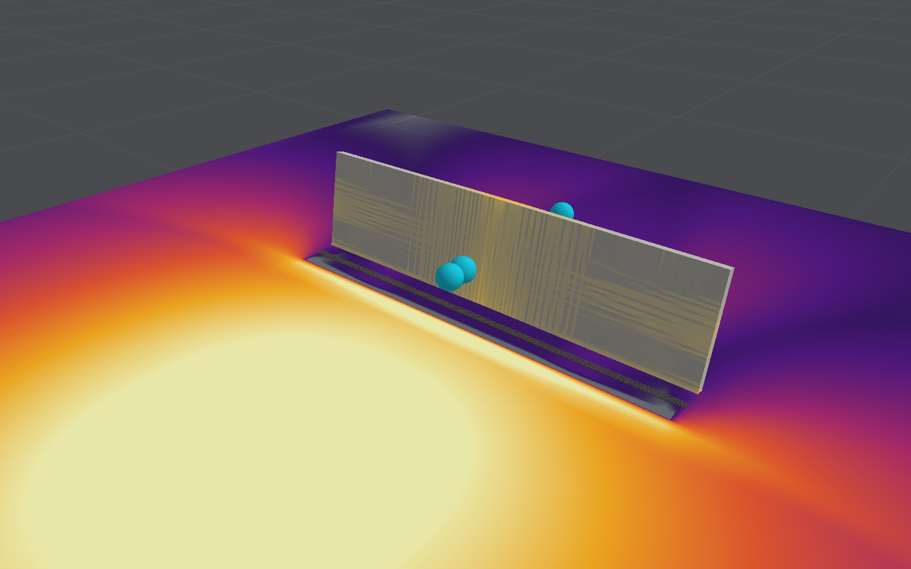

# Validation

What has been checked, against what, and how far the results can be trusted. "Verification"
here means agreement with theory (is the model solved correctly?); "validation" means agreement
with measurements (is it the right model?).

All of it can be reproduced:

```bash
swift test
```

```bash
swift run -c release blastbench slab --sensitivity
```

```bash
swift run -c release blastbench validate
```

## Summary

| Area                 | Evidence                                             | Confidence                         |
|----------------------|------------------------------------------------------|------------------------------------|
| Air solver numerics  | Exact solutions                                      | High                               |
| Blast loads          | Kingery–Bulmash at three ranges: impulse on a wall within 5–10% | Moderate to good for impulse on walls; peaks under-resolved |
| Structural numerics  | Beam and wave theory                                 | High                               |
| Concrete material    | Its own curves; section analysis of a beam           | High that it does what is intended |
| Structural response  | One slab test: peak within 11% on three meshes, rising with refinement | Low to moderate: one test, sensitive to supports |
| Collapse and debris  | Nothing                                              | None: plausible-looking only       |

## Structural response against a real test

### The test

The normal-strength slab of the 2013 Blast Blind Simulation Contest, organised by the University
of Missouri–Kansas City with ACI Committees 447 and 370 and tested in the Blast Loading
Simulator of the US Army Engineer Research and Development Center, Vicksburg. The simulator is
a large shock tube that applies a uniform, measured pressure history to one face of a specimen.

| Property        | Value                                                                          |
|-----------------|--------------------------------------------------------------------------------|
| Slab            | 64 × 33.75 × 4 in (1626 × 857 × 102 mm)                                        |
| Supports        | Simple, 52 in (1321 mm) apart                                                  |
| Concrete        | 5,400 psi (37 MPa)                                                             |
| Main bars       | Nine No. 3 (9.5 mm) at 4 in, 1 in from the unloaded face                       |
| Cross bars      | No. 3 at 12 in                                                                 |
| Steel           | Yield 72 ksi (496 MPa), 118 ksi (814 MPa) at 8% strain, rupture near 15%       |
| Load            | Peak 50 psi (345 kPa), impulse 1,020 psi·ms (7.0 kPa·s), over 80 ms            |
| Measured        | Peak mid-span deflection about 4.25 in (108 mm) at 30 ms; about 3.55 in (90 mm) at 70 ms |

**Source of the data.** T. H. Kewaisy, A. A. Khalil and A. ElFouly, *Advanced Modeling of Blast
Response of Reinforced Concrete Walls with and without FRP Retrofit*, ACI Spring Convention,
2018, which reproduces the contest's specimen drawing, material curves, pressure record and
measured displacement history. The test programme itself is reported in G. Thiagarajan,
A. V. Kadambi, S. Robert and C. F. Johnson, "Experimental and finite element analysis of doubly
reinforced concrete slabs subjected to blast loads", *International Journal of Impact
Engineering* 75, 2015.

**How the data were taken.** The pressure record, the steel curve and the displacement history
were read off the published plots by hand. The pressure record was then scaled so that its
impulse equals the stated 1,020 psi·ms; the scaling was under 1%, and the scaled peak is
49.9 psi against the stated 50.

### The model

The slab is meshed with cubic elements, eight (12.7 mm) or four (25.4 mm) through its
thickness. It is supported on two lines of nodes on the unloaded face (a pin and a roller), and
the recorded pressure is applied to the other face. Gravity is ignored, since the slab stood
vertically.

Nothing was fitted to the test. The concrete's stiffness, tensile strength and fracture energy
come from standard correlations with its compressive strength; the bars follow their published
curve; strengths rise with strain rate by published laws. Two inputs are assumptions: the crack
spacing (100 mm) and the aggregate size (16 mm).

### Results

| Case                             | Peak deflection | At    | At 70 ms | Elements failed |
|----------------------------------|-----------------|-------|----------|-----------------|
| **Measured**                     | **108 mm**      | 30 ms | 90 mm    |                 |
| Model, 16 elements through       | 110 mm (102%)   | 27 ms | 87 mm    | 0 of 552,960    |
| Model, 8 elements through        | 102 mm (94%)    | 26 ms | 68 mm    | 0 of 68,608     |
| Model, 4 elements through        | 96 mm (89%)     | 25 ms | 78 mm    | 0 of 8,704      |

Mid-span deflection through the record, in millimetres:

| Time  | Measured | 16 through | 8 through | 4 through |
|-------|----------|------------|-----------|-----------|
| 5 ms  | 9        | 9          | 9         | 9         |
| 10 ms | 35       | 37         | 36        | 35        |
| 15 ms | 66       | 69         | 68        | 65        |
| 20 ms | 88       | 95         | 92        | 88        |
| 25 ms | 103      | 109        | 101       | 96        |
| 30 ms | 108      | 108        | 96        | 91        |
| 35 ms | 107      | 96         | 84        | 81        |
| 40 ms | 98       | 84         | 76        | 78        |
| 45 ms | 95       | 79         | 75        | 83        |
| 50 ms | 98       | 80         | 81        | 87        |
| 55 ms | 98       | 86         | 87        | 82        |
| 60 ms | 96       | 93         | 86        | 75        |
| 65 ms | 92       | 94         | 77        | 73        |
| 70 ms | 90       | 87         | 68        | 78        |

The root-mean-square difference over the record is 8.8 mm for 16 elements through the
thickness and 13.9 mm for 8 or 4. The peak rises with refinement, from 96 mm to 102 mm to
110 mm, so the model is close to converged but not there; the measured 108 mm lies between the
two finer meshes. The rise to the peak is reproduced within a few millimetres on every mesh.
After the peak every mesh rebounds further than the specimen did (about 30 mm against 13 mm)
before settling. The rebound is set by a hinge at mid-span: once its crushed compression zone
unloads, the section cracks through its depth and the two halves swing back about the bars. The
[concrete model](concrete-model.md#how-the-model-got-here) gives the evidence.

Until the hourglass control and nonlocal crushing described in the
[structural](structural-model.md#elements) and [concrete](concrete-model.md#compression-and-confinement)
notes were added, the model gave 108 mm on 8 elements and 113 mm on 4, matching the test
closely, but collapsed on 16. That agreement came partly from compression zones folding in a
zigzag the element could not feel; the present figures are less flattering and more
trustworthy.

For comparison, the source reports these peaks from other tools on the same slab and load:

| Tool                                                       | Peak            |
|------------------------------------------------------------|-----------------|
| Extreme Loading for Structures (applied element method)    | 107 mm (99%)    |
| RCBlast (single degree of freedom)                         | 117 mm (108%)   |
| SBEDS (single degree of freedom, flexure)                  | 239 mm (221%)   |

### Sensitivity

Eight elements through the thickness, strain-rate laws, one thing changed at a time:

| Change                                       | Peak            | Elements failed |
|----------------------------------------------|-----------------|-----------------|
| None                                         | 102 mm (94%)    | 0               |
| Load 5% lower                                | 89 mm (82%)     | 0               |
| Load 5% higher                               | 116 mm (107%)   | 0               |
| Aggregate 10 mm instead of 16 mm             | 102 mm (94%)    | 0               |
| Crack spacing 50 mm instead of 100 mm        | 98 mm (90%)     | 0               |
| Crack spacing 200 mm                         | 103 mm (95%)    | 0               |
| Fracture energy halved                       | 102 mm (95%)    | 0               |
| Tensile strength 20% lower                   | 103 mm (95%)    | 0               |
| Cracks close fully (no residual opening)     | 101 mm (94%)    | 0               |
| Residual crack opening 30% instead of 10%    | 101 mm (94%)    | 0               |
| Crushing spread over at least 50 mm          | 102 mm (94%)    | 0               |
| Supports as 1 in bearings, held down         | 84 mm (78%)     | 402             |
| Supports as 1 in bearings, free to lift      | 88 mm (81%)     | 0               |
| 16 elements through the thickness            | 110 mm (102%)   | 0               |
| Fixed UFC 3-340-02 factors, no rate laws     | 673 mm, failing | 854             |
| Static strengths                             | 415 mm, failing | 12,220          |

Reading this table:

- **The rate laws decide the outcome.** The load is far above the slab's static capacity, so it
  survives only because steel and concrete are stronger when loaded quickly. With the fixed
  design factors (which are deliberately conservative) or none, the model predicts failure.
  The test is therefore a sharp check on the rate treatment, and a poor check on anything else.
- **A 5% change in load moves the peak by about 13%.** The hand-read pressure record could
  easily be 5% out in its shape, though its impulse is pinned.
- **No material assumption tips the slab into failure any more.** Earlier versions sat near a
  shear failure, which one assumption or another (a lower load, smaller aggregate, a wider
  crack spacing, 5% more load) would trigger, never the same one twice. Those failures went
  when the hourglass control was fixed, which suggests they were the zigzag modes, not shear.
- **The concrete's tensile properties barely matter** here, as expected for a slab whose
  resistance comes from its bars.
- **The supports matter by 15–20%.** The default is a pin and a roller on single lines of
  nodes. Bearings one inch wide lower the peak to 84–88 mm, and when they hold the slab down
  as well as up, elements at their inner edges fail as the slab rotates. The source does not
  describe the rig; [Data wanted](data-wanted.md) lists it.

### What this does and does not show

It shows that the model reproduces the flexural response of a lightly reinforced one-way slab
under a uniform dynamic load, including the influence of strain rate, to within about 10% at
the peak on meshes of 4 to 16 elements through the thickness, with the peak still rising
slowly as the mesh is refined. The rebound after the peak is too large on every mesh.

It does not show that the model predicts shear failure, breach, spalling, fragmentation or
collapse correctly; that walls loaded by the air solver respond correctly (the air solver's
loads have their own error, below); or that a second slab would agree as well. Agreement within
a few per cent on one test with this much sensitivity is partly luck.

The air solver's loads on a wall are close to the reference (next section), so a wall loaded by
the air solver starts from about the right impulse. The combination has still not been compared
with a test.

## Blast loads against empirical references

`blastbench validate` puts a 100 kg charge on rigid ground and compares the air solver with two
references.

### Kingery–Bulmash, the design-practice standard

Kingery and Bulmash fitted polynomials to a large body of test data for a hemispherical surface
burst of TNT; they underlie ConWep and UFC 3-340-02. The polynomials are not reproduced here.
The comparison uses the three worked examples tabulated in the United Nations' *International
Ammunition Technical Guidelines*, IATG 01.80 (3rd ed., 2021), Table 5, reduced to scaled form.
For 100 kg they fall at 5.0 m, 10.8 m and 23.2 m.

Incident (side-on) wave over open ground:

| Range  | Reference peak | 0.5 m cells | 0.25 m cells | 0.125 m cells |
|--------|----------------|-------------|--------------|---------------|
| 5.0 m  | 1,150 kPa      | 55%         | 74%          | 93%           |
| 10.8 m | 202 kPa        | 63%         | 77%          | 86%           |
| 23.2 m | 43 kPa         | 68%         | 81%          | 90%           |

| Range  | Reference impulse | 0.5 m cells | 0.25 m cells | 0.125 m cells |
|--------|-------------------|-------------|--------------|---------------|
| 5.0 m  | 1,060 Pa·s        | 78%         | 77%          | 82%           |
| 10.8 m | 543 Pa·s          | 83%         | 82%          | 82%           |
| 23.2 m | 274 Pa·s          | 85%         | 87%          | 87%           |

| Range  | Reference arrival | 0.5 m cells | 0.25 m cells | 0.125 m cells |
|--------|-------------------|-------------|--------------|---------------|
| 5.0 m  | 2.5 ms            | 100%        | 97%          | 94%           |
| 10.8 m | 10.4 ms           | 92%         | 95%          | 94%           |
| 23.2 m | 38.2 ms           | 97%         | 97%          | 98%           |

On a rigid wall facing the charge (the far face of the domain is made reflecting, with the
charge at each stand-off in turn):

| Stand-off | Reference peak | 0.5 m cells | 0.25 m cells | 0.125 m cells |
|-----------|----------------|-------------|--------------|---------------|
| 5.0 m     | 6,650 kPa      | 27%         | 45%          | 70%           |
| 10.8 m    | 680 kPa        | 50%         | 69%          | 84%           |
| 23.2 m    | 101 kPa        | 68%         | 80%          | 92%           |

| Stand-off | Reference impulse | 0.5 m cells | 0.25 m cells | 0.125 m cells |
|-----------|-------------------|-------------|--------------|---------------|
| 5.0 m     | 3,720 Pa·s        | 77%         | 91%          | 102%          |
| 10.8 m    | 1,411 Pa·s        | 98%         | 102%         | 104%          |
| 23.2 m    | 585 Pa·s          | 94%         | 94%          | 95%           |

Reading these:

- **Reflected impulse, the load a wall actually feels, is within about 5%** at the two farther
  stand-offs on every grid, and within 10% at 5 m on cells of 0.25 m or finer. This is the
  quantity that governs the response of most structures.
- **Peak pressures read low** because a captured shock is smeared over two or three cells. They
  improve steadily with resolution and are worst close in: at 5 m the reflected peak is still
  30% low on the finest grid.
- **Incident impulse is 13% to 23% low on every grid**, so this shortfall is in the source
  model, not the resolution. It matters for objects the wave passes over, less for surfaces it
  strikes.
- **Arrival times are within 8%**, slightly early.

Only three points of the reference are available, at scaled distances of 1.1, 2.3 and
5 m/kg^(1/3). Nothing is known about agreement closer in or farther out.

### Kinney–Graham

The same burst against the Kinney–Graham free-air formulae for 200 kg (a charge on perfectly
rigid ground is equivalent to one of twice the mass in free air):

| Range | Reference peak | 0.5 m cells | 0.25 m cells | 0.125 m cells |
|-------|----------------|-------------|--------------|---------------|
| 5 m   | 1,408 kPa      | 45%         | 60%          | 76%           |
| 10 m  | 300 kPa        | 47%         | 61%          | 68%           |
| 15 m  | 117 kPa        | 54%         | 66%          | 74%           |
| 20 m  | 62 kPa         | 60%         | 72%          | 81%           |
| 25 m  | 39 kPa         | 65%         | 77%          | 86%           |

| Range | Reference impulse | 0.5 m cells | 0.25 m cells | 0.125 m cells |
|-------|-------------------|-------------|--------------|---------------|
| 10 m  | 558 Pa·s          | 84%         | 85%          | 84%           |
| 15 m  | 419 Pa·s          | 81%         | 82%          | 83%           |
| 20 m  | 326 Pa·s          | 81%         | 83%          | 83%           |
| 25 m  | 264 Pa·s          | 82%         | 83%          | 84%           |

This comparison is harsher than the first, and less fair. Real ground is not perfectly rigid:
test data for surface bursts, which Kingery–Bulmash fits, correspond to about 1.8 times the mass
in free air rather than 2. At 10 m the Kinney–Graham peak is about a quarter higher than the
Kingery–Bulmash one.
The overpressure formula was confirmed against a published copy; the impulse formula was written
from memory and could not be.

## Consistency across air grids

The 3 m reinforced cantilever wall, 6 m from the charge, coupled to the air solver:

| Charge | 0.5 m cells                | 0.25 m cells       | 0.125 m cells      |
|--------|----------------------------|--------------------|--------------------|
| 50 kg  | 16 mm deflection at 0.1 s  | 28 mm              | 37 mm              |
| 200 kg | Sheared off at its base    | Sheared off        | Sheared off        |



The qualitative outcome is the same on every grid. The deflection at 50 kg has not converged:
it grows with resolution as the peak pressure does, although the impulse on the wall changes
little. There is no test to compare these with.

## Verification against theory

The test suite has 67 tests. The physical checks are:

**Air solver**

| Problem                                         | Check                                          |
|-------------------------------------------------|------------------------------------------------|
| Sod's shock tube, HLLC and HLL                  | Mean density error below 0.004 on 400 cells    |
| The same along x, y and z                       | Profiles agree within 0.002                    |
| Normal shock reflecting off a wall              | Reflected pressure within 2% of theory         |
| Sedov–Taylor point blast                        | Shock radius within 4% along an axis and a diagonal |
| Closed box with an obstacle                     | Mass and energy conserved to 1 part in 10⁴     |
| Centred burst in a cube                         | Mirror-symmetric to 1 part in 10³              |
| Still air around obstacles                      | Stays still                                    |

**Structural solver**

| Problem                                         | Check                                          |
|-------------------------------------------------|------------------------------------------------|
| Bar striking a rigid wall                       | Wave speed and stress ρcv within 5%            |
| Cantilever under its own weight                 | Tip deflection within 5% of beam theory        |
| Cantilever released from rest                   | First natural period within 5%                 |
| Spinning body                                   | Energy within 1%, angular momentum within 0.5% |
| Two blocks colliding                            | No overlap; momentum conserved to 1%           |
| Block dropped onto another                      | Comes to rest on it                            |
| Two-storey frame under gravity                  | Stands; bridges a removed column               |

**Concrete and reinforcement**

| Problem                                         | Check                                          |
|-------------------------------------------------|------------------------------------------------|
| Tension on two mesh sizes                       | Peak at f_t within 3%; fracture energy within 5% |
| Compression                                     | Peak at f_c within 2%; parabola; 20% residual  |
| Compression released and reapplied              | Permanent strain within 3% of Karsan–Jirsa     |
| Reinforcement stretched, then shortened         | Follows the Menegotto–Pinto curve within 3% of yield |
| Fully restrained compression                    | Peak at 5.1 f_c within 3% (confinement)        |
| Crack opened then closed                        | Closes at its residual opening; then full compressive stiffness |
| Reinforced element in tension                   | Yield, hardening and rupture within 3%         |
| Shear across an open crack, two widths          | Interlock law within 5%                        |
| Tension at 0.1 per second                       | Rate law within 6%                             |
| Reinforced beam in three-point bending          | Capacity within 15% (6 elements deep) and 10% (12 deep) of section analysis, closer on the finer mesh |

**Coupling**

| Problem                                         | Check                                          |
|-------------------------------------------------|------------------------------------------------|
| Block immersed in pressurised air               | Hydrostatic stress within 3%; no net force     |
| Free wall closing a shock tube                  | Gains the air's impulse within 1%              |
| Intact wall across a shock tube                 | Far side hears only the flexing wall (50–2000 Pa) |
| The same wall with moving walls switched off    | Far side stays at ambient pressure             |
| Hole knocked in that wall                       | Mask opens; blast passes through               |
| Wall pushed along the tube                      | Mask travels with it; air beyond compressed adiabatically within 5% |
| Wall driven at 100 m/s into still air           | Piston shock and rarefaction within 2% of theory |
| Wall driven 1.1 m at 10, 50 and 150 m/s         | Gas mass conserved within 0.5% of the true volume |
| After the blast has gone                        | Air freezes; structure carries on              |
| A wall broken by a 500 kg charge, run twice     | Identical to the last bit                      |

These establish that the equations are solved as intended. They say nothing about whether the
equations are the right ones.

## What is missing

In rough order of value:

1. A second and third structural test, of different kinds (see the
   [concrete model's future work](concrete-model.md#future-work)).
2. Blast loads against the full Kingery–Bulmash curves, closer in and farther out than the
   three points available so far.
3. A coupled test: a wall or slab loaded by a real charge at a known stand-off.
4. Any test of failure: shear, breach or collapse.
